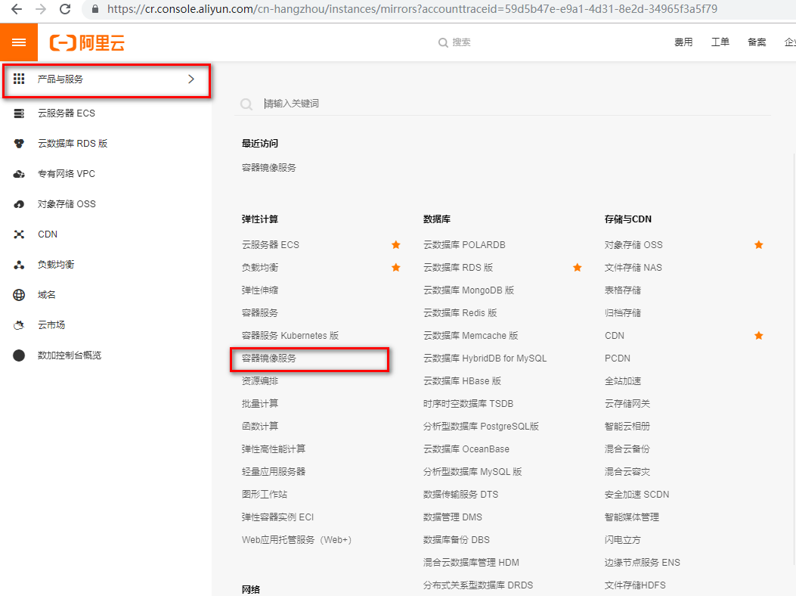

# 一、下载

## 1、官网

docker官网：http://www.docker.com

docker中文网站：https://www.docker-cn.com

## 2、仓库

docker Hub官网：https://hub.docker.com

# 二、安装

## 1、系统要求

CentOS7，要求系统为64位、系统内核版本为3.10以上

ContOS6.5或更高的版本的ContOS上，要求系统为64位、系统内核版本为2.6.32-431或者更高版本

```shell
# 查看内核
[root@localhost ~]# uname -r
2.6.32-754.el6.x86_64
```

```shell
# 查看已安装的CentOS版本信息
[root@localhost ~]# lsb_release -a
LSB Version:    :base-4.0-amd64:base-4.0-noarch:core-4.0-amd64:core-4.0-noarch:graphics-4.0-amd64:graphics-4.0-noarch:printing-4.0-amd64:printing-4.0-noarch
Distributor ID: CentOS
Description:    CentOS release 6.10 (Final)
Release:        6.10
Codename:       Final

[root@localhost ~]# cat /etc/redhat-release 
CentOS release 6.10 (Final)
```

## 2、Docker的基本组成

### 2.1、镜像(image)

就是一个只读的模板。镜像可以用来创建Docker容器，一个镜像可以创建很多容器。

容器与镜像的关系类似于面向对象编程中的对象与类。

| Docker | 面向对象 |
| ------ | -------- |
| 容器   | 对象     |
| 镜像   | 类       |

### 2.2、容器(container)

Docker利用容器(Container)独立运行的一个或一组应用。容器是用镜像创建的运行实例。

它可以被启动、开始、停止、删除。每个容器都是相互隔离的，保证安全的平台。

可以把容器看做是一个简易版的Linux环境(包括root用户权限、进程空间、用户空间和网络空间等)和运行在其中的应用程序。

容器的定义和镜像几乎一模一样，也是一堆层的统一视角，唯一的区别在于容器的最上面那一层是可读可写的。

### 2.3、仓库(repository)

仓库(Repository)是集中存放镜像文件的场所。

仓库(Repository)和仓库注册服务器(Registry)是有区别的。仓库注册服务器上往往存放着多个仓库，每个仓库中又包含了多个镜像，每个镜像有不同的标签(tag)。

仓库分为公开仓库(Public)和私有仓库(Private)两种形式。

最大的公开仓库是Docker Hub(https://hub.docker.com)

存放了数量庞大的镜像供用户下载。国内的公开仓库包括阿里去、网易云等。

## 3、CentOS6.8安装

### 3.1、yum install -y epel-release

Docker使用EPEL发布，RHEL系的OS首先要确保已经持有EPEL仓库，否则先检查OS的版本，然后安装相应的EPEL包

### 3.2、yum install -y docker-io

### 3.3、安装后的配置文件：/etc/sysconfig/docker

### 3.4、启动Docker后台服务：service docker start

### 3.5、docker version验证

```shell
[root@localhost ~]# echo "nameserver 8.8.8.8">>/etc/resolv.conf
[root@localhost ~]# yum install -y epel-release
[root@localhost ~]# yum install -y https://get.docker.com/rpm/1.7.1/centos-6/RPMS/x86_64/docker-engine-1.7.1-1.el6.x86_64.rpm
```

## 4、CentOS7.x安装

https://docs.docker.com/install/linux/docker-ce/centos/

# 三、HelloWorld

## 1、阿里云镜像加速

1. 地址：https://dev.aliyun.com

2. 注册一个属于自己的阿里云账户(可复用淘宝账号)

3. 获得加速器地址连接

登录阿里云开发者平台



获取加速器地址


4. 配置本机Docker运行镜像加还速器

鉴于国内网络问题，后续拉取Docker镜像十分缓慢，可以需要配置加速器来解决

```shell
[root@localhost ~]# vim /etc/sysconfig/docker 
# /etc/sysconfig/docker
#
# Other arguments to pass to the docker daemon process
# These will be parsed by the sysv initscript and appended
# to the arguments list passed to docker -d

other_args="--registry-mirror=https://awclrbku.mirror.aliyuncs.com"
```

5. 重新启动Docker后台服务

```shell
[root@localhost ~]# service docker restart
````

6. Linux系统下配置完加速器需要检查是否生效

```shell
[root@localhost ~]# ps -ef| grep docker
root     125102      1  2 20:35 pts/0    00:00:00 /usr/bin/docker -d --registry-mirror=https://awclrbku.mirror.aliyuncs.com
root     125792  94702  0 20:36 pts/0    00:00:00 grep docker
```

## 2、启动Docker后台容器(测试运行hello-world)

```shell
[root@localhost ~]# docker run hello-world
Unable to find image 'hello-world:latest' locally
latest: Pulling from hello-world

65b27d3bd74d: Pull complete 
9f5834b25059: Pull complete 
Digest: sha256:fb158b7ad66f4d58aa66c4455858230cd2eab4cdf29b13e5c3628a6bfc2e9f05
Status: Downloaded newer image for hello-world:latest

Hello from Docker!
This message shows that your installation appears to be working correctly.

To generate this message, Docker took the following steps:
 1. The Docker client contacted the Docker daemon.
 2. The Docker daemon pulled the "hello-world" image from the Docker Hub.
    (amd64)
 3. The Docker daemon created a new container from that image which runs the
    executable that produces the output you are currently reading.
 4. The Docker daemon streamed that output to the Docker client, which sent it
    to your terminal.

To try something more ambitious, you can run an Ubuntu container with:
 $ docker run -it ubuntu bash

Share images, automate workflows, and more with a free Docker ID:
 https://hub.docker.com/

For more examples and ideas, visit:
 https://docs.docker.com/get-started/
```
run 干了什么？


# 四、底层原理

## 1、Docker是怎么工作的

Docker是一个Client-Server结构的系统，Docker守护进行运行在主机上，然后通过Socket连接从客户端访问，守护进行从客户端授受命令并管理运行在主机上的容器。容器是一个运行时环境，就是前面说到的集装箱。

## 2、为什么Docker比较比VM快

- Docker有着比虚拟机更少的抽象层。由于Docker不需要Hypevisor实现硬件资源虚拟化，运行在Docker容器上的程序直接使用的都是实际物理机的硬件资源。因此在CPU、内存利用率上Docker将会在效率上有明显优势。

- Docker利用的是宿主机的内核，而不需要Guest OS。因此，当新建一个容器时，Docker不需要和虚拟机一样重新加载一个操作系统内核。仍而避免引寻，加载操作系统内核这个比较费时费资源的过程，当新建一个虚拟机时，虚拟机软件需要加载Guest OS，这个新建过程是分钟级别的。而Docker由于直接利用宿主机的操作系统，则省略了这个过程，因此新建一个Docker容器只需要几秒钟。

|            | Docker容器              | 虚拟机(VM)                  |
| ---------- | ----------------------- | --------------------------- |
| 操作系统   | 与宿主机共享OS          | 宿主机OS上运行虚拟机OS      |
| 存储大小   | 镜像小，便于存储与传输  | 镜像庞大(vmdk、vdi等)       |
| 运行性能   | 几乎无额外性能损失      | 操作系统额外的CPU、内存消耗 |
| 移植性     | 轻便、灵活、适应于Linux | 笨重、与虚拟化技术耦合度高  |
| 硬件新和性 | 面向软件开发者          | 面向硬件运维者              |
| 部署速度   | 快速、秒级              | 较慢，10s以上               |

# 五、常用命令

## 1、帮助命令

```
docker version
docker info
docker --help
```

## 2、镜像命令

### 2.1、列出本地主机上的镜像

```shell
# 列出本地主机上的镜像，格式： docker images [OPTIONS]
[root@localhost ~]# docker images
REPOSITORY          TAG                 IMAGE ID            CREATED             VIRTUAL SIZE
hello-world         latest              9f5834b25059        5 months ago        1.84 kB
各个选项说明：
	REPOSITORY：表示镜像的仓库源
	TAG：镜像的标签
	IMAGE ID：镜像ID
	CREATED：镜像创建时间
	VIRTUAL SIZE：镜像大小
同一个仓库源可以有多个TAG，代表这个仓库源的不同个版本，使用REPOSITORY:TAG来定义不同的镜像。
如果不指定一个镜像的版本标签，例如只使用ubuntu，docker将默认使用ubuntu：latest镜像。

OPTIONS说明：
	-a：列出本地所有的镜像(含中间映像层)
	-q：只显示镜像ID
	--digests：显示镜像的摘要信息
	--no-trunc：显示完整的镜像信息
```
### 2.2、搜索镜像

```shell
# 搜索镜像，格式：docker search 某个xxx镜像名字
# 网站：https://hub.docker.com/
[root@localhost ~]# docker search tomcat
NAME                          DESCRIPTION                                     STARS     OFFICIAL   AUTOMATED
tomcat                        Apache Tomcat is an open source implementa...   2432      [OK]       
tomee                         Apache TomEE is an all-Apache Java EE cert...   66        [OK]       
dordoka/tomcat                Ubuntu 14.04, Oracle JDK 8 and Tomcat 8 ba...   53                   [OK]
bitnami/tomcat                Bitnami Tomcat Docker Image                     28                   [OK]

OPTIONS说明：
	--no-trunc：显示完整的镜像描述
	-s：列出收藏数不小于指定值的镜像
	--automated：只列出automated build类型的镜像
```
### 2.3、下载镜像

```shell
# 下载镜像，格式 docker pull 某个xxx镜像名字[:TAG]
[root@localhost ~]# docker pull tomcat
```
### 2.4、删除镜像

```shell
# 删除镜像：格式 docker rmi 某个xxx镜像名字ID
# 错误演示
[root@localhost ~]# docker rmi hello-world
Error response from daemon: Conflict, cannot delete 9f5834b25059 because the container 54e652af1d06 is using it, use -f to force
Error: failed to remove images: [hello-world]

# 删除单个：格式 docker rmi -f 镜像ID
[root@localhost ~]# docker rmi -f hello-world
Untagged: hello-world:latest
Deleted: 9f5834b25059239faef06a9ba681db7b7c572fc0d87d2b140b10e90e50902b53
Deleted: 65b27d3bd74d2cf4ea3aa9e250be6c632f0a347e8abd5485345c55fa6eed0258

# 删除多个：格式 docker rmi -f 镜像名1:TAG 镜像名2:TAG
[root@localhost ~]# docker images
REPOSITORY          TAG                 IMAGE ID            CREATED             VIRTUAL SIZE
tomcat              latest              5af10febec3f        2 weeks ago         505.8 MB
nginx               latest              93a31a838aee        2 weeks ago         109.2 MB
hello-world         latest              9f5834b25059        5 months ago        1.84 kB
[root@localhost ~]# docker rmi -f hello-world nginx
Untagged: hello-world:latest
Deleted: 9f5834b25059239faef06a9ba681db7b7c572fc0d87d2b140b10e90e50902b53
Deleted: 65b27d3bd74d2cf4ea3aa9e250be6c632f0a347e8abd5485345c55fa6eed0258
Untagged: nginx:latest
Deleted: 93a31a838aee503cc32fc915110d3684e8f78324941080f6a1bd540117186490
Deleted: fc64cb385affd3f132909b9939c487976af3b0819b42f3831ede4bed4e37449b
Deleted: 4dc3ce2d848b9766dfe9347453010e3fb9017edda53097ebc5ae9c5bf4a79bda
Deleted: 1c8663a50ae81a7acd79fe2467663b129ecf44e2dbb2e01064092ca2ab395471
Deleted: 1d1ee5efca50f6e3ac2c3114f53dddc965622a7d2ca52143bcad881a2c426900
Deleted: ddacaa2e4df49596d3f42998d31295288cf2e5fe2e16936e9b836dad07854067
Deleted: 500f16055b10fd35ecd8177aca68dee1d48e3fdabdc3f9c4d4401222393a0772
Deleted: d91e3a0a9d04d1143f3e9ad7ae1d3d242a46673e16f728045e01ca9581a46f2a
Deleted: 658c4ff367db5eeb3a4cde866d44c8062d249039681f99c285eb84eaef6dc81d
Deleted: fed72abac5078c2021c399935c5a3161bd7722208720c6227de7f28b87c62715
Deleted: fd1a669b9084012e03abfb1c934f0650060789727e516eba334fb7c97f692b8d

# 删除全部，格式：docker rmi -f $(docker images -qa)
```


## 3、容器命令

### 1、有镜像才能创建容器，这是根本前提(下载一个CentOS镜像演示)

```shell
[root@localhost ~]# docker pull centos
```

### 2、新建并启动容器

```shell
# docker run [OPTIONS] IMAGE [COMMAND] [ARG...]
OPTIONS说明(常用)：有些是一个减号，有些是两个减号
	--name="容器新名字"：为容器指定一个名称
	-d：后台运行容器，并返回容器ID，也即启动守护式容器
	-i：以交互模式运行容器，通常与-t同时使用
	-t：为容器重新分配一个伪输入终端，通常与-i同时使用
	-P：随机端口映射
	-p：指定端口映射，有以下四种格式
		ip:hostPort:containerPort
		ip::containerPort
		hostPort:containerPort
		containerPort

# 启动交互式容器
[root@localhost ~]# docker images
REPOSITORY          TAG                 IMAGE ID            CREATED             VIRTUAL SIZE
tomcat              latest              5af10febec3f        2 weeks ago         505.8 MB
centos              latest              ee2526f4865b        3 months ago        201.8 MB
[root@localhost ~]# docker run -it ee2526f4865b
[root@6877deac57ac /]# ps -ef
UID         PID   PPID  C STIME TTY          TIME CMD
root          1      0  0 17:27 ?        00:00:00 /bin/bash
root         17      1  0 17:31 ?        00:00:00 ps -ef

# 或者使用镜像centos:latest以交互模式启动一个容器，在容器内执行/bin/bash命令
[root@localhost ~]# docker run -it centos /bin/bash
```

### 3、列出当前所有正在运行的容器

```shell
# docker ps [OPTIONS]
[root@localhost ~]# docker ps
CONTAINER ID        IMAGE               COMMAND             CREATED             STATUS              PORTS               NAMES
6877deac57ac        ee2526f4865b        "/bin/bash"         9 minutes ago       Up 9 minutes                            evil_lumiere  

OPTIONS说明(常用)：
	-a：列出当前所有正在运行的容器+历史上运行过的
	-l：显示最近(上一次)创建的容器
	-n：显示最近n个创建的容器
	-q：静默模式，只显示容器编号
	--no-trunc：不截断输出
```

### 4、退出容器(两种方式)

```shell
# 1、exit 容器停止退出
# 2、Ctrl+P+Q 容器不停止退出
```

### 5、启动容器

```shell
# docker start 容器ID或者容器名
```

### 6、重启容器

```shell
# docker restart 容器ID或者容器名
```

### 7、停止容器

```shell
# docker stop 容器ID或者容器名
```

### 8、强制停止容器

```shell
# docker kill 容器ID或者容器名
```

### 9、删除已停止的容器

```shell
# docker rm -f 容器id

# 一次性删除多个容器
[root@localhost ~]# docker rm -rf $(docker ps -a -q)
[root@localhost ~]# docker ps -a -q | xargs docker rm
```

### 10、重要

#### 10.1、启动守护式容器

```shell
# docker run -d 容器名

# 使用镜像centos:latest以后台模式启动一个容器
[root@localhost ~]# docker run -d centos

问题：然后docker ps -a 进行查看，会发现容器已经退出
很重要的要说明的一点：Docker容器后台运行，就必须有一个前台进程
容器运行的命令如果不是那些一直挂起的命令(比如运行top,tail)，就会自动退出的。

这个是Docker的机制问题，比如你的web容器，以nginx为例，正常情况下，配置启动服务只需要启动响应的service即可。例如service nginx start
但是，这样做，nginx为后台进程模式运行，就导致docker前台没有运行的应用，这样的容器后台启动后，会立即自杀因为他觉得他没事可做了。所以，最佳的解决方案是，将你要运行的程序以前台进行的形式运行
```

#### 10.2、查看容器日志

```shell
docker logs -f -t --tail 容器id
-t：是加入时间戳
-f：跟随最新的日志打印
--tail 数字：最示最后多少条

[root@localhost ~]# docker run -d centos /bin/sh -c "while true;do echo hello zzyy; sleep 2;done"
[root@localhost ~]# docker ps
CONTAINER ID        IMAGE               COMMAND                CREATED             STATUS              PORTS               NAMES
aa1e4889fbc8        centos              "/bin/sh -c 'while t   2 minutes ago       Up 2 minutes                            thirsty_brown 

# 查看容器最后5行日志
[root@localhost ~]# docker logs -t -f  --tail 5 aa1e4889fbc8 
2019-06-29T18:27:30.953885276Z hello zzyy
2019-06-29T18:27:32.955763488Z hello zzyy
2019-06-29T18:27:34.958083554Z hello zzyy
2019-06-29T18:27:36.957872484Z hello zzyy
2019-06-29T18:27:38.960670416Z hello zzyy
```

#### 10.3、查看容器内运行的进程

```shell
# docker top 容器ID

[root@localhost ~]# docke ps
CONTAINER ID        IMAGE               COMMAND                CREATED             STATUS              PORTS               NAMES
aa1e4889fbc8        centos              "/bin/sh -c 'while t   5 minutes ago       Up 5 minutes                            thirsty_brown       
[root@localhost ~]# docker top aa1e4889fbc8
UID                 PID                 PPID                C                   STIME               TTY                 TIME                CMD
root                86266               125102              0                   02:24               ?                   00:00:00            /bin/sh -c while true;do echo hello zzyy; sleep 2;done
root                100723              86266               0                   02:30               ?                   00:00:00            sleep 2

```

#### 10.4、查看容器内部细节

```shell
# docker inspect 容器ID
```

#### 10.5、进入正在运行的容器并以命令行交互

```shell
[root@localhost ~]# docker ps
CONTAINER ID        IMAGE               COMMAND             CREATED             STATUS              PORTS               NAMES
02699255bf01        centos              "/bin/bash"         3 minutes ago       Up 3 minutes                            sleepy_davinci 

# docker exec -it 容器ID bashShell
[root@localhost ~]# docker exec -it 02699255bf01 ls -l /tmp/
total 4
-rwx------. 1 root root 836 Mar  5 17:36 ks-script-eC059Y
-rw-------. 1 root root   0 Mar  5 17:34 yum.log

# 重新进入dockert attach 容器ID
[root@localhost ~]# docker attach 02699255bf01
[root@02699255bf01 /]# 


上述两个区别：
	attach 直接进入容器启动命令的终端，不会启动新的进程
	exec 是在容器中打开新的终端，并且可以启动新的进程
```

#### 10.6、从容器内拷贝文件到主机上

```shell
# docker cp 容器ID:容器内路径 目的主机路径
[root@localhost ~]# docker ps
CONTAINER ID        IMAGE               COMMAND             CREATED             STATUS              PORTS               NAMES
cba311dd5e7e        centos              "/bin/bash"         15 seconds ago      Up 14 seconds                           prickly_payne 

# 进入容器
[root@localhost ~]# docker attach cba311dd5e7e

# 查看/tmp目录下的文件
[root@cba311dd5e7e /]# cd /tmp/
[root@cba311dd5e7e tmp]# ll
total 4
-rwx------. 1 root root 836 Mar  5 17:36 ks-script-eC059Y
-rw-------. 1 root root   0 Mar  5 17:34 yum.log

# 查看宿主机/root/目录下的文件
[root@localhost ~]# ll /root/
total 48
-rw-------. 1 root root  1289 Jun 29 06:24 anaconda-ks.cfg
drwxr-x---. 2 root root  4096 Jun 29 06:25 anaconda-screenshots
-rw-r--r--. 1 root root 28250 Jun 29 06:24 install.log
-rw-r--r--. 1 root root  7572 Jun 29 06:23 install.log.syslog
# 从容器内拷贝文件到宿主机/root/目录
[root@localhost ~]# docker cp cba311dd5e7e:/tmp/yum.log /root/
[root@localhost ~]# ll
total 48
-rw-------. 1 root root  1289 Jun 29 06:24 anaconda-ks.cfg
drwxr-x---. 2 root root  4096 Jun 29 06:25 anaconda-screenshots
-rw-r--r--. 1 root root 28250 Jun 29 06:24 install.log
-rw-r--r--. 1 root root  7572 Jun 29 06:23 install.log.syslog
-rw-------. 1 root root     0 Mar  6 01:34 yum.log
```

# 六、镜像

## 1、镜像是什么

镜像是一种轻量级、可执行的独立软件包，用来打包软件运行环境和基于运行环境开发的软件，它包含运行某个软件所需的所有内容，包括代码、运行时、库、环境变量和配置文件。

### 1.1、UnionFS(联合文件系统)

UnionFS(联合文件系统)：Union文件系统(UnionFs)是一种分层、轻量级并且高性能的文件系统，它支持对文件系统的修改作为一次提交来一层层的叠加，同时可以将不同目录挂载到同一个虚拟文件系统下(unite several directories into a single virtual filesystem)。Union文件系统是Docker镜像的基础。镜像可以通过分层来进行继承，基本基础镜像(没有父镜像)，可能制作各种具体的应用镜像。

特性：一次同时加载多个文件系统。但从外面看起来，只能看到一个文件系统，联合加载会把各层文件系统叠加起来，这样最终的文件系统会包含所有底层的文件和目录

### 1.2、镜像加载原理

Docker的镜像实际上由一层一层的文件系统组成，这种层级的文件系统UnionFS。

bootfs(boot file system)主要包括bootloader和kernel，bootloader主要是引导加载kernel，Linux刚启动时会加载bootfs文件系统，在Docker镜像的最底层bootfs。这一层与我们典型的Linux/Unix系统是一样的，它包含boot加载器和内核。当boot加载完成之后整个内核y就都在内存中了，此时内存的使用权已经由bootfs转交给内核，此时系统也会卸载bootfs。

rootfs(root file system)，在bootfsp之上。包含的就是典型Linux系统中的/dev，/proc、/bin、/etc等标准目录和文件。rootfs就是各种不同的操作系统发行版，比如Ubuntu，Centos等等。

平时我们安装进虚拟机的Centos都是好几G，为什么dockery这里才200M？


对于一个精简的OS，rootfs可以很小，只需要包括最基本的命令，工具和程序库不可以了，因为底层直接用Host的kernel，自己只需要提供rootfs就行了。由此可见对于不同的Linux发行版，bootfs基本是一致的，rootfs会有差别，因此不同的发行版可以公用bootfs。

### 1.3、分层的镜像

以pull为例，在下载的过程中我们可以看到docker的镜像好像是在一层一层的在下载。

### 1.4、为什么Docker镜像要采用这种分层结构

最大的一个好处就是-共享资源

比如：有多个镜像都从相同的base镜像构建而来那么宿主机只需在磁盘上保存一份base镜像，同时内存中也只需要加载一份base镜像，就可以为所有容器服务了。而且镜像的每一层都可以被共享。

## 2、特点

## 3、镜像commit操作

```shell
# docker commit提交容器副本使之成为一个新镜像
# docker commit -m="提交的描述信息" -a="作者" 容器ID 要创建的目标镜像名:[标签名]
```

### 3.1、案例演示

1、从Hub上下载tocmat镜像到本地并成功运行

```shell
docker run -it -p 8080:8080 tomcat
-p 主机端口:docker容器端口
-P 随机分配端口
i：交互
t：终端
```
**指定端口**

```shell
[root@localhost ~]# docker run -it -p 8888:8080 tomcat
```


**随机端口**

```shell
[root@localhost ~]# docker run -it -P tomcat
```


2、故意删除上一步镜像生产tomcat容器的文档


3、也即当前的tomcat运行实例是一个没有文档内容的容器，以它为模板commit一个没有doc的tomcat新镜像zczhao/tomcat02


4、启动自己的新镜像并和d原来的对比


**后台启动**


# 七、容器数据卷

## 1、容器数据卷是什么

先看看Docker的理念：

- 将运用与运行的环境打包形成容器运行，运行可以伴随着容器，但是我们对数据的要求希望是持久化的
- 容器之间希望有可能共享数据

Docker容器产生的数据，如果不通过docker commit生成新的镜像，使得数据作为镜像的一部分保存下来，那么当容器m删除后，数据自然也就没有了

为了能保存数据在docker中我们使用数据卷

## 2、作用

卷就是目录或文件，存在于一个或多个容器中，由docker挂载到容器，但不属于联合文件系统，在此能够绕过Union File System提供一些用于持续存储或共享数据的特性：

卷的设计目的就是数据r的持久化，完全独立于容器的生存周期，因此Docker不会在容器删除时删除其挂载的数据卷

特点：

1. 数据卷可在容器之间共享或重用数据
2. 卷中的更改可以直接生效
3. 数据卷中的更改不会包含在镜像的更新中
4. 数据卷的生命周期一直持续到没有容器使用它为止

**容器的持久化**

**容器间继承+共享数据**

## 3、容器内添加数据卷

### 3.1、直接命令添加

1. 命令

```shell
# docker run -it -v /宿主机绝对路径目录：/容器内目录 镜像名
```

2. 查看数据卷是否挂载成功
3. 容器和宿主机之间数据共享
4. 容器停止退出后，主机修改后数据是否同步
5. 命令(带权限)

### 3.2、DockerFile添加