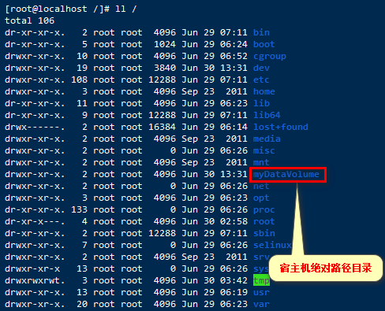
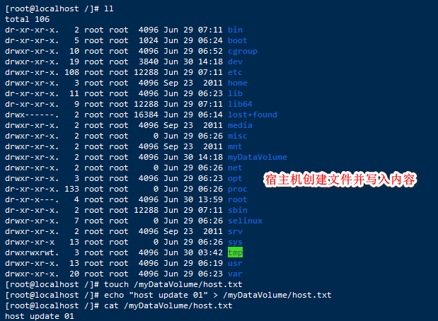
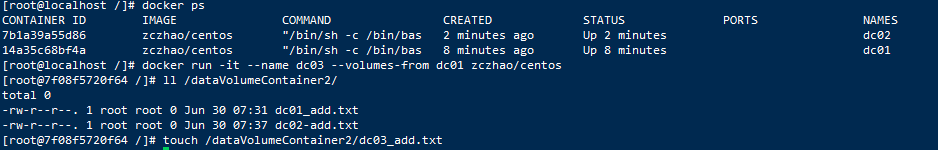
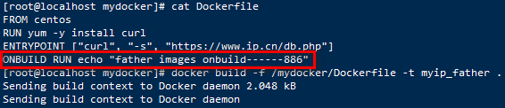
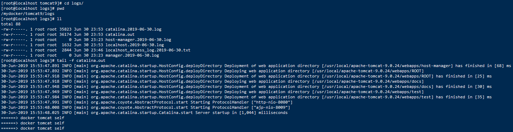
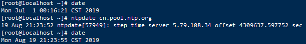
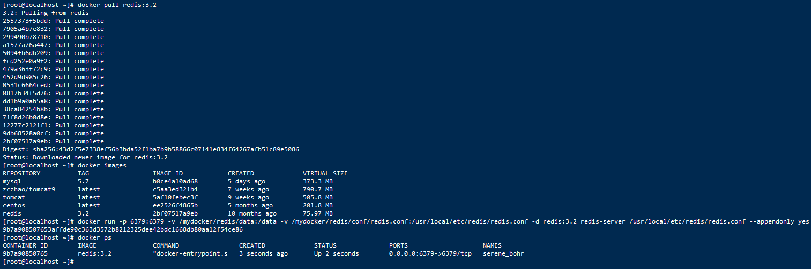

# 一、下载

## 1、官网

docker官网：http://www.docker.com

docker中文网站：https://www.docker-cn.com

## 2、仓库

docker Hub官网：https://hub.docker.com

# 二、安装

## 1、系统要求

CentOS7，要求系统为64位、系统内核版本为3.10以上

ContOS6.5或更高的版本的ContOS上，要求系统为64位、系统内核版本为2.6.32-431或者更高版本

```shell
# 查看内核
[root@localhost ~]# uname -r
2.6.32-754.el6.x86_64
```

```shell
# 查看已安装的CentOS版本信息
[root@localhost ~]# lsb_release -a
LSB Version:    :base-4.0-amd64:base-4.0-noarch:core-4.0-amd64:core-4.0-noarch:graphics-4.0-amd64:graphics-4.0-noarch:printing-4.0-amd64:printing-4.0-noarch
Distributor ID: CentOS
Description:    CentOS release 6.10 (Final)
Release:        6.10
Codename:       Final

[root@localhost ~]# cat /etc/redhat-release 
CentOS release 6.10 (Final)
```

## 2、Docker的基本组成

### 2.1、镜像(image)

就是一个只读的模板。镜像可以用来创建Docker容器，一个镜像可以创建很多容器。

容器与镜像的关系类似于面向对象编程中的对象与类。

| Docker | 面向对象 |
| ------ | -------- |
| 容器   | 对象     |
| 镜像   | 类       |

### 2.2、容器(container)

Docker利用容器(Container)独立运行的一个或一组应用。容器是用镜像创建的运行实例。

它可以被启动、开始、停止、删除。每个容器都是相互隔离的，保证安全的平台。

可以把容器看做是一个简易版的Linux环境(包括root用户权限、进程空间、用户空间和网络空间等)和运行在其中的应用程序。

容器的定义和镜像几乎一模一样，也是一堆层的统一视角，唯一的区别在于容器的最上面那一层是可读可写的。

### 2.3、仓库(repository)

仓库(Repository)是集中存放镜像文件的场所。

仓库(Repository)和仓库注册服务器(Registry)是有区别的。仓库注册服务器上往往存放着多个仓库，每个仓库中又包含了多个镜像，每个镜像有不同的标签(tag)。

仓库分为公开仓库(Public)和私有仓库(Private)两种形式。

最大的公开仓库是Docker Hub(https://hub.docker.com)

存放了数量庞大的镜像供用户下载。国内的公开仓库包括阿里去、网易云等。

## 3、CentOS6.8安装

### 3.1、yum install -y epel-release

Docker使用EPEL发布，RHEL系的OS首先要确保已经持有EPEL仓库，否则先检查OS的版本，然后安装相应的EPEL包

### 3.2、yum install -y docker-io

### 3.3、安装后的配置文件：/etc/sysconfig/docker

### 3.4、启动Docker后台服务：service docker start

### 3.5、docker version验证

```shell
[root@localhost ~]# echo "nameserver 8.8.8.8">>/etc/resolv.conf
[root@localhost ~]# yum install -y epel-release
[root@localhost ~]# yum install -y https://get.docker.com/rpm/1.7.1/centos-6/RPMS/x86_64/docker-engine-1.7.1-1.el6.x86_64.rpm
```

## 4、CentOS7.x安装

在centos7上安装docker，官网有比较详细的说明：

```shell
https://docs.docker.com/install/linux/docker-ce/centos/
```

### 4.1、docker要求Centos系统的内核版本高于3.10，检查操作系统版本

```shell
[root@localhost ~]# uname -r
3.10.0-1062.el7.x86_64
```

### 4.2、下载docker的rpm包

```
https://download.docker.com/linux/centos/7/x86_64/stable/Packages/
# 本次下载的包为：docker-ce-19.03.2-3.el7.x86_64.rpm
```

### 4.3、删除老版本docker

```shell
yum remove docker \
                  docker-client \
                  docker-client-latest \
                  docker-common \
                  docker-latest \
                  docker-latest-logrotate \
                  docker-logrotate \
                  docker-selinux \
                  docker-engine-selinux \
                  docker-engine
```

### 4.4、添加yum源

 在 Centos7 中使用阿里云的yum源 

```shell
# 1、备份原来的yum源
[root@localhost ~]# mv /etc/yum.repos.d/CentOS-Base.repo /etc/yum.repos.d/CentOS-Base.repo.backup

# 2、下载阿里云的CentOS-Base.repo 到/etc/yum.repos.d/
[root@localhost ~]# wget -O /etc/yum.repos.d/CentOS-Base.repo http://mirrors.aliyun.com/repo/Centos-7.repo
# 或者
[root@localhost ~]# mv /etc/yum.repos.d/CentOS-Base.repo /etc/yum.repos.d/CentOS-Base.repo.backup

# 3、清理缓存
[root@localhost ~]# sudo yum clean all

# 4、生成新的缓存
[root@localhost ~]# sudo yum makecache
```

添加docker源

```shell
[root@localhost ~]# yum update
[root@localhost ~]# yum -y install yum-utils 
[root@localhost ~]# yum-config-manager --add-repo https://download.docker.com/linux/centos/docker-ce.repo
```

### 4.5、安装

```shell
# docker安装包名为：docker-ce-19.03.2-3.el7.x86_64.rpm
# 安装包的存储目录为： /root
[root@localhost ~]# yum install -y /root/docker-ce-19.03.2-3.el7.x86_64.rpm
```

### 4.6、检查是否安装成功

```shell
[root@localhost ~]# docker version
```

### 4.7、配置镜像加速器

```shell
sudo mkdir -p /etc/docker
sudo tee /etc/docker/daemon.json <<-'EOF'
{
  "registry-mirrors": ["https://awclrbku.mirror.aliyuncs.com"]
}
EOF
sudo systemctl daemon-reload
sudo systemctl restart docker
```


# 三、HelloWorld

## 1、阿里云镜像加速

1. 地址：https://dev.aliyun.com

2. 注册一个属于自己的阿里云账户(可复用淘宝账号)

3. 获得加速器地址连接

登录阿里云开发者平台


获取加速器地址


4. 配置本机Docker运行镜像加还速器

鉴于国内网络问题，后续拉取Docker镜像十分缓慢，可以需要配置加速器来解决

```shell
[root@localhost ~]# vim /etc/sysconfig/docker 
# /etc/sysconfig/docker
#
# Other arguments to pass to the docker daemon process
# These will be parsed by the sysv initscript and appended
# to the arguments list passed to docker -d

other_args="--registry-mirror=https://awclrbku.mirror.aliyuncs.com"
```

5. 重新启动Docker后台服务

```shell
[root@localhost ~]# service docker restart
````

6. Linux系统下配置完加速器需要检查是否生效

```shell
[root@localhost ~]# ps -ef| grep docker
root     125102      1  2 20:35 pts/0    00:00:00 /usr/bin/docker -d --registry-mirror=https://awclrbku.mirror.aliyuncs.com
root     125792  94702  0 20:36 pts/0    00:00:00 grep docker
```

## 2、启动Docker后台容器(测试运行hello-world)

```shell
[root@localhost ~]# docker run hello-world
Unable to find image 'hello-world:latest' locally
latest: Pulling from hello-world

65b27d3bd74d: Pull complete 
9f5834b25059: Pull complete 
Digest: sha256:fb158b7ad66f4d58aa66c4455858230cd2eab4cdf29b13e5c3628a6bfc2e9f05
Status: Downloaded newer image for hello-world:latest

Hello from Docker!
This message shows that your installation appears to be working correctly.

To generate this message, Docker took the following steps:
 1. The Docker client contacted the Docker daemon.
 2. The Docker daemon pulled the "hello-world" image from the Docker Hub.
    (amd64)
 3. The Docker daemon created a new container from that image which runs the
    executable that produces the output you are currently reading.
 4. The Docker daemon streamed that output to the Docker client, which sent it
    to your terminal.

To try something more ambitious, you can run an Ubuntu container with:
 $ docker run -it ubuntu bash

Share images, automate workflows, and more with a free Docker ID:
 https://hub.docker.com/

For more examples and ideas, visit:
 https://docs.docker.com/get-started/
```
可能会报错：[x509: certificate has expired or is not yet valid](#2、从docker hub上(阿里云加速器)拉取mysql镜像到本地标签为5.7) 

run 干了什么？


# 四、底层原理

## 1、Docker是怎么工作的

Docker是一个Client-Server结构的系统，Docker守护进行运行在主机上，然后通过Socket连接从客户端访问，守护进行从客户端授受命令并管理运行在主机上的容器。容器是一个运行时环境，就是前面说到的集装箱。

## 2、为什么Docker比较比VM快

- Docker有着比虚拟机更少的抽象层。由于Docker不需要Hypevisor实现硬件资源虚拟化，运行在Docker容器上的程序直接使用的都是实际物理机的硬件资源。因此在CPU、内存利用率上Docker将会在效率上有明显优势。

- Docker利用的是宿主机的内核，而不需要Guest OS。因此，当新建一个容器时，Docker不需要和虚拟机一样重新加载一个操作系统内核。仍而避免引寻，加载操作系统内核这个比较费时费资源的过程，当新建一个虚拟机时，虚拟机软件需要加载Guest OS，这个新建过程是分钟级别的。而Docker由于直接利用宿主机的操作系统，则省略了这个过程，因此新建一个Docker容器只需要几秒钟。

|            | Docker容器              | 虚拟机(VM)                  |
| ---------- | ----------------------- | --------------------------- |
| 操作系统   | 与宿主机共享OS          | 宿主机OS上运行虚拟机OS      |
| 存储大小   | 镜像小，便于存储与传输  | 镜像庞大(vmdk、vdi等)       |
| 运行性能   | 几乎无额外性能损失      | 操作系统额外的CPU、内存消耗 |
| 移植性     | 轻便、灵活、适应于Linux | 笨重、与虚拟化技术耦合度高  |
| 硬件新和性 | 面向软件开发者          | 面向硬件运维者              |
| 部署速度   | 快速、秒级              | 较慢，10s以上               |

# 五、常用命令

## 1、帮助命令

```
docker version
docker info
docker --help
```

## 2、镜像命令

### 2.1、列出本地主机上的镜像

```shell
# 列出本地主机上的镜像，格式： docker images [OPTIONS]
[root@localhost ~]# docker images
REPOSITORY          TAG                 IMAGE ID            CREATED             VIRTUAL SIZE
hello-world         latest              9f5834b25059        5 months ago        1.84 kB
各个选项说明：
	REPOSITORY：表示镜像的仓库源
	TAG：镜像的标签
	IMAGE ID：镜像ID
	CREATED：镜像创建时间
	VIRTUAL SIZE：镜像大小
同一个仓库源可以有多个TAG，代表这个仓库源的不同个版本，使用REPOSITORY:TAG来定义不同的镜像。
如果不指定一个镜像的版本标签，例如只使用ubuntu，docker将默认使用ubuntu：latest镜像。

OPTIONS说明：
	-a：列出本地所有的镜像(含中间映像层)
	-q：只显示镜像ID
	--digests：显示镜像的摘要信息
	--no-trunc：显示完整的镜像信息
```
### 2.2、搜索镜像

```shell
# 搜索镜像，格式：docker search 某个xxx镜像名字
# 网站：https://hub.docker.com/
[root@localhost ~]# docker search tomcat
NAME                          DESCRIPTION                                     STARS     OFFICIAL   AUTOMATED
tomcat                        Apache Tomcat is an open source implementa...   2432      [OK]       
tomee                         Apache TomEE is an all-Apache Java EE cert...   66        [OK]       
dordoka/tomcat                Ubuntu 14.04, Oracle JDK 8 and Tomcat 8 ba...   53                   [OK]
bitnami/tomcat                Bitnami Tomcat Docker Image                     28                   [OK]

OPTIONS说明：
	--no-trunc：显示完整的镜像描述
	-s：列出收藏数不小于指定值的镜像
	--automated：只列出automated build类型的镜像
```
### 2.3、下载镜像

```shell
# 下载镜像，格式 docker pull 某个xxx镜像名字[:TAG]
[root@localhost ~]# docker pull tomcat
```
### 2.4、删除镜像

```shell
# 删除镜像：格式 docker rmi 某个xxx镜像名字ID
# 错误演示
[root@localhost ~]# docker rmi hello-world
Error response from daemon: Conflict, cannot delete 9f5834b25059 because the container 54e652af1d06 is using it, use -f to force
Error: failed to remove images: [hello-world]

# 删除单个：格式 docker rmi -f 镜像ID
[root@localhost ~]# docker rmi -f hello-world
Untagged: hello-world:latest
Deleted: 9f5834b25059239faef06a9ba681db7b7c572fc0d87d2b140b10e90e50902b53
Deleted: 65b27d3bd74d2cf4ea3aa9e250be6c632f0a347e8abd5485345c55fa6eed0258

# 删除多个：格式 docker rmi -f 镜像名1:TAG 镜像名2:TAG
[root@localhost ~]# docker images
REPOSITORY          TAG                 IMAGE ID            CREATED             VIRTUAL SIZE
tomcat              latest              5af10febec3f        2 weeks ago         505.8 MB
nginx               latest              93a31a838aee        2 weeks ago         109.2 MB
hello-world         latest              9f5834b25059        5 months ago        1.84 kB
[root@localhost ~]# docker rmi -f hello-world nginx
Untagged: hello-world:latest
Deleted: 9f5834b25059239faef06a9ba681db7b7c572fc0d87d2b140b10e90e50902b53
Deleted: 65b27d3bd74d2cf4ea3aa9e250be6c632f0a347e8abd5485345c55fa6eed0258
Untagged: nginx:latest
Deleted: 93a31a838aee503cc32fc915110d3684e8f78324941080f6a1bd540117186490
Deleted: fc64cb385affd3f132909b9939c487976af3b0819b42f3831ede4bed4e37449b
Deleted: 4dc3ce2d848b9766dfe9347453010e3fb9017edda53097ebc5ae9c5bf4a79bda
Deleted: 1c8663a50ae81a7acd79fe2467663b129ecf44e2dbb2e01064092ca2ab395471
Deleted: 1d1ee5efca50f6e3ac2c3114f53dddc965622a7d2ca52143bcad881a2c426900
Deleted: ddacaa2e4df49596d3f42998d31295288cf2e5fe2e16936e9b836dad07854067
Deleted: 500f16055b10fd35ecd8177aca68dee1d48e3fdabdc3f9c4d4401222393a0772
Deleted: d91e3a0a9d04d1143f3e9ad7ae1d3d242a46673e16f728045e01ca9581a46f2a
Deleted: 658c4ff367db5eeb3a4cde866d44c8062d249039681f99c285eb84eaef6dc81d
Deleted: fed72abac5078c2021c399935c5a3161bd7722208720c6227de7f28b87c62715
Deleted: fd1a669b9084012e03abfb1c934f0650060789727e516eba334fb7c97f692b8d

# 删除全部，格式：docker rmi -f $(docker images -qa)
```


## 3、容器命令

### 1、有镜像才能创建容器，这是根本前提(下载一个CentOS镜像演示)

```shell
[root@localhost ~]# docker pull centos
```

### 2、新建并启动容器

```shell
# docker run [OPTIONS] IMAGE [COMMAND] [ARG...]
OPTIONS说明(常用)：有些是一个减号，有些是两个减号
	--name="容器新名字"：为容器指定一个名称
	-d：后台运行容器，并返回容器ID，也即启动守护式容器
	-i：以交互模式运行容器，通常与-t同时使用
	-t：为容器重新分配一个伪输入终端，通常与-i同时使用
	-P：随机端口映射
	-p：指定端口映射，有以下四种格式
		ip:hostPort:containerPort
		ip::containerPort
		hostPort:containerPort
		containerPort

# 启动交互式容器
[root@localhost ~]# docker images
REPOSITORY          TAG                 IMAGE ID            CREATED             VIRTUAL SIZE
tomcat              latest              5af10febec3f        2 weeks ago         505.8 MB
centos              latest              ee2526f4865b        3 months ago        201.8 MB
[root@localhost ~]# docker run -it ee2526f4865b
[root@6877deac57ac /]# ps -ef
UID         PID   PPID  C STIME TTY          TIME CMD
root          1      0  0 17:27 ?        00:00:00 /bin/bash
root         17      1  0 17:31 ?        00:00:00 ps -ef

# 或者使用镜像centos:latest以交互模式启动一个容器，在容器内执行/bin/bash命令
[root@localhost ~]# docker run -it centos /bin/bash
```

### 3、列出当前所有正在运行的容器

```shell
# docker ps [OPTIONS]
[root@localhost ~]# docker ps
CONTAINER ID        IMAGE               COMMAND             CREATED             STATUS              PORTS               NAMES
6877deac57ac        ee2526f4865b        "/bin/bash"         9 minutes ago       Up 9 minutes                            evil_lumiere  

OPTIONS说明(常用)：
	-a：列出当前所有正在运行的容器+历史上运行过的
	-l：显示最近(上一次)创建的容器
	-n：显示最近n个创建的容器
	-q：静默模式，只显示容器编号
	--no-trunc：不截断输出
```

### 4、退出容器(两种方式)

```shell
# 1、exit 容器停止退出
# 2、Ctrl+P+Q 容器不停止退出
```

### 5、启动容器

```shell
# docker start 容器ID或者容器名
```

### 6、重启容器

```shell
# docker restart 容器ID或者容器名
```

### 7、停止容器

```shell
# docker stop 容器ID或者容器名
```

### 8、强制停止容器

```shell
# docker kill 容器ID或者容器名
```

### 9、删除已停止的容器

```shell
# docker rm -f 容器id

# 一次性删除多个容器
[root@localhost ~]# docker rm -f $(docker ps -a -q)
[root@localhost ~]# docker ps -a -q | xargs docker rm
```

### 10、重要

#### 10.1、启动守护式容器

```shell
# docker run -d 容器名

# 使用镜像centos:latest以后台模式启动一个容器
[root@localhost ~]# docker run -d centos

问题：然后docker ps -a 进行查看，会发现容器已经退出
很重要的要说明的一点：Docker容器后台运行，就必须有一个前台进程
容器运行的命令如果不是那些一直挂起的命令(比如运行top,tail)，就会自动退出的。

这个是Docker的机制问题，比如你的web容器，以nginx为例，正常情况下，配置启动服务只需要启动响应的service即可。例如service nginx start
但是，这样做，nginx为后台进程模式运行，就导致docker前台没有运行的应用，这样的容器后台启动后，会立即自杀因为他觉得他没事可做了。所以，最佳的解决方案是，将你要运行的程序以前台进行的形式运行
```

#### 10.2、查看容器日志

```shell
docker logs -f -t --tail 容器id/容器name
-t：是加入时间戳
-f：跟随最新的日志打印
--tail 数字：最示最后多少条

[root@localhost ~]# docker run -d centos /bin/sh -c "while true;do echo hello zzyy; sleep 2;done"
[root@localhost ~]# docker ps
CONTAINER ID        IMAGE               COMMAND                CREATED             STATUS              PORTS               NAMES
aa1e4889fbc8        centos              "/bin/sh -c 'while t   2 minutes ago       Up 2 minutes                            thirsty_brown 

# 查看容器最后5行日志
[root@localhost ~]# docker logs -t -f  --tail 5 aa1e4889fbc8 
2019-06-29T18:27:30.953885276Z hello zzyy
2019-06-29T18:27:32.955763488Z hello zzyy
2019-06-29T18:27:34.958083554Z hello zzyy
2019-06-29T18:27:36.957872484Z hello zzyy
2019-06-29T18:27:38.960670416Z hello zzyy
```

#### 10.3、查看容器内运行的进程

```shell
# docker top 容器ID

[root@localhost ~]# docke ps
CONTAINER ID        IMAGE               COMMAND                CREATED             STATUS              PORTS               NAMES
aa1e4889fbc8        centos              "/bin/sh -c 'while t   5 minutes ago       Up 5 minutes                            thirsty_brown       
[root@localhost ~]# docker top aa1e4889fbc8
UID                 PID                 PPID                C                   STIME               TTY                 TIME                CMD
root                86266               125102              0                   02:24               ?                   00:00:00            /bin/sh -c while true;do echo hello zzyy; sleep 2;done
root                100723              86266               0                   02:30               ?                   00:00:00            sleep 2

```

#### 10.4、查看容器内部细节

```shell
# docker inspect 容器ID
```

#### 10.5、进入正在运行的容器并以命令行交互

```shell
[root@localhost ~]# docker ps
CONTAINER ID        IMAGE               COMMAND             CREATED             STATUS              PORTS               NAMES
02699255bf01        centos              "/bin/bash"         3 minutes ago       Up 3 minutes                            sleepy_davinci 

# docker exec -it 容器ID bashShell
[root@localhost ~]# docker exec -it 02699255bf01 ls -l /tmp/
total 4
-rwx------. 1 root root 836 Mar  5 17:36 ks-script-eC059Y
-rw-------. 1 root root   0 Mar  5 17:34 yum.log

# 重新进入dockert attach 容器ID
[root@localhost ~]# docker attach 02699255bf01
[root@02699255bf01 /]# 


上述两个区别：
	attach 直接进入容器启动命令的终端，不会启动新的进程
	exec 是在容器中打开新的终端，并且可以启动新的进程
```

#### 10.6、从容器内拷贝文件到主机上

```shell
# docker cp 容器ID:容器内路径 目的主机路径
[root@localhost ~]# docker ps
CONTAINER ID        IMAGE               COMMAND             CREATED             STATUS              PORTS               NAMES
cba311dd5e7e        centos              "/bin/bash"         15 seconds ago      Up 14 seconds                           prickly_payne 

# 进入容器
[root@localhost ~]# docker attach cba311dd5e7e

# 查看/tmp目录下的文件
[root@cba311dd5e7e /]# cd /tmp/
[root@cba311dd5e7e tmp]# ll
total 4
-rwx------. 1 root root 836 Mar  5 17:36 ks-script-eC059Y
-rw-------. 1 root root   0 Mar  5 17:34 yum.log

# 查看宿主机/root/目录下的文件
[root@localhost ~]# ll /root/
total 48
-rw-------. 1 root root  1289 Jun 29 06:24 anaconda-ks.cfg
drwxr-x---. 2 root root  4096 Jun 29 06:25 anaconda-screenshots
-rw-r--r--. 1 root root 28250 Jun 29 06:24 install.log
-rw-r--r--. 1 root root  7572 Jun 29 06:23 install.log.syslog
# 从容器内拷贝文件到宿主机/root/目录
[root@localhost ~]# docker cp cba311dd5e7e:/tmp/yum.log /root/
[root@localhost ~]# ll
total 48
-rw-------. 1 root root  1289 Jun 29 06:24 anaconda-ks.cfg
drwxr-x---. 2 root root  4096 Jun 29 06:25 anaconda-screenshots
-rw-r--r--. 1 root root 28250 Jun 29 06:24 install.log
-rw-r--r--. 1 root root  7572 Jun 29 06:23 install.log.syslog
-rw-------. 1 root root     0 Mar  6 01:34 yum.log
```

# 六、镜像

## 1、镜像是什么

镜像是一种轻量级、可执行的独立软件包，用来打包软件运行环境和基于运行环境开发的软件，它包含运行某个软件所需的所有内容，包括代码、运行时、库、环境变量和配置文件。

### 1.1、UnionFS(联合文件系统)

UnionFS(联合文件系统)：Union文件系统(UnionFs)是一种分层、轻量级并且高性能的文件系统，它支持对文件系统的修改作为一次提交来一层层的叠加，同时可以将不同目录挂载到同一个虚拟文件系统下(unite several directories into a single virtual filesystem)。Union文件系统是Docker镜像的基础。镜像可以通过分层来进行继承，基本基础镜像(没有父镜像)，可能制作各种具体的应用镜像。

特性：一次同时加载多个文件系统。但从外面看起来，只能看到一个文件系统，联合加载会把各层文件系统叠加起来，这样最终的文件系统会包含所有底层的文件和目录

### 1.2、镜像加载原理

Docker的镜像实际上由一层一层的文件系统组成，这种层级的文件系统UnionFS。

bootfs(boot file system)主要包括bootloader和kernel，bootloader主要是引导加载kernel，Linux刚启动时会加载bootfs文件系统，在Docker镜像的最底层bootfs。这一层与我们典型的Linux/Unix系统是一样的，它包含boot加载器和内核。当boot加载完成之后整个内核y就都在内存中了，此时内存的使用权已经由bootfs转交给内核，此时系统也会卸载bootfs。

rootfs(root file system)，在bootfsp之上。包含的就是典型Linux系统中的/dev，/proc、/bin、/etc等标准目录和文件。rootfs就是各种不同的操作系统发行版，比如Ubuntu，Centos等等。

平时我们安装进虚拟机的Centos都是好几G，为什么dockery这里才200M？


对于一个精简的OS，rootfs可以很小，只需要包括最基本的命令，工具和程序库不可以了，因为底层直接用Host的kernel，自己只需要提供rootfs就行了。由此可见对于不同的Linux发行版，bootfs基本是一致的，rootfs会有差别，因此不同的发行版可以公用bootfs。

### 1.3、分层的镜像

以pull为例，在下载的过程中我们可以看到docker的镜像好像是在一层一层的在下载。

### 1.4、为什么Docker镜像要采用这种分层结构

最大的一个好处就是-共享资源

比如：有多个镜像都从相同的base镜像构建而来那么宿主机只需在磁盘上保存一份base镜像，同时内存中也只需要加载一份base镜像，就可以为所有容器服务了。而且镜像的每一层都可以被共享。

## 2、特点

## 3、镜像commit操作

```shell
# docker commit提交容器副本使之成为一个新镜像
# docker commit -m="提交的描述信息" -a="作者" 容器ID 要创建的目标镜像名:[标签名]
```

### 3.1、案例演示

1、从Hub上下载tocmat镜像到本地并成功运行

```shell
docker run -it -p 8080:8080 tomcat
-p 主机端口:docker容器端口
-P 随机分配端口
i：交互
t：终端
```
**指定端口**

```shell
[root@localhost ~]# docker run -it -p 8888:8080 tomcat
```


**随机端口**

```shell
[root@localhost ~]# docker run -it -P tomcat
```


2、故意删除上一步镜像生产tomcat容器的文档


3、也即当前的tomcat运行实例是一个没有文档内容的容器，以它为模板commit一个没有doc的tomcat新镜像zczhao/tomcat02


4、启动自己的新镜像并和d原来的对比


**后台启动**


# 七、容器数据卷

## 1、容器数据卷是什么

先看看Docker的理念：

- 将运用与运行的环境打包形成容器运行，运行可以伴随着容器，但是我们对数据的要求希望是持久化的
- 容器之间希望有可能共享数据

Docker容器产生的数据，如果不通过docker commit生成新的镜像，使得数据作为镜像的一部分保存下来，那么当容器m删除后，数据自然也就没有了

为了能保存数据在docker中我们使用数据卷

## 2、作用

卷就是目录或文件，存在于一个或多个容器中，由docker挂载到容器，但不属于联合文件系统，在此能够绕过Union File System提供一些用于持续存储或共享数据的特性：

卷的设计目的就是数据r的持久化，完全独立于容器的生存周期，因此Docker不会在容器删除时删除其挂载的数据卷

特点：

1. 数据卷可在容器之间共享或重用数据
2. 卷中的更改可以直接生效
3. 数据卷中的更改不会包含在镜像的更新中
4. 数据卷的生命周期一直持续到没有容器使用它为止

**容器的持久化**

**容器间继承+共享数据**

## 3、容器内添加数据卷

### 3.1、直接命令添加

1. 命令

```shell
# docker run -it -v /宿主机绝对路径目录:/容器内目录 镜像名

# 例 /myDataVolume宿主机绝对路径目录 /dataVolumeContainer容器内目录 (不需要手动创建目录，运行命令会自动创建)
[root@localhost /]# docker run -it -v /myDataVolume:/dataVolumeContainer centos
```

2. 查看数据卷是否挂载成功
   
   

3. 容器和宿主机之间数据共享
   
   
   

4. 容器停止退出后，主机修改后数据是否同步
   
   

5. 命令(带权限)

   ```shell
   # docker run -it -v /宿主机绝对路径目录:/容器内目录:ro 镜像名
   
   [root@localhost /]# docker run -it -v /myDataVolume:/dataVolumeContainer:ro centos
   ```





### 3.2、DockerFile添加

1. 根目录下新建mydocker文件夹进入

2. 可在Dockerfile中使用VOLUME指令来给镜像添加一个或多个数据卷

   ```dockerfile
   VOLUME ["/dataVolumeContainer", "/dataVolumeContainer2", "/dataVolumeContainer3"]
   ```

   说明：出于可移植和分享的考虑，用-v主机目录:容器目录这种方法不能够直接在DockerFile中实现。

   由于宿主机目录是依赖特定宿主机的，并不能够保证在所有的宿主机上都存在这样的特定目录。

3. File构建
   DockerFile：

   ```dockerfile
   # volume test
   FROM centos
   VOLUME ["/dataVolumeContainer1" , "/dataVolumeContainer2"]
   CMD echo "finished,-------success"
   CMD /bin/bash
   ```

4. build后生成镜像

   ```shell
   [root@localhost mydocker]# docker build -f /mydocker/DockerFile -t zczhao/centos .
   ```

   

5. run容器


 通过上述步骤，容器内的卷目录地址已经知道对应的主机目录地址在哪？


备注：Docker挂载主机目录Docker访问出现：cannot open directory.: Permission denied
解决办法：在挂载目录后多加一个 --privileged=true  参数即可

## 4、数据卷容器

### 1、是什么

命名的容器挂载数据卷，其它容器通过挂载这个(父容器)实现数据共享，挂载数据卷的容器，称之为数据卷容器

### 2、总体介绍

以上一步新建的镜像zczhao/centos为模板运行容器dc01/dc02/dc03

它们已经具有容器卷/dataVolumeContainer1，dataVolumeContainer2

### 3、容器间传递共享(--volumes-from)

1. 先启动一个父容器dc01
   在dataVolumeContainer2新增内容
   

2. dc02/dc03继承自dc01
   --volumes-from
   命令：

   ```shell
   [root@localhost /]# docker run -it --name dc02 --volumes-from dc01 zczhao/centos
   ```

   
   
   
3. 回到dc01可以看到02/03各自添加的都能共享了
   

4. 删除dc01，dc02修改后dc03可否访问
   

   

   

5. 删除dc02后dc03是否可访问

6. 新建dc04继承dc03后再删除dc03

7. 结论
   容器之间配置信息的传递，数据卷的生命周期一直持续到没有容器使用它为止

# 八、DockerFile解析

## 1、是什么

DockerFile是用来构建Dockers镜像的构建文件，是由一系列命令和参数构成的脚本。

构建三步骤：

1. 编码DockerFile
2. docker build
3. docker run

## 2、DockerFile构建过程解析

### 2.1、Dockerfile内容基础知识

1. 每条保留指令都必须为大写字母且后面要跟随至少一个参数
2. 指令按照从上到下，顺序执行
3. #表示注释
4. 每条指令都会创建一个新的镜像层，并对镜像进行提交

### 2.2、Docker执行Dockerfile的大致流程

1. docker从基础镜像运行一个容器
2. 执行一条指令并对容器作出修改
3. 执行类似docker commit的操作提交一个新的镜像层
4. docker再基于刚提交的镜像运行一个新容器
5. 执行dockerfile中的下一条指令直到所有指令都执行完成

### 2.3、总结

从应用软件的角度来看，Dockerfile、Docker镜像与Docker容器分别代表软件的三个不同阶段

- Dockerfile是软件的原材料
- Docker镜像是软件的交付品
- Docker容器则可以认为是软件的运行态。

Dockerfile面向开发，Docker镜像成为交付标准，Docker容器测涉及部署与运维，三者缺一不可，全力充当Docker体系的基石。

1. Dockerfile，需要定义一个Dockersfile，Dockerfile定义了进程需要的一切东西，Dockerfile涉及的内容包括执行代码或者是文件、环境变量、依赖包、运行时环境、动态链接库、操作系统的发行版，服务进程和内核进程(当应用进程需要和系统服务和内核进程打交道，这时需要考虑如何设计namespace的权限控制)等等
2. Docker镜像，在用Dockerfile定义一个文件之后，docker build时会产生一个Docker镜像，当运行Docker镜像时，会真正开始提供服务
3. Docker容器，容器是直接提供服务的

## 3、DockerFile体系结构(保留字指令)

### 3.1、FROM

基础镜像，当前新镜像是基于哪个镜像的

### 3.2、MAINTAINER

镜像维护者的姓名和邮箱地址

### 3.3、RUN

容器构建时需要运行的命令

### 3.4、EXPOSE

当前容器对外暴露出的端口

### 3.5、WORKDIR

指定在创建容器后，终端默认登录的进来工作目录，一个落脚点

### 3.6、ENV

用来在构建镜像过程中设置环境变量
ENV MY_PATH /usr/mytest
这个环境变量可以在后续的任何RUN指令中使用，这就如同在命令前面指定了环境变量前缀一样；也可以在其他指令中直接使用这些环境变量

比如：WORKDIR $MY_PATH

### 3.7、ADD

将宿主机目录下的文件拷贝进镜像且ADD命令会自动处理URL和解压tar压缩包

### 3.8、COPY

类似ADD，拷贝文件和目录到镜像中。

将从构建上下文目录<源路径>的文件/目录复制到新新的一层的镜像内的<目标路径>位置

```dockerfile
COPY src dest
COPY ["src", "dest"]
```

### 3.9、VOLUME

容器数据卷，用于数据保存和持久化工作

### 3.10、CMD

指定一个容器启动时要运行的命令

CMD容器启动命令：
CMD指令的格式和RUN相似，也是两种格式：
shell 格式：CMD ＜命令＞
exec 格式：CMD ［"可执行文件", "参数1", "参数2"...］
参数列表格式：CMD ["参数1", "参数2"...]。在指定了ENTRYINT指令后，用CMD指定具体的参数。

Dockerfile中可以有多个CMD指令，但只有最后一个生效，CMD会被docker run 之后的参数替换

### 3.11、ENTRYPOINT

指定一个容器启动时要运行的命令

ENTRYPOINT的目的和CMD一样，都是在指定容器启动程序及参数

### 3.12、ONBUILD

当构建一个被继承的Dockerfile时运行命令，父镜像在被子继承后父镜像的onbuild被触发




### 3.13、总结

| BUILD         | Both    | RUN        |
| ------------- | ------- | ---------- |
| FROM          | WORKDIR | CMD        |
| MAINTAINER    | USER    | ENV        |
| COPY          |         | EXPOSE     |
| ADD           |         | VOLUME     |
| RUN           |         | EXTRYPOINT |
| ONBUILD       |         |            |
| .dockerignore |         |            |

## 4、案例

### 4.1、Base镜像(scratch)

Docker Hub中99%的镜像都是通过在base镜像中安装和配置需要的软件构建出来的

### 4.2、自定义镜像mycentos

#### 1、编写

##### 1.1、hub默认CentOS镜像什么情况


自定义mycentos目的使自己的镜像具备如下功能：
1. 登录后的默认路径
2. vim编辑器
3. 查看网络配置ifconfig支持 

##### 1.2、准备编写Dockerfile文件


##### 1.3、mycentos Dockerfile内容

```dockerfile
FROM centos
MAINTAINER zczhao<zczhao@vip.com>

ENV MYPATH /usr/local
WORKDIR $MYPATH

RUN yum -y install vim
RUN yum -y install net-tools

EXPOSE 80

CMD echo $MYPATH
CMD echo "success------ok"
CMD /bin/bash
```

#### 2、构建

```shell
# docker build -t 新镜像名字:TAG .   (最后有个.表示当前目录)
```


#### 3、运行

```shell
# docker run -it 新镜像名字:TAG
```


#### 4、列出镜像的变更历史


### 4.3、CMD/ENTRYPOINT 镜像案例

#### 1、都是指定一个容器启动时要运行的命令

#### 2、CMD

Dockerfile中可以有多个CMD指令，但只有一个生效，CMD会被docker run 之后的参数替换

例子：

​	tomcat的讲解演示：docker run -it -p 8888:8080 tomcat ls -l

#### 3、ENTRYPOINT

docker run之后的参数会被当做参数传递给ENTRYPOINT，之后形成新的命令组合

例子：

1. 制作CMD版可以查询IP信息的容器

   ```dockerfile
   FROM centos
   RUN yum -y install curl
   CMD ["curl", "-s", "https://www.ip.cn/db.php"]
   ```

   


curl命令解释：

curl命令可以用来执行下载，发送各种HTTP请求，指定HTTP头部等操作。
如果系统i没有curl，可以使用yum install curl安装，也可以下载安装。
curl是将下载文件输出到stdout

使用命令：curl http://www.baidu.com
执行后，www.baidu.com的html就会显示在n屏幕上了

这是最简单的使用方法。用这个命令获取了http://curl.haxx.se指向的页面，同样，如果这里的URL指向的是一个文件或者一张图都可以直接下载到本地。如果下载的是HTML文档，那么缺省的将只显示文件头部，即HTML文档的header。要全部显示，请加参数 -i

2. 问题
   如果希望显示HTTP头信息，就需要加上-i参数
   

3. WHY
   可以看到可执行文件找不到报错，executable file not found in $PATH
   跟在镜像后面的是command，运行j时会替换CMD的默认值。
   因此这里的 -i 替换了原来的CMD，而不是添加在原来的 curl -s https://www.ip.cn/db.php 后面。而 -i 根本不是命令，所以自然找不到。
   那么如果希望加入 -i 这个参数，就必须重新完整的输入这个命令：

   ```shell
   [root@localhost mydocker]# docker run myip curl -s -i https://www.ip.cn/db.php
   ```

   

4. 制作ENTRYPOINT版查询IP信息的容器

   ```dockerfile
   FROM centos
   RUN yum -y install curl
   ENTRYPOINT ["curl", "-s", "https://www.ip.cn/db.php"]
   ```

   

### 4.4、自定义镜像Tomcat9

#### 1、mkdir -p /mydocker/tomcat9

#### 2、在上述目录下touch c.txt

#### 3、将jdk和tomcat安装的压缩包拷贝到 /mydocker/tomcat9 目录

apache-tomcat-9.0.24.tar.gz jdk-8u221-linux-x64.tar.gz

#### 4、在 /mydocker/tomcat9 目录下新建 Dockerfile 文件

```dockerfile
FROM centos
MAINTAINER zczhao<zczhao@vip.com>

# 把宿主机当前上下文的c.txt拷贝到容器/usr/local/路径下
COPY c.txt /usr/local/container.txt

# 把JDK与Tomcat添加到容器中
ADD jdk-8u221-linux-x64.tar.gz /usr/local/
ADD apache-tomcat-9.0.24.tar.gz /usr/local/

# 安装vim编辑器
RUN yum -y install vim

# 设置工作访问时候的WORKDIR路径，登录落脚点
ENV MYPATH /usr/local
WORKDIR $MYPATH

# 配置JDK与Tomcat环境变量
ENV JAVA_HOME /usr/local/jdk1.8.0_221
ENV CLASSPATH $JAVA_HOME/lib/dt.jar:$JAVA_HOME/lib/tools.jar
ENV CATALINA_HOME /usr/local/apache-tomcat-9.0.24
ENV CATALINA_BASE /usr/local/apache-tomcat-9.0.24
ENV PATH $PATH:$JAVA_HOME/bin:$CATALINA_HOME/lib:$CATALINA_HOME/bin

# 容器运行时监听的端口
EXPOSE 8080

# 启动时运行Tomcat
# ENTRYPOINT ["/usr/local/apache-tomcat-9.0.24/bin/startup.sh"]
# CMD ["/usr/local/apache-tomcat-9.0.24/bin/startup.sh", "run"]
CMD /usr/local/apache-tomcat-9.0.24/bin/startup.sh && tail -F /usr/local/apache-tomcat-9.0.24/logs/catalina.out

```

#### 5、构建

```shell
# 如果文件名为Dockerfile，可以简写，以下两条命令效果一样(如果编写的Dockerfile命名不为"Dockerfile"，需要使用第一种构建的方式)
[root@localhost tomcat9]# docker build -f /mydocker/tomcat9/Dockerfile -t zczhao/tomcat9 .
[root@localhost tomcat9]# docker build -t zczhao/tomcat9 .
```


6、run


```shell
[root@localhost tomcat9]# docker run -d -p 9080:8080 --name myt9 -v /mydocker/tomcat9/test:/usr/local/apache-tomcat-9.0.24/webapps/test -v /mydocker/tomcat9/logs:/usr/local/apache-tomcat-9.0.24/logs --privileged=true zczhao/tomcat9
```

#### 7、验证

```shell
[root@localhost tomcat9]# docker exec 容器id/容器名
```


#### 8、结合前述的容器卷将测试的web服务test发布

##### 1、总体概述


##### 2、web.xml

```xml
<?xml version="1.0" encoding="UTF-8"?>
<web-app xmlns="http://java.sun.com/xml/ns/javaee"
        xmlns:xsi="http://www.w3.org/2001/XMLSchema-instance"
        xsi:schemaLocation="http://java.sun.com/xml/ns/javaee http://java.sun.com/xml/ns/javaee/web-app_2_5.xsd"
        version="2.5">
	<display-name>test</display-name>
</web-app> 
```

##### 3、index.jsp

```jsp
<%@ page language="java" contentType="text/html; charset=utf-8"
    pageEncoding="utf-8"%>
<!DOCTYPE html PUBLIC "-//W3C//DTD HTML 4.01 Transitional//EN" "http://www.w3.org/TR/html4/loose.dtd">
<html>
<head>
<meta http-equiv="Content-Type" content="text/html; charset=utf-8">
<title>首页</title>
</head>
<body>
    ------ welcome ------
	<br>
	<br>
	<%="i am in docker tomcat self"%>
	<br>
	<br>
	<% System.out.println("======> docker tomcat self"); %>
</body>
</html>
```

##### 4、测试


查看Tomcat输出日志



# 九、Docker常用安装

## 1、总体安装

1. 搜索镜像
2. 拉取镜像
3. 查看镜像
4. 启动镜像
5. 停止容器
6. 移除容器

## 2、安装Tomcat

### 1、docker hub上面查找tomcat镜像

```shell
[root@localhost ~]# docker search tomcat
```

### 2、从docker hub上拉取tomcat镜像到本地

```shell
[root@localhost ~]# docker pull tomcat
```

### 3、docker images 查看是否有拉取到tomcat

```shell
[root@localhost ~]# docker images
```

### 4、使用tomcat镜像创建容器(也叫运行镜像)

```shell
[root@localhost ~]# docker run -it -p 8080:8080 tomcat
参数说明：
-p 主机端口:docker容器端口
-P 随机分配端口
i 交互
t 终端
```

## 3、安装Mysql

### 1、docker hub上面查找mysql镜像

```shell
[root@localhost ~]# docker search mysql
```


### 2、从docker hub上(阿里云加速器)拉取mysql镜像到本地标签为5.7

可能遇到的问题(docker x509: certificate has expired or is not yet valid)：

解决办法：

```shell
# 查看时间，发现时间不对
[root@localhost ~]# date
Mon Jul  1 00:16:21 CST 2019

# 同步时间
[root@localhost ~]# ntpdate cn.pool.ntp.org   
19 Aug 21:23:52 ntpdate[57949]: step time server 5.79.108.34 offset 4309637.597752 sec

# 查看时间是否正常
[root@localhost ~]# date
Mon Aug 19 21:23:55 CST 2019
```




### 3、使用mysql5.7镜像创建容器(也叫运行镜像)

#### 3.1、使用mysql镜像

```shell
[root@localhost ~]# docker run -p 12345:3306 --name mysql -v /mydocker/mysql/conf/my.cnf:/etc/mysql/conf.d -v /mydocker/mysql/logs:/logs -v /mydocker/mysql/data:/var/lib/mysql -e MYSQL_ROOT_PASSWORD=123456 -d mysql:5.7 --character-set-server=utf8mb4 --collation-server=utf8mb4_unicode_ci
命令说明：
-p 12345:3306	将主机的12345端口映射到docker容器的3306端口
--name mysql	运行服务名字
-v /mydocker/mysql/conf/my.cnf:/etc/mysql/conf.d	将主机/mydocker/mysql/目录下的conf/my.cnf挂载到容器的/etc/mysql/conf.d
-v /mydocker/mysql/logs:/logs	将主机/mydocker/mysql/目录下的logs目录挂载到容器的/logs
-v /mydocker/mysql/data:/var/lib/mysql	将主机/mydocker/mysql/目录下的data目录挂载到容器/var/lib/mysql
-e MYSQL_ROOT_PASSWORD=123456	初始化root用户的密码
-d mysql:5.7	后台程序运行mysql5.7
```

```shell
# docker exec -it mysql运行成功后的容器id /bin/bash
```


#### 3.2、外部Win10也来连接运行在docker上的mysql服务


#### 3.3、数据备份

```shell
# docker exec mysql服务容器id sh -c 'exec mysqldump --all-databases -uroot -p"123456"' > /mydocker/mysql/all-databases.sql
```


## 4、安装Redis

### 1、从docker hub上(阿里云加速器)拉取redis镜像到本地标签为3.2

```shell
[root@localhost ~]# docker search redis
[root@localhost ~]# docker pull redis
```


### 2、使用redis3.2镜像创建容器

#### 2.1、使用镜像

```shell
[root@localhost ~]# docker run -p 6379:6379 -v /mydocker/redis/data:/data -v /mydocker/redis/conf/redis.conf:/usr/local/etc/redis/redis.conf -d redis:3.2 redis-server /usr/local/etc/redis/redis.conf --appendonly yes
```



#### 2.2、在主机 /mydocker/redis/conf/redis.conf 目录下新建redis.conf文件 vim /mydocker/redis/conf/redis.conf/redis.conf

```conf
# Redis configuration file example.

#
# Note that in order to read the configuration file, Redis must be
# started with the file path as first argument:
#
# ./redis-server /path/to/redis.conf

# Note on units: when memory size is needed, it is possible to specify
# it in the usual form of 1k 5GB 4M and so forth:
#
# 1k => 1000 bytes
# 1kb => 1024 bytes
# 1m => 1000000 bytes
# 1mb => 1024*1024 bytes
# 1g => 1000000000 bytes
# 1gb => 1024*1024*1024 bytes
#
# units are case insensitive so 1GB 1Gb 1gB are all the same.

################################## INCLUDES ###################################

# Include one or more other config files here.  This is useful if you
# have a standard template that goes to all Redis servers but also need
# to customize a few per-server settings.  Include files can include
# other files, so use this wisely.
#
# Notice option "include" won't be rewritten by command "CONFIG REWRITE"
# from admin or Redis Sentinel. Since Redis always uses the last processed
# line as value of a configuration directive, you'd better put includes
# at the beginning of this file to avoid overwriting config change at runtime.
#
# If instead you are interested in using includes to override configuration
# options, it is better to use include as the last line.
#
# include /path/to/local.conf
# include /path/to/other.conf

################################## NETWORK #####################################

# By default, if no "bind" configuration directive is specified, Redis listens
# for connections from all the network interfaces available on the server.
# It is possible to listen to just one or multiple selected interfaces using
# the "bind" configuration directive, followed by one or more IP addresses.
#
# Examples:
#
# bind 192.168.1.100 10.0.0.1
# bind 127.0.0.1 ::1
#
# ~~~ WARNING ~~~ If the computer running Redis is directly exposed to the
# internet, binding to all the interfaces is dangerous and will expose the
# instance to everybody on the internet. So by default we uncomment the
# following bind directive, that will force Redis to listen only into
# the IPv4 lookback interface address (this means Redis will be able to
# accept connections only from clients running into the same computer it
# is running).
#
# IF YOU ARE SURE YOU WANT YOUR INSTANCE TO LISTEN TO ALL THE INTERFACES
# JUST COMMENT THE FOLLOWING LINE.
# ~~~~~~~~~~~~~~~~~~~~~~~~~~~~~~~~~~~~~~~~~~~~~~~~~~~~~~~~~~~~~~~~~~~~~~~~
#bind 127.0.0.1

# Protected mode is a layer of security protection, in order to avoid that
# Redis instances left open on the internet are accessed and exploited.
#
# When protected mode is on and if:
#
# 1) The server is not binding explicitly to a set of addresses using the
#    "bind" directive.
# 2) No password is configured.
#
# The server only accepts connections from clients connecting from the
# IPv4 and IPv6 loopback addresses 127.0.0.1 and ::1, and from Unix domain
# sockets.
#
# By default protected mode is enabled. You should disable it only if
# you are sure you want clients from other hosts to connect to Redis
# even if no authentication is configured, nor a specific set of interfaces
# are explicitly listed using the "bind" directive.
protected-mode yes

# Accept connections on the specified port, default is 6379 (IANA #815344).
# If port 0 is specified Redis will not listen on a TCP socket.
port 6379

# TCP listen() backlog.
#
# In high requests-per-second environments you need an high backlog in order
# to avoid slow clients connections issues. Note that the Linux kernel
# will silently truncate it to the value of /proc/sys/net/core/somaxconn so
# make sure to raise both the value of somaxconn and tcp_max_syn_backlog
# in order to get the desired effect.
tcp-backlog 511

# Unix socket.
#
# Specify the path for the Unix socket that will be used to listen for
# incoming connections. There is no default, so Redis will not listen
# on a unix socket when not specified.
#
# unixsocket /tmp/redis.sock
# unixsocketperm 700

# Close the connection after a client is idle for N seconds (0 to disable)
timeout 0

# TCP keepalive.
#
# If non-zero, use SO_KEEPALIVE to send TCP ACKs to clients in absence
# of communication. This is useful for two reasons:
#
# 1) Detect dead peers.
# 2) Take the connection alive from the point of view of network
#    equipment in the middle.
#
# On Linux, the specified value (in seconds) is the period used to send ACKs.
# Note that to close the connection the double of the time is needed.
# On other kernels the period depends on the kernel configuration.
#
# A reasonable value for this option is 300 seconds, which is the new
# Redis default starting with Redis 3.2.1.
tcp-keepalive 300

################################# GENERAL #####################################

# By default Redis does not run as a daemon. Use 'yes' if you need it.
# Note that Redis will write a pid file in /var/run/redis.pid when daemonized.
#daemonize yes

# If you run Redis from upstart or systemd, Redis can interact with your
# supervision tree. Options:
#   supervised no      - no supervision interaction
#   supervised upstart - signal upstart by putting Redis into SIGSTOP mode
#   supervised systemd - signal systemd by writing READY=1 to $NOTIFY_SOCKET
#   supervised auto    - detect upstart or systemd method based on
#                        UPSTART_JOB or NOTIFY_SOCKET environment variables
# Note: these supervision methods only signal "process is ready."
#       They do not enable continuous liveness pings back to your supervisor.
supervised no

# If a pid file is specified, Redis writes it where specified at startup
# and removes it at exit.
#
# When the server runs non daemonized, no pid file is created if none is
# specified in the configuration. When the server is daemonized, the pid file
# is used even if not specified, defaulting to "/var/run/redis.pid".
#
# Creating a pid file is best effort: if Redis is not able to create it
# nothing bad happens, the server will start and run normally.
pidfile /var/run/redis_6379.pid

# Specify the server verbosity level.
# This can be one of:
# debug (a lot of information, useful for development/testing)
# verbose (many rarely useful info, but not a mess like the debug level)
# notice (moderately verbose, what you want in production probably)
# warning (only very important / critical messages are logged)
loglevel notice

# Specify the log file name. Also the empty string can be used to force
# Redis to log on the standard output. Note that if you use standard
# output for logging but daemonize, logs will be sent to /dev/null
logfile /var/log/redis/redis-server.log

# syslog-enabled no

# Specify the syslog identity.
# syslog-ident redis

# Specify the syslog facility. Must be USER or between LOCAL0-LOCAL7.
# syslog-facility local0

# Set the number of databases. The default database is DB 0, you can select
# a different one on a per-connection basis using SELECT <dbid> where
# dbid is a number between 0 and 'databases'-1
databases 16

################################ SNAPSHOTTING  ################################
#
# Save the DB on disk:
#
#   save <seconds> <changes>
#
#   Will save the DB if both the given number of seconds and the given
#
#   Note: you can disable saving completely by commenting out all "save" lines.
#
#   It is also possible to remove all the previously configured save
#   points by adding a save directive with a single empty string argument
#   like in the following example:
#
#   save ""

save 900 1
save 300 10
save 60 10000

# By default Redis will stop accepting writes if RDB snapshots are enabled
# (at least one save point) and the latest background save failed.
# This will make the user aware (in a hard way) that data is not persisting
# on disk properly, otherwise chances are that no one will notice and some
# disaster will happen.
#
# If the background saving process will start working again Redis will
# automatically allow writes again.
#
# However if you have setup your proper monitoring of the Redis server
# and persistence, you may want to disable this feature so that Redis will
# continue to work as usual even if there are problems with disk,
# permissions, and so forth.
stop-writes-on-bgsave-error  no 

# Compress string objects using LZF when dump .rdb databases?
# For default that's set to 'yes' as it's almost always a win.
# If you want to save some CPU in the saving child set it to 'no' but
# the dataset will likely be bigger if you have compressible values or keys.
rdbcompression yes

# Since version 5 of RDB a CRC64 checksum is placed at the end of the file.
# This makes the format more resistant to corruption but there is a performance
# hit to pay (around 10%) when saving and loading RDB files, so you can disable it
# for maximum performances.
#
# RDB files created with checksum disabled have a checksum of zero that will
# tell the loading code to skip the check.
rdbchecksum yes

# The filename where to dump the DB
dbfilename dump.rdb

# The working directory.
#
# The DB will be written inside this directory, with the filename specified
# above using the 'dbfilename' configuration directive.
#
# The Append Only File will also be created inside this directory.
#
# Note that you must specify a directory here, not a file name.
dir /var/lib/redis

################################# REPLICATION #################################

# Master-Slave replication. Use slaveof to make a Redis instance a copy of
# another Redis server. A few things to understand ASAP about Redis replication.
#
# 1) Redis replication is asynchronous, but you can configure a master to
#    stop accepting writes if it appears to be not connected with at least
#    a given number of slaves.
# 2) Redis slaves are able to perform a partial resynchronization with the
#    master if the replication link is lost for a relatively small amount of
#    time. You may want to configure the replication backlog size (see the next
#    sections of this file) with a sensible value depending on your needs.
# 3) Replication is automatic and does not need user intervention. After a
#    network partition slaves automatically try to reconnect to masters
#    and resynchronize with them.
#
# slaveof <masterip> <masterport>

# If the master is password protected (using the "requirepass" configuration
# directive below) it is possible to tell the slave to authenticate before
# starting the replication synchronization process, otherwise the master will
# refuse the slave request.
#
# masterauth <master-password>

# When a slave loses its connection with the master, or when the replication
# is still in progress, the slave can act in two different ways:
#
# 1) if slave-serve-stale-data is set to 'yes' (the default) the slave will
#    still reply to client requests, possibly with out of date data, or the
#    data set may just be empty if this is the first synchronization.
#
# 2) if slave-serve-stale-data is set to 'no' the slave will reply with
#    an error "SYNC with master in progress" to all the kind of commands
#    but to INFO and SLAVEOF.
#
slave-serve-stale-data yes

# You can configure a slave instance to accept writes or not. Writing against
# a slave instance may be useful to store some ephemeral data (because data
# written on a slave will be easily deleted after resync with the master) but
# may also cause problems if clients are writing to it because of a
# misconfiguration.
#
# Since Redis 2.6 by default slaves are read-only.
#
# Note: read only slaves are not designed to be exposed to untrusted clients
# on the internet. It's just a protection layer against misuse of the instance.
# Still a read only slave exports by default all the administrative commands
# such as CONFIG, DEBUG, and so forth. To a limited extent you can improve
# security of read only slaves using 'rename-command' to shadow all the
# administrative / dangerous commands.
slave-read-only yes

# Replication SYNC strategy: disk or socket.
#
# -------------------------------------------------------
# WARNING: DISKLESS REPLICATION IS EXPERIMENTAL CURRENTLY
# -------------------------------------------------------
#
# New slaves and reconnecting slaves that are not able to continue the replication
# process just receiving differences, need to do what is called a "full
# synchronization". An RDB file is transmitted from the master to the slaves.
# The transmission can happen in two different ways:
#
# 1) Disk-backed: The Redis master creates a new process that writes the RDB
#                 file on disk. Later the file is transferred by the parent
#                 process to the slaves incrementally.
# 2) Diskless: The Redis master creates a new process that directly writes the
#              RDB file to slave sockets, without touching the disk at all.
#
# With disk-backed replication, while the RDB file is generated, more slaves
# can be queued and served with the RDB file as soon as the current child producing
# the RDB file finishes its work. With diskless replication instead once
# the transfer starts, new slaves arriving will be queued and a new transfer
# will start when the current one terminates.
#
# When diskless replication is used, the master waits a configurable amount of
# time (in seconds) before starting the transfer in the hope that multiple slaves
# will arrive and the transfer can be parallelized.
#
# With slow disks and fast (large bandwidth) networks, diskless replication
# works better.
repl-diskless-sync no

# When diskless replication is enabled, it is possible to configure the delay
# the server waits in order to spawn the child that transfers the RDB via socket
# to the slaves.
#
# This is important since once the transfer starts, it is not possible to serve
# new slaves arriving, that will be queued for the next RDB transfer, so the server
# waits a delay in order to let more slaves arrive.
#
# The delay is specified in seconds, and by default is 5 seconds. To disable
# it entirely just set it to 0 seconds and the transfer will start ASAP.
repl-diskless-sync-delay 5

# Slaves send PINGs to server in a predefined interval. It's possible to change
# this interval with the repl_ping_slave_period option. The default value is 10
# seconds.
#
# repl-ping-slave-period 10

# The following option sets the replication timeout for:
#
# 1) Bulk transfer I/O during SYNC, from the point of view of slave.
# 2) Master timeout from the point of view of slaves (data, pings).
# 3) Slave timeout from the point of view of masters (REPLCONF ACK pings).
#
# It is important to make sure that this value is greater than the value
# specified for repl-ping-slave-period otherwise a timeout will be detected
# every time there is low traffic between the master and the slave.
#
# repl-timeout 60

# Disable TCP_NODELAY on the slave socket after SYNC?
#
# If you select "yes" Redis will use a smaller number of TCP packets and
# less bandwidth to send data to slaves. But this can add a delay for
# the data to appear on the slave side, up to 40 milliseconds with
# Linux kernels using a default configuration.
#
# If you select "no" the delay for data to appear on the slave side will
# be reduced but more bandwidth will be used for replication.
#
# By default we optimize for low latency, but in very high traffic conditions
# or when the master and slaves are many hops away, turning this to "yes" may
# be a good idea.
repl-disable-tcp-nodelay no

# Set the replication backlog size. The backlog is a buffer that accumulates
# slave data when slaves are disconnected for some time, so that when a slave
# wants to reconnect again, often a full resync is not needed, but a partial
# resync is enough, just passing the portion of data the slave missed while
# disconnected.
#
# The bigger the replication backlog, the longer the time the slave can be
# disconnected and later be able to perform a partial resynchronization.
#
# The backlog is only allocated once there is at least a slave connected.
#
# repl-backlog-size 1mb

# After a master has no longer connected slaves for some time, the backlog
# will be freed. The following option configures the amount of seconds that
# need to elapse, starting from the time the last slave disconnected, for
# the backlog buffer to be freed.
#
# A value of 0 means to never release the backlog.
#
# repl-backlog-ttl 3600

# The slave priority is an integer number published by Redis in the INFO output.
# It is used by Redis Sentinel in order to select a slave to promote into a
# master if the master is no longer working correctly.
#
# A slave with a low priority number is considered better for promotion, so
# for instance if there are three slaves with priority 10, 100, 25 Sentinel will
# pick the one with priority 10, that is the lowest.
#
# However a special priority of 0 marks the slave as not able to perform the
# role of master, so a slave with priority of 0 will never be selected by
# Redis Sentinel for promotion.
#
# By default the priority is 100.
slave-priority 100

# It is possible for a master to stop accepting writes if there are less than
# N slaves connected, having a lag less or equal than M seconds.
#
# The N slaves need to be in "online" state.
#
# The lag in seconds, that must be <= the specified value, is calculated from
# the last ping received from the slave, that is usually sent every second.
#
# This option does not GUARANTEE that N replicas will accept the write, but
# will limit the window of exposure for lost writes in case not enough slaves
# are available, to the specified number of seconds.
#
# For example to require at least 3 slaves with a lag <= 10 seconds use:
#
# min-slaves-to-write 3
# min-slaves-max-lag 10
#
# Setting one or the other to 0 disables the feature.
#
# By default min-slaves-to-write is set to 0 (feature disabled) and
# min-slaves-max-lag is set to 10.

# A Redis master is able to list the address and port of the attached
# slaves in different ways. For example the "INFO replication" section
# offers this information, which is used, among other tools, by
# Redis Sentinel in order to discover slave instances.
# Another place where this info is available is in the output of the
# "ROLE" command of a masteer.
#
# The listed IP and address normally reported by a slave is obtained
# in the following way:
#
#   IP: The address is auto detected by checking the peer address
#   of the socket used by the slave to connect with the master.
#
#   Port: The port is communicated by the slave during the replication
#   handshake, and is normally the port that the slave is using to
#   list for connections.
#
# However when port forwarding or Network Address Translation (NAT) is
# used, the slave may be actually reachable via different IP and port
# pairs. The following two options can be used by a slave in order to
# report to its master a specific set of IP and port, so that both INFO
# and ROLE will report those values.
#
# There is no need to use both the options if you need to override just
# the port or the IP address.
#
# slave-announce-ip 5.5.5.5
# slave-announce-port 1234

################################## SECURITY ###################################

# Require clients to issue AUTH <PASSWORD> before processing any other
# commands.  This might be useful in environments in which you do not trust
# others with access to the host running redis-server.
#
# This should stay commented out for backward compatibility and because most
# people do not need auth (e.g. they run their own servers).
#
# Warning: since Redis is pretty fast an outside user can try up to
# 150k passwords per second against a good box. This means that you should
# use a very strong password otherwise it will be very easy to break.
#
# requirepass foobared

# Command renaming.
#
# It is possible to change the name of dangerous commands in a shared
# environment. For instance the CONFIG command may be renamed into something
# hard to guess so that it will still be available for internal-use tools
# but not available for general clients.
#
# Example:
#
# rename-command CONFIG b840fc02d524045429941cc15f59e41cb7be6c52
#
# It is also possible to completely kill a command by renaming it into
# an empty string:
#
# rename-command CONFIG ""
#
# Please note that changing the name of commands that are logged into the
# AOF file or transmitted to slaves may cause problems.

################################### LIMITS ####################################

# Set the max number of connected clients at the same time. By default
# this limit is set to 10000 clients, however if the Redis server is not
# able to configure the process file limit to allow for the specified limit
# the max number of allowed clients is set to the current file limit
# minus 32 (as Redis reserves a few file descriptors for internal uses).
#
# Once the limit is reached Redis will close all the new connections sending
# an error 'max number of clients reached'.
#
# maxclients 10000

# Don't use more memory than the specified amount of bytes.
# When the memory limit is reached Redis will try to remove keys
# according to the eviction policy selected (see maxmemory-policy).
#
# If Redis can't remove keys according to the policy, or if the policy is
# set to 'noeviction', Redis will start to reply with errors to commands
# that would use more memory, like SET, LPUSH, and so on, and will continue
# to reply to read-only commands like GET.
#
# This option is usually useful when using Redis as an LRU cache, or to set
# a hard memory limit for an instance (using the 'noeviction' policy).
#
# WARNING: If you have slaves attached to an instance with maxmemory on,
# the size of the output buffers needed to feed the slaves are subtracted
# from the used memory count, so that network problems / resyncs will
# not trigger a loop where keys are evicted, and in turn the output
# buffer of slaves is full with DELs of keys evicted triggering the deletion
# of more keys, and so forth until the database is completely emptied.
#
# In short... if you have slaves attached it is suggested that you set a lower
# limit for maxmemory so that there is some free RAM on the system for slave
# output buffers (but this is not needed if the policy is 'noeviction').
#
# maxmemory <bytes>

# MAXMEMORY POLICY: how Redis will select what to remove when maxmemory
# is reached. You can select among five behaviors:
#
# volatile-lru -> remove the key with an expire set using an LRU algorithm
# allkeys-lru -> remove any key according to the LRU algorithm
# volatile-random -> remove a random key with an expire set
# allkeys-random -> remove a random key, any key
# volatile-ttl -> remove the key with the nearest expire time (minor TTL)
# noeviction -> don't expire at all, just return an error on write operations
#
# Note: with any of the above policies, Redis will return an error on write
#       operations, when there are no suitable keys for eviction.
#
#       At the date of writing these commands are: set setnx setex append
#       incr decr rpush lpush rpushx lpushx linsert lset rpoplpush sadd
#       sinter sinterstore sunion sunionstore sdiff sdiffstore zadd zincrby
#       zunionstore zinterstore hset hsetnx hmset hincrby incrby decrby
#       getset mset msetnx exec sort
#
# The default is:
#
# maxmemory-policy noeviction

# LRU and minimal TTL algorithms are not precise algorithms but approximated
# algorithms (in order to save memory), so you can tune it for speed or
# accuracy. For default Redis will check five keys and pick the one that was
# used less recently, you can change the sample size using the following
# configuration directive.
#
# The default of 5 produces good enough results. 10 Approximates very closely
# true LRU but costs a bit more CPU. 3 is very fast but not very accurate.
#
# maxmemory-samples 5

############################## APPEND ONLY MODE ###############################

# By default Redis asynchronously dumps the dataset on disk. This mode is
# good enough in many applications, but an issue with the Redis process or
# a power outage may result into a few minutes of writes lost (depending on
# the configured save points).
#
# The Append Only File is an alternative persistence mode that provides
# much better durability. For instance using the default data fsync policy
# (see later in the config file) Redis can lose just one second of writes in a
# dramatic event like a server power outage, or a single write if something
# wrong with the Redis process itself happens, but the operating system is
# still running correctly.
#
# AOF and RDB persistence can be enabled at the same time without problems.
# If the AOF is enabled on startup Redis will load the AOF, that is the file
# with the better durability guarantees.
#
# Please check http://redis.io/topics/persistence for more information.

appendonly no

# The name of the append only file (default: "appendonly.aof")

appendfilename "appendonly.aof"

# The fsync() call tells the Operating System to actually write data on disk
# instead of waiting for more data in the output buffer. Some OS will really flush
# data on disk, some other OS will just try to do it ASAP.
#
# Redis supports three different modes:
#
# no: don't fsync, just let the OS flush the data when it wants. Faster.
# always: fsync after every write to the append only log. Slow, Safest.
# everysec: fsync only one time every second. Compromise.
#
# The default is "everysec", as that's usually the right compromise between
# speed and data safety. It's up to you to understand if you can relax this to
# "no" that will let the operating system flush the output buffer when
# it wants, for better performances (but if you can live with the idea of
# some data loss consider the default persistence mode that's snapshotting),
# or on the contrary, use "always" that's very slow but a bit safer than
# everysec.
#
# More details please check the following article:
# http://antirez.com/post/redis-persistence-demystified.html
#
# If unsure, use "everysec".

# appendfsync always
appendfsync everysec
# appendfsync no

# When the AOF fsync policy is set to always or everysec, and a background
# saving process (a background save or AOF log background rewriting) is
# performing a lot of I/O against the disk, in some Linux configurations
# Redis may block too long on the fsync() call. Note that there is no fix for
# this currently, as even performing fsync in a different thread will block
# our synchronous write(2) call.
#
# In order to mitigate this problem it's possible to use the following option
# that will prevent fsync() from being called in the main process while a
# BGSAVE or BGREWRITEAOF is in progress.
#
# This means that while another child is saving, the durability of Redis is
# the same as "appendfsync none". In practical terms, this means that it is
# possible to lose up to 30 seconds of log in the worst scenario (with the
# default Linux settings).
#
# If you have latency problems turn this to "yes". Otherwise leave it as
# "no" that is the safest pick from the point of view of durability.

no-appendfsync-on-rewrite no

# Automatic rewrite of the append only file.
# Redis is able to automatically rewrite the log file implicitly calling
# BGREWRITEAOF when the AOF log size grows by the specified percentage.
#
# This is how it works: Redis remembers the size of the AOF file after the
# latest rewrite (if no rewrite has happened since the restart, the size of
# the AOF at startup is used).
#
# This base size is compared to the current size. If the current size is
# bigger than the specified percentage, the rewrite is triggered. Also
# you need to specify a minimal size for the AOF file to be rewritten, this
# is useful to avoid rewriting the AOF file even if the percentage increase
# is reached but it is still pretty small.
#
# Specify a percentage of zero in order to disable the automatic AOF
# rewrite feature.

auto-aof-rewrite-percentage 100
auto-aof-rewrite-min-size 64mb

# An AOF file may be found to be truncated at the end during the Redis
# startup process, when the AOF data gets loaded back into memory.
# This may happen when the system where Redis is running
# crashes, especially when an ext4 filesystem is mounted without the
# data=ordered option (however this can't happen when Redis itself
# crashes or aborts but the operating system still works correctly).
#
# Redis can either exit with an error when this happens, or load as much
# data as possible (the default now) and start if the AOF file is found
# to be truncated at the end. The following option controls this behavior.
#
# If aof-load-truncated is set to yes, a truncated AOF file is loaded and
# the Redis server starts emitting a log to inform the user of the event.
# Otherwise if the option is set to no, the server aborts with an error
# and refuses to start. When the option is set to no, the user requires
# to fix the AOF file using the "redis-check-aof" utility before to restart
# the server.
#
# Note that if the AOF file will be found to be corrupted in the middle
# the server will still exit with an error. This option only applies when
# Redis will try to read more data from the AOF file but not enough bytes
# will be found.
aof-load-truncated yes

################################ LUA SCRIPTING  ###############################

# Max execution time of a Lua script in milliseconds.
#
# If the maximum execution time is reached Redis will log that a script is
# still in execution after the maximum allowed time and will start to
# reply to queries with an error.
#
# When a long running script exceeds the maximum execution time only the
# SCRIPT KILL and SHUTDOWN NOSAVE commands are available. The first can be
# used to stop a script that did not yet called write commands. The second
# is the only way to shut down the server in the case a write command was
# already issued by the script but the user doesn't want to wait for the natural
# termination of the script.
#
# Set it to 0 or a negative value for unlimited execution without warnings.
lua-time-limit 5000

################################ REDIS CLUSTER  ###############################
#
# ++++++++++++++++++++++++++++++++++++++++++++++++++++++++++++++++++++++++++++
# WARNING EXPERIMENTAL: Redis Cluster is considered to be stable code, however
# in order to mark it as "mature" we need to wait for a non trivial percentage
# of users to deploy it in production.
# ++++++++++++++++++++++++++++++++++++++++++++++++++++++++++++++++++++++++++++
#
# Normal Redis instances can't be part of a Redis Cluster; only nodes that are
# started as cluster nodes can. In order to start a Redis instance as a
# cluster node enable the cluster support uncommenting the following:
#
# cluster-enabled yes

# Every cluster node has a cluster configuration file. This file is not
# intended to be edited by hand. It is created and updated by Redis nodes.
# Every Redis Cluster node requires a different cluster configuration file.
# Make sure that instances running in the same system do not have
# overlapping cluster configuration file names.
#
# cluster-config-file nodes-6379.conf

# Cluster node timeout is the amount of milliseconds a node must be unreachable
# for it to be considered in failure state.
# Most other internal time limits are multiple of the node timeout.
#
# cluster-node-timeout 15000

# A slave of a failing master will avoid to start a failover if its data
# looks too old.
#
# There is no simple way for a slave to actually have a exact measure of
# its "data age", so the following two checks are performed:
#
# 1) If there are multiple slaves able to failover, they exchange messages
#    in order to try to give an advantage to the slave with the best
#    replication offset (more data from the master processed).
#    Slaves will try to get their rank by offset, and apply to the start
#    of the failover a delay proportional to their rank.
#
# 2) Every single slave computes the time of the last interaction with
#    its master. This can be the last ping or command received (if the master
#    is still in the "connected" state), or the time that elapsed since the
#    disconnection with the master (if the replication link is currently down).
#    If the last interaction is too old, the slave will not try to failover
#    at all.
#
# The point "2" can be tuned by user. Specifically a slave will not perform
# the failover if, since the last interaction with the master, the time
# elapsed is greater than:
#
#   (node-timeout * slave-validity-factor) + repl-ping-slave-period
#
# So for example if node-timeout is 30 seconds, and the slave-validity-factor
# is 10, and assuming a default repl-ping-slave-period of 10 seconds, the
# slave will not try to failover if it was not able to talk with the master
# for longer than 310 seconds.
#
# A large slave-validity-factor may allow slaves with too old data to failover
# a master, while a too small value may prevent the cluster from being able to
# elect a slave at all.
#
# For maximum availability, it is possible to set the slave-validity-factor
# to a value of 0, which means, that slaves will always try to failover the
# master regardless of the last time they interacted with the master.
# (However they'll always try to apply a delay proportional to their
# offset rank).
#
# Zero is the only value able to guarantee that when all the partitions heal
# the cluster will always be able to continue.
#
# cluster-slave-validity-factor 10

# Cluster slaves are able to migrate to orphaned masters, that are masters
# that are left without working slaves. This improves the cluster ability
# to resist to failures as otherwise an orphaned master can't be failed over
# in case of failure if it has no working slaves.
#
# Slaves migrate to orphaned masters only if there are still at least a
# given number of other working slaves for their old master. This number
# is the "migration barrier". A migration barrier of 1 means that a slave
# will migrate only if there is at least 1 other working slave for its master
# and so forth. It usually reflects the number of slaves you want for every
# master in your cluster.
#
# Default is 1 (slaves migrate only if their masters remain with at least
# one slave). To disable migration just set it to a very large value.
# A value of 0 can be set but is useful only for debugging and dangerous
# in production.
#
# cluster-migration-barrier 1

# By default Redis Cluster nodes stop accepting queries if they detect there
# is at least an hash slot uncovered (no available node is serving it).
# This way if the cluster is partially down (for example a range of hash slots
# are no longer covered) all the cluster becomes, eventually, unavailable.
# It automatically returns available as soon as all the slots are covered again.
#
# However sometimes you want the subset of the cluster which is working,
# to continue to accept queries for the part of the key space that is still
# covered. In order to do so, just set the cluster-require-full-coverage
# option to no.
#
# cluster-require-full-coverage yes

# In order to setup your cluster make sure to read the documentation
# available at http://redis.io web site.

################################## SLOW LOG ###################################

# The Redis Slow Log is a system to log queries that exceeded a specified
# execution time. The execution time does not include the I/O operations
# like talking with the client, sending the reply and so forth,
# but just the time needed to actually execute the command (this is the only
# stage of command execution where the thread is blocked and can not serve
# other requests in the meantime).
#
# You can configure the slow log with two parameters: one tells Redis
# what is the execution time, in microseconds, to exceed in order for the
# command to get logged, and the other parameter is the length of the
# slow log. When a new command is logged the oldest one is removed from the
# queue of logged commands.

# The following time is expressed in microseconds, so 1000000 is equivalent
# to one second. Note that a negative number disables the slow log, while
# a value of zero forces the logging of every command.
slowlog-log-slower-than 10000

# There is no limit to this length. Just be aware that it will consume memory.
# You can reclaim memory used by the slow log with SLOWLOG RESET.
slowlog-max-len 128

################################ LATENCY MONITOR ##############################

# The Redis latency monitoring subsystem samples different operations
# at runtime in order to collect data related to possible sources of
# latency of a Redis instance.
#
# Via the LATENCY command this information is available to the user that can
# print graphs and obtain reports.
#
# The system only logs operations that were performed in a time equal or
# greater than the amount of milliseconds specified via the
# latency-monitor-threshold configuration directive. When its value is set
# to zero, the latency monitor is turned off.
#
# By default latency monitoring is disabled since it is mostly not needed
# if you don't have latency issues, and collecting data has a performance
# impact, that while very small, can be measured under big load. Latency
# monitoring can easily be enabled at runtime using the command
# "CONFIG SET latency-monitor-threshold <milliseconds>" if needed.
latency-monitor-threshold 0

############################# EVENT NOTIFICATION ##############################

# Redis can notify Pub/Sub clients about events happening in the key space.
# This feature is documented at http://redis.io/topics/notifications
#
# For instance if keyspace events notification is enabled, and a client
# performs a DEL operation on key "foo" stored in the Database 0, two
# messages will be published via Pub/Sub:
#
# PUBLISH __keyspace@0__:foo del
# PUBLISH __keyevent@0__:del foo
#
# It is possible to select the events that Redis will notify among a set
# of classes. Every class is identified by a single character:
#
#  K     Keyspace events, published with __keyspace@<db>__ prefix.
#  E     Keyevent events, published with __keyevent@<db>__ prefix.
#  g     Generic commands (non-type specific) like DEL, EXPIRE, RENAME, ...
#  $     String commands
#  l     List commands
#  s     Set commands
#  h     Hash commands
#  z     Sorted set commands
#  x     Expired events (events generated every time a key expires)
#  e     Evicted events (events generated when a key is evicted for maxmemory)
#  A     Alias for g$lshzxe, so that the "AKE" string means all the events.
#
#  The "notify-keyspace-events" takes as argument a string that is composed
#  of zero or multiple characters. The empty string means that notifications
#  are disabled.
#
#  Example: to enable list and generic events, from the point of view of the
#           event name, use:
#
#  notify-keyspace-events Elg
#
#  Example 2: to get the stream of the expired keys subscribing to channel
#             name __keyevent@0__:expired use:
#
#  notify-keyspace-events Ex
#
#  By default all notifications are disabled because most users don't need
#  this feature and the feature has some overhead. Note that if you don't
#  specify at least one of K or E, no events will be delivered.
notify-keyspace-events ""

############################### ADVANCED CONFIG ###############################

# Hashes are encoded using a memory efficient data structure when they have a
# small number of entries, and the biggest entry does not exceed a given
# threshold. These thresholds can be configured using the following directives.
hash-max-ziplist-entries 512
hash-max-ziplist-value 64

# Lists are also encoded in a special way to save a lot of space.
# The number of entries allowed per internal list node can be specified
# as a fixed maximum size or a maximum number of elements.
# For a fixed maximum size, use -5 through -1, meaning:
# -5: max size: 64 Kb  <-- not recommended for normal workloads
# -4: max size: 32 Kb  <-- not recommended
# -3: max size: 16 Kb  <-- probably not recommended
# -2: max size: 8 Kb   <-- good
# -1: max size: 4 Kb   <-- good
# Positive numbers mean store up to _exactly_ that number of elements
# per list node.
# The highest performing option is usually -2 (8 Kb size) or -1 (4 Kb size),
# but if your use case is unique, adjust the settings as necessary.
list-max-ziplist-size -2

# Lists may also be compressed.
# Compress depth is the number of quicklist ziplist nodes from *each* side of
# the list to *exclude* from compression.  The head and tail of the list
# are always uncompressed for fast push/pop operations.  Settings are:
# 0: disable all list compression
# 1: depth 1 means "don't start compressing until after 1 node into the list,
#    going from either the head or tail"
#    So: [head]->node->node->...->node->[tail]
#    [head], [tail] will always be uncompressed; inner nodes will compress.
# 2: [head]->[next]->node->node->...->node->[prev]->[tail]
#    2 here means: don't compress head or head->next or tail->prev or tail,
#    but compress all nodes between them.
# 3: [head]->[next]->[next]->node->node->...->node->[prev]->[prev]->[tail]
# etc.
list-compress-depth 0

# Sets have a special encoding in just one case: when a set is composed
# of just strings that happen to be integers in radix 10 in the range
# of 64 bit signed integers.
# The following configuration setting sets the limit in the size of the
# set in order to use this special memory saving encoding.
set-max-intset-entries 512

# Similarly to hashes and lists, sorted sets are also specially encoded in
# order to save a lot of space. This encoding is only used when the length and
# elements of a sorted set are below the following limits:
zset-max-ziplist-entries 128
zset-max-ziplist-value 64

# HyperLogLog sparse representation bytes limit. The limit includes the
# 16 bytes header. When an HyperLogLog using the sparse representation crosses
# this limit, it is converted into the dense representation.
#
# A value greater than 16000 is totally useless, since at that point the
# dense representation is more memory efficient.
#
# The suggested value is ~ 3000 in order to have the benefits of
# the space efficient encoding without slowing down too much PFADD,
# which is O(N) with the sparse encoding. The value can be raised to
# ~ 10000 when CPU is not a concern, but space is, and the data set is
# composed of many HyperLogLogs with cardinality in the 0 - 15000 range.
hll-sparse-max-bytes 3000

# Active rehashing uses 1 millisecond every 100 milliseconds of CPU time in
# order to help rehashing the main Redis hash table (the one mapping top-level
# keys to values). The hash table implementation Redis uses (see dict.c)
# performs a lazy rehashing: the more operation you run into a hash table
# that is rehashing, the more rehashing "steps" are performed, so if the
# server is idle the rehashing is never complete and some more memory is used
# by the hash table.
#
# The default is to use this millisecond 10 times every second in order to
# actively rehash the main dictionaries, freeing memory when possible.
#
# If unsure:
# use "activerehashing no" if you have hard latency requirements and it is
# not a good thing in your environment that Redis can reply from time to time
# to queries with 2 milliseconds delay.
#
# use "activerehashing yes" if you don't have such hard requirements but
# want to free memory asap when possible.
activerehashing yes

# The client output buffer limits can be used to force disconnection of clients
# that are not reading data from the server fast enough for some reason (a
# common reason is that a Pub/Sub client can't consume messages as fast as the
# publisher can produce them).
#
# The limit can be set differently for the three different classes of clients:
#
# normal -> normal clients including MONITOR clients
# slave  -> slave clients
# pubsub -> clients subscribed to at least one pubsub channel or pattern
#
# pubsub -> clients subscribed to at least one pubsub channel or pattern
#
# pubsub -> clients subscribed to at least one pubsub channel or pattern
#
# pubsub -> clients subscribed to at least one pubsub channel or pattern
#
# The syntax of every client-output-buffer-limit directive is the following:
#
# client-output-buffer-limit <class> <hard limit> <soft limit> <soft seconds>
#
# A client is immediately disconnected once the hard limit is reached, or if
# the soft limit is reached and remains reached for the specified number of
# seconds (continuously).
# So for instance if the hard limit is 32 megabytes and the soft limit is
# 16 megabytes / 10 seconds, the client will get disconnected immediately
# if the size of the output buffers reach 32 megabytes, but will also get
# disconnected if the client reaches 16 megabytes and continuously overcomes
# the limit for 10 seconds.
#
# By default normal clients are not limited because they don't receive data
# without asking (in a push way), but just after a request, so only
# asynchronous clients may create a scenario where data is requested faster
# than it can read.
#
# Instead there is a default limit for pubsub and slave clients, since
# subscribers and slaves receive data in a push fashion.
#
# Both the hard or the soft limit can be disabled by setting them to zero.
client-output-buffer-limit normal 0 0 0
client-output-buffer-limit slave 256mb 64mb 60
client-output-buffer-limit pubsub 32mb 8mb 60

# Redis calls an internal function to perform many background tasks, like
# closing connections of clients in timeout, purging expired keys that are
# never requested, and so forth.
#
# Not all tasks are performed with the same frequency, but Redis checks for
# tasks to perform according to the specified "hz" value.
#
# By default "hz" is set to 10. Raising the value will use more CPU when
# Redis is idle, but at the same time will make Redis more responsive when
# there are many keys expiring at the same time, and timeouts may be
# handled with more precision.
#
# The range is between 1 and 500, however a value over 100 is usually not
# a good idea. Most users should use the default of 10 and raise this up to
# 100 only in environments where very low latency is required.
hz 10

# When a child rewrites the AOF file, if the following option is enabled
# the file will be fsync-ed every 32 MB of data generated. This is useful
# in order to commit the file to the disk more incrementally and avoid
# big latency spikes.
aof-rewrite-incremental-fsync yes  
```

#### 2.3、测试redis-cli连接上来

```shell
# docker exec -it 运行着redis服务的p容器id redis-cli
```


#### 2.4、测试持久化文件生成


# 十、本地镜像发布到阿里云

## 1、本地镜像发布到阿里云流程

## 2、镜像的生成方法

### 1、前面的Dockerfile

### 2、从容器创建一个新的镜像

```shell
docker commit [options] 容器id [REPOSITORY[:TAG]]

OPTIONS说明:
-a 提交的镜像作者
-m 提交时的说明文字
```


## 3、将本地镜像推送到阿里云

### 1、本地镜像素材原型


### 2、阿里云开发者平台

https://account.aliyun.com/login/login.htm

### 3、创建仓库镜像


### 4、将镜像推送到registry

```shell
docker login --username=fhqfndn@gmail.com registry.cn-hangzhou.aliyuncs.com
docker tag [ImageId] registry.cn-hangzhou.aliyuncs.com/zczhao/mytomcat:[镜像版本号]
docker push registry.cn-hangzhou.aliyuncs.com/zczhao/mytomcat:[镜像版本号]
```


### 5、公有云中以查询到


## 4、将阿里云上的镜像下载到本地


