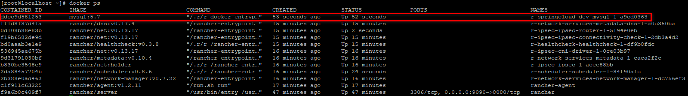
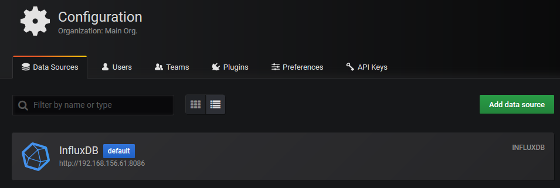
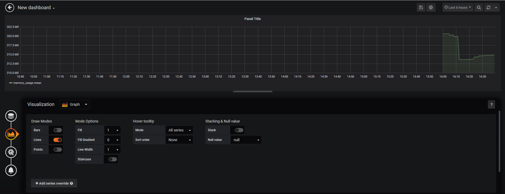

# 容器管理与容器监控

## 1、容器管理工具Rancher

### 1.1、什么是Rancher

Rancher是一个开源的企业级全栈化容器部署及管理平台。Rancher为容器提供一揽子基础架构服务：CNI兼容的网络服务、存储服务、主机管理、负载均衡、防护端......Rancher让上述服务跨越公有云、私有云、虚拟机、物理机环境运行、真正实现一键式应用部署和管理。

### 1.2、Rancher安装

（1） 下载rancher镜像

```shell
[root@localhost ~]# docker pull rancher/server
```

（2） 创建rancher容器

```shell
[root@localhost ~]# docker run -di --name=rancher --restart=always -p 9090:8080 rancher/server
```

restart为重启策略

- no：默认策略，在容器退出时不重启容器
- on-failure，在容器非正常退出时(退出状态非0)，才会重启容器
  on-failure:3，在容器非正常退出时重启容器，最多重启3次
- always，在容器退出总是重启容器
- unless-stopped，在容器退出时总是重启容器，但是不考虑在Docker守护进程启动时就已经停止了的容器

（3）在浏览器输入地址：http://192.168.156.61:9090 即可看到高端大气的欢迎页


点击确认(Got It)进入主界面，如果是英文可切换为简体中文


### 1.3、Rancher初始化

#### 1.3.1、添加环境

Rancher支持将资源分组归属到多个环境。每个环境具有自己独立的基础架构资源及服务，并由一个或多个用户、团队或组织所管理。

例如，可以创建独立的"开发"、"测试"及"生产"环境以确保环境之间的安全隔离，将"开发"环境的访问权限赋予全部人员，但限制"生产"环境的访问权限给一个小的团队。

（1）选择 Default -> 环境管理 菜单


（2）填写名称，点击"创建"按钮


（3）按照上述步骤，添加springcloud测试环境和生产环境

（4）可以通过点击logo右铡的菜单在各种环境下切换


#### 1.3.2、添加镜像库


#### 1.3.3、添加主机

（1）选择基础架构 -> 主机 菜单，点击添加主机


#### 1.3.4、添加应用

点击应用->全部(或用户)，点击"添加应用"按钮


填写名称和描述


### 1.4、应用部署

#### 1.4.1、MySQL部署

镜像：mysql:5.7


```shell
# 命令创建
[root@localhost ~]# docker run -id --name=mysql -p 3306:3306 -e MYSQL_ROOT_PASSWORD=123456 mysql:5.7
```


注意：添加环境变量MYSQL_ROOT_PASSWORD=123456




启动容器报错：iptables failed: iptables --wait -t nat -A DOCKER -p tcp -d 0/0 --dport 5000 -j DNAT --to-destination 172.18.0.4:5000 ! -i br-ff45d935188b: iptables: No chain/target/match by that name. (exit status 1)

解决办法：systemctl restart docker


#### 1.4.2、RibbitMQ部署

镜像：rabbitmq:management


```shell
# 命令创建
docker run -di --name=tensquare_rabbitmq -p 5671:5671 -p 5672:5672 -p 4369:4369 -p 15671:15671 -p 15672:15672 -p 25672:25672 rabbitmq:management
```


访问地址：http://192.168.156.61:15672 账号和密码：guest/guest

### 1.5、扩容/缩容

缩容、扩容的微服务不能有端口映射，需要配全网关一起使用


复制触发地址使用POST请求


## 2、influxDB

### 2.1、什么是influxDB

influxDB是一个分布式时间序列数据库，cAdvisor仅仅显示实时信息，但是不存储监视数据。因此，需要提供时序数据库用于存储cAdvisor组件所提供的监控信息，以便显示除实时信息之外的时序数据。

### 2.2、influxDB安装

（1）下载镜像

```shell
[root@localhost ~]# docker pull tutum/influxdb
```

（2）创建容器


```shell
[root@localhost ~]# docker run -di -p 8083:8083 -p 8086:8086 --expose 8090 --expose 8099 --name influxsrv tutum/influxdb
```

端口描述：8083端口：web访问端口  8086：数据写入端口

访问地址：http://192.168.156.61:8083/


### 2.3、influxDB常用操作

#### 2.3.1、创建数据库

```shell
CREATE DATABASE "cadvisor"
```


回车创建数据库

```shell
SHOW DATABASES
```


查看数据库

#### 2.3.2、创建用户并授权

创建用户

```shell
CREATE USER "cadvisor" WITH PASSWORD 'cadvisor' WITH ALL PRIVILEGES
```


查看用户

```shell
SHOW USERS
```


用户授权

```shell
grant all privileges on cadvisor to cadvisor
grant WRITE on cadvisor to cadvisor
grant READ on cadvisor to cadvisor
```

#### 2.3.3、查看采集的数据

切换到cadvisor数据数据，使用以下命令查看采集的数据

```shell
SHOW MEASUREMENTS
```


现在还没有数据，如果想采集系统的数据，需要使用Cadvisor软件来实现

## 3、cAdvisor

### 3.1、什么是cAdvisor

Google开源的用于监控基础设施应用的工具，它是一个强大的监控工具，不需要任何配置就可以通过运行在Docker主机上的容器来监控Docker容器，而且可以监控Docker主机。更多详细操作和配置选项可以查看Github上的cAdvisor项目文档。

### 3.2、cAdvisor安装

（1）下载镜像

```shell
[root@localhost ~]# docker pull google/cadvisor
```

（2）创建容器


```shell
[root@localhost ~]# docker run --volume=/:/rootfs:ro --volume=/var/run:/var/run:rw --volume=/sys:/sys:ro --volume=/varlib/docker/:/var/lib/docker:ro --publish=8080:8080 --detach=true --link influxsrv:influxsrv --name=cadvisor google/cadvisor -storage_driver=influxdb -storage_driver_db=cadvisor -storage_driver_host=influxsrv:8086
```

WEB前端访问地址：http://192.168.156.61:8080/containers/

性能指标含义参照地址：https://blog.csdn.net/ZHANG_H_A/article/details/53097084

再次查看influxDB，发现已经有很多数据数据被采集进去了。


## 4、Grafana

### 4.1、什么是Grafana

Grafana是一个可视化面板(Dashboard)，有着非常漂亮的图表和布局展示，功能齐全的度量仪表盘和图形编辑器。支持Graphite、zabbix、InfluxDB、Prometheus和OpenTSDB作为数据源。

Grafana主要特征：灵活丰富的图形化选项、可以混合多种风格、支持白天和夜间模式、多个数据源

### 4.2、下载镜像

（1）下载镜像

```shell
[root@localhost ~]# docker pull grafana/grafana
```

（2）创建容器


```shell
[root@localhost ~]# docker run -d -p 3001:3000 -e INFLUXDB_HOST=influxsrv -e INFLUXDB_PORT=8086 -e INFLUXDB_NAME=cadvisor -e INFLUXDB_USER=cadvisor -e INFLUXDB_PASS=cadvisor --link influxsrv:influxsrv --name grafana grafana/grafana
```

（3）访问

```shell
http://192.168.156.61:3001 admin/admin
```

登录后的主页：


### 4.3、Granafa的使用

#### 4.3.1、添加数据源

（1）点击设置，DataSource


（2）点击Add data sources




#### 4.3.2、添加仪表盘

（1）选择Dashboards -> Manager


（2）点击 New Dashboard


（3）点击 Add Query


（4）设置数据源


（5）设置图表类型



（6）设置图表标题


（7）保存


#### 4.4.3、预警通知设置

（1）选择菜单 Alerting -> Notificeaction channels


（2）点击 Add channel


（3）填写名称，选择类型为webhook，填写钩子地址

回到Rancher里复制扩容地址


点击测试


点击 Save 按钮保存成功


#### 4.4.4、仪表盘预警设置

（1）选择菜单 Dashboards


（2）选择要预警的服务


（3）编辑


（4）点击 Create Alert


（5）设置预警

