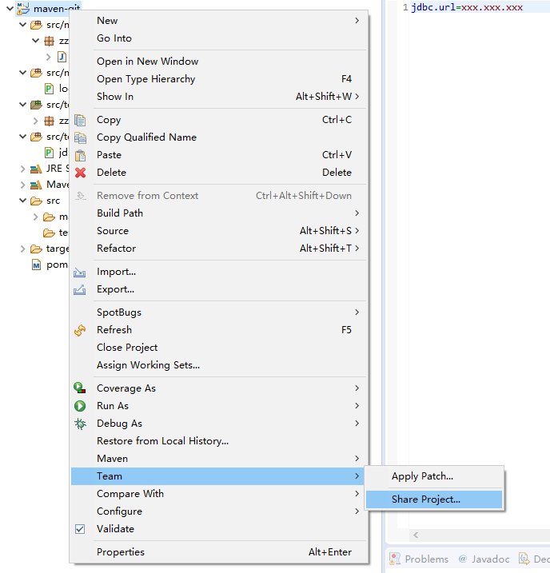
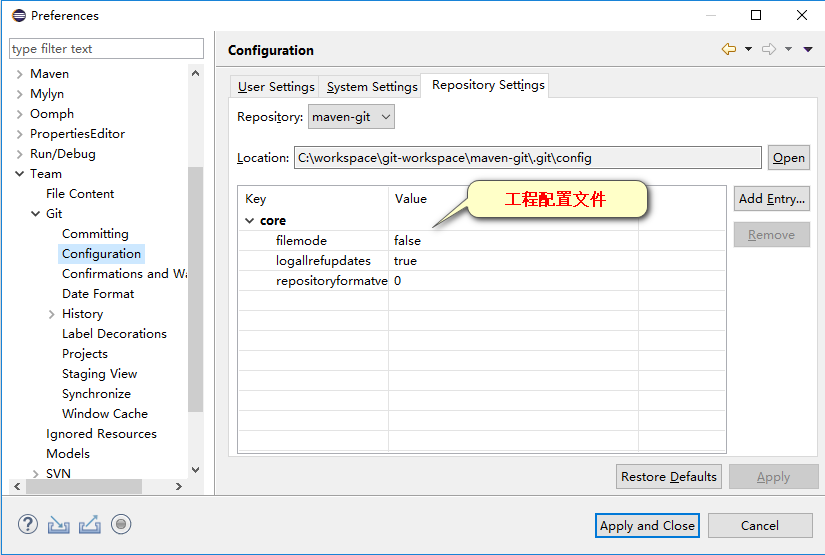

# 一、Git结构

## 工作区

写代码

## 暂存区

临时存储

## 本地库

历史版本

工作区 -> git add ->暂存区 -> git commit -> 本地库

# 二、Git和代码托管中心

代码托管中心的任务：维护远程库

## 1、局域网环境下

GitLab服务器

## 2、外网环境下

GitHub

码云

# 三、本地库和远程库

## 1、团队内部协作

本地库 -> push -> 远程库 -> clone -> 本地库 -> push(加入团队) ->远程库

## 2、跨团队协作

A的远程库 -> fork -> B的远程库 -> clone -> 本地库 -> push  -> B的远程库 -> pull request -> A审核 -> A merge -> A的远程库

# 四、Git命令行操作

## 1、本地库操作

### 1.1、本地库初始化

命令：git init

效果：


注意：.git 目录中存放的是本地库相关的子目录和文件，不要删除，也不要胡乱修改

### 1.2、设置签名

#### 1、形式

用户名：zczhao

Email地址： fhqfndn@gmail.com

#### 2、作用

区分不同开发人员的身份

#### 3、辨析

这里设置的签名和登录远程库(代码托管中心)的账号、密码没有任何关系

#### 4、命令

**项目级别/仓库级别**：仅在当前本地库范围内有效

命令：

​	git config user.name zczhao_pro

​	git config user.email fhqfndn_pro@gmail.com

信息保存位置：./.git/config 文件


**系统用户级别：**登录当前操作系统的用户范围

命令：

​	git config --global user.name zczhao_glb

​	git config --global user.email fhqfndn_glb@gmail.com

信息保存位置：~/.gitconfig 文件


**级别优先级：**

​	就近原则：项目级别优先于系统用户级别，二者都有时采用项目级别的签名

​	如果只有系统用户级别的签名，就以系统用户级别的签名为准

​	二者都没有不允许

### 1.3、基本操作

#### 1、状态查看操作


​	git status

​	查看工作区、暂存区状态

#### 2、添加操作

​	git add [filename]

​	将工作区的"新建/修改"添加到暂存区

#### 3、提交操作

​	git commit -m "commit message" [filename]

​	将暂存区的内容提交到本地库

#### 4、查看历史记录

​	git log

​		显示所有历史版本


​		多屏显示控制方式： 1、空格向上翻页 2、b向上翻页 3、q退出

​	git log --pretty=oneline

​		显示所有历史版本


​	git reflog 

​		只显示当前之前的历史版本


​		HEAD@{移动到当前版本需要多少步}

#### 5、前进后通

**基于索引值操作(推荐使用)**

​	git reset --hard [局部索引值]


**使用^符号**(只能后退)

​	git reset --hard HEAD^

​	注：一个^表示后一步，n个表示后退n步


**使用~符号**(只能后退)

​	git reset --hard HEAD~[n]

​	注：n代表数字，n是多少就表示后退多少步

#### 6、reset 命令的三个参数对比

--soft 参数

​	仅仅在本地库移动HEAD指针


--mixed 参数

​	在本地库移动HEAD指针

​	重置暂存区


--hard 参数

​	在本地库移动HEAD指针

​	重置暂存区

​	重置工作区


#### 7、删除文件并找回

前提：删除前，文件存在时的状态提交到了本地库

操作：git reset --hard [指针位置]

​	删除操作已经提交到本地库：指针位置指向历史记录

​	删除操作尚未提交到本地库：指针位置使用 HEAD

```shell
# 强制拉取并覆盖本地代码
$ git reset --hard [指针位置]
```

#### 8、比较文件差异


​	git diff [文件名]

​		将工作区中的文件和暂存区进行比较


​	git diff [本地库中历史版本] [文件名]

​		将工作区中的文件和本地库历史记录比较


​	不带文件名比较多个文件


### 1.4、分支管理

#### 1、创建分支

​	git branch [分支名]

#### 2、查看分支

​	git branch -v

#### 3、切换分支

​	git checkout [分支名]


#### 4、合并分支

1. 切换到接受修改的分支(被全并，增加新内容)上

   git checkout [被合并分支名]

2. 执行 merge 命令

   git merge [有新内容分支名]


#### 5、解决冲突

​	冲突的表现


​	冲突的解决

1. 编辑文件，删除特殊符号

2. 把文件修改到满意的程度，保存退出

3. git add [文件名]

4. git commit -m "日志信息"

   注意：此时commit一定不能带具体文件名


#### 6、删除分支

```shell
# 本地删除远程不存在的分支
$ git fetch —prune
# 显示所有分支
$ git branch -a
# 删除本地分支
$ git branch -d branch_name
# 删除远程分支
$ git push origin --delete branch_name
```

## 2、案例实现

### 2.1、本地库初始化

```shell
Administrator@DESKTOP-MNL9I3U /cygdrive/c/workspace/git-workspace
$ mkdir demo

Administrator@DESKTOP-MNL9I3U /cygdrive/c/workspace/git-workspace
$ cd demo

# 本地库初始化
Administrator@DESKTOP-MNL9I3U /cygdrive/c/workspace/git-workspace/demo
$ git init
已初始化空的 Git 仓库于 /cygdrive/c/workspace/git-workspace/demo/.git/
```

### 2.2、新建文件

```shell
Administrator@DESKTOP-MNL9I3U /cygdrive/c/workspace/git-workspace/demo
$ vim bash_demo.txt

Administrator@DESKTOP-MNL9I3U /cygdrive/c/workspace/git-workspace/demo
$ cat bash_demo.txt
第一天产品经理需求完成bash demo
```

### 2.3、查看本地库状态

```shell
# 查看状态
Administrator@DESKTOP-MNL9I3U /cygdrive/c/workspace/git-workspace/demo
$ git status
位于分支 master

尚无提交

未跟踪的文件:
  （使用 "git add <文件>..." 以包含要提交的内容）

        bash_demo.txt

提交为空，但是存在尚未跟踪的文件（使用 "git add" 建立跟踪）
```

### 2.4、把文件加入暂存区

```shell
# 加入暂存区
Administrator@DESKTOP-MNL9I3U /cygdrive/c/workspace/git-workspace/demo
$ git add bash_demo.txt

Administrator@DESKTOP-MNL9I3U /cygdrive/c/workspace/git-workspace/demo
$ git status
位于分支 master

尚无提交

要提交的变更：
  （使用 "git rm --cached <文件>..." 以取消暂存）

        新文件：   bash_demo.txt
```

### 2.5、提交到本地仓库

```shell
# 提交到本地仓库
Administrator@DESKTOP-MNL9I3U /cygdrive/c/workspace/git-workspace/demo
$ git commit -m "bash first commit"
[master（根提交） 59efbf4] bash first commit
 1 file changed, 1 insertion(+)
 create mode 100644 bash_demo.txt
 
Administrator@DESKTOP-MNL9I3U /cygdrive/c/workspace/git-workspace/demo
$ git status
位于分支 master
无文件要提交，干净的工作区
```

### 2.6、从暂存区取消暂存

```shell
Administrator@DESKTOP-MNL9I3U /cygdrive/c/workspace/git-workspace/demo
$ vim bash_demo.txt

Administrator@DESKTOP-MNL9I3U /cygdrive/c/workspace/git-workspace/demo
$ cat bash_demo.txt
第一天产品经理需求完成bash demo，产品经理临时变更需求

Administrator@DESKTOP-MNL9I3U /cygdrive/c/workspace/git-workspace/demo
$ git status
位于分支 master
尚未暂存以备提交的变更：
  （使用 "git add <文件>..." 更新要提交的内容）
  （使用 "git checkout -- <文件>..." 丢弃工作区的改动）

Administrator@DESKTOP-MNL9I3U /cygdrive/c/workspace/git-workspace/demo
$ git add bash_demo.txt

Administrator@DESKTOP-MNL9I3U /cygdrive/c/workspace/git-workspace/demo
$ git status
位于分支 master
要提交的变更：
  （使用 "git reset HEAD <文件>..." 以取消暂存）

        修改：     bash_demo.txt
        
# 取消暂存        
Administrator@DESKTOP-MNL9I3U /cygdrive/c/workspace/git-workspace/demo
$ git reset HEAD bash_demo.txt
重置后取消暂存的变更：
M       bash_demo.txt

Administrator@DESKTOP-MNL9I3U /cygdrive/c/workspace/git-workspace/demo
$ cat bash_demo.txt
第一天产品经理需求完成bash demo，产品经理临时变更需求

# 文件内容回退到当前最新版本
Administrator@DESKTOP-MNL9I3U /cygdrive/c/workspace/git-workspace/demo
$ git checkout -- bash_demo.txt

Administrator@DESKTOP-MNL9I3U /cygdrive/c/workspace/git-workspace/demo
$ cat bash_demo.txt
第一天产品经理需求完成bash demo
```

### 2.7、回滚到某一版本

```shell
Administrator@DESKTOP-MNL9I3U /cygdrive/c/workspace/git-workspace/demo
$ vim bash_demo.txt

Administrator@DESKTOP-MNL9I3U /cygdrive/c/workspace/git-workspace/demo
$ cat bash_demo.txt
第一天产品经理需求完成bash demo
第二天产品经理需求完成bash demo

Administrator@DESKTOP-MNL9I3U /cygdrive/c/workspace/git-workspace/demo
$ git add bash_demo.txt

Administrator@DESKTOP-MNL9I3U /cygdrive/c/workspace/git-workspace/demo
$ git commit -m "second commit"
[master b3fd83f] second commit
 1 file changed, 1 insertion(+)

# 查看提交记录
Administrator@DESKTOP-MNL9I3U /cygdrive/c/workspace/git-workspace/demo
$ git log
commit b3fd83f4158cd055c35d673aeebe9d4217d6b434 (HEAD -> master)
Author: zczhao <fhqfndn@gmail.com>
Date:   Sun Oct 13 18:53:58 2019 +0800

    second commit

commit 59efbf4842b23ae002424b682bc2dc58600a88cc
Author: zczhao <fhqfndn@gmail.com>
Date:   Sun Oct 13 18:45:20 2019 +0800

    bash first commit

# 回退到某一版本
Administrator@DESKTOP-MNL9I3U /cygdrive/c/workspace/git-workspace/demo
$ git reset --hard 59efbf4842b23ae002424b682bc2dc58600a88cc
HEAD 现在位于 59efbf4 bash first commit

Administrator@DESKTOP-MNL9I3U /cygdrive/c/workspace/git-workspace/demo
$ git status
位于分支 master
无文件要提交，干净的工作区

Administrator@DESKTOP-MNL9I3U /cygdrive/c/workspace/git-workspace/demo
$ cat bash_demo.txt
第一天产品经理需求完成bash demo
```

### 2.8、从本地库删除文件

```shell
Administrator@DESKTOP-MNL9I3U /cygdrive/c/workspace/git-workspace/demo
$ git status
位于分支 master
无文件要提交，干净的工作区

Administrator@DESKTOP-MNL9I3U /cygdrive/c/workspace/git-workspace/demo
$ ll
总用量 1
-rw-rw-r--+ 1 Administrator None 43 10月 13 18:56 bash_demo.txt

# 本地库删除文件
Administrator@DESKTOP-MNL9I3U /cygdrive/c/workspace/git-workspace/demo
$ git rm bash_demo.txt
rm 'bash_demo.txt'

Administrator@DESKTOP-MNL9I3U /cygdrive/c/workspace/git-workspace/demo
$ git status
位于分支 master
要提交的变更：
  （使用 "git reset HEAD <文件>..." 以取消暂存）

        删除：     bash_demo.txt

# 提交到本地仓库
Administrator@DESKTOP-MNL9I3U /cygdrive/c/workspace/git-workspace/demo
$ git commit -m "delete bash demo"
[master 861d679] delete bash demo
 1 file changed, 1 deletion(-)
 delete mode 100644 bash_demo.txt
 
Administrator@DESKTOP-MNL9I3U /cygdrive/c/workspace/git-workspace/demo
$ git status
位于分支 master
无文件要提交，干净的工作区
```

# 五、Git基本原理

## 1、哈希

哈希是一个系列的加密算法，各个不同的哈希算法虽然加密强度不同，但是有以下几个共同点：

1. 不管输入数据的数据量有多大，输入同一个哈希算法，得到的加密结果长度固定
2. 哈希算法确定，输入数据确定，输出数据能够保证不变
3. 哈希算法确定，输入数据变化 ，输出数据一定有变化，而且通常变化很大
4. 哈希算法不可逆

Git底层采用的是SHA-1算法。

哈希算法可以被用来验证文件。原理如下图所示：


Git就靠这种机制来从根本上保证数据完整性的。

## 2、Git保证版本的机制

### 2.1、集中式版本控制工具的文件管理机制

以文件变更列表的方式存储信息。这类系统将它们保存的信息看作是一组基本文件和每个文件随时间逐步累积的差异


### 2.2、Git的文件管理机制

Git把数据看作是小型文件系统的一组快照。每次提交更新时Git都会对当前的全部文件制作一个快照并保存这个快照的索引。为了高效，如果文件没有修改，Git不再重新存储该文件，而是只保留一个链接指向之前存储的文件。所以Git的工作方式可以称之为快照流。


### 2.3、Git文件管理机制细节

Git的"提交对象"


提交对象及其父对象形成的链条


## 3、Git分支管理机制

### 3.1、分支的创建


### 3.2、分支的切换


# 六、GitHub

## 1、账号信息

GitHub首页就是注册页面：[https://github.com](https://github.com/)

## 2、创建远程库


## 3、创建远程库地址别名

git remote -v 查看当前所有远程地址别名

git remote add [别名] [远程地址]


## 4、推送

git push [别名] [分支名]


```shell
# 强制提交本地分支覆盖远程分支
$ git push origin 分支名 --force

# eg：强制覆盖远程master
# git push  orgin master --force
```

## 5、克隆

git clone [远程地址]


命令效果：

1. 完整的把远程库下载到本地
2. 创建origin远程地址别名
3. 初始化本地库

## 6、邀请加入团队成员


## 7、拉取

pull=fetch+merge

git fetch [远程库地址别名] [远程分支名]


git merge [远程库地址别名/远程分支名] 


git pull  [远程库地址别名] [远程分支名]


## 8、解决冲突

要点：

1. 如果不基于GitHub远程库的最新版所做的修改，不能推送，必须先拉取
2. 拉取下来如果进入冲突状态，则按照"分支冲突解决"操作即可。

类比：

​	债权人：老王

​	债务人：小刘

​	老王说：10天后归还。小刘接受，双方达成一致。

​	老王媳妇说：5天后归还。小刘不能接受，老王媳妇需要找老王确认后再执行。


## 9、跨团队协作

- Fork


- 本地修改，然后推送到远程


- Pull requests


- 登录fhqfndn@gmail.com


- 对话


- 审核代码


- 合并代码


- 将远程库修改拉取到本地


## 10、SSH登录

- 进入当前用户的家目录

  ```shell
  $ cd ~ 
  ```

- 删除.ssh目录

  ```shell
  $ rm -rf .ssh
  ```

- 运行命令生成.ssh密钥目录

  ```shell
  $ ssh-keygen -t rsa -C "fhqfndn@gmail.com"
  ```

- 进入.ssh目录查看文件列表

  ```shell
  $ cd .ssh
  $ ls -lF
  ```

- 查看id_rsa.pub文件内容

  ```shell
  $ cat id_rsa.pub
  ```

- 复制id_rsa.pub文件内容，登录GitHub。点击用户头像->Settings->SSH and GPG Kys

- New SSH Key

- 输入复制的密钥信息

- 验证是否成功

  ```shell
  $ ssh -T git@github.com
  ```

- 回到GitHub创建远程地址别名

  ```shell
  $ git remote add origin_ssh git@github.com:zczhao/huashan.git
  ```

- 推送文件进行测试


## 11、案例实现

### 11.1、创建远程库

参上本章实现

### 11.2、本地创建新的仓库并推送到远程仓库

```shell
$ echo "# demo" >> README.md
$ git init
$ branch 'master' of https://github.com/zczhao/doc-workspace.git
$ git add README.md
$ git commit -m "first commit"
$ git remote add origin https://github.com/zczhao/demo.git
$ git push -u origin master
```

### 11.3、基于本地已有仓库推送到远程仓库

```shell
$ git remote add origin https://github.com/zczhao/demo.git
# 首次推送到远程仓库
$ git push -u origin master
# 后续推送到远程仓库
$ git push
```

### 11.4、克隆仓库

```shell
$ git clone https://github.com/zczhao/demo.git
# 推送到远程仓库
$ git push
# 批量删除多个目录下的文件或文件夹
$ find tensquare-*/.gitignore -exec rm -rf {} \;
$ find tensquare-*/target -exec rm -rf {} \;
```

### 11.5、标签管理

```shell
# 查看所有标签
$ git tag
# 查看远程标签
$ git show-ref --tag
# 查看远程标签
$ git tag -r
# 创建标签
$ git tag name
# 指定提交信息
$ git tag -a name -m "comment"
# 删除标签
$ git tag -d name
# 批量删除远程标签（注意最后有个空格）
$ git tag -l | awk '/b[0-9]{1,}.[0-9]{1,}.[0-9]{1,}$/ {print $1}' | xargs -n 1 git push --delete origin 
# 批量删除本地beta标签（注意最后有个空格）
$ git tag -l | awk '/b[0-9]{1,}.[0-9]{1,}.[0-9]{1,}$/ {print $1}' | xargs -n 1 git tag -d 
# 标签发布到远程
$ git push origin name
# 删除远程仓库标签
$ git push origin :name
```

### 11.6、分支管理

```shell
# 查看分支
$ git branch [-v]
# 查看远程分支
$ git branch -r
# 创建分支
$ git branch name
# 切换分支
$ git checkout name
# 合并分支
$ git merge name
# 提交分支到远程
$ git push origin name
# 删除分支
$ git branch -d name
# 删除远程分支
$ git push origin :name
```

### 11.7、子模块

#### 1、创建Git Submodule测试项目

##### 1.1、准备环境

```shell
$ pwd
/cygdrive/c/workspace/git-workspace/
$ mkdir -p submd/repos

# 创建需要的本地仓库
$ cd submd/repos
$ git --git-dir=lib1.git init --bare
$ git --git-dir=lib2.git init --bare
$ git --git-dir=project1.git init --bare
$ git --git-dir=project2.git init --bare
$ ll
drwxrwxr-x+ 1 Administrator None 0 10月 13 23:12 lib1.git/
drwxrwxr-x+ 1 Administrator None 0 10月 13 23:12 lib2.git/
drwxrwxr-x+ 1 Administrator None 0 10月 13 23:13 project1.git/
drwxrwxr-x+ 1 Administrator None 0 10月 13 23:13 project2.git/

# 初始化工作区
$ pwd
/cygdrive/c/workspace/git-workspace/submd
$ mkdir ws
```

##### 1.2、初始化项目

```shell
$ pwd
/cygdrive/c/workspace/git-workspace/submd/ws
# 初始化project1
$ git clone ../repos/project1.git
$ cd project1
$ echo "project1" > project-info.txt
$ git add project-info.txt
$ git commit -m "init project1"
$ git push origin master

$ pwd
/cygdrive/c/workspace/git-workspace/submd/ws
# 初始化project2
$ git clone ../repos/project2.git
$ cd project2
$ echo "project2" > project-info.txt
$ git add project-info.txt
$ git commit -m "init project2"
$ git push origin master
```

##### 1.3、初始化公共类库

```shell
$ pwd
/cygdrive/c/workspace/git-workspace/submd/ws
# 初始化公共类库lib1
$ git clone ../repos/lib1.git
$ cd lib1
$ echo "I'm lib1." > lib1-features
$ git add lib1-features
$ git commit -m "init lib1"
$ git push origin master

$ pwd
/cygdrive/c/workspace/git-workspace/submd/ws
# 初始化公共类库lib2
$ git clone ../repos/lib2.git
$ cd lib2
$ echo "I'm lib2." > lib2-features
$ git add lib2-features
$ git commit -m "init lib2"
$ git push origin master
```

#### 2、为主项目添加Submodules

##### 2.1、为project1添加lib1和lib2

```shell
$ pwd
/cygdrive/c/workspace/git-workspace/submd/ws
$ cd project1
$ ls
project-info.txt
# 添加子模块
$ git submodule add /cygdrive/c/workspace/git-workspace/submd/repos/lib1.git libs/lib1
$ git submodule add /cygdrive/c/workspace/git-workspace/submd/repos/lib2.git libs/lib2
$ ls
libs/ project-info.txt
$ ls libs
lib1/  lib2/
$ git status
位于分支 master
您的分支与上游分支 'origin/master' 一致。

要提交的变更：
  （使用 "git reset HEAD <文件>..." 以取消暂存）

        新文件：   .gitmodules
        新文件：   libs/lib1
        新文件：   libs/lib2
# 查看一下公共类库的内容
$ cat libs/lib1/lib1-features
I'm lib1.
$ cat libs/lib2/lib2-features
I'm lib2.

# 使用git submodule add命令为project1成功添加了两个公共类库（lib1、lib2），查看了当前的状态发现添加了一个新文件(.gitmodules)和两个文件夹(libs/lib1、libs/lib2),新增的.gitmodules作用:
$ cat .gitmodules
[submodule "libs/lib1"]
        path = libs/lib1
        url = /cygdrive/c/workspace/git-workspace/submd/repos/lib1.git
[submodule "libs/lib2"]
        path = libs/lib2
        url = /cygdrive/c/workspace/git-workspace/submd/repos/lib2.git
# .gitmodules记录了每个submodule的引用信息,知道当前项目的位置以及仓库的所在

# 把project1提交到本地仓库
$ git commit -am "add submodules[lib1,lib2] to project1"
# 推送到远程仓库
$ git push
```

##### 2.2、为project2添加lib1和lib2(完成1>2>3>4>5步后再执行)

```shell
$ pwd
/cygdrive/c/workspace/git-workspace/submd/ws
$ cd project2
$ ls
project-info.txt
$ git submodule add /cygdrive/c/workspace/git-workspace/submd/repos/lib1.git libs/lib1
$ git submodule add /cygdrive/c/workspace/git-workspace/submd/repos/lib2.git libs/lib2
$ ls
libs/ project-info.txt
# 初始化子仓库本地配置文件
$ git submodule init
$ git status
位于分支 master
您的分支与上游分支 'origin/master' 一致。

要提交的变更：
  （使用 "git reset HEAD <文件>..." 以取消暂存）

        新文件：   .gitmodules
        新文件：   libs/lib1
        新文件：   libs/lib2
$ git commit -am "add lib1 and lib2"
$ git push
```

#### 3、Clone带有Submodule的仓库

```shell
# 模拟开发人员b
$ pwd
/cygdrive/c/workspace/git-workspace/submd/ws
$ git clone ../repos/project1.git project1-b
$ cd project1-b
$ git submodule
-d667f3a948f362545e50fa9c6586a07ba6cd1aa9 libs/lib1
-8556f52e9c47bfd3761a66c2828214fbc7675b89 libs/lib2
# 看到submodules的状态是hash码和文件目录，但是注意前面有一个减号：-，含义是该子模块还没有检出

# 检出project1-b的submodules
$ git submodule init
# 同步子模块的数据
$ git submodule update
# 上面两个命令(git submodule init & update)可以简化
# 可以查看：.git/config文件的内容，最下面有submodule的注册信息

# 验证一下类库的文件是否存在
$ cat libs/lib1/lib1-features libs/lib2/lib2-features
I'm lib1.
I'm lib2.
```

#### 4、修改Submodule

```shell
# 在开发人员b的项目上修改Submodule的内容
$ pwd
/cygdrive/c/workspace/git-workspace/submd/ws/project1-b
# 先看一下当前Submodule的状态
$ cd libs/lib1
$ git status
头指针分离于 d667f3a
无文件要提交，干净的工作区
# 为什么是Not currently on any branch呢？不是应该默认在master分支吗？
# Git对于Submodule有特殊的处理方式，在一个主项目中引入了Submodule其实Git做了3件事情：
#   记录引用的仓库
#	记录主项目中Submodules的目录位置
#	记录引用Submodule的commit id

# 在project1中push之后其实就是更新了引用的commit id，然后project1-b在clone的时候获取到了submodule的commit id，然后当执行git submodule update的时候git就根据gitlink获取submodule的commit id，最后获取submodule的文件，所以clone之后不在任何分支上；但是master分支的commit id和HEAD保持一致。

# 查看/cygdrive/c/workspace/git-workspace/submd/ws/project1-b/libs/lib1的引用信息
$ cat  /cygdrive/c/workspace/git-workspace/submd/ws/project1-b/.git/modules/libs/lib1/HEAD
d667f3a948f362545e50fa9c6586a07ba6cd1aa9
$ cat  /cygdrive/c/workspace/git-workspace/submd/ws/project1-b/.git/modules/libs/lib1/refs/heads/master
d667f3a948f362545e50fa9c6586a07ba6cd1aa9

# 现在要修改lib1的文件需要先切换到master分支
$ pwd
/cygdrive/c/workspace/git-workspace/submd/ws/project1-b/libs/lib1
$ git checkout master
$ echo "add by developer B" >> lib1-features
$ git commit -am "update lib1-features by developer B"
# 在主项目中修改Submodule提交到仓库稍微繁琐一点,在git push之前先看看project1-b状态
$ pwd
/cygdrive/c/workspace/git-workspace/submd/ws/project1-b
$ git status
位于分支 master
您的分支与上游分支 'origin/master' 一致。

尚未暂存以备提交的变更：
  （使用 "git add <文件>..." 更新要提交的内容）
  （使用 "git checkout -- <文件>..." 丢弃工作区的改动）

        修改：     libs/lib1 (新提交)

修改尚未加入提交（使用 "git add" 和/或 "git commit -a"）
# libs/lib1 (new commits)状态表示libs/lib1有新的提交,这个比较特殊,看看project1-b的状态
$ git diff
diff --git a/libs/lib1 b/libs/lib1
index d667f3a..60987c6 160000
--- a/libs/lib1
+++ b/libs/lib1
@@ -1 +1 @@
-Subproject commit d667f3a948f362545e50fa9c6586a07ba6cd1aa9
+Subproject commit 60987c6997cc4a8d78fb23609a43ab81a8bee91b
# 从状态中可以看出libs/lib1的commit id由原来的d667f3a948f362545e50fa9c6586a07ba6cd1aa9更改为60987c6997cc4a8d78fb23609a43ab81a8bee91b
# 注意:如果现在执行了git submodule update 操作那么libs/lib1的commit id又会还原到d667f3a948f362545e50fa9c6586a07ba6cd1aa,这样的话刚刚的修改是不是丢了呢?不会,因为修改已经提交到了master分支,只要再git checkout master就可以了

# 现在可以把libs/lib1的修改提交到仓库了
$ pwd
/cygdrive/c/workspace/git-workspace/submd/ws/project1-b/libs/lib1
$ git push
# 现在仅仅只完成了一步,下一步要提交project1-b引用submodule的commit id
$ pwd
/cygdrive/c/workspace/git-workspace/submd/ws/project1-b
$ git add -u
$ git commit -m "update libs/lib1 to lastest commit id"
$ git push
# 完成了Submodule的修改并把libs/lib1的最新commit id提交到了仓库
```

#### 5、更新主项目的Submodules

```shell
# 进入project1目录同步仓库
$ pwd
/cygdrive/c/workspace/git-workspace/submd/ws/project1
$ git pull
$ git status
位于分支 master
您的分支与上游分支 'origin/master' 一致。

尚未暂存以备提交的变更：
  （使用 "git add <文件>..." 更新要提交的内容）
  （使用 "git checkout -- <文件>..." 丢弃工作区的改动）

        修改：     libs/lib1 (新提交)

修改尚未加入提交（使用 "git add" 和/或 "git commit -a"）
# 运行了git pull命令和git status获取了最新的仓库源码，然后看到了状态时modified，这是为什么呢？
# 用git diff比较一下不同
$ git diff
diff --git a/libs/lib1 b/libs/lib1
index 60987c6..d667f3a 160000
--- a/libs/lib1
+++ b/libs/lib1
@@ -1 +1 @@
-Subproject commit 60987c6997cc4a8d78fb23609a43ab81a8bee91b
+Subproject commit d667f3a948f362545e50fa9c6586a07ba6cd1aa9
# 从diff的结果分析出来是因为submodule的commit id更改了，我们前面刚刚讲了要在主项目更新submodule的内容首先要提交submdoule的内容，然后再更新主项目中引用的submodule commit id；现在看到的不同就是因为刚刚更改了project1-b的submodule commit id；好的，来学习一下怎么更新project1的公共类库。
$ git submodule update
```

#### 6、修改lib1和lib2并同步到project1和project2

```shell
# 假如开发人员C同时负责project1和project2，有可能在修改project1的某个功能的时候发现lib1或者lib2的某个组件有bug需要修复，这个需求多模块和大型系统中经常遇到，应该怎么解决呢？
# 假如需求如下:
#	在lib1中添加一个文件：README，用来描述lib1的功能
# 	在lib2中的lib2-features文件中添加一写文字：学习Git submodule的修改并同步功能

# 在lib1中添加一个文件: README
$ pwd
/cygdrive/c/workspace/git-workspace/submd/ws/project2
$ cd libs/lib1
$ git checkout master
$ echo "lib1 readme contents" > README
$ git add README
$ git commit -m "add file README"
$ git push

# 如果一开始忘记checkout到master并且有commit，则可以采用如下方法
$ git reflog # 查看commit hash id 假设id是12345
$ git checkout master
$ git cherry-pick 12345
$ git push

# 需要在project2中再更新lib1的commit id
$ pwd
/cygdrive/c/workspace/git-workspace/submd/ws/project2
$ git status
位于分支 master
您的分支与上游分支 'origin/master' 一致。

尚未暂存以备提交的变更：
  （使用 "git add <文件>..." 更新要提交的内容）
  （使用 "git checkout -- <文件>..." 丢弃工作区的改动）

        修改：     libs/lib1 (新提交)

修改尚未加入提交（使用 "git add" 和/或 "git commit -a"）
$ git add libs/lib1
$ git commit -m "update lib1 to lastest commit id"
# 暂时不push到仓库,等待和lib2的修改一起push

# 在lib2中的lib2-features文件添加文字
$ pwd
/cygdrive/c/workspace/git-workspace/submd/ws/project2
$ cd libs/lib2
$ echo "学习Git submodule的修改并同步功能" >> lib2-features
$ cat lib2-features
I'm lib2.
学习Git submodule的修改并同步功能
$ git commit -am "添加文字：学习Git submodule的修改并同步功能"
$ git push

$ pwd
/cygdrive/c/workspace/git-workspace/submd/ws/project2
$ git status
位于分支 master
您的分支领先 'origin/master' 共 1 个提交。
  （使用 "git push" 来发布您的本地提交）

尚未暂存以备提交的变更：
  （使用 "git add <文件>..." 更新要提交的内容）
  （使用 "git checkout -- <文件>..." 丢弃工作区的改动）

        修改：     libs/lib2 (新提交)

修改尚未加入提交（使用 "git add" 和/或 "git commit -a"）
$ git add libs/lib2
$ git commit -m "update lib2 to lastest commit id"
$ git status
位于分支 master
您的分支领先 'origin/master' 共 2 个提交。
  （使用 "git push" 来发布您的本地提交）

无文件要提交，干净的工作区
$ git push
```

#### 7、同步project2的lib1和lib2的修改到project1

```shell
# 现在project2已经享受到了最新的代码带来的快乐，那么既然project1和project2属于同一个风格，或者调用同一个功能，要让这两个(可能几十个)项目保持一致。
$ pwd
/cygdrive/c/workspace/git-workspace/submd/ws/project1
$ git pull
已经是最新的。
# 看看上面的结果对吗？为什么lib1和lib2更新了但是没有显示new commits呢？说到这里我记得刚刚开始学习的时候真得要晕死了，Git跟我玩捉迷藏游戏，为什么明明提交了但是从project1更新不到任何改动呢？
# 分析一下问题，不过在分析之前先看看当前(project1和project2)的submodule状态
# project2 的状态，也就是刚刚修改后的状态
$ cd /cygdrive/c/workspace/git-workspace/submd/ws/project2
$ git submodule
 aa552f2d9a6cfae5517480986535c71e78c67740 libs/lib1 (heads/master)
 db3205381941638867f7a552ac94b023e4ed929e libs/lib2 (heads/master)
# project1 的状态，等待更新submodules
$ cd /cygdrive/c/workspace/git-workspace/submd/ws/project1
$ git submodule
 60987c6997cc4a8d78fb23609a43ab81a8bee91b libs/lib1 (remotes/origin/HEAD)
 8556f52e9c47bfd3761a66c2828214fbc7675b89 libs/lib2 (heads/master)
# 两个项目有两个区别
#	commit id各不相同
#	libs/lib1所处的分支不同
```

#### 8、更新project1的lib1和lib2改动

```shell
# 在project2中修改的时候把lib1和lib2都切换到了master分支，目前project1中的lib1不在任何分支，先切换到master分支
$ pwd
/cygdrive/c/workspace/git-workspace/submd/ws/project1
$ cd libs/lib1
$ git checkout master
$ git pull
# 果不其然，看到了刚刚在project2中修改的内容，同步到了project1中，当然现在更新了project1的lib1，commit id也会随之变动
$ cd ../../
$ pwd
/cygdrive/c/workspace/git-workspace/submd/ws/project1
$ git status
位于分支 master
您的分支与上游分支 'origin/master' 一致。

尚未暂存以备提交的变更：
  （使用 "git add <文件>..." 更新要提交的内容）
  （使用 "git checkout -- <文件>..." 丢弃工作区的改动）

        修改：     libs/lib1 (新提交)

修改尚未加入提交（使用 "git add" 和/或 "git commit -a"）
$ git diff
diff --git a/libs/lib1 b/libs/lib1
index 60987c6..aa552f2 160000
--- a/libs/lib1
+++ b/libs/lib1
@@ -1 +1 @@
-Subproject commit 60987c6997cc4a8d78fb23609a43ab81a8bee91b
+Subproject commit aa552f2d9a6cfae5517480986535c71e78c67740
# 现在最新的commit id和project2目前的状态一致，说明真的同步了；好的，现在可以使用相同的办法更新lib2了
$ cd libs/lib2
$ git checkout master
$ git pull
```

#### 9、更新project1的submodule引用

```shell
# 更新了project1的lib1和lib2的最新版本，现在要把最新的commit id保存到project1中以保持最新的引用
$ pwd
/cygdrive/c/workspace/git-workspace/submd/ws/project1
$ git status
位于分支 master
您的分支与上游分支 'origin/master' 一致。

尚未暂存以备提交的变更：
  （使用 "git add <文件>..." 更新要提交的内容）
  （使用 "git checkout -- <文件>..." 丢弃工作区的改动）

        修改：     libs/lib1 (新提交)
        修改：     libs/lib2 (新提交)

修改尚未加入提交（使用 "git add" 和/或 "git commit -a"）
$ git commit -am "update lib1 and lib2 commit id to new version"
$ git push
```

#### 10、更新到project1-b项目的子模块

```shell
$ git submodule foreach git pull
```

#### 11、一次性Clone项目和Submodules

```shell
# 一般人使用的时候都是使用如下命令
$ git clone /path/to/repos/foo.git
$ git submodule init
$ git submodule update
# 上面的命令简直弱暴了，直接一行命令搞定
# –recursive参数的含义：可以在clone项目时同时clone关联的submodules
$ git clone --recursive /path/to/repos/foo.git
```

#### 12、移除Submodule

```shell
# 删除git cache和物理文件夹
$ git rm -r --cached libs/
$ rm -rf libs
# 删除.gitmodules的内容（或者整个文件） 因为本例只有两个子模块，直接删除文件
$ rm .gitmodules
# 如果仅仅删除某一个submodule那么打开.gitmodules文件编辑，删除对应submodule配置即可
# 删除.git/config的submodule配置
# 源文件
[core]
        repositoryformatversion = 0
        filemode = true
        bare = false
        logallrefupdates = true
        ignorecase = true
[remote "origin"]
        url = /cygdrive/c/workspace/git-workspace/submd/ws/../repos/project1.git
        fetch = +refs/heads/*:refs/remotes/origin/*
[branch "master"]
        remote = origin
        merge = refs/heads/master
[submodule "libs/lib1"]
        active = true
        url = /cygdrive/c/workspace/git-workspace/submd/repos/lib1.git
[submodule "libs/lib2"]
        active = true
        url = /cygdrive/c/workspace/git-workspace/submd/repos/lib2.git
# 删除后
[core]
        repositoryformatversion = 0
        filemode = true
        bare = false
        logallrefupdates = true
        ignorecase = true
[remote "origin"]
        url = /cygdrive/c/workspace/git-workspace/submd/ws/../repos/project1.git
        fetch = +refs/heads/*:refs/remotes/origin/*
[branch "master"]
        remote = origin
        merge = refs/heads/master
# 提交更改
$ git status
$ git add .gitmodules
$ git commit -m "删除子模块lib1和lib2"
$ git push
```


# 七、Eclipse操作

## 1、将工程初始化为本地库

工程 -> 右键 -> Team -> Share Project -> Git




Create Repository




## 2、设置本地库范围签名


 

## 3、Eclipse中忽略文件

### 3.1、Eclipse特定文件

这些都是Eclipse为了管理我们创建的工程而维护的文件，和开发的代码没有直接关系。最好不要在Git中进行追踪，也就是把他们忽略。
.classpath 文件
.project 文件
.settings 目录下所有文件

### 3.2、为什么要忽略Eclipse特定文件

同一个团队中很难保证大家使用相同的IDE工具，而IDE工具不同时，相关的工程特定文件就有可能不同。如果这些文件加入版本控制，那么开发时很可能需要为了这些文件去解决宣冲突。

### 3.3、GitHub管网样例文件

<https://github.com/github/gitignore>

<https://github.com/github/gitignore/blob/master/Java.gitignore>

### 3.4、编辑本地忽略配置文件，文件名任意

Java.gitignore

```
# Compiled class file
*.class

# Log file
*.log

# BlueJ files
*.ctxt

# Mobile Tools for Java (J2ME)
.mtj.tmp/

# Package Files #
*.jar
*.war
*.nar
*.ear
*.zip
*.tar.gz
*.rar

# virtual machine crash logs, see http://www.java.com/en/download/help/error_hotspot.xml
hs_err_pid*
```

### 3.5、在~/.gitconfig文件中引入上述文件

```
[core]
	excludesfile = C:/Users/Administrator/Java.gitignore
```

**注意：这里路径中一定使用"/"，不能使用"\"**

**在项目中忽略配置文件**


## 4、Eclipse中本地库基本操作

### 4.1、添加到暂存区


**Ctrl+#/Ctrl+Shift+3快捷键**

### 4.2、提交到本地库


## 5、将本地工程推送到远程库

### 5.1、登录GitHub

### 5.2、创建仓库


### 5.3、复制仓库地址


### 5.4、关联远程库


## 6、将远程库的工程克隆到本地

### 6.1、File -> Import... 导入工程


## 7、Eclipse中解决冲突

### 7.1、推送到远程库


### 7.2、推送另一个工程的文件


**推送失败，需要重新拉取**


拉取最新的文件


冲突的文件


手动处理冲突的内容


提交到本地库


再的推送到远程库


## 8、Eclipse创建Tag

Team -> Remote每次都需要输入仓库地址可执行以下解决


### 8.1、本地创建tag


### 8.2、推送tag到远程仓库


# 八、Git工作流

## 1、概念

在项目开发过程中使用Git的方式

## 2、分类

### 2.1、集中式工作流

像SVN一样，集中式工作流以中央仓库作为项目所有修改的单点实体。所有修改都提交到Master这个分支上。

这种方式与SVN的方式区别就是开发人员有本地库。Git很多特性并没有用到。


### 2.2、GitFlow工作流

GitFlow工作流通过为功能开发，发布准备和维护设立了独立的分支，让发布迭代过程更流畅。严格的分支模型也为大型项目提供了一些非常必要的结构。


### 2.3、Forking工作流

Forking工作流是在GitFlow基础上，充分利用Git的Fork和pull request的功能以达到代码审核的目的。更适合安全可靠地管理大团队的开发者。而且能接受不信任贡献者的提交。


## 3、GitFlow工作流详解

### 3.1、分支各类

- 主干分支master

主要负责管理正在运行的生产环境的代码。永远保持与正在运行的生产环境完全一致。

- 开发分支 develop

主要负责管理正在开发过程中的代码。一般情况下应该是最新的代码。

- bug修理分支 hotfix

主要负责管理生产环境下出现的紧急修复的代码。从主干分支分出，修理完毕并测试上结后，并回主干分支。并回后，视情况可以删除该分支。

- 准生产分支(预发布分支) release

较大的版本上线前，会从开发分支中分现准生产分支，进行最后阶段的集成测试。该版本上线后，会合并到主干分支。生产环境运行一段阶段稳定后可以视情况删除。

- 功能分支 feature

为了不影响较短周期的开发工作，一般把中长期开发模块，会从开发分支中独立出来。开发完成后合并到开发分支。

### 3.2、GitFlow工作流举例


### 3.3、GitFlow实战

- 创建分支


其他团队成员拉取分支，先执行pull 

**切换分支**


**切换回 master**


**合并分支**


**合并完后，推送master到远程仓库**

