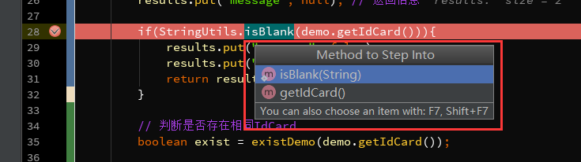
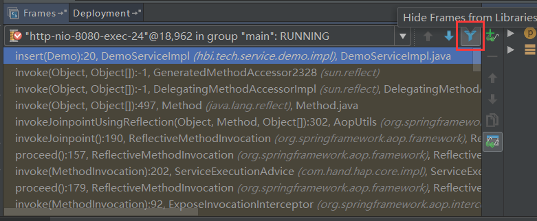

# 全局JDK配置


# 全局MAVEN配置


# 在Intellij IDEA中使用Debug

参考网上博文：https://www.cnblogs.com/chiangchou/archive/2017/09/05/idea-debug.html

## 1、Debug开篇


设置调试模式的Variables和Watches窗口的变量为Object模式

```java
@Test
public void test01() {
    Map<String, Integer> map = new HashMap<String, Integer>();
    map.put("语文", 1);
    map.put("数学", 2);
    map.put("英语", 3);
    map.put("历史", 4);
    map.put("政治", 5);
    map.put("地理", 6);
    map.put("生物", 7);
    map.put("化学", 8);
    for (Entry<String, Integer> entry : map.entrySet()) {
        System.out.println(entry.getKey() + ": " + entry.getValue());
    }
}
```

在 System.out.println(entry.getKey() + ": " + entry.getValue());行打一个断点


并不是想要的效果：


最终效果图：


## 2、基本用法&快捷键

1、首先说第一组按钮，共8个按钮，从左到右依次如下：


- ==Show Execution Point (Alt + F10)==： 如果你的光标在其它行或其它页面，点击这个按钮可跳转到当前代码执行的行
- ==Step Over (F8)==： 步过，一行一行地往下走，如果这一行上有方法不会进入方法。
- ==Step Into (F7)==： 步入，如果当前行有方法，可以进入方法内部，一般用于进入自定义方法内，不会进入官方类库的方法，如第25行的put方法。
- ==Force Step Into (Alt + Shift + F7)==： 强制步入，能进入任何方法，查看底层源码的时候可以用这个进入官方类库的方法。
- ==Step Out (Shift + F8)==： 步出，从步入的方法内退出到方法调用处，此时方法已执行完毕，只是还没有完成赋值。
- ==Drop Frame (默认无)==： 回退断点，后面章节详细说明。
- ==Run to Cursor (Alt + F9)==： 运行到光标处，你可以将光标定位到你需要查看的那一行，然后使用这个功能，代码会运行至光标行，而不需要打断点。
- ==Evaluate Expression (Alt + F8)==： 计算表达式，后面章节详细说明。

2、第二组按钮，其8个按钮，从上到下依次如下：


- ==Rerun 'xxxx'(Ctrl+F5)==： 重新运行程序，会关闭服务后重新启动程序。

- Rerun Failed Tests：

- Toggle auto-test：目前没发现具体用法

- Pause Program：暂停程序 ，启动Debug。目前没发现具体用法

- ==Stop 'xxx'(Ctrl+F2)==：连续按两下，关闭程序。有时候你会发现关闭服务再启动时，报端口被占用，这是因为没完全关闭服务的原因，你就需要查杀所有JVM进程了。

- ==View Breakpoints (Ctrl + Shift + F8)==： 查看所有断点，后面章节会涉及到

- ==Mute Breakpoints==： 哑的断点，选择这个后，所有断点变为灰色，断点失效，按F9则可以直接运行完程序。再次点击，断点变为红色，有效。如果只想使某一个断点失效，可以在断点上右键取消Enabled，如图2.4，则该行断点失效。　　　　 

- ==Update 'tech' application (Ctrl + F5)==： 更新程序，一般在你的代码有改动后可执行这个功能。而这个功能对应的操作则是在服务配置里

更新程序，On 'Update' actions，执行更新操作时所做的事情，一般选择'Update classes and resources'，即更新类和资源文件。一般配合热部署插件会更好用，如JRebel，这样就不用每次更改代码后还要去重新启动服务。如何激活JRebel，在最后章节附上。
下面的On frame deactivation，在IDEA窗口失去焦点时触发，即一般你从idea切换到浏览器的时候，idea会自动帮你做的事情，一般可以设置Do nothing，频繁切换会比较消耗资源的。


## 3、变量查看

在Debug过程中，跟踪查看变量的变化是非常必要的，这里就简单说下IDEA中可以查看变量的几个地方，相信大部分人都了解。

1、如下，在IDEA中，参数所在行后面会显示当前变量的值。


2、光标悬停到参数上，显示当前变量信息。


3、在Variables里查看，这里显示当前方法里的所有变量


4、在Watches里，点击New Watch，输入需要查看的变量。或者可以从Variables里拖到Watche里查看

如果发现你有Watches，可能在上图眼镜所在的地方。


## 4、计算表达式

Evaluate Expression (Alt + F8) 。可以使用这个操作在调试过程中计算某个表达式的值，而不用再去打印信息。


1、按Alt + F8或按钮，或者，你可以选中某个表达式再Alt + F8，弹出计算表达式的窗口，如下，回车或点击Evaluate计算表达式的值。
　　　  这个表达式不仅可以是一般变量或参数，也可以是方法，当你的一行代码中调用了几个方法时，就可以通过这种方式查看查看某个方法的返回值。


2、设置变量，在计算表达式的框里，可以改变变量的值，这样有时候就能很方便我们去调试各种值的情况了不是


## 5、智能步入

​       想想，一行代码里有好几个方法，怎么只选择某一个方法进入。之前提到过使用Step Into (Alt + F7) 或者 Force Step Into (Alt + Shift + F7)进入到方法内部，但这两个操作会根据方法调用顺序依次进入，这比较麻烦。
　　那么智能步入就很方便了，智能步入，这个功能在Run里可以看到，Smart Step Into (Shift + F7)


按Shift + F7，会自动定位到当前断点行，并列出需要进入的方法，点击方法进入方法内部。

如果只有一个方法，则直接进入，类似Force Step Into。



## 6、断点条件设置

　　通过设置断点条件，在满足条件时，才停在断点处，否则直接运行。
　　通常，当我们在遍历一个比较大的集合或数组时，在循环内设置了一个断点，难道我们要一个一个去看变量的值？那肯定很累，说不定你还错过这个值得重新来一次。
　　1、在断点上右键直接设置当前断点的条件，如图6.1，我设置exist为true时断点才生效。


2、点击View Breakpoints (Ctrl + Shift + F8)，查看所有断点。
	Java Line Breakpoints 显示了所有的断点，在右边勾选Condition，设置断点的条件。
	勾选Log message to console，则会将当前断点行输出到控制台，如图6.3
	勾选Evaluate and log，可以在执行这行代码是计算表达式的值，并将结果输出到控制台。


3、再说说右边的Filters过滤，这些一般情况下不常用，简单说下意思。
　　　　Instance filters：实例过滤，输入实例ID(如图6.5中的实例ID)，但是我这里没有成功，不知道什么原因，知道的朋友留个言。
　　　　Class filters：类过滤，根据类名过滤，同样没有成功....
　　　　Pass count：用于循环中，如果断点在循环中，可以设置该值，循环多少次后停在断点处，之后的循环都会停在断点处。


4、异常断点，通过设置异常断点，在程序中出现需要拦截的异常时，会自动定位到异常行。
　　如图6.6，点击+号添加Java Exception Breakpoints，添加异常断点。然后输入需要断点的异常类，如图6.7，之后可以在Java Exception Breakpoints里看到添加的异常断点。
　　我这里添加了一个NullPointerException异常断点，如图6.8，出现空指针异常后，自动定位在空指针异常行。


## 7、多线程调试

　　一般情况下我们调试的时候是在一个线程中的，一步一步往下走。但有时候你会发现在Debug的时候，想发起另外一个请求都无法进行了？
　　那是因为IDEA在Debug时默认阻塞级别是ALL，会阻塞其它线程，只有在当前调试线程走完时才会走其它线程。可以在View Breakpoints里选择Thread，如图7.1，然后点击Make Default设置为默认选项。


切换线程，在图7.2中Frames的下拉列表里，可以切换当前的线程，如下我这里有两个Debug的线程，切换另外一个则进入另一个Debug的线程。


## 8、回退断点

在调试的时候，想要重新走一下流程而不用再次发起一个请求？
　　1、首先认识下这个方法调用栈，如图8.1，首先请求进入DemoController的insertDemo方法，然后调用insert方法，其它的invoke我们且先不管，最上面的方法是当前断点所在的方法。


　2、断点回退
　　所谓的断点回退，其实就是回退到上一个方法调用的开始处，在IDEA里测试无法一行一行地回退或回到到上一个断点处，而是回到上一个方法。
　　回退的方式有两种，一种是Drop Frame按钮(图8.2)，按调用的方法逐步回退，包括三方类库的其它方法(取消Show All Frames按钮会显示三方类库的方法，如图8.3)。
　　第二种方式，在调用栈方法上选择要回退的方法，右键选择Drop Frame(图8.4)，回退到该方法的上一个方法调用处，此时再按F9(Resume Program)，可以看到程序进入到该方法的断点处了。
　　但有一点需要注意，断点回退只能重新走一下流程，之前的某些参数/数据的状态已经改变了的是无法回退到之前的状态的，如对象、集合、更新了数据库数据等等。





## 9、中断Debug

　　想要在Debug的时候，中断请求，不要再走剩余的流程了？
　　有些时候，我们看到传入的参数有误后，不想走后面的流程了，怎么中断这次请求呢(后面的流程要删除数据库数据呢....)，难道要关闭服务重新启动程序？嗯，我以前也是这么干的。
　　确切的说，我也没发现可以直接中断请求的方式(除了关闭服务)，但可以通过Force Return，即强制返回来避免后续的流程，如图9.1。
　　点击Force Return，弹出Return Value的窗口，我这个方法的返回类型为Map，所以，我这里直接返回 results，来强制返回，从而不再进行后续的流程。或者你可以new HashMap<>()。


# 快捷键对应描述

```
窗口切换到上一个：Previous Project Window
窗口切换到下一个：Next Project Window

查找最近打开的文件或窗口：Recent Files
查找最近修改的文件：Recent Changed Files
查找最近修改：Recent Changes

光标定位到上一次修改的地方：Last Edit Location
光标定位到下一次修改的地方：Next Edit Location

上一个光标的地方：Back
下一下光标的地方：Forwoard
添加到收藏夹：Add to Favorites
添加取消断点：Toggle Line Breakpoints
书签：Bookmarts
收藏夹：Favorites

选择所有相同的内容：Select All Occurrences
选择下相同的内容：Add Selection for Next Occurrence
选择下一个选中的内容：Find Next / Move to Next Occurrence
选择上一个选中的内容：Find Previous / Move to Previous Occurrence
列选择模式：Column Selection Mode
取消选中：Unselect Occurrence

方法、代码上移：Move Statement Up
方法、代码下移：Move Statement Down
把光标所在行代码向上移一行：Move Line Up
把光标所在行代码向下移一行：Move Line Down
移动元素到左：Move Element Left
移动元素到右：Move Element Right
向上选中行：Up with Selection
向下选中行：Down with Selection
向左选中一个字符：Left with Selection
从光标处选中前一个单词：Move Caret to Previous Word with Selection
向右选中一个字符：Right with Selection
从光标处选中后一个单词：Move Caret to Next Word with Selection
光标移动到行首：Move Caret to Line Start
从光标处选中到行首：Move Caret to Line Start with Selection
光标移动到行尾：Move Caret to Line End
从光标处选中到行尾：Move Caret to Line End with Selection
递进式取消选择代码块。可选中光标所在的单词或段落，连续按会在原有选中的基础上再扩展取消选中范围：Extend Selection

大小写转换：Toggle Case
删除行：Delete Line
从光标处删除到行首：Delete  to Line Start
从光标处删除到行尾：Delete  to Line End

格式化代码：Reformat Code
弹出格式化弹框：Show Reformat File Dialog
自动删除无用的导入包：Optimize Imports

自动缩进：Auto-Indent Lines
多行注释：Comment with Block Comment
单行注释：Comment with Line Comment
全局替换：Replace in Path...

跳转到实现类：Implementations(s)
跳转到方法或类定义处：Declaration
跳转到上一个方法：Previous Method
跳转到下一个方法：Next Method
跳转到行/列：Line/Column

实现接口定义的方法：Implement methods
重写覆盖方法：Override Methods
实现方法跳转到接口定义处：Super Methods
实现接口里的方法：Implement Methods...
生成代码：Generate…
生成包围方法( 选中的代码快速添加)：if/while/for/try-catch：Surround With...
取消生成包围方法：Unwarp/Remove

Completion 自动完成代码
    代码提示：Basic
    智能选择并实现：SmartType
    循环往上选择单词：Cyclic Expand Word
    循环往下选择单词：Cyclic Expand Word (Backwrad)
    选择Live Templates模板：Insert Live Template
    选择Live Templates模板：Surround  with Live Template

Folding 折叠
    方法展开：Expand
    方法折叠：Collapse
    同上，方法展开：Expand Recursively
    同上，方法折叠：Collapse Recursively
    全部方法展开：Expand All
    全部方法折叠：Collapse All
    展开Java doc注释：Expand doc comments
    折叠Java doc注释：Collapse doc comments
    选中代码折叠/展开：Fold Selection/Remove region
    折叠代码块：Fold code Block
    
显示类或方法使用情况：Show Usages
查找类或方法使用情况：Find Usages
查找选中的代码在当前文件中使用情况：Find Usages In File
高亮显示所有该选中的文本：Highlight Usages in File
查看类继承关系：Type Hierarchy
显示类结构：Structure
显示类中所有方法：File Structure...
查看方法调用层次：Call Hierarchy
新建文件或类：New...
行尾加分号：Complete Current Statement
选中关键词向下查找：Find word at Caret  可使用查找后，使用Command+G(向下) Command+Shift+G(向上)

查找字符串：Find in Path...
查找类：Class...
查找文件：File...
查找符号：Symbol...
查找任何文件：Search everywhere


重构变量/修改变量名：Rename reference
重构方法/修改方法名增加参数：Change Signature...
选中文件重命名：Rename...
打开文件光标在文件中：Rename File...

显示错误信息：Error Description
切换视图：Change View…

切换为前一个Tab：Select Previous Tab
切换为后一个Tab：Select Next Tab

水平(左右)窗口：Split vertically 水平(左右)  / Move Right
垂直(上下)窗口： Split Horizontally / Move Down

关闭窗口：Close
关闭所有窗口：Close All
关闭左侧的窗口：Close All to the Left
关闭右侧的窗口：Close All to the Right
关闭激活的窗口：Close Active Tab
关闭其他的窗口：Close Others

Favorites窗口：Favorites
书签：Toggle Bookmark
显示Bookmark列表：Show Bookmarks
带有标记的书签：Toggle Bookmark with Mnemonic
跳转到标记：Go to Bookmark 
收藏文件/方法：Add to Favorites

显示所有断点：View Breakpoint...
添加/取消断点：Toggle Line Breakpoint
禁用/启动断点：Toggle Breakpoint Enabled

光标上一行新建一行光标跳到新建行：Start New Line Before Current
光标下一行新建一行光标跳到新建行：Start New Line
分隔行：Split Line
合并行：Join Lines
抽取代码块为方法：Method...
跳到光标最近的括号前：Move Caret to Code Block Start
跳到光标最近的括号后：Move Caret to Code Block End

显示最近复制的内容,剪切板：Paste from History...
模板找内容：Search Structurally...
向左/右/上/下拉动窗口的大小：Stretch to Left/Right/Top/Bottom

打开Intellij IDEA系统设置：Settings...
打开当前项目结构设置：Project Structure...
打开全局设置：Setting for New Projects...
打开全局项目结构设置：Structure for new Projects...
复制文件路径：Copy Paths
隐藏显示的工具窗口：Hide Active Tool Window
回到前一个工具窗口：Jump to Last Tool Window
光标回到编辑区：Switch Focus To Editor

快速跳转到类、变量定义处：Jump to Source
查看类、方法、属性注释：Quick Documentation
查看方法，类、变量的定义：Quick Definition
查看参数信息：Parameter Info
方法参数提示：Parameter... 

启动服务：Run...
Debug启动服务：Debug...
停止服务：Stop 'xxx'

编辑器最大化(隐藏所有工具窗口)：Hide ALl Tool WIndows
演出模式：Presentation Mode
退出演出模式：Exit Presentation Mode
选择最近的的项目打开：Open Recent...
```

# 常用配置

1、隐藏不必要的文件

```
# 如隐藏.idea、*.iml
Preferences>Editor > File Types 最下面的Ignore files and folders 加上 .idea;*.iml;
```

2、自动导包 

```
 Preferences->Editor->General->Auto Import:
     Add unambiguous imports on the fly
     Optimize imports on the fly(for current project)
```

3、提示忽略大小写

```
Settings->Editor->General->Code Completion
  Match case 取消勾选
```

4、导包

```
导入的某个包下的类超过设置的，就会换成*号来代替
Preferences>Editor>Code Style>Java:
     Imports:
     Class count to use import with "*"  9999
     Names count to use static import with "*” 9999
```

5、注释紧贴代码前

```
Preferences>Editor>Code Style>Java
    Code Generation: (取消选中)
        Line comment at first column  
        Block comment at first column
```

6、每个方法显示方法分隔线

```
Preferences>Editor>General >Appearance:
     Show method separators 显示方法分隔线
     Show Whitespaces 显示空格和制表符(tab)
```

7、去掉编码区域的竖线

```
Preferences->Editor->General->Appearance:
    Show hard wrap guide(configured in Code Style options)
```

8、svn 文件修改后，文件夹路径也变为蓝色

```
 Preferences->Version Control:
    Show directories with changed descendants 
```

9、html style 属性显示完整

```
Preferences->Editor->General->Code Folding:
    HTML ’style’ attribute    
```

10、取消默认打开的项目工程

```
 Preferences>Apperance & Behavior>System Settings
	取消勾选 Reopen last project on startup
```


# 技巧，使用问题记录

1、MAC更换新版Tomcat后:启动Tomcat:Permission denied

```
cd apache-tomcat-x.x.x/bin
chmod u+x *.sh
```

2、svn/git提交

```
使用git/svn提交代码时，点击commit之后卡死在Performing code Analysis，或者Performing code Analysis结束后没有进入下一步操作
把右侧的”Perform code Analysis”和”Check TODO”复选框前面的勾去掉就好了
```

3、使用Rest Client，开发时用来模拟http请求

```
Tools->Test RESTFul Web Service
```

4、自动展开目录和定位打开文件位置

```
从Project左边栏的龄轮上选择Autoscroll to Source和 Autoscroll from Sources都勾选上
```

5、使用自带代码检查功能

```
Analyze->Inspect Code…
```

6、Maven添加jar包

```
在pom.xml中 Find Action…->Generate…->Dependency->输入加添加的jar包名字
```

7、Maven配置

```
 Settings->Build,Execution,Deployment->Build Tools->Maven
    pom文件修改后自动导入包
    Settings->Build,Execution,Deployment->Build Tools->Maven->Importing
        Import Maven projects automatically
```

