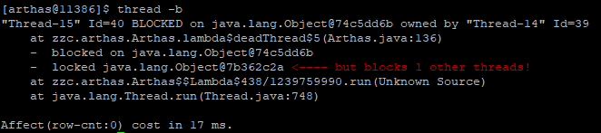
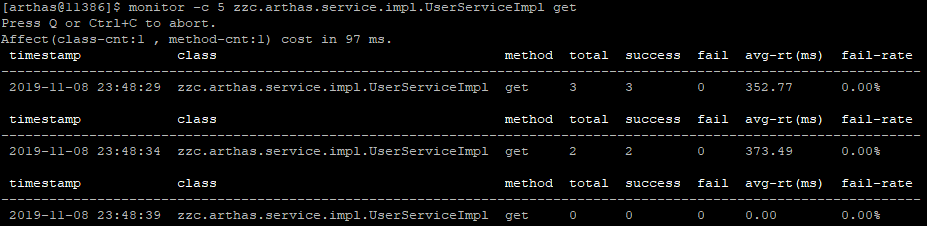
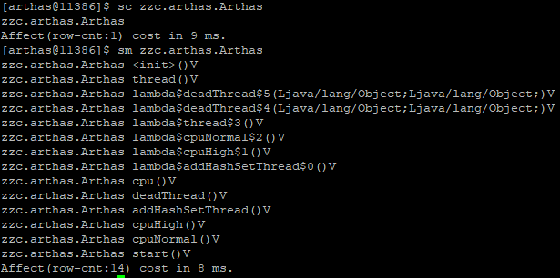
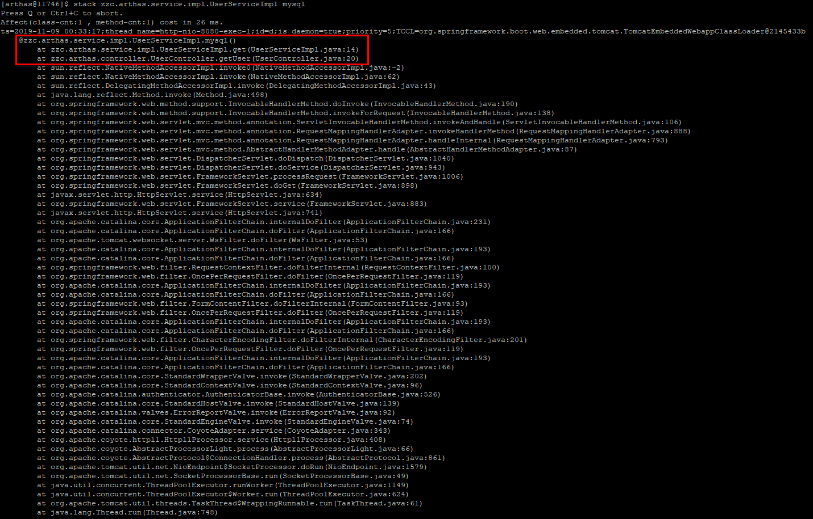

# 1、Arthas 是什么？

**Arthas**是Alibaba开源的**Java诊断**工具

开源地址：[https://github.com/alibaba/arthas](https://github.com/alibaba/arthas)

文档地址：[https://alibaba.github.io/arthas](https://alibaba.github.io/arthas)

# 2、Arthas 做什么？

1. 这个类从哪个 jar 包加载的？为什么会报各种类相关的 Exception？
2. 我改的代码为什么没有执行到？难道是我没 commit？分支搞错了？
3.  遇到问题无法在线上 debug，难道只能通过加日志再重新发布吗？ 
4.  线上遇到某个用户的数据处理有问题，但线上同样无法 debug，线下无法重现！ 
5.  是否有一个全局视角来查看系统的运行状况？ 
6.  有什么办法可以监控到JVM的实时运行状态？ 

# 3、Arthas 怎么用？

## 3.1、安装

```shell
[root@localhost ~]# wget https://alibaba.github.io/arthas/arthas-boot.jar
# 如果下载速度比较慢，可以使用aliyun的镜像
[root@localhost ~]# java -jar arthas-boot.jar --repo-mirror aliyun --use-http
# 如果从github下载有问题，可以使用gitee镜像
[root@localhost ~]# wget https://arthas.gitee.io/arthas-boot.jar
```

## 3.2、启动

前提：

​	1、有正在运行的Java项目

​	2、Arthas已经下载完成

```shell
# 查询启动时可以指定哪些参数
[root@localhost ~]# java -jar arthas-boot.jar -h

# 查看Java进程信息
[root@localhost ~]# jps -mlvV

# 先找出正在运行程序的pid，也可启动之后再做选择
[root@localhost ~]# java -jar arthas-boot.jar [进程id]

# 启动 Web Console 方式
# 访问地址：http://192.168.156.61:8563/
[root@localhost ~]# java -jar arthas-boot.jar --target-ip 192.168.156.61
```

## 3.3、退出

使用reset 重置增强类，将Arthas增强过的类全部还原。

或者使用 shutdwon 退出

## 3.4、 常用命令

| 命令                                                         | 介绍                                                         |
| ------------------------------------------------------------ | ------------------------------------------------------------ |
| [dashboard](https://alibaba.github.io/arthas/dashboard.html) | 当前系统的实时数据面板                                       |
| [**thread**](https://alibaba.github.io/arthas/thread.html)   | 查看当前 JVM 的线程堆栈信息                                  |
| [**watch**](https://alibaba.github.io/arthas/watch.html)     | 方法执行数据观测                                             |
| **[trace](https://alibaba.github.io/arthas/trace.html)**     | 方法内部调用路径，并输出方法路径上的每个节点上耗时           |
| [**stack**](https://alibaba.github.io/arthas/stack.html)     | 输出当前方法被调用的调用路径                                 |
| [**tt**](https://alibaba.github.io/arthas/tt.html)           | 方法执行数据的时空隧道，记录下指定方法每次调用的入参和返回信息，并能对这些不同的时间下调用进行观测 |
| [monitor](https://alibaba.github.io/arthas/monitor.html)     | 方法执行监控                                                 |
| [jvm](https://alibaba.github.io/arthas/jvm.html)             | 查看当前JVM信息                                              |
| [vmoption](https://alibaba.github.io/arthas/vmoption.html)   | 查看，更新VM诊断相关的参数                                   |
| [sc](https://alibaba.github.io/arthas/sc.html)               | 查看JVM已加载的类信息                                        |
| [jad](https://alibaba.github.io/arthas/jad.html)             | 反编译指定已加载类的源码                                     |
| [classloader](https://alibaba.github.io/arthas/classloader.html) | 查看classloader的继承树，urls，类加载信息                    |
| [heapdump](https://alibaba.github.io/arthas/heapdump.html)   | 类似jmap命令的heap dump功能                                  |

# 4、Arthas 常用操作

## 4.1、全局监控（dashboard）

使用 **dashboard** 命令可以概览程序的 线程、内存、GC、运行环境信息。


## 4.2、模拟CPU过高（thread）

使用 **thread** 命令查询线程CPU消耗信息

模拟代码

```java
public static void cpu() {
    cpuHigh();
    cpuNormal();
}

/**
 * 极度消耗CPU的线程
 */
private static void cpuHigh() {
    Thread thread = new Thread(() -> {
        while (true) {
            log.info("cpu start 100");
        }
    });
    // 添加到线程
    executorService.submit(thread);
}

/**
* 普通消耗CPU的线程
*/
private static void cpuNormal() {
    for (int i = 0; i < 10; i++) {
        new Thread(() -> {
            while (true) {
                log.info("cpu start");
                try {
                    Thread.sleep(3000);
                } catch (InterruptedException e) {
                    e.printStackTrace();
                }
            }
        }).start();
    }
}
```

使用 thread 查看线程信息


然后查看CPU消耗较高的线程信息


也可以直接使用命令 **thread -n 5** 按CPU使用率 **Top N** 排序。


定位到CPU使用最高的方法


## 4.3、线程有没有问题

### 4.3.1、线程的几种状态

线程的几种状态：

- **RUNNABLE 运行中**
- **TIMED_WAITIN** 调用了以下方法的线程会进入 **TIMED_WAITIN**
  1. Thread#sleep()
  2. Object#wait()并加了超时参数
  3. Thtread#join()并加了超时参数
  4. LockSupport#parkNanos()
  5. LockSupport#parkUntil()
- **WAITING** 当线程调用以下方法时会进入 **WAITING** 状态
  1. Object#wait()而且不加超时参数
  2. Thread#join()而且不加超时参数
  3. LockSupport#port()
- **BLOCKED** 阻塞，等待锁

### 4.3.2、线程池线程状态

使用 thread 命令查看线程池信息


可以看到线程池有 WAITING 的线程


### 4.3.3、线程死锁

使用 thread -b 命令查看线程死锁信息

模拟代码：
```java
/**
 * 死锁
 */
private static void deadThread() {
    /**
     * 创建资源
     */
    Object resourceA = new Object();
    Object resourceB = new Object();
    // 创建线程
    Thread threadA = new Thread(() -> {
        synchronized (resourceA) {
            log.info(Thread.currentThread() + " get ResourceA");
            try {
                Thread.sleep(1000);
            } catch (InterruptedException e) {
                e.printStackTrace();
            }
            log.info(Thread.currentThread() + "waiting get resourceB");
            synchronized (resourceB) {
                log.info(Thread.currentThread() + " get resourceB");
            }
        }
    });

    Thread threadB = new Thread(() -> {
        synchronized (resourceB) {
            log.info(Thread.currentThread() + " get ResourceB");
            try {
                Thread.sleep(1000);
            } catch (InterruptedException e) {
                e.printStackTrace();
            }
            log.info(Thread.currentThread() + "waiting get resourceA");
            synchronized (resourceA) {
                log.info(Thread.currentThread() + " get resourceA");
            }
        }
    });
    threadA.start();
    threadB.start();
}
```

检查是否有死锁：



可以看到存在死锁。

## 4.4、程序有没有问题

### 4.4.1、运行较慢，耗时较长（trace）

使用 **trace** 命令跟踪方法耗时

模拟代码 Controller：

```java
@RestController
@Slf4j
public class UserController {
    @Autowired
    private UserServiceImpl userService;

    @GetMapping(value = "/user")
    public HashMap<String, Object> getUser(Integer uid) throws Exception {
        // 模拟用户查询
        userService.get(uid);
        HashMap<String, Object> hashMap = new HashMap<>();
        hashMap.put("uid", uid);
        hashMap.put("name", "name" + uid);
        return hashMap;
    }
    
}
```

模拟代码 Service：

```java
@Service
@Slf4j
public class UserServiceImpl {

    public void get(Integer uid) throws Exception {
        check(uid);
        service(uid);
        redis(uid);
        mysql(uid);
    }

    public void service(Integer uid) throws Exception {
        int count = 0;
        for (int i = 0; i < 10; i++) {
            count += i;
        }
        log.info("service  end {}", count);
    }

    public void redis(Integer uid) throws Exception {
        int count = 0;
        for (int i = 0; i < 10000; i++) {
            count += i;
        }
        log.info("redis  end {}", count);
    }

    public void mysql(Integer uid) throws Exception {
        long count = 0;
        for (int i = 0; i < 10000000; i++) {
            count += i;
        }
        log.info("mysql end {}", count);
    }

    public boolean check(Integer uid) throws Exception {
        if (uid == null || uid < 0) {
            log.error("uid不正确，uid:{}", uid);
            throw new Exception("uid不正确");
        }
        return true;
    }
    
}
```

使用 trace 命令查看耗时情况

基本springboot的程序，访问地址：http://192.168.156.61:8080/user?uid=1


继续跟踪


很清楚的看到是  zzc.arthas.service.impl.UserServiceImpl 的 mysql 方法耗时较高

### 4.4.2、统计方法耗时（monitor）

使用 monitor 命令监控统计方法的执行情况

每 5 秒统计一次 zzc.arthas.service.impl.UserServiceImpl 类的 get 方法执行情况

```shell
$ monitor -c 5 zzc.arthas.service.impl.UserServiceImpl get
```



## 4.5、怀疑不是自已的代码吗

### 4.5.1、反编译（jad）

使用 **jad** 命令直接反编译 class


一些参数：

```shell
# 反编译只显示源码
$ jad --source-only zzc.arthas.Arthas
# 反编译某个类的某个方法
$ jad --source-only zzc.arthas.Arthas cpuHigh
```


### 4.5.2、查看字段信息（sc）

使用 **sc** 命令查看类的字段信息


### 4.5.3、查看方法信息（sm）

使用 **sm** 命令查看类的方法信息



## 4.6、对变量的值很是好奇（ognl）

使用 **ognl** 命令，ognl 表达式可以轻松操作想要的信息。

代码：

```java
@Slf4j
public class Arthas {

    private static HashSet hashSet = new HashSet();
```

查看静态变量 hshSet 的信息：

```shell
# 只能查看类静态变量信息
$ getstatic zzc.arthas.Arthas hashSet
# 使用 ognl 查看类静态变量信息
$ ognl '@zzc.arthas.Arthas@hashSet'
```

查看静态变量 hashSet 大小

```shell
$ ognl '@zzc.arthas.Arthas@hashSet.size()'
```

甚至可以进行操作

```shell
$ ognl '@zzc.arthas.Arthas@hashSet.add("test")'
# 查看添加的字符
$ ognl '@zzc.arthas.Arthas@hashSet' | grep test
```

ognl 可以做很多事情，可以参考 [ognl 表达式特殊用法](https://github.com/alibaba/arthas/issues/71)

## 4.7、想观察方法信息

### 4.7.1、观察方法的入参出参信息（watch）

使用 **watch** 命令轻松查看输入输出参数以及异常等信息

常用操作：

```shell
# 查看入参和出参
$ watch zzc.arthas.Arthas addHashSet '{params[0],returnObj}'
# 查看入参和出参大小
$ watch zzc.arthas.Arthas addHashSet '{params[0],returnObj.size}'
# 查看入参和出参k是否包含 'count10'
$ watch zzc.arthas.Arthas addHashSet '{params[0],returnObj.contains("count10")}'
# 查看入参和出参，出参 toString
$ watch zzc.arthas.Arthas addHashSet '{params[0],returnObj.toString()}'
```

### 4.7.2、观察方法的调用路径（stack）

使用 **stack** 命令查看方法的调用信息

```shell
# 观察类 zzc.arthas.service.impl.UserServiceImpl 的 mysql 方法调用路径
$ stack zzc.arthas.service.impl.UserServiceImpl mysql
```



### 4.7.3、观察方法调用详细信息（tt）

使用 **tt** 命令记录方法执行的详细情况

> tt 命令方法执行数据的时空隧道，记录下指定方法每次调用的入参和返回信息，并能对这些不同的时间下调用进行观测

常用操作：

```shell
# 开始记录方法调用信息
$ tt -t zzc.arthas.service.impl.UserServiceImpl check
```


可以看到记录中 INDEX=1005 的记录 IS-EXP=false ，说明这次调用出现异常 

```shell
# 查看记录的方法调用信息
$ tt -l
```


```shell
# 查看调用记录的详细信息(-i 指定 INDEX)
$ tt -i 1005
```


可以看到 INDEX=1005 的记录的异常信息

重新发起调用，使用指定记录，使用 -p 重新调用

```shell
$ tt -i 1005 -p
```


## 4.8、热更新（redefine）

加载外部的 .class 文件，redefine jvm已经加载的类。

**注意**：redefine后的类不能恢复，redfine有可能失败(比如类增加了新的字段)

reset 命令对 redefine 的类无效。如果想重置，需要 redefine 原始的字节码

redefine的限制：

- 不允许新增加 field/method
- 正在跑的函数，没有退出不能生效

热加载之前的请求返回的结果为：

```json
{"uid":1,"name":"name1"}
```

热更新需要把请求返回的结果改为：

```json
{"uid":1,"username":"name1"}
```

反编译代码

```shell
# jad反编译代码
# 反编译UserController，保存到 /tmp/UserController.java文件里。
$jad --source-only zzc.arthas.controller.UserController > /tmp/UserController.java
```

修改编译出来的代码

```shell
[root@localhost ~]# vi /tmp/UserController.java
```

查找ClassLoader

```shell
# sc查找加载UserController的ClassLoader
$ sc -d *UserController | grep classLoaderHash
 classLoaderHash   1be6f5c3
```

mc内存编绎代码

```shell
# 保存好/tmp/UserController.java之后，使用mc(Memory Compiler)命令来编译，并且通过-c参数指定ClassLoader
$ mc -c 1be6f5c3 /tmp/UserController.java -d /tmp
Memory compiler output:
/tmp/zzc/arthas/controller/UserController.class
Affect(row-cnt:1) cost in 346 ms
```

redefine热更新代码

```shell
# 再使用redefine命令重新加载新编译好的UserController.class
$ redefine /tmp/zzc/arthas/controller/UserController.class
redefine success, size: 1
```

发起请求返回结果已经改变：

```json
{"uid":1,"username":"name1"}
```

## 4.9、查看JVM已加载类信息（sc）

"Search-Class" 的简写，这个命令能搜索出所有已经加载到 JVM 中的 Class 信息。

### 4.9.1、输出当前类的详细信息

```shell
# 输出当前类的详细信息，包括这个类所加载的原始文件来源、类的声明、加载的ClassLoader等详细信息。
# 如果一个类被多个ClassLoader所加载，则会出现多次
$ sc -d 全类名
```

模糊搜索：


打印类的详细信息：


### 4.9.2、输出类的成员变量信息

```shell
# 输出当前类的成员变量信息（需要配合参数-d一起使用）
$ sc -d -f 全类名
```

打印出类的字段信息：


## 4.10、基础命令

```shell
# 查看命令帮助信息
$ help
# 清空当前屏幕区域
$ cls
# 查看当前会话的信息
$ session
# 重置增强类，将被 Arthas 增强过的类全部还原，Arthas 服务端关闭时会重置所有增强过的类
$ reset
# 输出当前目标 Java 进程所加载的 Arthas 版本号
$ version
# 打印命令历史
$ history
# 退出当前 Arthas 客户端，其他 Arthas 客户端不受影响
$ quit
# 和shutdown命令一致
$ stop
# 关闭 Arthas 服务端，所有 Arthas 客户端全部退出
$ shutdown
# Arthas快捷键列表及自定义快捷键
$ keymap
```

## 4.11、测试完整代码

pom.xml

```xml
<?xml version="1.0" encoding="UTF-8"?>
<project xmlns="http://maven.apache.org/POM/4.0.0" xmlns:xsi="http://www.w3.org/2001/XMLSchema-instance" xsi:schemaLocation="http://maven.apache.org/POM/4.0.0 http://maven.apache.org/xsd/maven-4.0.0.xsd">
    <modelVersion>4.0.0</modelVersion>
    <groupId>zzc.arthas</groupId>
    <artifactId>arthas</artifactId>
    <version>1.0-SNAPSHOT</version>
    <packaging>jar</packaging>
    <properties>
        <project.build.sourceEncoding>UTF-8</project.build.sourceEncoding>
        <maven.compiler.source>1.8</maven.compiler.source>
        <maven.compiler.target>1.8</maven.compiler.target>
    </properties>
    
    <parent>
        <groupId>org.springframework.boot</groupId>
        <artifactId>spring-boot-starter-parent</artifactId>
        <version>2.2.0.RELEASE</version>
        <relativePath/>
    </parent>
      
    <dependencies>
        <dependency>
            <groupId>org.springframework.boot</groupId>
            <artifactId>spring-boot-starter-web</artifactId>
        </dependency>

        <dependency>
            <groupId>org.springframework.boot</groupId>
            <artifactId>spring-boot-starter-test</artifactId>
            <scope>test</scope>
        </dependency>
        
        <dependency>
            <groupId>org.projectlombok</groupId>
            <artifactId>lombok</artifactId>
            <scope>provided</scope>
        </dependency>
        
        <dependency>
            <groupId>org.springframework.boot</groupId>
            <artifactId>spring-boot-devtools</artifactId>
            <optional>true</optional> <!-- 这个需要为 true 热部署才有效 -->
        </dependency>
        
    </dependencies>
  
    <build>
        
        <plugins>
            <plugin>
                <groupId>org.springframework.boot</groupId>
                <artifactId>spring-boot-maven-plugin</artifactId>
            </plugin>
            
            <plugin>
                <groupId>org.apache.maven.plugins</groupId>
                <artifactId>maven-compiler-plugin</artifactId>
                <version>3.8.1</version>
                <configuration>
                    <source>1.8</source>
                    <target>1.8</target>
                    <encoding>UTF-8</encoding>
                </configuration>
            </plugin>
        </plugins>
    </build>
</project>
```

Arthas.java

```java
package zzc.arthas;

import java.util.HashSet;
import java.util.concurrent.ExecutorService;
import java.util.concurrent.Executors;
import lombok.extern.slf4j.Slf4j;

@Slf4j
public class Arthas {

    private static HashSet hashSet = new HashSet();
    /**
     * 线程池，大小1
     */
    private static ExecutorService executorService = Executors.newFixedThreadPool(1);

    public static void start() {
        // 模拟 CPU 过高
         cpu();
        // 模拟线程阻塞
        thread();
        // 模拟线程死锁
        deadThread();
        // 不断的向 hashSet 集合增加数据
        addHashSetThread();
    }

    /**
     * 不断的向 hashSet 集合添加数据
     */
    public static void addHashSetThread() {
        // 初始化常量
        new Thread(() -> {
            int count = 0;
            while (true) {
                try {
                    hashSet.add("count" + count);
                    Thread.sleep(10000);
                    count++;
                } catch (InterruptedException e) {
                    e.printStackTrace();
                }
            }
        }).start();
    }

    public static void cpu() {
        cpuHigh();
        cpuNormal();
    }

    /**
     * 极度消耗CPU的线程
     */
    private static void cpuHigh() {
        Thread thread = new Thread(() -> {
            while (true) {
                log.info("cpu start 100");
            }
        });
        // 添加到线程
        executorService.submit(thread);
    }

    /**
     * 普通消耗CPU的线程
     */
    private static void cpuNormal() {
        for (int i = 0; i < 10; i++) {
            new Thread(() -> {
                while (true) {
                    log.info("cpu start");
                    try {
                        Thread.sleep(3000);
                    } catch (InterruptedException e) {
                        e.printStackTrace();
                    }
                }
            }).start();
        }
    }

    /**
     * 模拟线程阻塞,向已经满了的线程池提交线程
     */
    private static void thread() {
        Thread thread = new Thread(() -> {
            while (true) {
                log.debug("thread start");
                try {
                    Thread.sleep(3000);
                } catch (InterruptedException e) {
                    e.printStackTrace();
                }
            }
        });
        // 添加到线程
        executorService.submit(thread);
    }

    /**
     * 死锁
     */
    private static void deadThread() {
        /**
         * 创建资源
         */
        Object resourceA = new Object();
        Object resourceB = new Object();
        // 创建线程
        Thread threadA = new Thread(() -> {
            synchronized (resourceA) {
                log.info(Thread.currentThread() + " get ResourceA");
                try {
                    Thread.sleep(1000);
                } catch (InterruptedException e) {
                    e.printStackTrace();
                }
                log.info(Thread.currentThread() + "waiting get resourceB");
                synchronized (resourceB) {
                    log.info(Thread.currentThread() + " get resourceB");
                }
            }
        });

        Thread threadB = new Thread(() -> {
            synchronized (resourceB) {
                log.info(Thread.currentThread() + " get ResourceB");
                try {
                    Thread.sleep(1000);
                } catch (InterruptedException e) {
                    e.printStackTrace();
                }
                log.info(Thread.currentThread() + "waiting get resourceA");
                synchronized (resourceA) {
                    log.info(Thread.currentThread() + " get resourceA");
                }
            }
        });
        threadA.start();
        threadB.start();
    }
}

```

ArthasApplication.java

```java
package zzc.arthas;

import org.springframework.boot.SpringApplication;
import org.springframework.boot.autoconfigure.SpringBootApplication;

@SpringBootApplication
public class ArthasApplication {
    
    public static void main(String[] args) {
        SpringApplication.run(ArthasApplication.class,args);
        Arthas.start();
    }
    
}
```

UserServiceImpl.java

```shell
package zzc.arthas.service.impl;

import lombok.extern.slf4j.Slf4j;
import org.springframework.stereotype.Service;

@Service
@Slf4j
public class UserServiceImpl {

    public void get(Integer uid) throws Exception {
        check(uid);
        service(uid);
        redis(uid);
        mysql(uid);
    }

    public void service(Integer uid) throws Exception {
        int count = 0;
        for (int i = 0; i < 10; i++) {
            count += i;
        }
        log.info("service  end {}", count);
    }

    public void redis(Integer uid) throws Exception {
        int count = 0;
        for (int i = 0; i < 10000; i++) {
            count += i;
        }
        log.info("redis  end {}", count);
    }

    public void mysql(Integer uid) throws Exception {
        long count = 0;
        for (int i = 0; i < 10000000; i++) {
            count += i;
        }
        log.info("mysql end {}", count);
    }

    public boolean check(Integer uid) throws Exception {
        if (uid == null || uid < 0) {
            log.error("uid不正确，uid:{}", uid);
            throw new Exception("uid不正确");
        }
        return true;
    }
    
}

```

UserController.java

```java
package zzc.arthas.controller;

import java.util.HashMap;
import lombok.extern.slf4j.Slf4j;
import org.springframework.beans.factory.annotation.Autowired;
import org.springframework.web.bind.annotation.GetMapping;
import org.springframework.web.bind.annotation.RestController;
import zzc.arthas.service.impl.UserServiceImpl;


@RestController
@Slf4j
public class UserController {
    @Autowired
    private UserServiceImpl userService;

    @GetMapping(value = "/user")
    public HashMap<String, Object> getUser(Integer uid) throws Exception {
        // 模拟用户查询
        userService.get(uid);
        HashMap<String, Object> hashMap = new HashMap<>();
        hashMap.put("uid", uid);
        hashMap.put("name", "name" + uid);
        return hashMap;
    }
    
}
```

