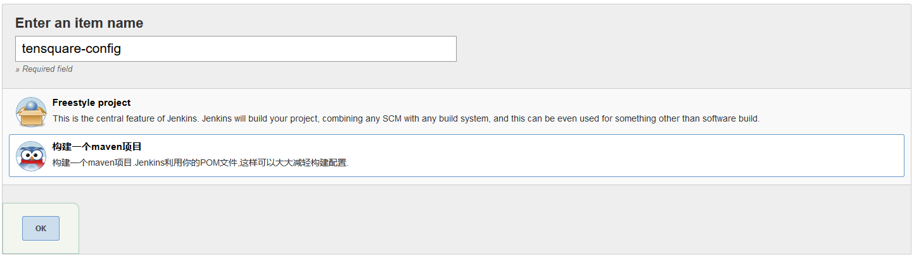

# Docker

## 1、安装Docker

省略（请参考Linux软件安装篇）

## 2、Docker私有仓库搭建(registry)

### 2.1、registry镜像接取、容器创建

```shell
# 拉取私有仓库镜像
[root@localhost ~]# docker pull registry
# 启动私有仓库容器
[root@localhost ~]# docker run -di --name=registry -p 5000:5000 registry
# 打开浏览器输入地址：http://192.168.156.61:5000/v2/_catalog 看到{"repositories":[]}表示私有仓库搭建成功并且内容为空
```

### 2.2、修改Docke信任私有仓库地址

```shell
# 修改daemon.json，并添加内容："insecure-registries": ["192.168.156.61:5000"]，此步用于让Docker信任私有仓库地址
[root@localhost ~]# vi /etc/docker/daemon.json
# 重启docker服务
[root@localhost ~]# systemctl restart docker
[root@localhost ~]# docker start registry
```

### 2.3、上传镜像至私有仓库

#### 2.3.1、Dockerfile构建JDK镜像

```dockerfile
# 依赖镜像名称和版本
FROM centos:7
# 指定镜像创建者信息
MAINTAINER zhaozhicheng
# 切换工作目录
WORKDIR /usr
RUN mkdir /usr/local/java
# ADD 是相对路径,把JDK添加到容器中
ADD jdk-8u231-linux-x64.tar.gz /usr/local/
# 配置JDK环境变量
ENV JAVA_HOME /usr/local/jdk1.8.0_231
ENV JRE_HOME $JAVA_HOME/jre
ENV CLASSPATH $JAVA_HOME/lib/dt.jar:$JAVA_HOME/lib/tools.jar:$JRE_HOME/lib:$CLASSPATH
ENV PATH $JAVA_HOME/bin:$PATH
```

#### 2.3.2、准备下载好的JDK放至和Dockerfile同一目录

```shell
[root@localhost dockerjdk8]# ls
Dockerfile  jdk-8u231-linux-x64.tar.gz
[root@localhost dockerjdk8]# docker build -t="jdk1.8" .
# 测试是否成功，运行jdk1.8容器并进入容器
[root@localhost ~]# docker run -di --name=jdk1.8 jdk1.8
[root@localhost ~]# docker exec -it jdk1.8 /bin/bash
```

# JDK

省略(请参考Linux软件安装篇)

# Git

省略(请参考Linux软件安装篇)

# Maven

省略(请参考Linux软件安装篇)

# Jenkins

## 1、Jenkins安装

省略(请参考Linux软件安装篇)

## 2、安装成功后，启动服务访问地址

### 2.1、到自定义Jenkins页面后，选择 选择插件来安装 ，跳过所有插件安装

### 2.2、创建第一个管理员用户zczhao/zczhao

### 2.3、实例配置，默认就行

### 2.4、提示Jenkins已经就绪，开始使用Jenkins

## 3、插件安装

### 3.1、Manage Jenkins -> Manage Plugins

### 3.2、Git插件安装

选中Available Tab页搜索 Git

勾选 Git 安装

### 3.3、Maven插件安装

选中Available Tab页搜索 Maven

勾选 Maven Intergration plugin 安装

## 4、全局工具配置

### 4.1、Manage Jenkins -> Global Tool Configuration

### 4.2、配置JDK


### 4.3、配置Git


### 4.4、配置Maven


## 5、微服务持续集成

### 5.1、New Item


### 5.2、基础微服务部署




点击进度条可查看日志


## 6、勾子配置

### 6.1、安装Gogs插件

选中Available Tab页搜索 Gogs

勾先 Gogs 安装


### 6.2、Gogs仓库配置Web勾子


推送的地址格式为：http(s)://<你的Jenkins地址>/gogs-webhook/?job=<你的Jenkins任务名>

# Gogs(类似Github)

## 1、下载镜像

```shell
[root@localhost ~]# docker pull gogs/gogs
```

## 2、创建容器

```shell
[root@localhost ~]# docker run -di --name=gogs -p 10022:22 -p 3000:3000 -v /var/gogsdata:/data gogs/gogs
```

## 3、访问地址

```shell
http://192.168.156.61:3000
```

## 4、配置


## 5、注册用户


## 6、新建仓库


