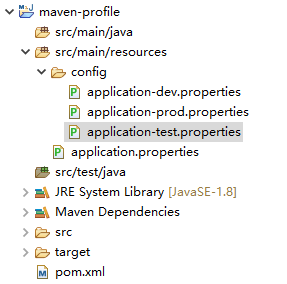
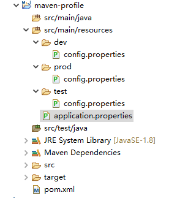

# JDK

## 1、环境变量

```
JAVA_HOME
C:\Java\jdk1.8.0_202

CLASSPATH
.;%JAVA_HOME%\lib;%JAVA_HOME%\lib\dt.jar;%JAVA_HOME%\lib\tools.jar

Path
%JAVA_HOME%\bin
%JAVA_HOME%\jre\bin
```

# Ant

## 1、环境变量

```
ANT_HOME
C:\apache-ant-1.9.14

Path
%ANT_HOME%\bin
```

# Maven

## 1、环境变量

```
MAVEN_HOME
C:\apache-maven-3.6.0

Path
%MAVEN_HOME%\bin
```

## 2、命令行创建项目

mvn archetype:generate 命令参数含义

| 参数名                | 作用/可选值                                                  |
| --------------------- | ------------------------------------------------------------ |
| -DgroupId             | 生成工程坐标的groupId部分                                    |
| -DartifactId          | 生成工程坐标的artifactId部分                                 |
| -DarchetypeArtifactId | maven-archetype-quickstart 对应jar包工程<br />maven-archetype-webapp 对应war包工程 |
| -DinteractiveMode     | 设置为falst关闭用户交互模式                                  |
| -DarchetypeCatalog    | 设置为local表示使用本地archetype-catalog.xml文件             |
| -X                    | 详细打印日志                                                 |

### 2.1、创建普通Java项目

```
mvn archetype:generate -DgroupId=com.zzc -DartifactId=maven-java -DarchetypeArtifactId=maven-archetype-quickstart
```

### 2.2、创建JavaWeb项目

```
mvn archetype:generate -DgroupId=com.zzc -DartifactId=maven-javaweb -DarchetypeArtifactId=maven-archetype-webapp
```

### 2.2、导入eclipse

```
File->Import...->Maven->Existing Maven Projects
```

## 3、maven 转 gradle 项目

```
gradle init --type pom
```

## 4、将项目打成可执行的jar包

### 1、maven-shade-plugin

```xml
<plugin>
    <groupId>org.apache.maven.plugins</groupId>
    <artifactId>maven-shade-plugin</artifactId>
    <version>3.2.1</version>
    <executions>
        <execution>
            <!-- 执行package的phase -->
            <phase>package</phase>
            <!-- 为这个phase绑定goal -->
            <goals>
                <goal>shade</goal>
            </goals>
            <configuration>
                <transformers>
                    <!-- 打成可执行的jar包 的主方法入口 -->
                    <transformer
                                 implementation="org.apache.maven.plugins.shade.resource.ManifestResourceTransformer">
                        <mainClass>zzc.App</mainClass>
                    </transformer>
                </transformers>
            </configuration>
        </execution>
    </executions>
</plugin>
```

```shell
mvn clean package
cd target
java -jar xxx.jar
```

### 2、maven-assembly-plugin

```xml
<plugin>
    <groupId>org.apache.maven.plugins</groupId>
    <artifactId>maven-assembly-plugin</artifactId>
    <version>3.1.1</version>
    <configuration>
        <descriptorRefs>
            <descriptorRef>jar-with-dependencies</descriptorRef>
        </descriptorRefs>
        <archive>
            <manifest>
                <mainClass>zzc.App</mainClass>
            </manifest>
        </archive>
    </configuration>
    <executions>
        <execution>
            <id>make-assembly</id>
            <phase>package</phase>
            <goals>
                <goal>single</goal>
            </goals>
        </execution>
    </executions>
</plugin>
```

```shell
mvn clean package
cd target
java -jar xxx-jar-with-dependencies.jar
```

### 3、onejar-maven-plugin

```xml
<plugin>
    <groupId>org.apache.maven.plugins</groupId>
    <artifactId>maven-jar-plugin</artifactId>
    <version>3.1.1</version>
    <configuration>
        <archive>
            <manifest>
                <mainClass>zzc.App</mainClass>
            </manifest>
        </archive>
    </configuration>
</plugin>

<plugin>
    <groupId>com.jolira</groupId>
    <artifactId>onejar-maven-plugin</artifactId>
    <version>1.4.4</version>
    <executions>
        <execution>
            <configuration>
                <attachToBuild>true</attachToBuild>
                <classifier>onejar</classifier>
            </configuration>
            <goals>
                <goal>one-jar</goal>
            </goals>
        </execution>
    </executions>
</plugin>
```

```shell
mvn clean package
cd target
java -jar xxx.jar
java -jar xxx.one-jar.jar
```

### 4、使用maven-jar-plugin和maven-dependency-plugin打可执行包,引用的包放包外面文件夹下

```xml
<plugin>
    <groupId>org.apache.maven.plugins</groupId>
    <artifactId>maven-jar-plugin</artifactId>
    <version>3.1.1</version>
    <configuration>
        <excludes>
            <exclude>**/*.log</exclude>
        </excludes>
        <archive>
            <manifest>
                <addClasspath>true</addClasspath>
                <mainClass>zzc.App</mainClass>
                <classpathPrefix>lib/</classpathPrefix>
            </manifest>
        </archive>
    </configuration>
</plugin>

<plugin>
    <groupId>org.apache.maven.plugins</groupId>
    <artifactId>maven-dependency-plugin</artifactId>
    <version>3.1.1</version>
    <executions>
        <execution>
            <id>copy-dependencies</id>
            <phase>package</phase>
            <goals>
                <goal>copy-dependencies</goal>
            </goals>
            <configuration>
                <!-- exclude junit, we need runtime dependency only -->
                <includeScope>runtime</includeScope>
                <outputDirectory>${project.build.directory}/lib/</outputDirectory>
            </configuration>
        </execution>
    </executions>
</plugin>
```

```shell
mvn clean package
cd target
java -jar xxx.jar
```

maven-shade-plugin和maven-assembly-plugin采取的是将依赖包解压再一并打到新包中,这样依赖包可能存在冲突的时候,
导致运行时可能出现未知问题,而onejar-maven-plugin打包是将依赖包自动归入lib目录,不解压原包,相当于在原包基础上加壳, 这样可以避免冲突的发生。第四种方法即是原来ant打包所使用的方法


## 5、设定项目编码

```xml
<properties>
    <!-- 文件拷贝时的编码 -->
    <project.build.sourceEncoding>UTF-8</project.build.sourceEncoding>
    <project.reporting.outputEncoding>UTF-8</project.reporting.outputEncoding>
    <!-- 编译时的编码 -->
    <maven.compiler.encoding>UTF-8</maven.compiler.encoding>
    <!-- 设置编译版本 -->
    <maven.compiler.source>1.8</maven.compiler.source>
    <maven.compiler.target>1.8</maven.compiler.target>
    <maven.compiler.compilerVersion>1.8</maven.compiler.compilerVersion>
</properties>
```

```xml
<plugin> 
  <!-- 指定maven编译的jdk版本,如果不指定,maven3默认用jdk 1.5 maven2默认用jdk1.3 -->  
  <groupId>org.apache.maven.plugins</groupId>  
  <artifactId>maven-compiler-plugin</artifactId>  
  <version>3.1</version>  
  <configuration> 
    <!-- 一般而言，target与source是保持一致的，但是，有时候为了让程序能在其他版本的jdk中运行(对于低版本目标jdk，源代码中不能使用低版本jdk中不支持的语法)，会存在target不同于source的情况 -->  
    <source>1.8</source>  
    <!-- 源代码使用的JDK版本 -->  
    <target>1.8</target>  
    <!-- 需要生成的目标class文件的编译版本 -->  
    <encoding>UTF-8</encoding>
    <!-- 字符集编码 -->  
    <skipTests>true</skipTests>
    <!-- 跳过测试 -->  
    <verbose>true</verbose>  
    <showWarnings>true</showWarnings>  
    <fork>true</fork>
    <!-- 要使compilerVersion标签生效，还需要将fork设为true，用于明确表示编译版本配置的可用 -->  
    <executable>
      <!-- path-to-javac -->
    </executable>
    <!-- 使用指定的javac命令，例如：<executable>${JAVA_1_4_HOME}/bin/javac</executable> -->  
    <compilerVersion>1.3</compilerVersion>
    <!-- 指定插件将使用的编译器的版本 -->  
    <meminitial>128m</meminitial>
    <!-- 编译器使用的初始内存 -->  
    <maxmem>512m</maxmem>
    <!-- 编译器使用的最大内存 -->  
    <compilerArgument>-verbose -bootclasspath ${java.home}\lib\rt.jar</compilerArgument>
    <!-- 这个选项用来传递编译器自身不包含但是却支持的参数选项 --> 
  </configuration> 
</plugin>
```


## 6、Maven的filtering和profile标签使用

### 1、filter方式实现



application-dev.properties

```properties
env.jdbc.username=dev
env.jdbc.password=123456
```

application-test.properties

```properties
env.jdbc.username=test
env.jdbc.password=888888
```

application-prod.properties

```properties
env.jdbc.username=prod
env.jdbc.password=666666
```

application.properties

```properties
jdbc.username=${env.jdbc.username}
jdbc.password=${env.jdbc.password}

# 公共配置
salt=123456789
```

pom.xml

```xml
<project xmlns="http://maven.apache.org/POM/4.0.0"
	xmlns:xsi="http://www.w3.org/2001/XMLSchema-instance"
	xsi:schemaLocation="http://maven.apache.org/POM/4.0.0 http://maven.apache.org/maven-v4_0_0.xsd">
	<modelVersion>4.0.0</modelVersion>
	<groupId>com.zzc</groupId>
	<artifactId>maven-profile</artifactId>
	<packaging>jar</packaging>
	<version>1.0-SNAPSHOT</version>
	<name>maven-profile</name>
	<url>http://maven.apache.org</url>

	<properties>
		<project.build.sourceEncoding>UTF-8</project.build.sourceEncoding>
		<project.reporting.outputEncoding>UTF-8</project.reporting.outputEncoding>		
		<maven.compiler.encoding>UTF-8</maven.compiler.encoding>
		<maven.compiler.source>1.8</maven.compiler.source>
		<maven.compiler.target>1.8</maven.compiler.target>
		<maven.compiler.compilerVersion>1.8</maven.compiler.compilerVersion>
	</properties>

	<dependencies>
		<dependency>
			<groupId>junit</groupId>
			<artifactId>junit</artifactId>
			<version>3.8.1</version>
			<scope>test</scope>
		</dependency>
	</dependencies>

	<profiles>
		<profile>
			<!-- 开发环境 -->
			<id>dev</id>
			<properties>
				<env>dev</env>
			</properties>
			<activation>
				<!-- 设置默认激活这个配置 -->
				<activeByDefault>true</activeByDefault>
			</activation>
		</profile>
		<profile>
			<!-- 测试环境 -->
			<id>test</id>
			<properties>
				<env>test</env>
			</properties>
		</profile>
		<profile>
			<!-- 发布环境 -->
			<id>prod</id>
			<properties>
				<env>prod</env>
			</properties>
		</profile>
	</profiles>
	<build>
		<finalName>maven-profile</finalName>
		<filters>
			<filter>src/main/resources/config/application-${env}.properties</filter>
		</filters>

		<resources>
			<resource>
				<directory>src/main/resources</directory>
				<filtering>true</filtering>
				<excludes>
					<exclude>config/**</exclude>
				</excludes>
			</resource>
		</resources>
	</build>
</project>
```

打包运行

```shell
# 如果不指定环境，默认是activeByDefault=true的环境，当前是指开发环境
mvn package
# 打包指定的环境通过-P 参数，注意p是大写的 evn就是pom.xm中的profiles>profile>id
mvn package -P <env>
```

### 2、多resource实现方式



dev/config.properties

```properties
env.jdbc.username=dev
env.jdbc.password=666666
```

test/config.properties

```properties
env.jdbc.username=test
env.jdbc.password=888888
```

prod/config.properties

```properties
jdbc.username=prod
jdbc.password=888888
```

创建一个与环境无关的prod/application.properties

```properties
# 公共配置
salt=123456789
```

pom.xml

```xml
<project xmlns="http://maven.apache.org/POM/4.0.0"
	xmlns:xsi="http://www.w3.org/2001/XMLSchema-instance"
	xsi:schemaLocation="http://maven.apache.org/POM/4.0.0 http://maven.apache.org/maven-v4_0_0.xsd">
	<modelVersion>4.0.0</modelVersion>
	<groupId>com.zzc</groupId>
	<artifactId>maven-profile</artifactId>
	<packaging>jar</packaging>
	<version>1.0-SNAPSHOT</version>
	<name>maven-profile</name>
	<url>http://maven.apache.org</url>

	<properties>
		<!-- 文件拷贝时的编码 -->
		<project.build.sourceEncoding>UTF-8</project.build.sourceEncoding>
		<project.reporting.outputEncoding>UTF-8</project.reporting.outputEncoding>
		<!-- 编译时的编码 -->
		<maven.compiler.encoding>UTF-8</maven.compiler.encoding>
		<!-- 设置编译版本 -->
		<maven.compiler.source>1.8</maven.compiler.source>
		<maven.compiler.target>1.8</maven.compiler.target>
		<maven.compiler.compilerVersion>1.8</maven.compiler.compilerVersion>
	</properties>

	<dependencies>
		<dependency>
			<groupId>junit</groupId>
			<artifactId>junit</artifactId>
			<version>3.8.1</version>
			<scope>test</scope>
		</dependency>
	</dependencies>

	<profiles>
		<profile>
			<!-- 开发环境 -->
			<id>dev</id>
			<properties>
				<env>dev</env>
			</properties>
			<activation>
				<!-- 设置默认激活这个配置 -->
				<activeByDefault>true</activeByDefault>
			</activation>
		</profile>
		<profile>
			<!-- 测试环境 -->
			<id>test</id>
			<properties>
				<env>test</env>
			</properties>
		</profile>
		<profile>
			<!-- 发布环境 -->
			<id>prod</id>
			<properties>
				<env>prod</env>
			</properties>
		</profile>
	</profiles>
	<build>
		<finalName>maven-profile</finalName>
		<resources>
			<resource>
				<directory>src/main/resources</directory>
				<excludes>
					<exclude>dev/**</exclude>
					<exclude>test/**</exclude>
					<exclude>prod/**</exclude>
				</excludes>
				<filtering>true</filtering>
			</resource>
			<resource>
				<directory>src/main/resources/${env}</directory>
				<includes>
					<include>*.*</include>
					<include>**/*.xml</include>
					<include>**/*.properties</include>
				</includes>
				<filtering>true</filtering>
			</resource>
		</resources>
	</build>
</project>

```

打包运行：

```shell
mvn package -P <env>
```

### 3、两种方式比较

**filter方式**会把所有的application-dev.properties、application-test.properties、application-pro.properties文件都会打包进去，而且此种方式只能针对属性文件，如果有其他文件(如.xml)也根据不同的环境有不同的配置，这种方式是不好处理。

**多resource方式**在打包时只打包指定环境的配置文件，可以将各种文件放到各自的环境文件夹中，在打包的时候会将整个文件夹都打包进去。推荐此种方式

# Gradle

## 1、环境变量

```
GRADLE_HOME
C:\gradle-5.3.1

GRADLE_USER_HOME
C:\workspace\repo

Path
%GRADLE_HOME%\bin
```

## 2、命令行创建项目

### 2.1、创建普通Java项目

build.gradle

```groovy
apply plugin: "java"
apply plugin: "eclipse"

task createJavaProject {
    sourceSets*.java.srcDirs*.each { it.mkdirs() }
    sourceSets*.resources.srcDirs*.each { it.mkdirs()}
}
```

```java
gradle createJavaProject eclipse
```

### 2.2、创建JavaWeb项目

build.gradle

```groovy
apply plugin: 'java'
apply plugin: 'eclipse'
apply plugin: 'war'

task createJavaProject {
    sourceSets*.java.srcDirs*.each { it.mkdirs() }
    sourceSets*.resources.srcDirs*.each { it.mkdirs()}
}
```

```
gradle createWebProject eclipse
```

## 3、gradle 转 maven 项目

build.gradle

```groovy
apply plugin: 'maven'
```

```
gradle install
```

根目录的build文件夹下会生成了一个poms文件夹，里面包含需要的pom文件

## 4、将项目打成可执行的jar包

```groovy
apply plugin: "java"
apply plugin: "eclipse"

dependencies {
	compile "org.jsoup:jsoup:1.11.3"
}

jar {
    manifest {
    	attributes("Main-Class": "zzc.App","Implementation-Title": "Gradle")
    }    
    into('lib') {
    	from configurations.runtime
    }
}
```

```shell
gradle build
cd build/libs
java -jar xxx.jar
```

