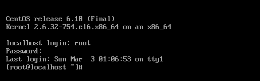
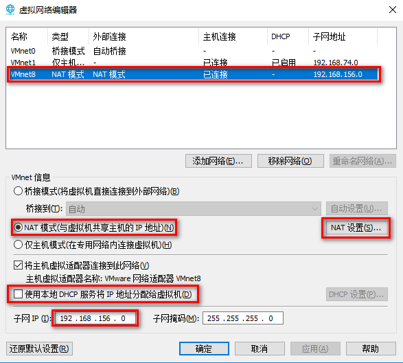

# vmware安装centos

centos6安装最小内存：628MB，如果系统小于628MB，会开启简易安装

## 分区

### 1、分区

**两种分区表形式**：

- MBR分区表：最大支持2.1TB硬盘，最多支持4个分区

- GPT分区表(全局唯一标示分区表)：GPT支持9.4ZB硬盘(1ZB=1024PB，1PB=1024EB，1EB=1024TB)。理论上支持的分区数据没有限制，但windows限制128个主分区

**MBR分区类型**：

主分区：最多只能有4个

扩展分区：

- 最多只能有1个

- 主分区加扩展分区最多有4个

- 不能写入数据，只能包含逻辑分区

逻辑分区

### 2、格式化：

格式化(高级格式化)又称逻辑格式化，它是指根据用户选定的文件系统(如FAT16、FAT32、NTFS、EXT2、EXT4等)，在磁盘的特定区域写入特定数据，在分区中划出一片用于存放文件分配表、目录表等用于文件管理的磁盘空间。

### 3、设备文件名

分区设备文件名

/dev/hda1(IDE硬盘接口)

/dev/sda1(SCSI硬盘接口、SATA硬盘接口)

### 4、挂载点(使用已经存在的空目录作为挂载点)

所有的空目录，包括新建目录都可以作为挂载点，但是/bin/、/lib/、/etc/不行

**必须分区**

​	/ （根分区）

​	swap分区(交换分区)

​		如果真实内存小于4GB，swap位内存的两倍

​		如果真实内存大于4GB，swap和内存一致

​		实验环境，不大于2GB

**推荐分区**

​	/boot (启动分区，1GB)

**常用分区**

​	/home(用于文件服务器)

​	/www(用于web服务器)

## Linux安装

### 1、vmware配置


### 2、启动安装


### 3、跳过检查


### 4、开始安装


### 5、配置主机名

主机名：建议修改主机名(初学时，暂时不修改) 


### 6、设置密码(root)

密码三原则：

​	复杂性：大于8位，大写、小写、符号四种最少包含三种，不允许使用和个人的信息相关的内容，不允许使用现有的英文单词

​	易记性：

​	时效性：180天

以下密码设置为：123456


### 7、分区


### 8、安装完成


### 9、快照管理

类似于游戏存档，当系统有问题时可快速回到快照版本


### 10、镜像克隆

关机后才能进行克隆


### 11、安装完成后，点重新引导登录

登录用户名：root

密码：123456



## 配置IP地址

```shell
# 通过setup工具设置IP地址，注意激活noboot=yes
[root@localhost ~]# setup
# 重启网络服务
[root@localhost ~]# service network restart
```

### 1、查看ip地址


### 2、setup 命令配置IP地址


### 3、配置IP


### 4、重启网络服务


## 设置静态IP并可上网

参考网址：https://blog.csdn.net/u012453843/article/details/52839105

1、  在网络连接下有VMnet1和VMnet8两个连接，其中VMnet1是本地模式，VMnet8是NAT模式（也就是网络模式），如下图所示


2、以管理员的身份运行VMware软件，在桌面VMware快捷图标上右键，选择“以管理员身份运行”，如下图所示


3、VMware开启后，我们点击头部菜单中的“编辑”，在下拉菜单中点击“虚拟网络编辑器(N)...”，如下图所示


4、点击上图的"虚拟网络编辑器(N)...”之后，我们会看到如下图所示的界面，我们先点击VMnet8那一行，然后把下面“使用本地DHCP服务将IP地址分配给虚拟机(D)”前面的勾选状态变为未勾选状态。初始状态VMnet8的子网IP不是这个地址的，我们参考VMnet1的IP，也以192.168开头，至于第三个，这里我使用的是156，第四个则是0（注意：下图的配置刚开始是最好是初始配置，如果你曾经乱配过，可能会有问题，如果想要恢复到初始化配置，则点击"还原默认设置(R)"按钮来恢复初始化的配置，然后重新开始），然后我们点击"NAT 设置(S)... "



我们点击上图的“NAT 设置(S)...”按钮后，会弹出如下图所示的界面，我们把网关IP(G)修改为"192.168.156.2"，这个IP在后面的配置中会用到。记下这个IP后，点击“确定”按钮关闭当前界面，然后点击上图的“确定”按钮关闭父界面。


5、确认要启动的虚拟机的网络适配器类型是"NAT"模式，如下图所示


6、启动CentOS虚拟机

修改文件：/etc/sysconfig/network-scripts/ifcfg-eth0

文件默认信息：


修改后的文件信息：


7、重启虚拟机

```shell
[root@localhost ~]# reboot
```

8、检查我们配置的虚拟机IP是否生效


检查是否能ping的通www.baidu.com


再检查虚拟机和Windows能否互相通信


在从虚拟机ping Windows的IP前，先看看VMnet8的IP地址是多少


 VMnet8的IP地址是可以自己配的，如下图所示，大家也可以配其它的IP，不过前192.168.156要一样，第四位可以自己定


## 安装日志

/root/install.log：存储了安装在系统中的软件包及其版本信息

/root/install.log.syslog：存储了安装过程中留下的事件记录

/root/anaconda-ks.cfg：以Kickstart配置文件的格式记录安装过程中设置的选项信息

# 初学者Linux服务器管理建议

## 一、学习Linux的注意事项

### 1、linux严格区分大小写

Linux是严格区分大小写的，这一点和Windows不一样，所以操作时要注意区分大小写的不同，包括文件名和目录名、命令、命令选项、配置文件设置选项等。

### 2、Linux一切皆文件

Linux中所有内容都是以文件的形式保存和管理的。硬件设备也是文件，这和windows完全不同，Windows是通过设备管理器来管理硬件的。Linux的设备文件保存在/dev/目录中，硬盘文件是/dev/sa[a-p]，光盘文件是/dev/hdc等。

### 3、Linux不靠扩展名区分文件类型

Windows是依赖扩展名区分文件类型的，比如，".txt"是文本文件，".exe"是执行文件，".ini"是配置文件，".mp4"是小电影等。但Linux不是靠扩展名区分文件类型的，而是靠权限标识来确来确定文件类型的，而且文件类型的种类也不像Windows下那么多，常见的文件类型只有普通文件，目录，链接文件，块设备文件、字符设备文件等几种。Linux的可执行文件不过就是普通文件被赋予了可执行权限而已。

但Linux中的一些特殊文件还是要求写"扩展名"的，但是大家小心，并不是Linux一定要靠扩展名来识别文件类型，写这些扩展名是为了帮助管理员来区分不同的文件类型。这样的文件扩展名主要有以下几中。

压缩名：Linux下常见的压缩文件名有`*.gz`、`*.bz2`、`*.zip`、`*.tar.gz`、`*.tar.bz2`、`*.tgz`等。为什么压缩包一定要写扩展名呢？其实很好理解，如果不写清楚扩展名，那么管理员不容易判断压缩包的格式，虽然有命令可以帮助判断，但是直观一点更加方便，另外，就写没写扩展名，在Linux中一样可以解压缩，不影响使用。

二进制软件包：Centos中所使用的二进制安装包是RPM包，所有RPM包都用".rpm"扩展名结尾，目的同样是让管理员一目了然。

程序文件：Shell脚本一般用".sh"扩展名结尾，其他还有用".c"扩展名结尾的C语言文件等。

网页文件：网页文件一般使用".html"、".php"等结尾，不过这是网页服务器的要求，而不是Linux的要求。

### 4、Linux中所有的存储设备都必须在挂载之后才能使用

Linux中所有的存储设备都有自己的设备文件名，这些设备文件必须在挂载之后才能使用，包括硬盘，U盘和光盘。挂载其实就是给这些设备分配盘符，只不过Windows中的盘符用英文字母表示，而Linux中的盘符则是一个已经建立的空目录。我们把这些空目录叫作挂载点(可以理解为Windows的盘符)，把设备文件(如/dev/sdb)和挂载点(已经建立的空目录)连接的过程叫作挂载

### 5、Windows下的程序不能直接在linux中使用

Linux和Windows是不同的操作系统，可以安装和使用的软件也是不同的，所以能够在Windows中安装的软件是不能在Linux中安装的，有好处吗？当然有，那就是能够感染Windows的病毒和木马都对Linux无效。有坏处吗？也有，那就是所有的软件要想在Linux中安装，必须单独开发针对Linux的版本，或者依赖模拟器软件运行。

很多软件也会同时推出针对Windows和Linux的版本，如大家熟悉的即时通信软件QQ。

## 二、服务器管理建议

### 1、了解Linux目录结构

| 目录名            | 目录的作用                                                   |
| ----------------- | ------------------------------------------------------------ |
| /bin/             | 存放系统命令的目录，普通用户和超级用户都可以执行。是/usr/bin/目录的软连接 |
| /sbin/            | 存放系统命令的目录，只有超级用户才可以执行，是/usr/bin/目录的软连接 |
| /usr/bin/         | 存放系统命令的目录，普通用户和超级用户都可以执行             |
| /usr/sbin/        | 存放系统命令的目录，只有超级用户才可以执行                   |
| /boot/            | 系统启动目录，保存与系统启动相关的文件，如内核文件和启动引导程序(grub)文件等 |
| /dev/             | 设备文件保存位置                                             |
| /etc/             | 配置文件保存位置，系统内所有彩用默认安装方式(rpm安装)有服务配置文件全部保存在此目录中，如用户信息，服务的启动脚本，常用服务的配置文件等。 |
| /home/            | 普通用户的家目录。在创建用户时，每个用户要有一个默认登录和保存自己数据的位置，就是用户的家目录，所有普通用户的宿主目录是在/home/下建立一个和用户名相同的目录。如用户user1的家目录就是/home/user1 |
| /lib/             | 系统调用的函数库保存的位置。是/usr/lib的软链接               |
| /lib64/           | 64位函数库保存位置。是/usr/lib64的软链接                     |
| /lost+found/      | 当系统意外崩溃或机器意外关机，而产生一些文件碎片放在这里。当系统启动的过程中fsck工具会检查这里，并修复已经损坏的文件系统。这个目录只在每个分区中出现，例如/lost+found就是根分区的备份恢复目录，/boot/lost+found就是/boot分区的备份恢复目录 |
| /media/           | 挂载目录，系统建议用来挂载媒体设备的，如软盘和光盘           |
| /misc/            | 挂载目录。系统建议用来挂载NFS服务的共享目录。在刚刚已经解释了挂载，应该知道只要是一个已经建立的空目录就可以作为挂载点。那么系统虽然准备了三个默认挂载目录/media、/mnt、/misc，但到底在哪个目录中挂载什么设备都可以由管理员自己决定。以前的Cnetos版本中默认挂载目录只有/mnt一个，所以建议在/mnt下建立不同目录挂载不同设备的习惯。如/mnt/cdrom 挂载光盘，/mnt/usb挂载U盘，这都是可以的 |
| /mnt/             | 挂载目录。早期Linux中只有这一个挂载目录，并没有细分。现在系统建议这个目录用来挂载额外的设备，如U盘、移动硬盘和其他操作系统的分区 |
| /opt/             | 第三方软件保存的位置。这个目录是放置和安装其他软件的位置，手工安装的源码包软件都可以安装到这个目录中。建立把软件放到/usr/local/目录中，也就是说，/usr/local目录也可以用来安装软件 |
| /proc/            | 虚拟文件系统。该目录中的数据并不保存在硬盘上，而是保存到内存中。主要保存系统的内核、进程、外部设备状态和网络状态等。如/proc/cpuinfo是保存CPU信息的。/proc/devices/是保存设备燕驱动的列表的，/proc/filesystems是保存文件系统列表的，/proc/net是保存网络协议信息的 |
| /sys/             | 虚拟文件系统。和/proc/目录相似，该目录中的数据都保存在内存中，主要保存与内核相关的信息 |
| /root/            | root的宿主目录，普通用户宿主目录在/home/下，root宿主目录直接在"/"下 |
| /run/             | 系统运行时产生的数据，如ssid，pid相关数据。/var/run/是此目录的软链接 |
| /srv/             | 服务数据目录。一些系统服务启动之后，可以在这个目录中保存需要的数据 |
| /tmp/             | 临时目录。系统存放临时文件的目录，在该目录下所有用户都可以访问和写入。我们建议此目录中不能保存重要数据，最好每次开机都该目录清空 |
| /usr/             | 系统软件资源目录。注意usr不是user的缩写，而是"UNIX Software Resource"的缩写，所以不是存放用户数据的目录，而是存放系统软件资源的目录，系统中安装的软件大多数保存在这里 |
| /usr/lib/         | 应用程序调用的函数库保存位置                                 |
| /usr/local/       | 手工安装的软件保存位置。建议源码包软件安装在这个位置         |
| /usr/share/       | 应用程序的资源文件保存位置，如帮助文档、说明文档和字体目录   |
| /usr/src/         | 源码包保存位置。我们手工下载的源码包和内核源码包都可以保存到这里。不过建议把手工下载的源码包保存到/usr/local/src目录中，把内核源码保存到/usr/src/kernels/目录中 |
| /usr/src/kernels/ | 内核源码保存位置                                             |
| /var/             | 动态数据保存位置，主要保存缓存、日志以及软件运行所产生的文件 |
| /var/www/html/    | RPM包安装的Apache有网页主目录                                |
| /var/lib/         | 程序运行中需要调用或改变的数据保存位置。如MySQL的数据库保存在/var/lib/mysql/目录中 |
| /var/log/         | 系统日志保存位置                                             |
| /var/run/         | 一些服务和程序运行后，它们的PID(进程ID)保存位置，是/run/目录的软链接 |
| /var/spool/       | 放置队列数据的目录，就是排队等待其他程序使用的数据，比如邮件队列和打印队列 |
| /var/spool/mail/  | 新收到的邮件队列保存位置，系统新收到的邮件会保存在此目录中   |
| /var/spool/cron/  | 系统的定时任务队列保存位置，系统的计划任务会保存在这里       |

### 2、远程服务器关机以及重启时的注意事项

为什么远程服务器不能关机呢？很简单，远程服务器没有放置在本地，关机后，谁可以帮你按开机电源键启动服务器？虽然计算机技术日新月异，但是像插入电源和开机这样的工作还是需要手工进行的。如果服务器在远程，一旦关机，就只能求助托管机房的管理人员帮你开机了。

远程服务器重启时需要注意两点。

#### 2.1、远程服务器在重启前，要中止正在执行的服务

计算机的硬盘最怕在高速存储时断电或重启，非常容易造成硬盘损坏。所以，在重启前先中止你的服务，甚至可以考虑暂时断开对外提供服务的网络。可能你会觉得服务器有这么娇贵吗？我的笔记本电脑经常强行关机，也没有发现硬盘损坏啊？这是因为你的个人计算机没有很多人访问，强制断电时硬盘并没有进行数据交换，小心使得万年般！

#### 2.2、重启命令的选用

Linux可以识别的重启命令有很多条，但是建议大家使用"shutdown -r now"命令重启。这条命令在重启时会正常保存和中止服务器中正在运行的程序，是安全重启命令。而且最好在重启前执行几次"sync"命令，这条命令是数据同步命令，可以让暂时保存在内存中的数据同步到硬盘上。

### 3、不要在服务器访问高峰运行高负载命令

这一点大家很好理解，有服务器访问高峰，如果使用一些对服务器压力较大的命令，则有可能会造成服务器响应缓慢甚至死机。

哪些命令是高负载命令呢？其实，如果大家使用过Windows操作系统，则也会留意到一些操作会给计算机带来较大的运行压力，道理都是一样的，如果复制大量的数据、压缩或解压大文件，大范围的硬盘搜索等。

什么时间算作访问高峰期？我们一般认为17:00-24:00算作访问高峰期，当然，每台服务器具体提供的服务不同，访问高峰期有时也会有所出入，比如，服务器主要提供美国人民访问的，那就要考虑时差的问题，或者服务器提供的服务很特殊，访问高峰期可能也不同。

一般我们建议在凌晨4:00-5:00执行这些命令，那是不是说我们需要在凌晨上班？当然不是，这谁受得了啊？我们可以使用系统的计划任务，让操作自动在指定的时间段执行。

### 4、远程配置防火墙时不要把自己踢出服务器

防火墙：基本功能是数据包过滤(IP、MAC地址、端口号、协议类型、数据包中数据)

简单来讲，防火墙就是根据数据包自身的参数来判断是否允许通过的网络设备。我们的服务器要想在公网中安全地使用，就需要使用防火墙过滤有害的数据包。但是在配置防火墙时，如果管理员对防火墙不是很熟悉，则有可能把自己的正常访问数据包和有害数据包全部过滤掉，导致自己也无法正常登录服务器，如防火墙关闭了远程连接的SSH服务的端口。

防火墙配置完全是靠手工命令完成的，配置规则和配置命令相对也比较复杂，万一设置的时候心不在焉，悲剧就发生了。

如何避免这种尴尬的情况发生呢？最好的方法当然是在服务器本地配置防火墙，这样就算不小心把自己的远程登录给过滤了，还可以通过本机登录来进行恢复。如果服务器已经在远程登录了，要配置防火墙，那么最好在本地测试完善后再进行上传，这样会把发生故障的概率降到最低。虽然在本地测试好了，但是传到远程服务器上时仍有可能发生问题。如果需要远程配置防火墙，那么先写一个系统定时任务，让它每5分钏清空一下防火墙规则，就算写错了也还有反悔的机会，等测试没有问题了再删除这个系统定时任务

### 5、指定合理的密码规范并定期更新

### 6、合理分配权限

服务器管理有一个最简单的原则：给予用户最小的权限

### 7、定时备份重要数据和日志

备份的基本原则：不要把鸡蛋放在同一个蓝子里

# 常用命令

## 一、命令的基本格式

### 1、命令的提示符

```shell
[root@localhost ~]#
```

[]：这是提示符的分隔符号，没有特殊含义

root：显示的是当前的登录用户，现在使用的是root用户登录

@：分隔符号，没有特殊含义

localhost：当前系统的简写主机名(完整主机名是localhost.localdomain，可用hostname命令查看)

~：代表用户当前所在的目录，此例中用户当前的目录是家目录

#：命令提示符。超级用户是#，普通用户是$

### 2、命令的基本格式

```shell
[root@localhost ~]# 命令 [选项] [参数]
```

ls是最常见的目录操作命令。主要作用是显示目录下的内容

- 命令名称：ls

- 英文原意：list

- 所在路径：/bin/ls

- 执行权限：所有用户

- 功能描述：显示目录下的内容

命令格式：

```shell
[root@localhost ~]# ls [选项] [文件名或目录名]
```

选项：

​	-a：	显示所有文件，包括以“.“开头的隐藏文件（linux下文件隐藏文件是以.开头的，如果存在..代表存在着父目录）

​	--color=when：支持颜色输出，when的值默认是always(总显示颜色)，也可以是never(从不显示颜色)和auto(自动)

​	-d：	显示目录信息，而不是目录下的文件

​	-h：	人性化显示，按照我们习惯的的单位显示文件大小

​	-i：	显示文件的i节点号

​	-l：	长格式显示

​	-r：	以文件名排序(ls -lrt 文件名升序排列，ls -lt文件名降序排列)

​	-t：	按文件时间进行排序

```shell
[root@localhost ~]# ls -l
总用量 189556
-rw-------. 1 root root      1288 2月  26 05:44 anaconda-ks.cfg
-rw-r--r--. 1 root root     28425 2月  26 05:44 install.log
-rw-r--r--. 1 root root      9043 2月  26 05:43 install.log.syslog
-rw-r--r--. 1 root root 194042837 2月  26 11:54 jdk-8u202-linux-x64.tar.gz
-rw-r--r--. 1 root root       409 2月  26 11:58 Test.class
-rw-r--r--. 1 root root       107 2月  26 11:58 Test.java
```

"-l"选项是用于显示文件的详细信息，"-l"选项显示的7列分别的含义是：

第一列：权限

第二列：引用计数。文件的引用计数代表该文件的硬链接个数，而目录的引用计数代表该目录有多少个一级子目录

第三列：所有者，也就是这个文件属于哪个用户。默认所有者是文件的建立用户

第四列：所属组。默认所属组是文件建立用户的有效组，一般情况下就是建立用户的所在组

第五列：大小。默认单位是字节

第六列：文件修改时间。文件状态修改时间或文件数据修改时间都会更改这个时间，注意这个时间不是文件的创建时间

第七列：文件名


选项：是用于调整命令的功能的

参数：是命令的操作对象，如果省略参数，是因为有默认参数

## 二、目录操作命令

### 1、ls 命令

见前一小节的内容

### 2、cd 命令

cd是切换所在目录的命令，这个命令的基本信息如下：

- 命令名称：cd

- 英文原意：change directory

- 所在路径：Shell内置命令

- 执行权限：所有用户

- 功能描述：切换所在目录

#### 2.1、cd 命令的简化用法

| 特殊符号 |       作用       |
| :------: | :--------------: |
|    ~     | 代表用户的家目录 |
|    -     | 代表上次所在目录 |
|    .     |   代表当前目录   |
|    ..    |   代表上级目录   |

#### 2.2、绝对路径和相对路径

绝对路径：以根目录为参照物，从根目录开始，一级一级进入目录

相对路径：以当前目录作为参照物，进行目录查找

### 3、mkdir 命令

mkdir 是创建目录的命令，其基本信息如下：

- 命令名称：mkdir

- 英文原意：make direcotories

- 所在路径：/bin/mkdir

- 执行权限：所有用户

- 功能描述：创建空目录

命令格式：

```shell
[root@localhost ~]# mkdir [选项] 目录名
```

选项：

​	-p：	递归建立所需目录

### 4、rmdir

既然有建立目录的命令，就一定会有删除目录的的命令rmdir，其基本信息如下：

- 命令名称：rmdir

- 英文原意：remove empty directorys

- 所有路径：/bin/rmdir

- 执行权限：所有用户

- 功能描述：删除空目录

命令格式：

```shell
[root@localhost ~]# rmdir [选项] 目录名
```

选项：

​	-p：递归删除目录

rmdir命令的作用十分有限，因为只能删除空目录，所以一旦目录中有内容，就会报错。这个命令比较"笨"，所以我们不太常用。后续我们不论删除的是文件还是目录，都会使用rm命令(还原工具extundelete)

## 三、文件操作命令

### 1、touch 命令

创建空文件或修改文件时间，这个命令的基本信息如下：

- 命令名称：touch

- 英文原意：change file timestamps

- 所在路径：/bin/touch

- 执行权限：所有用户

- 功能描述：修改文件的时间戳

### 2、stat 命令

stat 是查看文件详细信息的命令，而且可以看到文件的这三个时间，其基本信息如下：

- 命令名称：stat

- 英文原意：display file or file system status

- 所有路径：/usr/bin/stat

- 执行权限：所有用户

- 功能描述：显示文件或文件系统的详细信息

```shell
[root@localhost ~]# stat install.log
  File: "install.log"
  Size: 28425           Blocks: 64         IO Block: 4096   普通文件
Device: 805h/2053d      Inode: 261123      Links: 1
Access: (0644/-rw-r--r--)  Uid: (    0/    root)   Gid: (    0/    root)
Access: 2019-02-26 06:30:59.279775264 +0800
Modify: 2019-02-26 05:44:41.560998952 +0800 # 数据修改时间，修改内容
Change: 2019-02-26 05:44:47.587998947 +0800 # 状态修改时间，改动权限，所属组
```

### 3、cat 命令

cat 命令用来查看文件内容。这个命令的基本信息如下：

- 命令名称：cat

- 英文原意：concatenate files and print on the standard output

- 所在路径：/bin/cat

- 执行权限：所有用户

- 功能描述：合并文件并打印输出到标准输出

命令格式：

```shell
[root@localhost ~]# cat [选项] 文件名
```

选项：

​	-A：	相当于-vET选项的整合，用于列出所有隐藏符号

​	-E：	列出每行结尾的回车符 $

​	-n：	显示行号

​	-T：	把Tab键用 ^I 显示出来

​	-v：	列出特殊字符

```shell
# 查看全部文本内容
[root@localhost ~]# cat filename

# 查看文本的中间某些行范围之间的内容,例如说查看文本文件100-120行之间的内容
[root@localhost ~]# cat -n filename | tail -n +100 | head -n 20
```

### 4、more 命令

more 是分屏显示文件的命令，其基本信息如下：

- 命令名称：more

- 英文原意：file perusal filter for crt viewin

- 所有路径：/bin/more

- 执行权限：所有用户

- 功能描述：分屏显示文件内容

more命令比较简单，一般不用什么选项，命令会打开一个交互界面，可以识别一些交互命令，常用的交互命令如下：

- 空格键：向下翻页

- b：向上翻页

- 回车键：向下滚动一行

- /字符串：搜索指定的字符串

- q：退出

### 5、less 命令

less 命令和 more 命令类似，只是more 是分屏显示命令，而 less 是分行显示命令，其基本信息如下：

- 命令名称：less

- 英文原意：opposite of more

- 所在路径：/usr/bin/less

- 执行权限：所有用户

- 功能描述：分行显示文件内容

### 6、head 命令

head 命令显示文件文字区块，其基本信息如下：

- 命令名称：head

- 英文原意：output the first part of files

- 所有路径：/usr/bin/head

- 执行权限：所有用户

- 功能描述：显示文件文字区块

命令格式：

```shell
[root@localhost ~]# head [选项] 文件名

# 显示前5行
[root@localhost ~]# head -n 5 head.txt 

# 显示前5个字节
[root@localhost ~]# head -c 5 head.txt 
```

选项：

​	-q：隐藏文件名

​	-v：显示文件名

​	-c：显示字节数

​	-n：显示行数

### 7、tail 命令

既然有显示文件开头的命令，就会有显示文件结尾的命令。tail 命令的基本信息如下：

命令名称：tail

英文原意：output the last part of files

所在路径：/usr/bin/tail

执行权限：所有用户

功能描述：显示文件结尾的内容

命令格式：

```shell
[root@localhost ~]# tail [选项] 文件名
```

选项：

​	-n 行数：	从文件结尾开始，显示指定行数

​	-f：	监听文件的新增内容

```shell
# 实时监控日志
[root@localhost ~]# tail -f filename

# 实时监控10行日志信息
[root@localhost ~]# tail -10f filename

# 查看日志尾部的最后100行日志信息
[root@localhost ~]# tail -n 100 filename

# 查看日志100行之后的日志信息
[root@localhost ~]# tail -n +100 filename
```

### 8、ln 命令

ln 命令的基本信息：

- 命令名称：ln

- 英文原意：make links between file

- 所有路径：/usr/ln

- 执行权限：所有用户

- 功能描述：在文件之间建立链接

#### 8.1、ln 命令的基本格式

```shell
[root@localhost ~]# ln [选项] 源文件 目标文件
```

选项：

​	-s：建立软链接文件。如果不加"-s"，则建立硬链接文件

​	-f：强制。如果目标文件已经存在，则删除目标文件后再建立链接文件

创建硬链接：

```shell
[root@localhost ~]# touch cangls
[root@localhost ~]# ln /root/cangls /tmp/
# 建立硬链接文件，目标文件没有写文件名，会和原名一致
# 也就是/root/cangls 和 /tmp/cangls 是硬链接文件
```

创建软链接：

```shell
[root@localhost ~]# touch bols
[root@localhost ~]# ln -s /root/bols /tmp/
```

#### 8.2、硬链接和软链接的特征

硬链接特性：

- 源文件和硬链接文件拥有相同的Inode和Block

- 修改任意一个文件，另一个都会改变

- 删除任意一个文件，另一个都能使用

- 硬链接标记不清楚，很难确认硬文件位置，不建议使用

- 硬链接不能链接目录

- 硬链接不能跨分区

软链接特性：

- 软链接和硬链接文件拥有不同的Inode和Block
- 两个文件修改任意一个，别一个都会改变
- 删除软链接，源文件不受影响，删除源文件，软链接不能使用
- 软链接没有实际数据，只保存源文件的Inode，不论源文件多大，软链接大小不变
- 软链接的权限是最大权限lrwxrwxrwx，但由于没有实际数据，最终访问时需要参考源文件权限
- 软链接可以链接目录
- 软链接可以跨分区
- 软链接特征明显，建议使用软链接

### 9、tac 命令

和cat命令有点相反，cat命令更多的是从头部往尾部的顺序展现文本内容，而tac命令正好是从文本的尾部往头部展现日志内容

```shell
[root@localhost ~]# rm [选项] 文件或目录
```

## 四、目录和文件都能操作的命令

### 1、rm 命令

rm 是强大的删除命令，不仅可以删除文件，也可以删除目录。这个命令的基本信息如下：

- 命令名称：rm

- 英文原意：remove files or directories

- 所有路径：/bin/rm

-  执行权限：所有用户

- 功能描述：删除文件或目录

命令格式：

```shell
[root@localhost ~]# rm [选项] 文件或目录
```

选项：

​	-f：强制删除(force)

​	-i：交互删除，在删除之前会询问用户

​	-r：递归删除，可以删除目录(recursive)

### 2、cp 命令

cp 是用于复制的命令，其基本信息如下：

- 命令名称：cp

- 英文原意：copy files and directories

- 所有路径：/bin/cp

- 执行权限：所有用户

- 功能描述：复制文件和目录

命令格式：

```shell
[root@localhost ~]# cp [选项] 文件或目录
```

选项：

​	-a：	相当于 -dpr 选项的集合

​	-d：	如果源文件为软链接(对硬链接无效)，则复制出的目标文件也为软链接

​	-i：	询问，如果目标文件已经存在，则会询问是否覆盖

​	-p：	复制后目标文件保留源文件的属性(包括所有者、所属组、权限和时间)

​	-r：	递归复制，用于复制目录

### 3、mv 命令

mv 是用来剪切的命令，其基本信息如下：

命令名称：mv

英文原意：move(rename) files

所有路径：/bin/mv

执行权限：所有用户

功能描述：移动文件或改名

命令格式：

```shell
[root@localhost ~]# mv [选项] 源文件 目标文件
```

选项：

​	-f：	强制覆盖，如果目标文件已经存在，则不询问，直接强制覆盖

​	-i：	交互移动，如果目录文件已经存在，则询问用户是否覆盖(默认选项)

​	-v：	显示详细信息

## 五、基本权限管理

### 1、权限介绍

**权限位的含义**

```shell
[root@localhost ~]# ls -l install.log
-rw-r--r--. 1 root root 28425 2月  26 05:44 install.log
```

第一列的权限位如果不计算最后的"."(后面解释)，则共有10位，这10位权限位的含义：

-文件类型(-文件，d文件夹)

rw-r 所有者 (u) 

r-- 所属组 (g)

r-- 其他人 (o)

- 第1位代表文件类型。Linux不像Windows使用扩展名表示文件类型，而是使用权限位的第1位表示文件类型。虽然 Linux文件的种类不像Windows中那么多，但是分类也不少，详细情况可以使用"info  ls"命令查看。常见的类型：

"-"：普通文件

"b"：块设备文件。这是一种特殊设备文件，存储设备都是这种文件，如分区文件/dev/sha1就是这种文件

"c"：字符设备文件。这也是特殊设备文件，输入设备一般都是这种文件，如鼠标、键盘等。

"d"：目录文件。Linux中一切皆文件，所以目录也是文件的一种。

"l"：软链接文件

"p"：管道符文件。这是一种非常少见的特殊设备文件。

"s"：套接字文件。这也是一特殊设备文件，一些服务支持Scoket访问，就会产生这样的文件

- 第2~4位代表文件所有者的权限

r：代表read，是读取权限

w：代表write，是写权限

x：代表execute，是执行权限

如果有字母，则代表拥有对应的权限，如果"-"，则代表没有对应的权限。

- 第5~7位代表文件所属组的权限，同样拥有"rwx"权限。

- 第8~10位代表其他人的权限，同样拥有"rwx"权限。

### 2、基本权限命令

chmod 是修改权限命令，其基本信息如下：

- 命令名称：chmod

- 英文原意：change file mode bits

- 所有路径：/bin/chmod

- 执行权限：所有用户

- 功能描述：修改文件的权限模式

#### 2.1、chmod 命令格式

```shell
[root@localhost ~]# chmod [选项] 权限模式 文件名
```

选项：

-R：递归设备权限，也就是给子目录中的所有文件设定权限

#### 2.2、权限模式

chmod 命令的权限模式的格式是"`[ugoa][[+-=][perms]]`"，也就是"`[用户身份][[赋予方式][权限]]`"的格式。解释如下：

- 用户身份

u：代表所有者(user)

g：代表所属组(group)

o：代表其他人(other)

a：代表全部身份(all)

- 赋予方式

+：加入权限

-：减去权限

=：设置权限

- 权限

r：读取权限(read)

w：写权限(write)

x：执行权限(execute)

#### 2.3、数字权限

数字权限的赋予方式是最简单的，但是不如之前的字母权限好记、直观。数字权限含义：

4：代表"r"权限

2：代表"w"权限

1：代表"x"权限

#### 2.4、常用权限

数字权限的赋予方式更加简单，但是需要用户对这几个数字更加熟悉。其实常用权限也并不多，只有如下几个：

644：这是文件的基本权限，代表所有者拥有读、写权限。而所属组和其他人拥有只读权限

755：这是文件的执行权限和目录的基本权限，代表所有者拥有读、写和执行权限，而所属组和其他人拥有读和执行权限

777：这是最大权限。在实际的生产服务器中，要尽力避免给文件或目录赋予这样的权限，这会造成一定的安全隐患

### 3、基本权限的作用

#### 3.1、权限含义的解释

首先，读、写、执行权限对文件和目录的作用是不同的。

- 权限对文件的作用

读(r)：对文件有读(r)权限，代表可以读取文件中的数据。如果把权限对应到命令上，那么一旦对文件有读(r)权限，就可以对文件执行**cat、more、less、head、tail等文件查看命令**。

写(w)：对文件有写(w)权限，代表可以修改文件中的数据。如果把权限对应到命令上，那么一旦对文件有写(w)权限，就可以对文件执行**vim、echo等修改文件数据的命令。注意：对文件有写权限，是不能删除文件本身的，只能修改文件中的数据。如果想要删除文件，则需要对文件的上组目录拥有写权限。**

执行(x)：对文件有执行(x)权限，代表文件拥有了执行权限，可以运行。在Linux中，只要文件拥有执行(x)权限，这个文件就是执行文件了。只是这个文件到底能不能正解执行，不仅需要执行(x)权限，还要看文件中的代码是不是正解的语言代码。对文件来说，执行(x)权限是最高权限。

- 权限对目录的作用

读(r)：对目录有(r)权限，代表可以查看目录下的内容，也就是可以查看目录下有哪些子文件和子目录。如果把权限对应到命令上，那么一旦对目录拥有了读(r)权限，就可以在目录下执行 ls 命令，查看目录下的内容了。

写(w)：对目录有写(r)权限，代表可以修改目录下的数据，也就可以在目录中创建、删除、复制、剪切子文件或子目录。如果把权限对应到命令上，那么一旦对目录拥有了写(r)权限，就可以在目录下执行 **touch、rm、cp、mv命令**。对目录来说，写(r)权限是最高权限。

执行(x)：目录是不能执行的，那么对目录拥有执行(x)，代表可以进入目录。如果把权限对应的命令上，那么一旦对目录拥有了执行(x)权限，就可以对目录执行**cd命令**，进入目录。

#### 3.2、目录的可用权限

目录的可用权限其实只有以下几个：

0：任何权限都不赋予

5：基本的目录浏览和进入权限

7：完全权限

### 4、所有者和所属组命令

#### 4.1、chown 命令

chown 是修改文件和目录的所有者和所属组的命令，其基本信息如下：

- 命令名称：chown

- 英文原意：change file owner and group

- 所有路径：/bin/chown

- 执行权限：所有用户

- 功能描述：修改文件和目录的所有者和所属组

命令格式

```shell
[root@localhost ~]# chown [选项] 所有者:所属组 文件或目录
```

选项：

​	-R：递归设置权限，也就是给子目录中的所有文件设置权限

普通用户不能修改文件的所有者，哪怕自己是这个文件的所有者也不行。

普通用户可以修改所有者是自己的文件的权限。

#### 4.2、chgrp 命令

chgrp 是修改文件和目录的所属组的命令，其基本信息好下：

- 命令名称：chgrp

- 英文原意：change group ownership

- 所有路径：/bin/chgrp

- 执行权限：所有用户

- 功能描述：修改文件和目录的所属组

### 5、umask 默认权限

#### 5.1、查看系统的umask权限

```shell
[root@localhost ~]# umask
0022
# 用八进制数值显示umask权限
[root@localhost ~]# umask -S
u=rwx,g=rx,o=rx
# 用字母表示文件和目录的初始权限
```

#### 5.2、umask 权限的计算方法

需要先了解一下新建文件目录的默认最大权限。

- 对文件来讲，新建文件的默认最大权限是666，没有执行(x)权限，这是因为执行权限对文件来讲比较危险，不能在新建文件的时候默认赋予，而必须通过用户手工赋予。

- 对目录来讲，新建目录的默认最大权限是777。这是因为对目而言，执行(x)权限仅仅代表进入目录，所以即使建立新文件时直接默认赋予，也没有什么危险。

按照官方的标准算法，umask默认权限需要使用二进制进行逻辑与和逻辑非联合运算才可以得到正确的新建文件和目录的默认权限。这种方法既不好计算，也不好理解，并不推荐。

我们在这里还是按照权限字母来讲解umask权限的计算方法。我们就按照默认的umask值是022来分别计算一下新建文件和目录的默认权限

- 文件的默认权限最大只能是666，而umask的值是022

"-rw-rw-rw-" 减去 "-----w--w-" 等于 "-rw-r--r--"

- 目录的默认权限最大可以是777，而umask的值是022

"drwxrwxrwx" 减去 "d----w--w-" 等于 "drwx-r-xr-x"

**注意：umask默认权限的计算绝不是数字直接相关。**

### 6、帮助命令

#### 1、man 命令

man 是最常见的帮助命令，也是Linux最主要的帮助命令，其基本信息如下：

- 命令名称：man

- 英文原意：format and display the on-line manual pages

- 所有路径：/usr/bin/man

- 执行权限：所有用户

- 功能描述：显示联机帮助手册

##### 1.1、命令格式

```shell
[root@localhost ~]# man [选项] 命令
```

选项：

​	-f：查看命令拥有哪个级别的帮助

​	-k：查看和命令相关的所有帮助

##### 1.2、man 命令的快捷键

| 快捷键  | 作用                                                         |
| ------- | ------------------------------------------------------------ |
| 上箭头  | 向上移动一行                                                 |
| 下箭头  | 向下移动一行                                                 |
| PgUp    | 向上翻一页                                                   |
| PgDn    | 向下翻一页                                                   |
| g       | 移动到第一页                                                 |
| G       | 移动到最后一页                                               |
| q       | 退出                                                         |
| /字符串 | 从当前页向下搜索字符串                                       |
| ?字符串 | 从当前向上搜索字符串                                         |
| n       | 当搜索字符串时，可以使用n键找到下一个字符串                  |
| N       | 当搜索字符串时，使用N键反向查询字符串。也就是，如果使用"/字符串"方式搜索，则N键表示向上搜索字符串，如果使用"?字符串"方式搜索，则N键表示向下搜索字符串 |

##### 1.3、man命令的帮助级别

| 级别 | 作用                                         |
| ---- | -------------------------------------------- |
| 1    | 普通用户可以执行的系统命令和可执行文件的帮助 |
| 2    | 内核可以调用的函数和工具的帮助               |
| 3    | C语言函数的帮助                              |
| 4    | 设备和特殊文件的帮助                         |
| 5    | 配置文件的帮助                               |
| 6    | 游戏的帮助(个人版的Linux中是有游戏的)        |
| 7    | 杂项的帮助                                   |
| 8    | 超级用户可以执行的系统命令的帮助             |
|      | 内核帮助                                     |

查看命令拥有哪个级别的帮助：

```shell
[root@localhost ~]# man -f 命令
# 或
[root@localhost ~]# whatis 命令
```

查看和命令相关的所有帮助：

```shell
[root@localhost ~]# man -k 命令
[root@localhost ~]# apropos 命令
```

#### 2、info 命令

info 命令的帮助信息是一套完整的资料，每个单独命令的帮助信息只是这套完整资料中的某一个小章节。

| 快捷键 | 作用                                    |
| ------ | --------------------------------------- |
| 上箭头 | 向上移动一行                            |
| 下箭头 | 向下移动一行                            |
| PgUp   | 向上翻一页                              |
| PgDn   | 向下翻一页                              |
| Tab    | 在有"*"符号的节点间进行切换             |
| 回车   | 进入有"*"符号的子页面，查看详细帮助信息 |
| u      | 进入上一层信息(回车是进入下一层信息)    |
| n      | 进入下一小节信息                        |
| p      | 进入上一小节信息                        |
| ?      | 查看帮助信息                            |
| q      | 退出info信息                            |

#### 3、help 命令

help只能获取Shell内置命令的帮助，其基本信息如下：

命令名称：help

英文原意：help

所有路径：Shell内置命令

执行权限：所有用户

功能描述：显示Shell内置命令的帮助，可以使用type命令来区分内置命令与外部命令

shell是Linux的命令解析器。

#### 4、--help 选项

绝大多数命令都可以使用"--help"选项来查看帮助，这也是一种获取帮助的方法。

例如：

```shell
[root@localhost ~]# ls --help
```

这种方法非常简单，输出的帮助信息基本上是man命令的信息简要版

### 7、搜索命令

#### 1、whereis 命令

whereis 是搜索系统命令的命令(像绕口令一样)，也就是说，whereis命令不能搜索普通文件，而只能搜索系统命令。其基本信息如下：

- 命令名称：whereis

- 英文原意：locate thin binary,source,and manual page files for a command

- 所有路径：/usr/bin/whereis

- 执行权限：所有用户

- 功能描述：查找二进制命令、源文件和帮助文档的命令

#### 2、which 命令

which 也是搜索系统命令的命令。和whereis 命令的区别在于：

- whereis 命令可以在查找到二进制命令的同时，查找到帮助文档的位置

- which命令在查找到进制命令的同时，如果这个命令有别名，则还可以找到别名命令

which 命令的基本信息如下：

命令名称：which

英文原意：shows the full path of (shell) commands

所在路径：/usr/bin/which

执行权限：所有用户

功能描述：列出命令的所有路径

#### 3、locate 命令

##### 3.1、基本用法

locate 命令才是可以按照文件名搜索普通文件的命令

优点：按照数据库搜索，搜索速度快，消耗资源小。数据库位置/var/lib/mlocate/mlocate.db

缺点：只能按照文件名来搜索文件，而不能执行更复杂的搜索，比如按照权限、大小、修改时间等搜索文件

locate 命令的基本信息如下：

- 命令名称：locate

- 英文原意：find files by name

- 所在路径：/usr/bin/locate

- 执行权限：所有用户

- 功能描述：按照文件名搜索文件

更新mlocate.db命令：updatedb

##### 3.2、配置文件

```shell
[root@localhost ~]# vi /etc/updatedb.conf
# 开启搜索限制，也就是让这个配置文件生效
PRUNE_BIND_MOUNTS = "yes"
# 在locate 执行搜索时，禁止搜索这些文件系统类型
PRUNEFS = "..."
# 在locate 执行搜索时，禁止搜索带有这些扩展名的文件
PRUNENAMES = "..."
# 在locate 执行搜索时，禁止搜索这些系统目录
PRUNEPATHS = "..."
```

#### 4、find 命令

find 命令的基本信息好下：

命令名称：find

英文原意：search for files  in a directory hierarchy

所有路径：/bin/find

执行权限：所有用户

功能描述：在目录中搜索文件

##### 4.1、按照文件名搜索

```shell
[root@localhost ~]# find 搜索路径 [选项] 搜索内容
```

选项：

​	-name： 按照文件名搜索

​	-iname：按照文件名搜索，不区分文件名大小写

​	-inum：按照inode号搜索

##### 4.2、按照文件大小搜索	

```shell
[root@localhost ~]# find 搜索路径 [选项] 搜索内容
```

选项：

​	-size [+|-] 大小：按照指定大小搜索文件

​	这里"+"的意思是搜索比指定大小还在大的文件，"-"的意思是搜索比指定大小还要小的文件

找相大于1M的文件：

```shell
[root@localhost ~]# find / -size +1M
```

find 命令的单位：

```shell
[root@localhost ~]# man find
-size n[cwbkMG]
              File uses n units of space.  The following suffixes can be used:
			# 这是默认单位，如果单位为b或不写单位，则按照512Byte搜索
              ‘b’    for 512-byte blocks (this is the default if no suffix is used)
			# 搜索单位是C，按照字节搜索
              ‘c’    for bytes
			# 搜索单位是w，按照双字节(中文)搜索
              ‘w’    for two-byte words
			# 按照kb单位搜索，必须是小写的k
              ‘k’    for Kilobytes (units of 1024 bytes)
			# 按照MB单位搜索，必须是大写的M
              ‘M’    for Megabytes (units of 1048576 bytes)
			# 按照GB单位搜索，必须是大写的G
              ‘G’    for Gigabytes (units of 1073741824 bytes)
```

##### 4.3、按照修改时间搜索

Linux中的文件有访问时间(atime)、数据修改时间(mtime)、状态修改时间(ctime)这三个时间，也可以按照时间来搜索文件

```shell
[root@localhost ~]# find 搜索路径 [选项] 搜索内容
```

选项：

​	-atime  [+|-] 时间：按照文件访问时间搜索

​	-mtime [+|-] 时间：按照文件数据修改时间搜索

​	-ctime [+|-] 时间：按照文件状态修改时间搜索

这三个时间的区别在stat命令已经解释过了，这里用mtime数据修改时间来举例，重点说"[+-]"时间的含义

-5：代表5天内修改的文件

5：代表前5~6天那一天修改的文件

+5：代表6天前修改的文件

##### 4.4、按照权限搜索

命令格式：

```shell
[root@localhost ~]# find 搜索路径 [选项] 搜索内容
```

选项：

​	-perm 权限模式：查找文件权限刚好等于"权限模式"的文件

​	-perm -权限模式：查找文件权限全部包含"权限模式"的文件

​	-perm +权限模式：查找文件权限包含"权限模式"的任意一个权限的文件

##### 4.5、按照所有者和所属组搜索

```shell
[root@localhost ~]# find 搜索路径 [选项] 搜索内容
```

选项：

​	-uid 用户ID：	按照用户ID查找所有者指定ID的文件

​	-gid 组ID：	按照用户组ID查找所属组是指定ID的文件

​	-user 用户名：	按照用户名查找所有者是指定用户的文件

​	-group 组名：	按照组名查找所属组的指定用户组的文件

​	-nouser：	查找没有所有者的文件

按照所有者和所属组搜索时，"-nouser"选项比较常用，主要用于查找垃圾文件。

只有一种情况例外，那就是外来文件，比如光盘和U盘中的文件如果是由Windows复制的，在Linux中查看就是没有所有者的文件，再比如手工源码包安装的文件，也有可能没有所有者

##### 4.6、按照文件类型搜索

```shell
[root@localhost ~]# find 搜索路径 [选项] 搜索内容
```

选项：

​	-type d：查找目录

​	-type f：查找普通文件

​	-type l：查找软链接文件

##### 4.7、逻辑运算符

```shell
[root@localhost ~]# fing 搜索路径 [选项] 搜索内容
```

选项：

​	-a：and逻辑与

​	-o：or逻辑或

​	-not：not逻辑非

-a：and逻辑与

find命令也支持逻辑运算符选项，其中-a代表逻辑与运算，也就是-a的两个条件都成立，find搜索的结果才成立。举例：

```shell
# 在当前目录下搜索大于2kb，并且文件类型是普通文件的文件
[root@localhost ~]# find . -size +2k -a -type f
```

-o：or逻辑或

-o选项代表逻辑或运算，也就是-o的两个条件只要其中一个成立，find命令就可以找到结果，举例：

```shell
# 在当前目录下搜索文件要么是cangls的文件，要么是bols的文件
[root@localhost ~]# find . -name cangls -o -name bols
./cangls
./bols
```

-not：not逻辑非

-not是逻辑非，也就是取反的意思。举例：

```shell
# 在当前目录下搜索文件名不是cangls的文件
[root@localhost ~]# find . -not -name cangls
```

##### 4.8、其他选项

-exec 选项

主要讲两个选项 "-exec" 和 "-ok"，这两个选项的基本作用非常相似。

```shell
[root@localhost ~]# find 搜索路径 [选项] 搜索内容 -exec 命令2 {} \;
```

其次，这个选项的作用其实是把find命令的结果交给由"-exec" 调用的命令2来处理。"{}"就代表find命令的查找结果。

-ok 选项

"-ok"选项和"-exec"选项的作用基本一致，区别在于："-exec"的命令2会直接处理，而不询问，"-ok"的命令2在处理前会先询问用户是否这样处理，在得到确认命令后，才会执行。

#### 5、grep 命令

grep 的作用是在文件中提取和匹配符合条件的字符串行，命令格式如下：

```shell
[root@localhost ~]# grep [选项] "搜索内容" 文件名
```

选项：

​	-i：忽略大小写

​	-n：输入号行

​	-v：反射查找

​	--color=auto：搜索出的关键字用颜色显示

**find是搜索命令，那么 find 和 grep命令有什么区别:**

1. find 命令：

​	find命令用于在系统中搜索符合条件的文件名，如果需要模糊查询，则使用通配符进行匹配。搜索时文件名是完全匹配的(find命令可以通过-regex选项，把匹配规则转为正则表达式规则 ，但是不建议如此)。

2. grep 命令：

grep 命令用于在文件中搜索符合条件的字符串，如果需要模糊查询，则使用正则表达式进行匹配。搜索时字符串是包含匹配的。

3. 通配符与正则表达式的区别

通配符：用于匹配文件名，完全匹配

| 通配符 | 作用                                                         |
| ------ | ------------------------------------------------------------ |
| ?      | 匹配一个任意字符                                             |
| *      | 匹配0个或任意多个任意字符，也就是可以匹配任何内容            |
| []     | 匹配中括号中任意一个字符。例如，[abc]代表一定匹配一个字符，或者是a，或者是b，或者是c |
| [-]    | 匹配中括号中任意一个字符，-代表一个范围。例如，[a-z]代表匹配一个小写字母 |
| [^]    | 逻辑非，表示匹配不是中括号内的一个字符。例如，`[^0-9]`代表匹配一个不是数字的字符 |

正则表达式：用于匹配字符串，包含匹配

| 正则符 | 作用                                                         |
| ------ | ------------------------------------------------------------ |
| ?      | 匹配前一个字符重复0次，或1次                                 |
| *      | 匹配前一个字符重复0次，或任意多次                            |
| []     | 匹配中括号中任意一个字符。例如，[abc]代表一定匹配一个字符，或者是a，或者是b，或者是c |
| [-]    | 匹配中括号中任意一个字符，-代表一个范围。例如，[a-z]代表匹配一个小写字母 |
| [^]    | 逻辑非，表示匹配不是中括号内的一个字符。例如，`[^0-9]`代表匹配一个不是数字的字符 |
| ^      | 匹配行首                                                     |
| $      | 匹配行尾                                                     |

```shell
# 在多个文件中查找
[root@localhost ~]# grep "match_pattern" file_1 file_2 file_3 ...

# 标记匹配颜色 --color=auto 这里的color项可以根据文档说明进行选择always，never，auto三种
[root@localhost ~]# grep "match_pattern" file_name --color=auto
[root@localhost ~]# grep "match_pattern" file_name --color

# 输出除之外的所有行 -v 选项
[root@localhost ~]# grep -v "match_pattern" file_name

# 使用正则表达式 -E 选项
[root@localhost ~]# grep -E "[1-9]+"

#只输出匹配到的内容选项
[root@localhost ~]# grep -o -E "[a-z]+." line

# 统计文件或者文本中包含匹配字符串的行数 -c 选项
[root@localhost ~]# grep -c "text" file_name

# 输出包含匹配字符串的行数 -n 选项
[root@localhost ~]# grep "text" -n file_name

# 查看2019-08-06 22点这一个小时以内的日志信息
[root@localhost ~]# grep "2019-08-06 22" filename

# 设定每一页展示10条数据信息
[root@localhost ~]# more -10 filename

# 查看日志最后一次出现关键字'test'的日志记录
[root@localhost ~]# grep "test" -A 10 log.file | tail -n 11
# grep "name" -A 10 显示匹配内容和后面的10行
# grep "name" -B 10 显示匹配内容和前面的10行
# grep "name" -C 10 显示匹配内容和前后面的10行

# 统计一份日志里面出现‘test’关键字的行数
[root@localhost ~]# grep "test" filename | wc -l
```

#### 6、管道符

命令格式：命令1|命令2

命令1的正确输出作为命令2的操作对象

例子1：

经常需要使用 "ll" 命令查看文件的长格式，不过在有些目录中文件众多，比如/etc/目录，使用 "ll" 命令显示的内容就会非常多，只能看到最后的内容，而不能看到前面输出的内容。这时我们马上相到more命令可以分屏显示文件内容，可是怎么让more命令分屏显示命令的输出呢？

笨办法：

```shell
# 用输出重定向，把ll命令的输出保存到/root/testfile文件中
[root@localhost ~]# ll -a /etc/ > /root/testfile
# 既然testfile是文件，当然可以使用more命令分屏显示了
[root@localhost ~]# more /root/testfile
```

可是这样操作实在不方便，这时就可以利用管道符了。命令如下：

```shell
[root@localhost ~]# ll -a /etc/ | more
```

例子2：

相在命令 ll /etc/ 的结果中搜索yum的文件名，应用使用 find 命令?还是 grep 命令?

```shell
[root@localhost ~]# ll -a /etc/ | grep yum
```

例子3：

netstat命令(CentOS 7中，需要安装 net-snmp.x86_64，net-tools.x89_64两个包才有此命令。7.5系统中已经自动安装)格式如下：

```shell
[root@localhost ~]# netstat [选项]
```

选项：

​	-a：	列出所有网络状态，包括Socket程序

​	-c 秒数：指定每隔几秒刷新一次网络状态

​	-n：	使用IP地址和端口号显示，不使用域名与服务名

​	-p：	使用PID和程序名

​	-t：	使用TCP协议端口的连接状况

​	-u：	使用UDP协议商品的连接状况

​	-l：	仅显示监听状态的连接

​	-r：	显示路由

统计正在连接的网络连接数量

```shell
# 如果想知道具体的网络连接数量，就可以使用 wc 命令统计行数 
[root@localhost ~]# netstat -an | grep "ESTABLISHED" |wc -l
```

#### 7、命令的别名

命令的别名，就是命令的小名，主要是用于照顾管理员使用习惯的。

命令格式：

```shell
# 查询命令别名
[root@localhost ~]# alias
# 设定命令别名
[root@localhost ~]# alias 别名='原命令'
# 例如：用ser别名，替代 service network restart 命令
[root@localhost ~]# alias ser='service network restart'
```

用命令定义的别名，是临时生效的，要想永久生效，需要写入环境变量配置文件~/.bashrc

### 8、常用快捷键

| 快捷键 | 作用                                                         |
| ------ | ------------------------------------------------------------ |
| Tab键  | 命令或文件补全                                               |
| Ctrl+A | 把光标移动到命令行开头，如果我们输入的命令过长，想要把光标移动到命令开关时使用。 |
| Ctrl+B | 光标向前移                                                   |
| Ctrl+E | 把光标移动到命令行结尾                                       |
| Ctrl+F | 光标向后移                                                   |
| Ctrl+C | 强制终止当前的命令                                           |
| Ctrl+L | 清屏，相当于clear命令                                        |
| Ctrl+U | 删除或剪切光标之前的命令，当输入了一行很长的命令，不用使用通格键一个一个字符的删除，使用这个快捷键会更加方便 |
| Ctrl+U | 粘贴Ctrl+U剪切的命令                                         |

## 六、压缩和解压缩命令

在Linux中可以识别的常见压缩格式有十几种，比如："zip"、".gz"、".bz2"、".tar"、".tar.gz"、".tar.bz2"等。

### 1、.zip 格式

".zip" 格式是Windows中最常用的压缩格式，Linux也可以正确识别".zip"格式，这可以方便地和Windows系统通用压缩文件

#### 1.1、.zip 格式的压缩命令

压缩命令就是zip，其基本信息如下：

- 命令名称：zip

- 英文原意：package and compress(archive) files

- 所在路径：/usr/bin/zip

- 执行权限：所有用户

- 功能描述：压缩文件或目录

命令格式如下：

```shell
[root@localhost ~]# zip [选项] 压缩包名 源文件或源目录
```

选项：

​	-r：压缩目录

```shell
[root@localhost ~]# zip ana.zip anaconda-ks.cfg
```

#### 1.2、 .zip格式的解压缩命令

.zip 格式的解压缩命令是unzip，基本信息好下：

- 命令名称：unzip

- 英文原意：list,test and extract compressed files in a ZIP archive

- 所在路径：/usr/bin/unzip

- 执行权限：所有用户

- 功能描述：列表，测试和提取压缩文件中的文件

命令格式如下：

```shell
[root@localhost ~]# unzip [选项] 压缩包名
```

选项：

​	-d：指定解压缩位置

```shell
# 把压缩包解压到指定位置
[root@localhost ~]# unzip -d /tmp/ ana.zip
```

### 2、.gz 格式(不会打包)

#### 2.1、.gz格式的压缩命令

.gz 格式是Linux中最常用的压缩格式，使用gzip命令进行压缩，其基本信息如下：

- 命令名称：gzip

- 英文原意：compress or expand files

- 所在路径：/bin/gzip

- 执行权限：所有用户

- 功能描述：压缩文件或目录

命令的格式如下：

```shell
[root@localhost ~]# gzip [选项] 源文件
```

选项：

​	-c：将压缩数据输出到标准输出中，可以用于保留源文件

​	-d：解压缩

​	-r：压缩目录

```shell
# 使用-c选项，但是不让压缩数据输出到屏幕上，而是重定向到压缩文件中
# 这样可以在压缩文件的同时不删除源文件
[root@localhost ~]# gzip -c anaconda-ks.cfg > anaconda-ks.cfg.gz
```

#### 2.2、.gz 格式的解压缩命令

如果要解压缩".gz"格式，那么使用"gzip -d 压缩包" 和 "gunzip 压缩包"命令都可以。gunzip命令的基本信息	

命令名称：gunzip

英文原意：compress or expand files

所有路径：/bin/gunzip

执行权限：所有用户

功能描述：解压缩文件或目录

```shell
# 两个命令都可以解压缩.gz格式
[root@localhost ~]# gunzip install.log.gz
[root@localhost ~]# gzip -d anaconda-ks.cfg.gz
```

### 3、.bz2 格式(不能压缩目录)

#### 3.1、.bz2 格式的压缩命令

".bz2"格式是Linux的另一种压缩格式，从理论上来讲，".bz2"格式的算法更先进、压缩比更好，而".gz"格式相对来讲压缩的时间更快

".bz2"格式压缩命令是bzip2，其命令的基本信息如下：

- 命令名称：bzip2

- 英文原意：a block-sorting file compressor

- 所在路径：/usr/bin/bzip2

- 执行权限：所有用户

- 功能描述：.bz2格式的压缩命令

命令格式：

```shell
[root@localhost ~]# bzip2 [选项] 源文件
```

选项：

​	-d：解压缩

​	-k：压缩时，保留源文件

​	-v：显示压缩的详细信息

```shell
# 压缩成.bz2格式
[root@localhost ~]# bzip2 anaconda-ks.cfg
# 保留源文件压缩
[root@localhost ~]# bzip2 -k install.log.syslog
```

#### 3.2、.bz2 格式的解压缩命令

".bz2" 格式可以使用"bzip2 -d 压缩包"命令来进行解压缩，也可以使用"bunzip2 压缩包"命令进行解压缩。bunzip2命令的基本信息如下：

命令名称：bunzip2

英文原意：a block-sorting file compressor

所在路径：/usr/bin/bunzip2

执行权限：所有用户

功能描述：.bz2格式的解压缩命令

```shell
# 两个命令都可以解压缩
[root@localhost ~]# bunzip2 anaconda-ks.cfg.bz2
[root@localhost ~]# bzip2 -d install.log.syslog.bz2
```

### 4、.tar 格式(打包不会压缩)

#### 4.1、.tar格式的打包命令

.tar 格式的打包和解打包都使用tar命令，区别只是选项不同。tar命令的基本信息如下：

- 命令名称：tar

- 英文原意：tar

- 所在路径：/bin/tar

- 执行权限：所有用户

- 功能描述：打包与解打包命令

命令格式如下：

```shell
[root@localhost ~]# tar [选项] 【-f 压缩包名】源文件或目录
```

选项：

​	-c：打包

​	-f：指定压缩包的文件名。压缩包的扩展名是用来给管理员识别格式的，所以一定要正确指定扩展名

​	-v：显示打包文件过程

```shell
# 打包，不会压缩
[root@localhost ~]# tar -cvf anaconda-ks.cfg.tar anaconda-ks.cfg 
```

#### 4.2、.tar 格式的解打包命令

.tar 格式的解打包也需要使用tar命令，但是选项不太一样。命令格式如下：

```shell
[root@localhost ~]# tar [选项] 压缩包
```

选项：

​	-x： 解打包

​	-f：指定压缩包的文件名

​	-v：显示解打包过程

​	-t：测试，就是不解打包，只是查看包中有哪些文件

​	-C 目录：指定解打包位置

```shell
# 解打包到当前目录下
[root@localhost ~]# tar -xvf anaconda-ks.cfg.tar
```

### 5、.tar.gz 和 .tar.bz2 格式

使用tar命令直接打包压缩。命令格式如下：

```shell
[root@localhost ~]# tar [选项] 压缩包 源文件或目录
```

选项：

​	-z：压缩和解压缩".tar.gz"格式

​	-j：压缩和解压缩".tar.bz2"格式

```shell
# .tar.gz格式
# 把/tmp/目录直接打包压缩为".tar.gz"格式
[root@localhost ~]# tar -zcvf tmp.tar.gz /tmp/
# 解压缩与解打包".tar.gz"格式
[root@localhost ~]# tar -zxvf tmp.tar.gz
```

```shell
# .tar.bz2
# 把/tmp/目录直接打包压缩为".tar.bz2"格式
[root@localhost ~]# tar -jcvf tmp.tar.bz2 /tmp/
# 解压缩与解打包".tar.bz2"格式
[root@localhost ~]# tar -jxvf tmp.tar.bz2
```

```shell
# 建立测试目录和文件
[root@localhost ~]# mkdir test
[root@localhost ~]# touch test/abc
[root@localhost ~]# touch test/bcd
[root@localhost ~]# touch test/cde

# 压缩
[root@localhost ~]# tar -zcvf test.tar.gz test/
# 只查看，不解压
[root@localhost ~]# tar -ztvf test.tar.gz
# 解压缩到指定位置
[root@localhost ~]# tar -zxvf test.tar.gz -C /tmp
# 只解压压缩包中的特定文件到指定位置
[root@localhost ~]# tar -zxvf test.tar.gz -C /tmp test/cde
```

## 七、关机和重启命令

### 1、sync 数据同步

sync命令的基本信息如下 ：

- 命令名称：sync

- 英文原意：flush file system buffers

- 所在路径：/bin/sync

- 执行权限：所有用户

- 功能描述：刷新文件系统缓冲区

### 2、shutdown 命令

shutdown 命令的基本信息如下：

- 命令名称：shutdown

- 英文原意：bring the system down

- 所有路径：/sbin/shutdown

- 执行权限：超级用户

- 功能描述：关机和重启

命令格式：

```shell
[root@localhost ~]# shutdown [选项] 时间 [警告信息]
```

选项：

​	-c：取消已经执行的shutdown命令

​	-h：关机

​	-r：重启

### 3、reboot 命令

在现在的系统中，reboot命令也是安全的，而且不需要加入过多的选项

```shell
# 重启
[root@localhost ~]# reboot
```

### 4、halt 和 poweroff 命令

这两个都是关机命令，直接执行即可。这两个命令不会完整关闭和保存系统的服务，不建议使用。

```shell
# 关机
[root@localhost ~]# halt
# 关机
[root@localhost ~]# poweroff
```

### 5、init 命令

init 是修改Linux运行级别的命令，也可以用于关机和重启。这个命令并不安全，不建议使用

```shell
# 关机，也就是调用系统的0级别
[root@localhost ~]# init 0
# 重启，也就是调用系统的6级别
[root@localhost ~]# init 6
```

## 八、常用网络命令

### 1、配置IP地址

#### 1.1、配置IP地址

IP地址是计算机在互联网唯一的地址编码。每台计算机如果需要接入风格和其他计算机进行数据通信，就必须配置唯一的公网IP地址。

配置IP地址的两种方法

1. setup工具
2. vi /etc/sysconfig/network-scripts/ifcfg-eth0  手工修改配置

#### 1.2、重启网络服务

```shell
# 重启网络服务
[root@localhost ~]# service network restart
```

#### 1.3、虚拟机需要桥接到有线网卡，并重启网络服务

#### 1.4、复制镜像有可能需要重置UUID(唯一识别符)

```shell
# 删除MAC地址行，HWADDR= 就是MAC地址行
[root@localhost ~]# vi /etc/sysconfig/network-scripts/ifcfg-eth0
# 删除MAC地址和UUID绑定文件
[root@localhost ~]# rm -rf /etc/udev/rules.d/70-persistent-net.rules
# 重启Linux
[root@localhost ~]# reboot
```

### 2、ifconfig 命令

- 命令名称：ifconfig

- 英文原意：configure a network interface

- 所在路径：/sbin/ifconfig

- 执行权限：超级用户

- 功能描述：配置网络接口

ifconfig 命令最主要的作用就是查看IP地址的信息，直接输入ifconfig 命令即可。

```shell
[root@localhost ~]# ifconfig
          # 标志               MAC地址 
eth0      Link encap:Ethernet  HWaddr 00:0C:29:B1:7E:81
		 # IP地址                   广播地址               子网掩码
          inet addr:192.168.152.10  Bcast:192.168.152.255  Mask:255.255.255.0
          # IPv6 地址(目前没有生效) MAC地址
          inet6 addr: fe80::20c:29ff:feb1:7e81/64 Scope:Link
          UP BROADCAST RUNNING MULTICAST  MTU:1500  Metric:1
          # 接收的数据包情况
          RX packets:478 errors:0 dropped:0 overruns:0 frame:0
          # 发送的数据包情况
          TX packets:210 errors:0 dropped:0 overruns:0 carrier:0
          collisions:0 txqueuelen:1000
          RX bytes:40138 (39.1 KiB)  TX bytes:28544 (27.8 KiB)

# 本地回环网卡
lo        Link encap:Local Loopback
          inet addr:127.0.0.1  Mask:255.0.0.0
          inet6 addr: ::1/128 Scope:Host
          UP LOOPBACK RUNNING  MTU:65536  Metric:1
          RX packets:0 errors:0 dropped:0 overruns:0 frame:0
          TX packets:0 errors:0 dropped:0 overruns:0 carrier:0
          collisions:0 txqueuelen:0
          RX bytes:0 (0.0 b)  TX bytes:0 (0.0 b)
```

### 3、ping 命令

ping 是常用的网络命令，主要通过ICMP协议进行网络探测，测试网络中主机的通信情况。ping 命令的基本信息如下 ：

- 命令名称：ping

- 英文原意：send ICMP ECHO_REQUEST to network hosts

- 所在路径：/bin/ping

- 执行权限：所有用户

- 功能描述：向网络主机发送ICMP请求

命令的基本格式如下：

```shell
[root@localhost ~]# ping [选项] IP
```

选项：

​	-b：	后面加入广播地址，用于对整个网段进行探测

​	-c 次数： 用于指定ping的次数

​	-s 字节：指定探测包的大小

例子：探测网段中的可用主机

在ping命令中，可以使用 "-b" 选项，后面加入广播地址，探测整个网段。可以使用这个选项知道整个网络中有多少主机是可以和我们通信的，而不是一个一个IP址地进行探测。例如：

```shell
# 探测192.168.103.0~255网段中有多少可以通信的主机，VMWare改为桥接可测试，net不能测试
[root@localhost ~]# ping -b -c 3 192.168.103.255
```

### 4、netstat 命令

netstat 是网络状态查看命令，既可以查看到本机开启的端口，也可以查看有哪些客户端连接。在CentOS 7.x中netstat命令默认没有安装，如果需要使用，需要安装net-snmp和net-tools软件包。netstat的基本信息如下：

- 命令名称：netstat
- 英文原意：Print network connections,routing tables,interface statistics,masquerade connections, and multicast memberships
- 所在路径：/bin/netstat
- 执行权限：所有用户
- 功能描述：输出网络连接、路由表、接口统计、伪装连接和组播成员

命令格式如下：

```shell
[root@localhost ~]# netstat [选项]
```

选项：

​	-a：	列出所有网络状态，包括Socket程序

​	-c 秒数：指定每隔几秒刷新一次网络状态

​	-n：	使用IP地址和端口号显示，不使用域名与服务名

​	-p：	显示PID和程序名

​	-t：	显示使用TCP协议端口的连接状况

​	-u：	显示使用UDP协议端口的连接状况

​	-l：	仅显示监听状态的连接

​	-r：	显示路由表

**例子1：查看本机开启的端口**

这是本机最常用的方式，使用选项"-tuln"。因为使用了 "-l" 选项，所以只能看到监听状态的连接，而不能看到已经建立连接状态的连接，例如：

```shell
[root@localhost ~]# netstat -tunl
Active Internet connections (only servers)
Proto Recv-Q Send-Q Local Address               Foreign Address             State
tcp        0      0 127.0.0.1:6010              0.0.0.0:*                   LISTEN
tcp        0      0 0.0.0.0:111                 0.0.0.0:*                   LISTEN
tcp        0      0 0.0.0.0:51409               0.0.0.0:*                   LISTEN
tcp        0      0 0.0.0.0:22                  0.0.0.0:*                   LISTEN
tcp        0      0 127.0.0.1:631               0.0.0.0:*                   LISTEN
tcp        0      0 127.0.0.1:25                0.0.0.0:*                   LISTEN
tcp        0      0 ::1:6010                    :::*                        LISTEN
tcp        0      0 :::111                      :::*                        LISTEN
tcp        0      0 :::50131                    :::*                        LISTEN
tcp        0      0 :::22                       :::*                        LISTEN
tcp        0      0 ::1:631                     :::*                        LISTEN
tcp        0      0 ::1:25                      :::*                        LISTEN
udp        0      0 127.0.0.1:703               0.0.0.0:*
udp        0      0 0.0.0.0:111                 0.0.0.0:*
udp        0      0 0.0.0.0:631                 0.0.0.0:*
udp        0      0 0.0.0.0:642                 0.0.0.0:*
udp        0      0 0.0.0.0:52108               0.0.0.0:*
udp        0      0 :::111                      :::*
udp        0      0 :::642                      :::*
udp        0      0 :::60041                    :::*
#协议  接收队列  发送队列  本机的IP地址及端口号  运程主机的IP地址及端口号  状态  
```

这个命令的输出较多

Proto：网络连接的协议，一般就是TCP协议或者UDP协议

Recv-Q：表示接收到的数据，已经在本地的缓冲中，但是还没有被进程取走

Send-Q：表示从本机发送，对方还没有收到的数据，依然在本地的缓冲中，一般是不具备ACK标志的数据包

Local Address：本机的IP地址和端口号

Foreign Address：远程主机的IP地址和端口号

State：状态。常见的状态主要有以下几种：

- LISTEN：监听状态，只有TCP协议需要监听，而UDP协议不需要监听

- ESTABLISHED：已经建立连接的状态。如果使用"-l"选项，则看不到已经建立连接的状态

- SYN_SEND：SYN发起包，就是主动发起连接的数据包。

- SYN_RECV：接收到主动连接的数据包

- FIN_WAIT1：正在中断的连接

- FIN_WAIT2：已经中断的连接，但是正在等待对方主机进行确认

- TIME_WAIT：连接已经中断，但是套接字依然在网络中等待结果

- CLOSED：套接字没有被使用

在这些状态中，最常用的就是LISTEN、ESTABLISHED状态，一种代表正在监听，另一种代表已经建立连接

**例子2：查看本机有哪些程序开启的端口**

如果使用"-p"选项，则可以查看到是哪个程序占用了端口，并且可以知道这个程序的PID。例如：

```shell
[root@localhost ~]# netstat -tulnp
Active Internet connections (only servers)
Proto Recv-Q Send-Q Local Address               Foreign Address             State       PID/Program name
tcp        0      0 127.0.0.1:6010              0.0.0.0:*                   LISTEN      2255/sshd
tcp        0      0 0.0.0.0:111                 0.0.0.0:*                   LISTEN      1315/rpcbind
tcp        0      0 0.0.0.0:51409               0.0.0.0:*                   LISTEN      1337/rpc.statd
tcp        0      0 0.0.0.0:22                  0.0.0.0:*                   LISTEN      1588/sshd
tcp        0      0 127.0.0.1:631               0.0.0.0:*                   LISTEN      1393/cupsd
tcp        0      0 127.0.0.1:25                0.0.0.0:*                   LISTEN      1667/master
tcp        0      0 ::1:6010                    :::*                        LISTEN      2255/sshd
tcp        0      0 :::111                      :::*                        LISTEN      1315/rpcbind
tcp        0      0 :::50131                    :::*                        LISTEN      1337/rpc.statd
tcp        0      0 :::22                       :::*                        LISTEN      1588/sshd
tcp        0      0 ::1:631                     :::*                        LISTEN      1393/cupsd
tcp        0      0 ::1:25                      :::*                        LISTEN      1667/master
udp        0      0 127.0.0.1:703               0.0.0.0:*                               1337/rpc.statd
udp        0      0 0.0.0.0:111                 0.0.0.0:*                               1315/rpcbind
udp        0      0 0.0.0.0:631                 0.0.0.0:*                               1393/cupsd
udp        0      0 0.0.0.0:642                 0.0.0.0:*                               1315/rpcbind
udp        0      0 0.0.0.0:52108               0.0.0.0:*                               1337/rpc.statd
udp        0      0 :::111                      :::*                                    1315/rpcbind
udp        0      0 :::642                      :::*                                    1315/rpcbind
udp        0      0 :::60041                    :::*                                    1337/rpc.statd
# 比之前的命令多了一个"-p"选项，结果多了"PID/程序名"，可以知道是哪个程序占用了端口
```

**例子3：查看所有连接**

使用选项"-an"可以查看所有连接，包括监听状态的连接(LISTEN)、已经建立连接状态的(ESTABLISHED)、Socket程序连接等。因为连接较多，所以输出的内容有很多。例如：

```shell
[root@localhost ~]# netstat -an
Active Internet connections (servers and established)
Proto Recv-Q Send-Q Local Address               Foreign Address             State
tcp        0      0 127.0.0.1:6010              0.0.0.0:*                   LISTEN
tcp        0      0 0.0.0.0:111                 0.0.0.0:*                   LISTEN
tcp        0      0 0.0.0.0:51409               0.0.0.0:*                   LISTEN
tcp        0      0 0.0.0.0:22                  0.0.0.0:*                   LISTEN
tcp        0      0 127.0.0.1:631               0.0.0.0:*                   LISTEN
tcp        0      0 127.0.0.1:25                0.0.0.0:*                   LISTEN
tcp        0      0 192.168.152.10:22           192.168.152.1:54057         ESTABLISHED
tcp        0     48 192.168.152.10:22           192.168.152.1:54056         ESTABLISHED
tcp        0      0 ::1:6010                    :::*                        LISTEN
tcp        0      0 :::111                      :::*                        LISTEN
tcp        0      0 :::50131                    :::*                        LISTEN
tcp        0      0 :::22                       :::*                        LISTEN
tcp        0      0 ::1:631                     :::*                        LISTEN
tcp        0      0 ::1:25                      :::*                        LISTEN
udp        0      0 127.0.0.1:703               0.0.0.0:*
udp        0      0 0.0.0.0:111                 0.0.0.0:*
udp        0      0 0.0.0.0:631                 0.0.0.0:*
udp        0      0 0.0.0.0:642                 0.0.0.0:*
udp        0      0 0.0.0.0:52108               0.0.0.0:*
udp        0      0 :::111                      :::*
udp        0      0 :::642                      :::*
udp        0      0 :::60041                    :::*
Active UNIX domain sockets (servers and established)
Proto RefCnt Flags       Type       State         I-Node Path
unix  2      [ ACC ]     STREAM     LISTENING     14245  public/cleanup
unix  2      [ ACC ]     STREAM     LISTENING     14252  private/tlsmgr
unix  2      [ ACC ]     STREAM     LISTENING     14256  private/rewrite
unix  2      [ ACC ]     STREAM     LISTENING     14260  private/bounce
unix  2      [ ACC ]     STREAM     LISTENING     14264  private/defer
unix  2      [ ACC ]     STREAM     LISTENING     14268  private/trace
unix  2      [ ACC ]     STREAM     LISTENING     14272  private/verify
```

从"Active UNIX domain sockets (servers and established)"开始，之后的内容就是Socket程序产生的连接，之前的内容都是网络服务产生的连接。可以在"an" 选项的输出中看到各种网络连接状态，而之前的"-tuln"选项则只能看到监听状态。

### 5、wirte 命令

write 命令的基本信息如下：

- 命令名称：write
- 英文原意：send a message to anothre user
- 所在路径：/usr/bin/write
- 执行权限：所有用户
- 功能描述：向其他用户发送信息

```shell
# 向在pts/1(远程终端1)登录的user1用户发送信息，使用"Ctrl+D"快捷键保存发送的数据
[root@localhost ~]# write user1 pts/1
hello
```

查看所有登录用户：

```shell
[root@localhost ~]# w
 02:46:24 up  1:30,  2 users,  load average: 0.00, 0.00, 0.00
USER     TTY      FROM              LOGIN@   IDLE   JCPU   PCPU WHAT
root     tty1     -                01:17    1:26m  0.05s  0.05s -bash
root     pts/0    192.168.152.1    01:20    0.00s  0.14s  0.02s w
```


登录终端：

​	本地字符终端	tty1~6	alt+F1~6

​	本地图形终端	tty7	Ctrl+alt+F7(需要安装启动图形界面，按住3秒)

​	远程终端	pts/0~255

### 6、wall 命令

write 命令用于给指定用户发送信息，而wall命令用于给所有登录用户发送信息，包括自己。执行时，在wall命令后加入需要发送的信息即可，例如：

```shell
[root@localhost ~]# wall "hello"
```

### 7、mail 命令

mail 是Linux的邮件客户端命令，可以利用这个命令给其他用户发送邮件。mail命令的基本信息如下：

- 命令名称：mail
- 英文原意：send and receive Internet mail
- 所在路径：/bin/mail
- 执行权限：所有用户
- 功能描述：发送和接收电子邮件

**例子1：发送邮件**

如果我们想要给其他用户发送邮件，则可以执行如下命令：

```shell
# 发邮件给user1用户
[root@localhost ~]# mail user1
Subject: hello		<- 邮件标题
Nice to meet you!	<- 邮件具体内容
.				   <- 使用"."来结束邮件输入
```

接收到的邮件都保存在"/var/spool/mail/用户名"中，每个用户都有一个自己的用户名命名的邮箱

**例子2：发送文件内容**

如果想把某个文件的内容发送给指定用户，则可以执行如下命令：

```shell
# 把/root/anaconda-ks.cfg文件内容发送给root用户
[root@localhost ~]# mail -s "test mail" root < /root/anaconda-ks.cfg
```

选项：

​	-s：指定邮件标题

在写脚本时，有时需要脚本自动发送一些信息给指定用户，把要发送的信息预先写到文件中，是一个非常不错的选择。

**例子3：查看已经接收的邮件**

可以直接在命令行中执行mail命令，进入mail的交互命令中，可以在这里查看已经接收到的邮件。例如：

```shell
[root@localhost ~]# mail
Heirloom Mail version 12.4 7/29/08.  Type ? for help.
"/var/spool/mail/root": 1 message 1 new
>N  1 root                  Sun Mar  3 03:09  18/614   "hello"
# 未阅读 编号 发件人 时间 标题
&
```

可以看到已经接收到的邮件列表，"N"代表未读邮件，如果是已经阅读过的邮件，则前面不会有这个"N"的，之后的数字是邮件的编号，我们主要通过这个编号来进行邮件的操作。如果我们想要查看第1封邮件，则只需要输入邮件的编辑"1"就可以了。

在交互命令中执行"?",则可以查看这个交互界面支持的命令。例如：

```shell
[root@localhost ~]# mail
Heirloom Mail version 12.4 7/29/08.  Type ? for help.
"/var/spool/mail/root": 1 message 1 new
>N  1 root                  Sun Mar  3 03:09  18/614   "hello"
&?     <- 输入命令
               mail commands
type <message list>             type messages
next                            goto and type next message
from <message list>             give head lines of messages
headers                         print out active message headers
delete <message list>           delete messages
undelete <message list>         undelete messages
save <message list> folder      append messages to folder and mark as saved
copy <message list> folder      append messages to folder without marking them
write <message list> file       append message texts to file, save attachments
preserve <message list>         keep incoming messages in mailbox even if saved
Reply <message list>            reply to message senders
reply <message list>            reply to message senders and all recipients
mail addresses                  mail to specific recipients
file folder                     change to another folder
quit                            quit and apply changes to folder
xit                             quit and discard changes made to folder
!                               shell escape
cd <directory>                  chdir to directory or home if none given
list                            list names of all available commands

A <message list> consists of integers, ranges of same, or other criteria
separated by spaces.  If omitted, mail uses the last message typed.

```

这些交互命令是可以简化输入的，比如"headers"，直接输入"h"，这是列出邮件标题列表的命令。常用的交互命令：

- headers：列出邮件标题列表，直接输入"h"命令即可

- delete：删除指定邮件。比如想要删除第2封邮件，可以输入"d 2"

- save：保存邮件。可以把指定邮件保存成文件，如"s 2 /tmp/test.mail"

- quit：退出，并把已经操作过的邮件进行保存。比如移除已经删除邮件、保存已阅读邮件等

- exit：退出，但是不保存任何操作

## 九、系统痕迹命令

系统中有一些重要的痕迹日志文件，如/var/log/wtmp、/var/run/utmp、/var/log/btmp、/var/log/lastlog/等日志文件，如果用vim打开这些文件，会发现这些文件是二进制乱码。这是由于这些日志中保存的是系统的重要登录痕迹，包括某个用户何时登录了系统，何时退出了系统，错误登录等重要的系统信息。这些信息要是可以通过vim打开，就能编辑，这样痕迹信息就不准确，所以这些重要的痕迹日志，只能通过对应的命令来进行查看。

### 1、w 命令

w 命令是显示系统中正在登录的用户信息的命令，这个命令查看的痕迹日志是/var/run/utmp。w命令的基本信息如下：

- 命令名称：w
- 英文原意：show who is logged on and what they are doing
- 所在路径：/usr/bin/w
- 执行权限：所有用户
- 功能描述：显示登录用户，和他正在做什么

例如：

```shell
[root@localhost ~]# w
# 系统时间 持续开机时间 登录用户 系统在1分钟，5分钟，15分钟前的平均负载
 04:16:33 up  3:00,  2 users,  load average: 0.00, 0.00, 0.00
USER     TTY      FROM              LOGIN@   IDLE   JCPU   PCPU WHAT
root     tty1     -                01:17    1:20m  0.06s  0.06s -bash
root     pts/0    192.168.152.1    02:53    0.00s  0.15s  0.08s w
```

第一行信息，内容如下：

| 内容                           | 说明                                                         |
| ------------------------------ | ------------------------------------------------------------ |
| 12:26:46                       | 系统当前时间                                                 |
| up 1day,13:32                  | 系统的运行时间，本机已经运行1天13小时32分钟                  |
| 2 users                        | 当前登录了两个用户                                           |
| load average: 0.00, 0.00, 0.00 | 系统在之前1分钟，5分钟，15分钟的平均负载。如果CPU是单核的，则这个数值超过1就是高负载，如果CPU是四核，则这个数值超过4就是高负载(这个平均负载完全是依据个人经验来进行判断的，一般认为不应超过服务器CPU的核数) |

第二行信息，内容如下：

| 内容   | 说明                                                         |
| ------ | ------------------------------------------------------------ |
| USER   | 当前登录的用户                                               |
| TTY    | 登陆的终端：<br />tty1~6：本地字符终端(alt+F1~6切换)<br />tty7：本地图形终端(Ctrl+alt+F7切换，必须安装启动图形界面)<br />ptx/0~255：远程终端 |
| FROM   | 登录的IP地址，如果是本地终端，则是空                         |
| LOGIN@ | 登录时间                                                     |
| IDLE   | 用户闲置时间                                                 |
| JCPU   | 所有的进程占用CPU时间                                        |
| PCPU   | 当前进程占用CPU时间                                          |
| WHAT   | 用户正在进行的操作                                           |

### 2、who 命令

who 命令和 w 命令类似，用于查看正在登录的用户，但是显示的内容更加简单，也是查看/var/run/utmp日志。

```shell
[root@localhost ~]# who
root     tty1         2019-03-03 01:17
root     pts/0        2019-03-03 02:53 (192.168.152.1)
# 用户名	登录终端	登录时间(来源IP)
```

### 3、last 命令

last 命令是查看系统所有登录过的用户信息的，包括正在登录的用户和之前登录的用户。这个命令查看的是/var/log/wtmp痕迹日志文件。

```shell
[root@localhost ~]# last
root     pts/0        192.168.152.1    Sun Mar  3 02:53   still logged in
root     pts/0        192.168.152.1    Sun Mar  3 01:20 - 02:53  (01:32)
root     tty1                          Sun Mar  3 01:17   still logged in
# 用户名 终端号 来源IP地址 登录时间 - 退出时间
#系统重启信息记录
reboot   system boot  2.6.32-754.el6.x Sun Mar  3 01:16 - 04:38  (03:22)
reboot   system boot  2.6.32-754.el6.x Sun Mar  3 01:13 - 04:38  (03:24)
root     tty1                          Sun Mar  3 01:06 - down   (00:00)
reboot   system boot  2.6.32-754.el6.x Sun Mar  3 01:03 - 01:07  (00:03)

wtmp begins Sun Mar  3 01:03:22 2019

```

### 4、lastlog 命令

lastlog 命令是查看系统中所有用户最后一次的登录时间的命令，他查看的日志是/var/log/lastlog文件。

```shell
[root@localhost ~]# lastlog
用户名           端口     来自             最后登陆时间
root             pts/0    192.168.152.1    日 3月  3 02:53:23 +0800 2019
bin                                        **从未登录过**
daemon                                     **从未登录过**
adm                                        **从未登录过**
lp                                         **从未登录过**
sync                                       **从未登录过**
shutdown                                   **从未登录过**
halt                                       **从未登录过**
mail                                       **从未登录过**
uucp                                       **从未登录过**
operator                                   **从未登录过**
games                                      **从未登录过**
gopher                                     **从未登录过**
ftp                                        **从未登录过**
nobody                                     **从未登录过**
dbus                                       **从未登录过**
rpc                                        **从未登录过**
vcsa                                       **从未登录过**
abrt                                       **从未登录过**
rpcuser                                    **从未登录过**
nfsnobody                                  **从未登录过**
haldaemon                                  **从未登录过**
ntp                                        **从未登录过**
saslauth                                   **从未登录过**
postfix                                    **从未登录过**
sshd                                       **从未登录过**
tcpdump                                    **从未登录过**
oprofile                                   **从未登录过**
# 用户名	终端	来源IP	登录时间
```

### 5、lastb 命令

lastb 命令是查看错误登录的信息的，查看的是/var/log/btmp痕迹日志：

```shell
[root@localhost ~]# lastb
root     tty1                          Sun Mar  3 04:46 - 04:46  (00:00)
# 错误登录用户 终端	尝试登录的时间
btmp begins Sun Mar  3 04:46:46 2019
```

## 十、挂载命令

### 1、mount 命令

Linux所有存储设备都必须挂载使用，包括硬盘

- 命令名称：mount
- 命令所在目录：/bin/monut
- 执行权限：所有用户

命令的格式如下：

```shell
# 查询系统中已经挂载的设备，-l会显示卷标名称
[root@localhost ~]# mount [-l]
# 依据配置文件/etc/fstab的内容，自动挂载
[root@localhost ~]# mount -a

# \ 代表这一行没有写完，换行
[root@localhost ~]# mount [-t 文件系统] [-L 卷标名] [-o 特殊选项] \ 
设备文件名 挂载点
```

选项：

​	-t 文件系统：加入文件系统类型来指定挂载的类型，可以ext3、ext4、iso9660等文件系统。

​	-L 卷标名：挂载指定卷标的分区，而不是安装设备文件名挂载

​	-o 特殊选项：可以指定挂载的额外选项，比如读写权限、同步异步等，如果不指定默认值生效

| 参数          | 说明                                                         |
| ------------- | ------------------------------------------------------------ |
| atime/noatime | 更新访问时间/不更新访问时间。访问分区文件时，是否更新文件的访问时间，默认为更新 |
| async/sync    | 异步/同步，默认为异步                                        |
| auto/nauto    | 自动/手动，mount -a 命令执行时，是否会自动安装/etf/fstab文件内容挂载，默认为自动 |
| defaults      | 定义默认值，相当于rw、suid、dev、exec、auto、nouser、async这七个选项 |
| rw/ro         | 读写/只读，文件系统挂载时，是否具有读写权限，默认为rw        |
| suid/nosuid   | 具有/不具有SUID权限，设定文件系统是否具有SUID/SGID的权限，默认是具有 |
| user/nonuser  | c允许/不允许普通用户挂载，设定文件系统是否允许普通用户挂载，默认是不允许，中有root可以挂载分区 |
| usrquota      | 写入代表文件系统支持用户磁盘配额，默认不支持                 |
| grpquota      | 写入代表文件系统支持组磁盘配额，默认不支持                   |

举例：

```shell
# 查看系统中已经挂载的文件系统，注意有虚拟文件系统
[root@localhost ~]# mount
# 命令结果是代表：/dev/sda5 分区挂载到/目录，文件系统是ext4，权限是读写
/dev/sda5 on / type ext4 (rw)
proc on /proc type proc (rw)
sysfs on /sys type sysfs (rw)
devpts on /dev/pts type devpts (rw,gid=5,mode=620)
tmpfs on /dev/shm type tmpfs (rw,rootcontext="system_u:object_r:tmpfs_t:s0")
/dev/sda1 on /boot type ext4 (rw)
/dev/sda2 on /home type ext4 (rw)
none on /proc/sys/fs/binfmt_misc type binfmt_misc (rw)


# 修改特殊权限
[root@localhost ~]# mount
# 查看到/boot分区已经被挂载，而且采用的是defaults选项，那么重新挂载分区，并采用noexe 权限禁止执行文件执行，看看会出现什么情况(注意不要用/分区做试验，#不然系统命令不能执行了)
/dev/sda1 on /boot type ext4 (rw)

# 重新挂载/boot分区，并使用noexec权限
[root@localhost ~]# mount -o remount,noexec /boot
[root@localhost ~]# cd /boot/
[root@localhost boot]# vi hello.sh
# 写个shell吧
#!/bin/bash
echo "hello!!"

[root@localhost boot]# chmod 755 hello.sh
[root@localhost boot]# ./hello.sh
-bash: ./hello.sh: 权限不够
# 虽然赋予了hello.sh执行权限，但是仍然无法执行

# 记得改回来啊，要不会影响系统启动的
[root@localhost ~]# mount -o remount,exec /boot
```

如果我们做试验修改了特殊选项，一定要记得住，而且确定需要修改，否则非常容易出现系统问题，而且还找不到哪里出现了问题。

```shell
# 挂载分区
# 建立挂载点目录
[root@localhost ~]# mkdir /mnt/disk1
# 挂载分区
[root@localhost ~]# mount /dev/sdb1 /mnt/disk1
```

### 2、光盘挂载

光盘挂载的前提依然是指定光盘的设备文件名，不同版本的Linux，设备文件名并不相同：

CentOS 5.x以前的系统，光盘设备文件名是/dev/hdc

CentOS 6.x以后的系统，光盘设备文件名是/dev/sr0

不论哪个系统都有软连接/dev/cdrom，与可以作为光盘的设备文件名

```shell
# 挂载光盘
[root@localhost ~]# mount -t iso9660 /dev/cdrom /mnt/cdrom

# 用完之后记得卸载
[root@localhost ~]# umonut /dev/sr0
[root@localhost ~]# umount /mnt/cdrom
# 因为设备文件名和挂载点已经连接到一起，卸载哪一个都可以
# 注意：卸载的时候需要退出光盘目录，才能正常卸载
```

### 3、U盘挂载

U盘会和硬盘共用设备文件名，所以U盘的设备文件名不是固定的，需要手工查询，查询命令：

```shell
# 查询硬盘
[root@localhost ~]# fdisk -l
```

然后就是挂载了，挂载命令如下：

```shell
# 挂载U盘，因为是Windows分区，所以是vfat文件系统格式
[root@localhost ~]# mount -t vfat /dev/sdb1 /mnt/usb
```

如果U盘中有中文，会发现中文是乱码。Linux要想正常显示中文，需要两个条件：

- 安装了中文编码和中文字体
- 操作终端需要支持中文显示(纯字符终端，是不支持中文编码的)

而我们当前系统是安装了中文编码和字体，而xshell远程终端是Windows下的程序，当然是支持中文显示的，那之所以挂载U盘还出现了乱码，是需要在挂载的时候，手工指定中文编码，例如：

```shell
# 挂载U盘，指定中文编码格式为UTF-8
[root@localhost ~]# mount -t vfat -o iocharset=utf8 /dev/sdb1 /mnt/usb
```

如果需要卸载，可以执行以下命令：

```shell
[root@localhost ~]# umount /mnt/usb
```

### 4、挂载NTFS分区

#### 4.1、Linux的驱动加载顺序

- 驱动直接放入系统内核之中。这种驱动主要是系统启动加载必须的驱动，数量较少
- 驱动以模块的形式放入硬盘。大多数驱动都以这种方式保存，保存位置在/lib/modules/2.6.32-754.el6.x86_64/kernel/中
- 驱动可以被Linux识别，但是系统认为这种驱动一般不常用，默认不加载。如果需要加载这种驱动，需要重新编译内核，而NTFS文件系统的驱动就属于这种情况
- 硬件不能补LInux内核识别，需要手工安装驱动。当然前提是厂商提供了该硬件针对Linux的驱动，否则就需要自己开发驱动了

#### 4.2、使用NTFS-3G安装NTFS文件系统模块

**下载NTFS-3G插件**

从网站http://www.tuxera.com/community/ntfs-3g-download/下载NTFS-3G插件到Linux服务器上

**安装NTFS-3G插件**

在编译安装NTFS-3G插件之前，要保证gcc编译器已经安装。具体安装命令如下：

```shell
# 解压
[root@localhost ~]# tar -zxvf ntfs-3g_ntfsprogs-2013.1.13.tgz
# 进入解压目录
[root@localhost ~]# cd ntfs-3g_ntfsprogs-2013.1.13
# 编译器准备。没有指定安装目录，安装到默认位置中
[root@localhost ntfs-3g_ntfsprogs-2013.1.13]# ./configure
# 编译
[root@localhost ntfs-3g_ntfsprogs-2013.1.13]# make
# 编译安装
[root@localhost ntfs-3g_ntfsprogs-2013.1.13]# make install
```

安装就完成了，已经可以挂载和使用Windows的NTFS分区了，不过需要注意挂载分区时的文件系统不是NTFS，而是NTFS-3G。挂载命令如下：

```shell
[root@localhost ~]# mount -t ntfs-3g 分区设备文件名 挂载点

# 例如
[root@localhost ~]# mount -t ntfs-3g /dev/sdb1 /mnt/win
```

# vim 编辑器

## 一、vi 编辑器简介

vim 是一个全屏幕纯文本编辑器，是vi编辑器的增强版，主要讲解的是vim编辑器。可以利用别名输入vi命令的时候，实际上执行vim编辑器，例如：

```shell
# 定义别名
[root@localhost ~]# alias vi='vim'
```

这样定义的别名是临时生效，如果需要永久生效，请放入环境变量配置文件(~/.bashrc)

## 二、vim 基本使用

### 1、vim 的工作模式

#### 1.1、普通(normal)模式

主要用来浏览和修改文件内容的，一般的，打开vim都是普通模式，只要按下Esc键就可以返回普通模式


#### 1.2、插入(insert)模式
**进入插入模式：**

| 命令 |         作用         |
| :--: | :------------------: |
|  a   | 在光标所在字符后插入 |
|  A   |   在光标所在行尾插   |
|  i   | 在光标所在字符前插入 |
|  I   | 在光标所在行行首插入 |
|  o   |   在光标下插入新行   |
|  O   |   在光标上插入新行   |
**输入模式：**主要用于文本编辑，和记事本类似，输入数据就好

```shell
Ctrl+h 删除上一个字符
Ctrl+w 删除上一个单词
Ctrl+u 删除当前行
```

#### 1.3、可视(Visual)模式

**可视(Visual)模式：**一般用来块状选择文本

​	Normal模式下使用v进入visual模式

| 命令   | 作用                             |
| ------ | -------------------------------- |
| v      | 进入visual选择                   |
| V      | 选择行                           |
| Ctrl+v | 进行方块选择                     |
| gv     | 选中前一次可视化模式时选择的文本 |

#### 1.4、命令(command)模式

**末行模式(编辑模式)：**

```shell
:w 保存不退出 
	:w 新文件名    #把文件另存为新文件
:q 不保存退出
:wq 保存退出
:x 保存退出
:! 强制
	:q! 强制不保存退出，用于修改文件后，不保存数据退出
	:wq! 强制保存退出，当文件的所有者或者root用户，对文件没有写权限的时候，强制写入数据使用
Shift+zz 退出
```


### 2、命令模式操作

#### 2.1、移动光标

##### 1、上下左右移动光标

```vim
上、下、左、右方向键		移动光标
H、j、k、l				 移动光标
```

##### 2、把光标移动到文件头或尾

```vim
gg		移动到文件头
G		移动到文件尾(Shift+g)
```

##### 3、移动到行首或行尾

```vim
^		移动到行首
$		移动到行尾
```

##### 4、移动到指定行

```shell
:n		移动到第几行(这里n是数字，准备移动到第几行，就用哪个数字)
```

##### 5、单词间移动

```shell
w/W 移动光标到下一个word/WORD开头
e/E 移动光标到下一个word/WORD结尾
b/B 移动梁村到上一个word/WORD开头
word指的是以非空白符分割的单词，WORD以空白符分割的单词
```

##### 6、行间搜索移动

同一行快速移动的方式其实是搜索一个字符并且移动到该字符

```shell
使用 f{chart} 可以移动到char字符上，t 移动到char的前一个字符
如果第一次没搜索到，可以用 分号(;) / 逗号(,) 继续搜该行下一个/上一个
大写的F表示反过来搜前面的字符
```

##### 7、水平移动

```shell
0 移动到行首每一个字符，^ 移动到第一个非空白字符
$ 移动到行尾，g_ 移动到行尾非空白字符
```

##### 8、垂值移动

还可以在句子(sendtence)和段落(paragraph)间移动(不常用)

```shell
使用括号 () 在句子间移动
使用 {} 在段落之间移动
```

##### 9、页面移动

```shell
gg/G 移动到文件开头和结尾，可以使用 Ctrl+o 快速返回
H/M/L 跳转到屏幕的开头(Head),中间(Middle)和结尾(Lower)
Ctrl+u/Ctrl+f 上下翻页(upword/forward)。zz把屏幕置为中间
```


#### 2.2、删除或剪切

##### 1、删除字母

```vim
x normal模式快速删除一个字符
nx 删除n个字母(n是数字，如果打算从光标位置删除连接的10个字母，可以使用"10x"即可。删除字母并不符合使用习惯，更习惯在编辑模式中，用"Backspace"键删除字母)
```

##### 2、删除整行

```vim
d  配合文本对象快速删除一个单词daw (d around word)
dd		删除单行
ndd		删除多行
:n1,n2d	删除指定范围的行(例：:5,10d 删除第5行到第10行)
```

删除整行或多行，这是比较常用的删除方法。这里的dd快捷键既是删除，也是剪切。删除内容放入了剪切板，如果不粘贴就是删除。粘贴方法如下：

```vim
p		粘贴到光标后
P(大写)  粘贴到光标前
```

##### 3、从光标所在行删除到文件尾

vim没有删除整篇文档的快捷键，但是可以这样：

```vim
dG		从光标所在行删除到文件尾
```

"d"是删除行，"G"是文件尾，连起来就是从光标所在行删除到文件尾。如果把光标入在文件首，那么”dG“就变成了删除整篇文档了

```shell
d 和 x 都可以搭配数字来执行多次

例子： 
diw 删除一个单词，保留单词后的空白字符
dw/daw 删除一个单词并包括单词后的空白字符
dt）删除当前光标到右括号前的字符
d$ 删除光标后的字符直到行尾
d0 删除光标前的字符直到行首
2dd 删除光标处的2行
4x 删除光标后的4个字符
```

#### 2.3、复制

Normal模式复制粘贴：

```vim
y/p       复制/粘贴
d/p       剪贴/粘贴

配合文本对象： 
yiw     复制一个单词
yy		复制单行
nyy		复制多行

vim里的剪贴(cut)/复制(copy)/粘贴(paste)分别是delete/yank/put
```

复制之后的粘贴，依然可以使用p键和P(大写)键

**Insert模式下的复制粘贴**：

```shell
使用鼠标进行行选中，然后使用Ctrl+v或者cmd+v粘贴
这个和其他的文本编辑器差不多，但是粘贴代码有个坑
很多人在vimrc中设置了autoindent，粘贴python代码缩进错乱
这个时候需要使用:set paste 和 :set nopaste解决
```

**vim的寄存器**

Vim里操作的是寄存器而不是系统剪贴板，这和其他编辑器不同

默认使用d删除或者y复制的内容都放在了"无名寄存器"

用x删除一个字符放到无名寄存器，然后p粘贴，可以调换俩字符

**深入寄存器(register)**

Vim不使用单一剪贴板进行剪贴、复制与粘贴，而是多组寄存器

- 通过"{register}"前缀可以指定寄存器，不指定默认用无名寄存器
- 比如使用 "ayiw 复制一个单词到寄存器a中，"bdd 删除当前行到寄存器b中
- 查看寄存器a中的内容 :reg a ，查看寄存器b中的内容 :reg b
- Vim中 "" 表示无名寄存器，缺省使用。"" p 其实就等同p 

**其他常见寄存器**

除了有名寄存器a-z，Vim中还有一些其他常见寄存器

- 复制专用寄存器 "0 使用y复制文本同时会被拷到复制寄存器0
- 系统剪贴板 "+ 可以在复制前加上 "+ 复制到系统剪贴板，验证是否支持系统剪贴板 :echo has('clipboard')、:set clipboard=unnamed可以直接复制粘贴系统前贴板内容
- 其他一些寄存器比如 "% 当前文件名，".上次插入的文本


#### 2.4、撤销

```shell
u		撤销
Ctrl+r	反撤销
```

"u" 键能一直撤销到文件打开时的状态，类似Windows下"Ctrl+z"键的作用。

"Ctrl+r"能一直反撤销到最后一次操作状态，类似Windows下"Ctrl+y"键的作用。

#### 2.5、修改

```vim
常用有三个 r (replace)、c (change)、s (substitute)
normal模式下使用 r 可以替换一个字符。s 替换并进入插入模式
使用 c 配合文本对象，可以快速进行修改

4s 删除光标后的4个字符并进入插入械
R 从光标所在处开始替换字符，按ESC结束
S/C 删除整行并进入插入模式
cw 删除一个单词，保留单词后的空白字符并进入插入模式
caw 删除整个单词包括后面的空白字符并进入插入模式
ct) 删除当前光标到右括号前的字符并进入插入模式
```

"r" 键替换单一字符，不用进入输入模式，实例使用时，比进入输入模式删除后再修改，要方便

#### 2.6、vim 配置文件

这是末行模式参数设置，多数需要在vim中才能生效

| 设置参数                           | 含义                                                         |
| :--------------------------------- | :----------------------------------------------------------- |
| :set nu<br />:set nonu             | 显示与取消行号                                               |
| :syntax on<br />:synatx off        | 是否依据语法显示相关的颜色帮助。在Vim中修改相关的配置文件或Shell脚本文件时(如脚本的/etc/init.d/sshd)，默认会显示相应的颜色 ，用来帮助排错。如果觉得颜色产生了干扰，则可以取消此设备 |
| :set hlsearch<br />:set nohlsearch | y设置是否将查找的字符串高亮显示，默认是set hlsearch高亮显示  |
| :set insearch                      | 增量搜索                                                     |
| :set ruler<br />:set noruler       | y设置是否显示右下角的状态栏，默认是set ruler显示             |
| :set showmode<br />:set noshowmode | y设置是否在左下角显示如"--INSERT--"之类的状态栏，默认是set showmode显示 |
| :set list<br />:set nolist         | y设置是否显示隐藏字符(Tab键用"^I"表示，回车符用"$"表示)。默认是nolist显示。如果使用set list显示隐藏字符，类似"cat -A 文件名" |
| :set ts=4                          | 设置Tab宽度为4个空格                                         |
| :set cul                           | 高亮当前行                                                   |

vim支持更多的设置参数，可以通过 ":set all" 进行查看

会发现，这些参数都只是临时生效，一旦关闭文件再打开，又需要重新输入。如果需要永久生效，需要手工建立vim的配置文件"~/.vimrc"，把需要的参数写入配置文件就永久生效了

补充：Windows下回车符在Linux中是用"^M$"符号显示，而不是"$"符。这样会导致Windows下编辑的程序脚本，无法在Linux中执行。这时可以通过使用"dos2unix"，把Windows格式转为Linux格式，当然反过来"unix2dos"命令就是把Linux格式转为Windows格式。这两个命令默认没有安装，需要手工安装才能使用。

```shell
" 常用设置
" 设置行号
set number
" 设置主题
colorscheme default
" 高亮搜索
set hlsearch
" 增量搜索
set insearch
" 搜索忽略大小写
set ignorecase
" 设置Tab宽度
set ts=4
" 统一缩进为4
set softtabstop=4
set shiftwidth=4
" 设置折叠方式
set foldmethod=indent
" 按F2进入粘贴模式
set pastetoggle=<F2>

" 一些方便的映射
let mapleader=','
" 使用 leader+w 直接保存
inoremap <leader>w <Esc>:w<cr>
" 使用 jj 进入 normal 模式
inoremap jj <Esc>

" 使用 Ctrl+h/j/k/l 切换窗口
noremap <C-h> <C-w>h
noremap <C-j> <C-w>j
noremap <C-k> <C-w>k
noremap <C-l> <C-w>l

" 新建.sh,.py文件，自动插入文件头 
autocmd BufNewFile *.sh,*.py exec ":call SetTitle()"
" 定义函数SetTitle，自动插入文件头
func SetTitle()
	if &filetype == 'sh'
		call setline(1, "\#!/bin/bash")
		normal G
		normal o
		normal o
	elseif &filetype == 'python'
		call setline(1, "\#!/usr/bin/env python")
		call setline(2, "\# -*- coding:utf-8 -*-")
		normal G
		normal o
		normal o
		call setline(5, "if __name__ == '__main__':")
		call setline(6, "	pass")
	endif
endfunc
```

查看所有配置项 :help option-list

#### 2.7、搜索

```vim
/查找内容		从光标所在行向下查找
?查找内容		从光标所在行向上查找
n			   下一个
N			   上一个
*			   光标处单词高亮查找前向匹配	
#			   光标处单词高亮查找后向匹配 
```

#### 2.8、替换

```vim
r		替换光标所在处的字符
R		从光标所在处开始替换字符，按ESC结束
substitute 命令允许查找并且替换掉文本，并且支持表达式
格式 :[range]s[ubstitute]/{pattern}/{string}/[flags]
range 表示范围。比如 :10,20 表示10-20行，%表示全部
pattern是要替换的模式，string是替换后的文本
flags替换标志位，有几个常用的标志：
	g(global)表示全局范围内执行
	c(confirm)表示确认，可以确认或者拒绝修改
	n(number)报告匹配到次数而不替换，可以用来查询匹配次数

:1,10s/old/new/g	替换1到10行的所有old为new
:%s/old/new/g		替换整个文件的old为new
:s/old//n           统计old在文件中出现的次数不会替换
:1,10s/old//n       统计1-10行old在文件中出现的次数不会替换
:%s/\<old\>/new/g   完整匹配old替换，不包括oldd，hold这些
```

替换字符串，在shell中"#"开头是注释，注释文件的前10行：

```vim
:s/^/#/g		注释光标所在行
:s/^#//g		取消光标所在行注释
:1,10s/^/#/g	注释1到10行
:1,10/^#//g		取消注释
```

在C语言，PHP语言等大多数语言中，是使用"//"开头作为注释的，当然也可以用vim来写这些程序语言脚本，那么批量加入"//"注释：

```vim
:s/^/\/\//g		注释光标所在行
:s/^\/\///g		取消光标所在行注释
:1,10s/^/\/\//g 	注释1到10行
:1,10s/^\/\///g  取消注释
```

### 3、Visual(可视)模式

Visual模式一般用来块状选择文本

- Normal 模式下使用v进入visual选择

- 使用V选择行

- 使用Ctrl+v进行方块选择

### 4、快速切换insert和normal模式

很多键盘的键位设置，Esc按起来不方便，不方便切换换到normal

- 使用 Ctrl+c 代替Esc(但是可能会中断某些插件)或者 Ctrl+[

- gi 快速跳转到最后一次编辑的地方并进入插入模式

## 三、vim 使用技巧

### 1、在vim中导入其他文件内容或命令结果

#### 1.1、导入其他文件内容

```vim
：r 文件名		把文件名内容导入光标位置
```

可以把其他文件的内容导入到光标所在位置

#### 1.2、在vim中执行系统命令

```vim
:!命令	在vim中执行系统命令
```

这里只是在vim中执行系统命令，但并不把系统命令的结果写入到文件中。主要用于在文件编辑中，查看系统信息。如时间。

#### 1.3、导入命令结果

```vim
:r !命令		在vim中执行系统命令，并把命令结果导入到光标所在行
```

在vim中执行系统命令，并把命令结果导入光标所在行

### 2、设定快捷键

```vim
:map 快捷键 快捷键执行的命令		自定义快捷键
```

vim允许自定义快捷键，常用的自定义快捷键如下：

```vim
:map ^P I#<ESC>	按"Ctrl+p"时，在行首加入注释
:map ^B ^x	    按"Ctrl+b"时，删除行首第一个字母(删除注释)
```

注意：^p快捷键不能手工输入，需要执行Ctrl+V+P来定义，或Ctrl+V，然后Ctrl+P。 ^B快捷键也是一样。(前面的"^P ^B"，都需要按Ctrl+V、Ctrl+P出现^P，Ctrl+V、Ctrl+B出现^B 后面的快捷键执行的命令，直接输入)

### 3、字符替换

```vim
:ab 源字符	替换为字符		字符替换
```

在vim编辑中，有时候需要频繁输入某一个长字符串(比如邮箱)，这时使用字符串替换，能增加输入效率，例如：

```vim
:ab mymail zhicheng@163.com		当碰到"mymail"时，转变为邮箱
```

注意："源字符"不应设置的太短，否则可能影响输入

### 4、多文件打开

在vim中可以同时打开两个文件，只要执行如下命令：

```shell
# -o 小写o会上下分屏打开两个文件
[root@localhost ~]# vim -o abc bcd
# -O 大写O会左右分屏打开两个文件
[root@localhost ~]# vim -O abc bcd
```

这样可以同时打开两个文件，方便操作，如果是"-o"上下打开两个文件，可以通过先按"Ctrl+w"，再按"上下箭头"的方式在两个文件之间切换。

如果"-O"左中打开两个文件，可以通过先按"Ctrl+w"，再按"左右箭头"的方式在两个文件之间切换。

**Buffer**是指打开的一个文件内存缓冲区

缓冲区：

- Vim打开一个文件后会加载文件内容到缓冲区

- 之后的修改都针对内存中的缓冲区，并不会直接保存到文件

- 直到执行 :w(write)的时候才会把修改内容写入到文件里

buffer之间切换：

- 使用 :ls 会列举当前缓冲区，然后使用 :b n跳转到第n个缓冲区
- :bpre :bnext :bfirst :blast
- :b buffer_name 加上tab补全来跳转

```shell
[root@localhost ~]# ls
a.txt  b.txt c.txt
[root@localhost ~]# vim a.txt
# 使用vim打开a.txt后进入命令模式 e b.txt	
# 列举出当前缓冲区，进入命令模式 ls
```

**Window(窗口)**是Buffer可视化的分割区域：

- 一个缓冲区可以分割成多个窗口，每个窗口也可以打开不同缓冲区

- <Ctrl+w>s 水平分割，<Ctrl+w>v 垂直分割。或者 :sp 和 :vs

**切换窗口**：

切换窗口的命令都是使用Ctrl+w(window)作为前缀

| 命令          | 用途             |
| ------------- | ---------------- |
| Ctrl+w+w      | 在窗口间循环切换 |
| Ctrl+w+h      | 切换到左边的窗口 |
| Ctrl+w+j      | 切换到下边的窗口 |
| Ctrl+w+k      | 切换到上边的窗口 |
| Ctrl+w+l      | 切换到右边的窗口 |
| Ctrl+w+左箭头 | 切换到左边的窗口 |
| Ctrl+w+下箭头 | 切换到下边的窗口 |
| Ctrl+w+上箭头 | 切换到上边的窗口 |
| Ctrl+w+右箭头 | 切换到右边的窗口 |

**窗口移动**：

| 命令            | 用途             |
| --------------- | ---------------- |
| Ctrl+w，Shift+h | 把窗口的去到左边 |
| Ctrl+w，Shift+l | 把窗口的去到右边 |

**重排窗口**：

重排窗口可以改变窗口的大小 :h winodw-resize查看文档

| 命令               | 用途                      |
| ------------------ | ------------------------- |
| Ctrl+w+=           | 使用所有窗口等宽、等高    |
| Ctrl+w+_           | 最大化活动窗口的高度      |
| Ctrl+w+\|(竖杠)    | 最大货活动窗口的宽度      |
| [N]Ctrl+w+_        | 把活动窗口的高度设为[N]行 |
| [N]Ctrl+w+\|(竖杠) | 把活动窗口的宽度设为[N]列 |

**Tab(标签页)**可以组织窗口为一个工作区：

将窗口分组，是可以容纳一系列窗口的容器(:h tabpage)

- vim的Tab和其他编辑器不太一样，可以想象成Linux的虚拟桌面
- 比如一个Tab全用来编辑Python文件一个Tab全是HTML文件
- 相比窗口，Tab一般用的比较少，Tab太多管理起来比较麻烦

常用操作

| 命令                   | 用途                                 |
| ---------------------- | ------------------------------------ |
| :table[dit] {filename} | 在新标签页中打开{filename}           |
| Ctrl+w+T               | 把当前窗口移到一个新标签页           |
| :tabc[lose]            | 关闭当前标签页及其中的所有窗口       |
| :tabo[nly]             | 只保留活动标签页，关闭所有其他标签页 |

标签页切换操作

| Ex 命令        | 普通模式命令 | 用途                    |
| -------------- | ------------ | ----------------------- |
| :tabn[ext] {N} | {n}gt        | 切换到编号为{N}的标签页 |
| :tabn[ext]     | gt           | 切换到下一标签页        |
| :tabp[revious] | gT           | 切换到上一标签页        |


### 5、分屏

```shell
:vs 左右分屏
:sp 上下分屏
```

### 6、修改

```shell
常用有三个 r (replace)、c (change)、s (substitute)
normal模式下使用 r 可以替换一个字符。s 替换并进入插入模式
使用 c 配合文本对象，可以快速进行修改

4s 删除光标后的4个字符并进入插入械
R 连续替换光标的字符
S 删除整行并进入插入模式
C 删除整行并进入插入模式
caw 删除整个单词并进入插入模式
ct) 删除当前光标到右括号前的字符并进入插入模式
```

### 7、Text Object (文本对象)

vim里文本也有对象的概念，比如一个单词，一段句子，一个段落

很多其他编辑器经常只能操作单个字符来修改文本，比较低效

通过操作文本对象来修改要比只操作单个字符高效

**文本对象操作方式**：

```shell
dw 删除一个单词

[number]<command>[text object]
number 表示次数
command  是命令，d(elete)，c(hange)，y(yank)
text object 是要操作的文本对象，比如单词w，兔子s，段落p
```

iw表示inner word。如果输入viw命令，那么首先v进入选择模式，然后iw将选中当前单词

aw表示a word，它不旦会选中当前单词，还会包含当前单词之后的空格。


### 8、使用宏

宏的使用分为录制和回放

- Vim使用q来录制，同时也是q结束录制
- 使用q{register}选择要保存的寄存器，把录制的命令保存其中
- 使用@{register}回放寄存器中保存的一系列命令

例：把文件中的所有url都使用双引号引起来

第一种方式：

1. 使用normal模式下键入 qa

2. 回到第一行，键入Shift+i，输入双引号，Esc回到normal模式使用Shift+a，输入双引号，Esc回到normal模式，键入q

3. 移动到第二行，键入 Shift+v，Shift+g，进入命令模式 :'<,'>normal @a

第二种试：
1. normal模式下，第一行键入Shift+v，Shift+g，进入命令模式 :'<,'>normal I"
2. 再次进入命令模式 :'<,'>normal A"
   

### 9、补全

| 命令           | 实例类型         |
| -------------- | ---------------- |
| Ctrl+n         | 普通关键字       |
| Ctrl+x，Ctrl+n | 当前缓冲区关键字 |
| Ctrl+x，Ctrl+i | 包含文件关键字   |
| Ctrl+x，Ctrl+] | 标签文件关键字   |
| Ctrl+x，Ctrl+k | 字典查找         |
| Ctrl+x，Ctrl+l | 整行补全         |
| Ctrl+x，Ctrl+f | 文件名补全       |
| Ctrl+x，Ctrl+o | 全能(0mni)补全   |

常见的三种补全类型

1. 使用 Ctrl+n 和 Ctrl+p 补全单词
2. 使用 Ctrl+x Ctrl+f 补全文件名
3. 使用 Ctrl+x Ctrl+o 补全代码，需要开启文件类型检查，安装插件

```shell
:r! echo %	插入当前文件名
:r! echo %:p 插入当前文件完整路径
```
### 10、Vim更换配色
1. 使用 :colorscheme 显示当前的主题配色，默认是default
2. 用 :colorscheme Ctrl+d 可以显示所有的配色
3. 有中意的配色后，用 :colorscheme 配色名 就可以修改配色

# 软件包安装

## 一、软件包分类

### 1、软件包分类

- 源码包
- 二进制包(脚本安装包)

### 2、源码包

#### 2.1、源码包什么样

```shell
[root@localhost ~]# vim hello.c
#include <stdio.h>
int main (void)
{
    printf("hello word\n");
}
```

```shell
[root@localhost ~]# rpm -ivh /mnt/cdrom/Packages/gcc-4.4.6-4.e16.i686.rpm
```

```shell
# -c 生成".o"头文件。这里会生成hello.o头文件，但不会生成执行文件
[root@localhost ~]# gcc -c hello.c
# -o 生成执行文件，并指定执行文件名。这里生成的hello就是可执行文件
[root@localhost ~]# gcc -o hello hello.o
# 执行hello文件
[root@localhost ~]# ./hello
```

#### 2.2、源码包特点

源码包的优点是：

- 开源，如果有足够的能力，可以修改源代码
- 可以自由选择所需的功能
- 软件是编译安装，所以更加适合自己的系统，更加稳定也效率更高
- 卸载方便

源码包有缺点：

- 安装过程步骤多，尤其安装较大的软件集合时(如LAMP环境搭建)，容易出现拼写错误
- 编译过程时间较长，安装比二进制安装时间长
- 因为是编译安装，安装过程中一旦报错新手很难解决

### 3、二进制包

#### 3.1、二进制包分类

- DPKG包：是由Debian Linux所开发出来的包管理机制，通过DPKG包，Debian Linux就可以进行软件包管理。主要应用在Debian和ubuntu。
- RPM包：是由Red Hat公司所开发的包管理系统。功能强大、安装、升级查询和卸载都非常简单和方便。目前很多Linux都在使用这种包管理方式，包括Fedora、CentOS、SuSE等。CentOS使用的RPM包管理系统

#### 3.2、特点

RPM包的优点：

- 包管理系统简单，只通过几个命令就可以实现包的安装、升级、查询和卸载
- 安装速度比源码包安装快的多

RPM包的缺点：

- 经过编译，不再可以看到源代码
- 功能选择不如源码包灵活
- 依赖性。有时我们会发现需要安装软件包a时需要先安装b和c，而安装b时需要安装d和e。这是需要先安装d和e，再安装b和c，最后才能安装a包。比如说，我买了个漂亮的灯具，打算安装到我们家客厅，可是在安装灯具之前我们家客厅总要有顶棚吧，顶棚总要是做好了防水和刷好油漆了吧，这个装修和安装软件其实类似总要有一定的顺序的。可是有时依赖性会非常繁琐

软件包选择建议：

源码包：如果服务是给大量客户端提供访问的，建议使用源码包，源码包效率更高(LAMP)

RPM包：如果程序是给少量用户访问，或者本地使用用，建议RPM包，因为RPM管理方便

#### 3.3、RPM包依赖

1. 树形依赖 a-->b-->c(一个一个安装) 

2. 环形依赖 a-->b-->c-->a(一起安装)

3. 模块依赖

什么是模块依赖？举一个例子，尝试安装以下文件：

安装CentOS光盘中的Packages中已包含所有的rpm包：


```shell
# 挂载光盘
[root@localhost ~]# mkdir /mnt/cdrom
[root@localhost ~]# mount /dev/sr0 /mnt/cdrom
[root@localhost ~]# cd /mtn/cdrom/Packages
# 安装软件
[root@localhost Packages]# rpm -ivh mysql-connector-odbc-5.1.5r1144-7.el6.x86_64.rpm
warning: mysql-connector-odbc-5.1.5r1144-7.el6.x86_64.rpm: Header V3 RSA/SHA256 Signature, key ID c105b9de: NOKEY
error: Failed dependencies:
        libodbcinst.so.2()(64bit) is needed by mysql-connector-odbc-5.1.5r1144-7.el6.x86_64
        unixODBC is needed by mysql-connector-odbc-5.1.5r1144-7.el6.x86_64
```

发现报错，需要安装"libodbcinst.so.2"函数库文件，这时会发现在光盘中根本找不到这个文件。那是国类函数库没有单独成包，是包含在某一个软件包中的，而如果要知道在哪个软件包中，需要查询网站www.rpmfind.net，如图：


## 二、rpm 安装

### 1、rpm 包命名规则

```shell
httpd-2.2.15-15.e16.centos.1.i686.rpm
```

httpd	  软件包名

2.2.15	软件版本

15	      软件发布的次数	

e16            软件发行商。e16是RedHat公司发布，适合RHEL6.x(Red Hat Enterprise Linux)和CentOS6.x下使用

i686	   适合的硬件平台。RPM包可以不同的硬件平台安装，选择适合不同CPU的软件版本，可以最大化的发挥CPU性能，所以出现了所谓的i386(386以上计算机都可以安装)、i586(586以上的计算机都可以安装)、i686(奔腾I1以上计算机都可以安装，目前所有的CPU都是奔腾I1以上，所以这个软件版本居多)、x86_64(64位CPU可以安装)和noarch(没有硬件限制)等文件名

rpm	     rpm包的扩展名。Linux下文件不是靠扩展名区分文件类型，也就是Linux中扩展名没有任何含义。可是这里怎么又出现了扩展名呢？原因很简单，如果不把RPM的扩展名叫做".rpm"，管理员很难知道这是一个RPM包，当然也法正确安装了。也就说如果RPM包不用".rpm"作为扩展名，系统可以正确识别没有问题，可是管理员很难识别这是个什么样的软件

包全名：如果操作的是未安装软件包，则使用包全名，而且需要注意绝对路径

包名：如果操作的是已经安装的软件包，则使用包名即可，系统会生产RPM包的数据库(/var/lib/rpm)，而且可以在任意路径下操作

### 2、依赖性

### 3、rpm 包手工命令安装

#### 3.1、默认安装位置

| RMP包默认安装路径 |                            |
| ----------------- | -------------------------- |
| /etc/             | 配置文件安装目录           |
| /usr/bin          | 可执行的命令安装目录       |
| /usr/lib          | 程序所使用的函数库保存位置 |
| /usr/share/doc    | 基本的软件使用手册保存位置 |
| /usr/share/man    | 帮助文档保存位置           |

#### 3.2、RPM包安装

##### 1、安装命令

```shell
[root@localhost ~]# rpm -ivh 包全名
# 注意一定是包命名。如果跟包命名的命令要注意路径，因为软件包在光盘当中
选项：
	-i		install安装(install)
	-v		显示更详细的信息(verbose)
	-h		打印#显示安装进度(hash)
```

- --nodeps	不检测依赖性安装。软件是会检测依赖性，确定所需的底层软件是否安装。如果没有安装则会报错。如果不管依赖性，想强行安装，可以使用这个上选项。注意：这样不检测依赖性安装的软件基本是不能使用的，所以不建议这样做

- --replacefiles       替换文件安装。如果安装软件包，可是包中部分文件已经存在，那么正常安装时，会报错"某个文件已经存在"从而导致软件无法安装，使用这个选项可以忽视这个报错，而覆盖安装  

- --replacepkgs      替换软件包安装。如果软件包已经安装，些选项可以把软件包重复安装一遍

- --force        强制安装。不管是否已经安装，都重新安装。就是--replacefiles和--replacepkgs的综合

- --test     测试安装。不会实际安装，只是检测一下依赖性

- --prefix 指定安装路径。为安装软件指定安装路径，而不使用默认安装路径。注意：如果指定了安装路径，软件没有安装到系统默认路径中的话，系统会找不到这些安装的软件，需要进行手工配置才能被系统识别。所以rpm包我们一般都彩用默认路径安装。

##### 2、服务启动

```shell
[root@localhost ~]# service 服务名 start|stop|restart|status
参数：
	start	启动服务
	stop	停止服务
	restart 重启服务
	status	查看服务状态
	
# 这个命令也行	
[root@localhost ~]# systemctl restart httpd
```

##### 3、RPM包升级

```shell
[root@localhost ~]# rpm -Uvh 包全名
选项：
	-U(大写)	升级安装，如果没有安装过，系统直接安装。如果安装过的版本较旧，则升级到新版本(upgrade)

[root@localhost ~]# rpm -Fvh 包全名
选项：
	-F(大写)	升级安装，如果没有安装过，则不会安装。必须安装有较旧版本，才能升级(freshen)
```

##### 4、卸载

```shell
[root@localhost ~]# rpm -e 包名
选项：
	--nodeps	不检查依赖性
	-e		   卸载 		
```

##### 5、查询

###### 1、查询软件包是否安装

可以查询软件包是否安装，命令格式如下：

```shell
[root@localhost ~]# rpm -q 包名
选项：
	-q	查询(query)
```

###### 2、查询系统中的所有安装软件包

可以查询Linux系统中所有已经安装的软件包，命令格式如下：

```shell
[root@localhost ~]# rpm -qa
选项：
	-a	所有(all)
```

当然，可以用管道符来查看所需的内容，比如：

```shell
[root@localhost ~]# rpm -qa | grep httpd
```

使用"rpm -qa 包名"，只能查看包是否安装，但是使用"rpm -qa | grep 包名"会把包含名称的所有包都列出来

###### 3、查询软件包的详细信息

可以查询已经安装的某个软件包的详细信息，命令格式如下：

```shell
[root@localhost ~]# rpm -qi 包名
选项：
	-i	查询软件信息(information)
```

也可以查询还没有安装的软件包的详细信息，命令格式如下：

```shell
[root@localhost ~]# rpm -qip 包全名
选项:
	-p	查询没有安装的软件包(package)
```

###### 4、查询软件包中的文件列表

可以查询已经安装的软件包中的文件列表和安装的完整目录，命令格式如下：

```shell
[root@localhost ~]# rpm -ql 包名
选项：
	-l	列出软件包中所有的文件列表和软件所安装的目录(list)
```

那么，可以查询还没有安装的软件包中的文件列表和打算安装的位置吗？答案是可以的，命令格式如下：

```shell
[root@localhost ~]# rpm -qlp 包全名
选项：
	-p	查询没有安装的软件包信息(package)
```

###### 5、查询系统文件属于哪个RPM包

既然可以知道每个RPM包中的文件的安装位置，那么可以查询系统文件属于哪个RPM包吗？当然可以，不过需要注意的是，手工建立的文件是不能查询的，因为这些文件不是通过RPM包安装的，当然不能反向查询它属于哪个RPM包。命令格式如下：

```shell
[root@localhost ~]# rpm -qf 系统文件名
选项：
	-f	查询系统文件属于哪个软件包(file)
```

###### 6、查询软件包所依赖的软件包

查询系统中和已经安装的软件包有依赖关系的软件包，命令格式如下：

```shell
[root@localhost ~]# rpm -qR 包名
选项：
	-R	查询软件包的依赖性(requires)
```

可以查询没有安装的软件包的依赖性吗？"-p"选项即可。例如，查看一下还没有安装的bind软件包的依赖包，可以执行如下命令：

```shell
[root@localhost ~]# rpm -qRp /mnt/cdrom/Packages/bind-9.8.2-0.68.rc1.el6.x86_64.rpm
```

##### 6、验证

###### 1、基本命令

```shell
[root@localhost ~]# rpm -Va
选项：
	-Va	检验本机已经安装的所有软件包
	
[root@localhost ~]# rpm -V 已安装的包名
选项：
	-V	校验指定RPM包中的文件(verify)

[root@localhost ~]# rpm -Vf 系统文件名
选项：
	-Vf	校验某个系统文件是否被修改
```

###### 2、验证举例

```shell
[root@localhost ~]# rpm -V initscripts-9.03.61-1.el6.centos.x86_64
.......T.  c         /etc/inittab
验证内容   文件类型    文件名
```

出现了提示信息，解析下最前面共有8个信息内容，是表示 验证内容的。文件名前的c表示这是个配置文件(configuration)。最后是文件名。那么验证内容中的8个信息的具体内容如下：

- S	文件大小是否改变

- M	文件的类型或文件的权限(rwx)是否被改变

- 5	文件MD5校验和是否改变(可以看成文件内容是否改变)

- D	设备的主从代码是否改变

- L	文件路径是否改变

- U	文件的属主(所有者)是否改变

- G	文件的属组是否改变

- T	文件的修改时间是否改变

apache配置文件的文件类型是c，那么还有哪些文件类型呢？

- c	配置文件(config file)

- d	普通文件(documentation)

- g	"鬼"文件(ghost file)，很少见，就是该文件不应该被这个RPM包包含

- l	授权文件(license file)

- r	描述文件(read me)

##### 7、数字证书

刚刚的校验方法只能对已经安装的RPM包中的文件进行校验，但是如果RPM包本身就被动过手脚，那么校验就不能解决问题了，我们就必须使用数字证书验证了。

数字证书有如下特点：

- 首先必须找到原厂的公钥文件，然后进行安装
- 再安装RPM包时，会去提取RPM包中的证书信息，然后和本机安装的原厂证书进行验证
- 如果验证通过，则允许安装，如果验证不通过，则不允许安装并警告

###### 1、数字证书位置

那么数字证书在哪里呢？其实在CentOS 6.10的第一张光盘中就有，当然它默认也会放在系统中。

```shell
# 光盘中的数字证书位置
[root@localhost ~]# ll /mnt/cdrom/RPM-GPG-KEY-CentOS-6
-r--r--r--. 2 root root 1706 11月 27 2013 /mnt/cdrom/RPM-GPG-KEY-CentOS-6

# 系统中的数字证书位置
[root@localhost ~]# ll /etc/pki/rpm-gpg/RPM-GPG-KEY-CentOS-6
-rw-r--r--. 1 root root 1706 6月  26 2018 /etc/pki/rpm-gpg/RPM-GPG-KEY-CentOS-6
```

###### 2、数字证书导入

```shell
[root@localhost ~]# rpm --import /etc/pki/rpm-gpg/RPM-GPG-KEY-CentOS-6
选项：
	--import	导入数字证书
```

如何查询系统中安装好的数字证书呢？命令如下：

```shell
[root@localhost ~]# rpm -qa | grep gpg-pubkey
gpg-pubkey-c105b9de-4e0fd3a3
```

##### 8、RPM包中文件的提取

###### 1、cpio 命令

cpio命令主要有三种模式："-o"模式指的是copy-out模式，就是把数据备份到文件库中；"-i"模式指的是copy-in模式，就是把数据从文件库中恢复；"-p"模式指的是复制模式，就是不把数据备份到cpio库中，而是直接复制为其他文件。命令如下：

```shell
# 备份
[root@localhost ~]# cpio -o[vcB] > [文件|设备]
选项：
	-o	copy-out模式，备份
	-v	显示备份过程
	-c	使用较新的portable format存储方式
	-B	设定输入输出块为5120bytes，而不是模式的512butes
	
# 还原	
[root@localhost ~]# cpio -i[vcdu] < [文件|设备]
选项：
	-i	copy-in模式，还原
	-v	显示还原过程
	-c	使用较新的portable format存储方式
	-d	还原时自动新建目录
	-u	自动使用较新的文件覆盖较旧的文件
	
# 复制
[root@localhost ~]# cpio -p 目标目录
```

使用cpio备份数据的方法，命令如下：

```shell
# 例子：使用find命令找到文件，备份
# 利用find指定要备份的/etc/目录，使用>导出到etc.cpio文件
[root@localhost ~]# find /etc/ -print | cpio -ovcB > /root/etc.cpio
# etc.cpio文件生成
[root@localhost ~]# ll -h etc.cpio
-rw-r--r--. 1 root root 27M 3月   3 12:19 etc.cpio
```

恢复cpio的备份数据，命令如下：

```shell
# 还原etc的备份
[root@localhost ~]# cpio -ivcdu < /root/etc.cpio
# 查看当前目录/root，会发现没有生成etc目录，这是因为备份是/etc目录使用的是绝对路径，所以恢复的数据直接恢复到了/etc系统目录中，而没有生成在/root/etc中
```

在CentOS 5.x的版本中，是可以利用上面的命令备份与恢复指定的文件。但是到CentOS 6.x当中，需要更加严谨。如果备份时使用绝对路径，则恢复的数据会直接到绝对路径指定的路径中，如果需要把数据恢复到当前目录中，则需要使用相对路径，例如：

```shell
# 备份
[root@localhost ~]# cd /etc
# 利用find指定要备份/etc/目录，使用>导出到etc.cpio文件
[root@localhost etc]# find . -print | cpio -ovcB > /root/etc.cpio

# 恢复
# 返回到/root目录中
[root@localhost etc]# cd /root
# 建立恢复测试目录
[root@localhost ~]# mdkir etc_test
# 进入测试目录，数据恢复到此
[root@localhost ~]# cd etc_test
# 还原/etc目录的数据，因为备份时使用的是相对路径，则会还原到/root/etc_test/目录下
[root@localhost ~]# cpio -ivcdu < /root/etc.cpio
```

cpio命令的"-p"复制模式，命令如下：

```shell
# 进入/tmp目录
[root@localhost ~]# cd /tmp/
# 删除/tmp目录中所有数据
[root@localhost tmp]# rm -rf *
#建立备份目录
[root@localhost tmp]# mkdir test
# 备份/boot/目录到/tmp/test/目录中
[root@localhost tmp]# find /boot/ -print | cpio -p /tmp/test
# 在/tmp/test/目录中备份出了boot目录
[root@localhost tmp]# ls test/
boot
```

###### 2、提取RPM包中文件

```shell
[root@localhost ~]# rpm2cpio 包全名 | cpio -idv .文件绝对路径
	rpm2cpio	将rpm包转换为cpio格式的命令
	cpio		是一个标准工具，它用于创建软件档案文件和从档案文件中提取文件
```

举个例子，假设把系统中的/bin/ls命令不小心误删除了，那么可以修复回来吗？这时有两个方法，要就是使用--force选项覆盖安装一遍coreutils-8.4-47.el6.x86_64.rpm包，要不就可以使用cpio命令提取出/bin/ls命令文件，再把它拷贝到对应位置就可以了。要怎么知道/bin/ls命令是属于coreutils-8.4-47.el6.x86_64.rpm这个软件包的呢？使用-qf选项，命令如下：

```shell
# 查看ls文件属于哪个软件包
[root@localhost ~]# rpm -qf /bin/ls
```

RPM包文件提取，cpio命令提取出ls命令文件，然后拷贝到对应位置，命令如下：

```shell
# 把/bin/ls命令移动到/root目录下，造成误删除的假象
[root@localhost ~]# mv /bin/ls /root/

# 这时执行ls命令，系统会报"命令没有找到"
[root@localhost ~]# ls
-bash: /bin/ls: 没有那个文件或目录

#提取ls命令文件到当前目录下
[root@localhost ~]# rpm2cpio /mnt/cdrom/Packages/coreutils-8.4-47.el6.x86_64.rpm | cpio -idv ./bin/ls

# 把提取出来的ls命令文件复制到/bin目录下
[root@localhost ~]# cp /root/bin/ls /bin/

# ls命令又可以正常使用了
[root@localhost ~]# ls
anaconda-ks.cfg  bin  install.log  install.log.syslog  ls
```

### 4、rpm 包在线安装(yum安装)

#### 4.1、yum 源文件解析

yum源配置文件保存在/etc/yum.repos.d/目录中，文件的扩展名一定是"`*.repo`"。也就是说yum的源配置文件只要扩展名是"`*.repos`"就会生效。

```shell
[root@localhost ~]# ls /etc/yum.repos.d/
CentOS-Base.repo  CentOS-Debuginfo.repo  CentOS-fasttrack.repo  CentOS-Media.repo  CentOS-Vault.rep
```

这目录中的5个yum源配置文件，默认情况下CentOS-Base.repo文件生效。打开这个文件看看，命令如下：

```shell
[root@localhost ~]# vim /etc/yum.repos.d/CentOS-Base.repo
# CentOS-Base.repo
#
# The mirror system uses the connecting IP address of the client and the
# update status of each mirror to pick mirrors that are updated to and
# geographically close to the client.  You should use this for CentOS updates
# unless you are manually picking other mirrors.
#
# If the mirrorlist= does not work for you, as a fall back you can try the
# remarked out baseurl= line instead.
#
#

[base]
name=CentOS-$releasever - Base
mirrorlist=http://mirrorlist.centos.org/?release=$releasever&arch=$basearch&repo=os&infra=$infra
#baseurl=http://mirror.centos.org/centos/$releasever/os/$basearch/
gpgcheck=1
gpgkey=file:///etc/pki/rpm-gpg/RPM-GPG-KEY-CentOS-6

#released updates
[updates]
name=CentOS-$releasever - Updates
mirrorlist=http://mirrorlist.centos.org/?release=$releasever&arch=$basearch&repo=updates&infra=$infra
#baseurl=http://mirror.centos.org/centos/$releasever/updates/$basearch/
gpgcheck=1
gpgkey=file:///etc/pki/rpm-gpg/RPM-GPG-KEY-CentOS-6

#additional packages that may be useful
[extras]
name=CentOS-$releasever - Extras
mirrorlist=http://mirrorlist.centos.org/?release=$releasever&arch=$basearch&repo=extras&infra=$infra
#baseurl=http://mirror.centos.org/centos/$releasever/extras/$basearch/
gpgcheck=1
gpgkey=file:///etc/pki/rpm-gpg/RPM-GPG-KEY-CentOS-6

#additional packages that extend functionality of existing packages
[centosplus]
name=CentOS-$releasever - Plus
mirrorlist=http://mirrorlist.centos.org/?release=$releasever&arch=$basearch&repo=centosplus&infra=$infra
#baseurl=http://mirror.centos.org/centos/$releasever/centosplus/$basearch/
gpgcheck=1
enabled=0
gpgkey=file:///etc/pki/rpm-gpg/RPM-GPG-KEY-CentOS-6

#contrib - packages by Centos Users
[contrib]
name=CentOS-$releasever - Contrib
mirrorlist=http://mirrorlist.centos.org/?release=$releasever&arch=$basearch&repo=contrib&infra=$infra
#baseurl=http://mirror.centos.org/centos/$releasever/contrib/$basearch/
gpgcheck=1
enabled=0
gpgkey=file:///etc/pki/rpm-gpg/RPM-GPG-KEY-CentOS-6

```

在CentOS-Base.repo文件中有5个yum源容器，都类似，解释一下base这个容器：

- [base]：容器名称，一定要放在[]中

- name：容器说明，可以自己随便写

- mirrorlist：镜像站点，这个可以注释掉

- baseurl：我们的yum源服务器的地址。默认是CentOS官方的yum源服务器，是可以使用的。如果觉得慢，则可以改成你喜欢 的yum源地址。

- enabled：此容器是否生效，哪颗不写或写成enabled=1则表示此容器生效，写成enabled=0则表示此容器不生效。

- gpgcheck：如果为1则表示RPM的数字证书生效，如果为0则表示RPM的数字证书不生效。

- gpgkey：数字证书的公钥文件保存位置。不用修改

#### 4.2、搭建本地光盘yum源

1. 放入CentOS安装光盘，并挂载光盘到指定位置。命令如下：

```shell
# 创建cdrom目录，作为光盘的挂载点
[root@localhost ~]# mkdir /mnt/cdrom
# 挂载光盘到/mnt/cdrom目录下
[root@localhost ~]# mount /dev/cdrom /mnt/cdrom
```

2. 修改其他几个yum源配置文件的扩展名，让它们失效，因为只有扩展名是"`*.repo`"的文件才能作为yum源配置文件。当然也可以删除其他几个yum源配置文件，但是如果删除了，当你又想用网络作为yum源时，就没有了参考文件，所以最好还是修改扩展名。命令如下：

```shell
[root@localhost ~]# cd /etc/yum.repos.d/
[root@localhost yum.repos.d]# mv CentOS-Base.repo CentOS-Base.repo.bak
[root@localhost yum.repos.d]# mv CentOS-Debuginfo.repo CentOS-Debuginfo.repo.bak
[root@localhost yum.repos.d]# mv CentOS-fasttrack.repo CentOS-fasttrack.repo.bak
[root@localhost yum.repos.d]# mv CentOS-fasttrack.repo CentOS-fasttrack.repo.bak
```

3. 修改光盘yum源配置文件CentOS-Media.repo，参照以下方法修改：

```shell
[root@localhost yum.repos.d]# vim CentOS-Media.repo
# CentOS-Media.repo
#
#  This repo can be used with mounted DVD media, verify the mount point for
#  CentOS-6.  You can use this repo and yum to install items directly off the
#  DVD ISO that we release.
#
# To use this repo, put in your DVD and use it with the other repos too:
#  yum --enablerepo=c6-media [command]
#
# or for ONLY the media repo, do this:
#
#  yum --disablerepo=\* --enablerepo=c6-media [command]

[c6-media]
name=CentOS-$releasever - Media
# 修改地址为你自己的光盘挂载地址
baseurl=file:///media/CentOS/
# 注释这两个不存在的地址
        file:///media/cdrom/
        file:///media/cdrecorder/
gpgcheck=1
# 把enabled=0改为enabled=1，让这个yum源配置文件生效
enabled=0
gpgkey=file:///etc/pki/rpm-gpg/RPM-GPG-KEY-CentOS-6

```

#### 4.3、yum 命令

##### 1、查询

- 查询yum源服务器上所有可安装的软件包列表

```shell
# 查询所有可用软件包列表
[root@localhost ~]# yum list
# 已安装的软件包
已安装的软件包
ConsoleKit.x86_64                         0.4.1-6.el6                          @anacon
# 还可以安装的软件包
可安装的软件包
ConsoleKit-devel.i686                      0.4.1-6.el6                   base
# 软件名                                      版本                      所在位置
```

- 查询yum源服务器中是否包含某个软件

```shell
# 查询单个软件包
[root@localhost ~]# yum list 包名

# 例如
[root@localhost ~]# yum list samba
可安装的软件包
samba.x86_64                            3.6.23-51.el6                             base
```

- 搜索yum源服务器上所有和关键字相关的软件包

```shell
# 搜索服务器上所有和关键字相关的软件
[root@localhost ~]# yum search 关键字

# 例如
[root@localhost ~]# yum search ifconfig
已加载插件：fastestmirror, security
Loading mirror speeds from cached hostfile
 * base: mirrors.aliyun.com
 * extras: mirrors.163.com
 * updates: mirrors.163.com
================================= Matched: ifconfig ==================================
net-tools.x86_64 : Basic networking tools
```

yum search搜索可以用于确定某个软件在哪个相关包中，此例子可以确定"ifconfig"命令需要安装"net-tools"包。

- 查询指定软件包的信息

```shell
[root@localhost ~]# yum info samba
已加载插件：fastestmirror, security
Loading mirror speeds from cached hostfile
 * base: mirrors.aliyun.com
 * extras: mirrors.163.com
 * updates: mirrors.163.com
可安装的软件包
Name        : samba		-> 包名
Arch        : x86_64	-> 适合的硬件平台
Version     : 3.6.23	-> 版本
Release     : 51.el6	-> 发布版本
Size        : 5.1 M		-> 大小
Repo        : base		-> 位置
Summary     : Server and Client software to interoperate with Windows machines
URL         : http://www.samba.org/
License     : GPLv3+ and LGPLv3+
Description :
            : Samba is the suite of programs by which a lot of PC-related machines
            : share files, printers, and other information (such as lists of
            : available files and printers). The Windows NT, OS/2, and Linux
            : operating systems support this natively, and add-on packages can
            : enable the same thing for DOS, Windows, VMS, UNIX of all kinds, MVS,
            : and more. This package provides an SMB/CIFS server that can be used to
            : provide network services to SMB/CIFS clients.
            : Samba uses NetBIOS over TCP/IP (NetBT) protocols and does NOT
            : need the NetBEUI (Microsoft Raw NetBIOS frame) protocol.

```

##### 2、安装

```shell
[root@localhost ~]# yum -y install 包名
```

选项：

​	install 	安装

​	-y		自动回答yes，如果不加-y，那么每个安装的软件都需要手工回答yes

```shell
# 使用yum 自动安装gcc
[root@localhost ~]# yum -y install gcc
```

##### 3、升级

```shell
# 升级指定的软件包
[root@localhost ~]# yum -y update 包名
```

选项：

​	update	升级

​	-y		自动回答yes

**注意：**在进行升级操作时，yum源服务器中软件包的版本要比本机安装的软件包的版本高。

```shell
# 升级本机所有软件包
[root@localhost ~]# yum -y update
```

这条命令会升级系统中所有的软件包。不过我们的生产服务器是稳定优先，所以这种全系统升级的情况并不多见。

##### 4、卸载

再次强调一下，除非你确定卸载的软件的依赖包不会对系统产生影响，否则不要执行yum的卸载，因为很有可能在卸载软件包的同时卸载的依赖包也是重要的系统文件，这就有可能导致系统崩溃。卸载命令如下：

```shell
# 卸载指定的软件包
[root@localhost ~]# yum remove 包名
```

#### 4.4、yum组管理命令

- 查看可以安装的软件组

```shell
# 列出所有可用的软件组列表
[root@localhost ~]# yum grouplist
```

- 查询软件组内包含的软件

```shell
# 列出软件组中包含的软件
[root@localhost ~]# yum groupinfo 软件组名

# 例如：查询软件组"Web Server"中包含的软件
[root@localhost ~]# yum groupinfo "Web Server"
```

- 安装软件组

```shell
# 安装指定软件组，组名可以由grouplist查询出来
[root@localhost ~]# yum -y groupinstall 软件组名
```

- 卸载软件组

```shell
# 卸载指定软件组
[root@localhost ~]# yum groupremove 软件组名
```

## 三、源码包安装

### 1、注意事项

#### 1.1、应该选择哪种软包？

- 如果软件包是给大量客户提供访问，建议使用源码包安装，如LAMP环境搭建，因为源码包效率更高

- 如果软件包是给Linux底层使用，或只给少量客户访问，建议使用rpm包安装，国为rpm包简单

#### 1.2、源码包是从哪里来的？

rpm包是光盘中直接包含的，所以不需要用户单独下载。而源码包是通过官方网站下载的，如果需要使用，是需要单独下载的。

#### 1.3、是否可以在系统中既安装rpm包的Apache，又安装源码包的Apache?

答案是可以的，因为两中安装方法安装的Apache，安装安装位置是不一样的，例如：

```shell
RPM包：不建议指定安装位置的，建议安装在默认位置(rpm包安装的服务有标准的卸载命令，不怕文件到安装)
配置文件：	/etc/httpd/conf/httpd.conf
网页位置：	/var/www/html/
日志位置：	/var/log/httpd/
启动方法：	1. service httpd restart
		   2. /etc/rc.d/init.d/httpd restart
		   
源码包：必须指定安装位置(源码包没有安装数据库，没有删除命令)
配置文件：	/usr/local/apache2/conf/httpd.conf
网页文件：	/usr/local/apache2/htdocs/
日志位置：	/usr/local/apache2/logs/
启动方法：	/usr/local/apache2/bin/apachectl start
```

#### 1.4、生产服务器上，是否会有同时安装两种Apache？

当然不会，国为系统中只有一个80端口，所以只能启动一个Apache，装多个只能浪费资源，建议安装源码包的Apache

### 2、安装过程

源码包安装的具体步骤：

1. 下载软件包
2. 解压缩
3. 进入解压目录
4. ./configure       编译前准备

这一步主要有三个作用：

1. 在安装之前需要检测系统环境是否符合安装要求

2. 在定义需要的功能选项。"./configure"支持的功能选项较多，可以执行"./configure --help"命令查询其支持的功能。一般都会通过"./configure --prefix=安装路径"来指定安装路径。

3. 把系统环境的检测结果和定义好的功能选项写入Makefile文件，后续的编译和安装需要依赖这个文件的内容。

需要注意的是，configure不是系统命令，而是源码包软件自带的一个脚本程序，所以必须采用"./configure"方法执行("./"代表当前目录下)

5. make    编译

make会调用gcc编译器，并读取Makefile文件中的信息进行系统软件编译。编译的目的就是把源码程序转变为被Linux识别的可执行文件，这些可执行文件保存在当前目录下。编译过程较为耗时，需要有足够的耐心。

6. make clean    清空编译崆(非必须步骤)

如果在"./configure"或"make"编译中的报错，那么我们在重新执行命令之前一定要记得执行make clean命令，它会清空Makefile文件或编译产生的".o"头文件

7. make install    编译安装

这才是真正的安装过程，一般会写清楚程序的安装位置。如果忘记指定安装目录，则可以把这个命令的执行过程保存下来，以备将来删除使用。

### 3、删除

源码包没有删除命令，如果需要删除，直接删除安装目录即可。

### 4、打入补丁

#### 1、补丁的生成

```shell
# 比较old和new文件的不同
[root@localhost ~]# diff 选项 old new
选项：
	-a		将任何文档当做文本文档处理
	-b		忽略空格造成的不同
	-B		忽略空白行造成的不同
	-I		忽略大小写造成的不同
	-N		比较两个目录时，如果某个文件只在一个目录中，则在别一个目录中视作空文件
	-r		当比较目录时，递归比较子目录
	-u		使用同一的输出格式
```

举例：

```shell
# 建立测试目录
[root@localhost ~]# mkdir test
# 进入测试目录
# 文件old.txt，为了一会输出便于比较，每行分开
[root@localhost test]# vi old.txt
1111
2222
3333
# 文件new.txt
[root@localhost test]# vi new.txt
1111
2222
3333
4444
5555

# 比较两个文件的不同，并生成补丁文件"txt.patch"，命令如下：
# 比较两个文件的不同，同时生成txt.patch补丁文件
[root@localhost 筋络]# diff -Naur /root/test/old.txt /root/test/new.txt >txt.patch
# 查看下这个文件
[root@localhost test]# vi txt.patch
# 前一个文件
--- /root/test/old.txt  2019-03-03 19:46:32.957260632 +0800
# 后一个文件
+++ /root/test/new.txt  2019-03-03 19:46:51.746262802 +0800
@@ -2,3 +2,5 @@
 2222
 3333
 4444
+5555
+6666
# 后一个文件比前一个文件多两行(+表示)
```

#### 2、打入补丁

```shell
# 按照补丁文件进行更新
[root@localhost test]# patch -pn < 补丁文件
选项：
	-pn 	n为数字。代表按照补丁文件中的路径，指定更新文件的位置
```

"-pn"不好理解，我们说明下。补丁文件是要打入旧文件的，但是当前所在的目录和补丁文件中的记录的目录是不一定匹配的，所以就需要"-pn"来同步两个目录。

比如我们当前是在"/root/test"目录中(我要打补丁的旧文件就在当前目录下)，补丁文件中记录的文件目录为"/root/test/old.txt"，这时如果写入"-p1"(在补丁文件目录中取消一级目录)那么补丁文件就会打入"/root/test/root/test/old.txt"文件中，这显然是不对的。那如果写入的是"-p2"(在补上文件目录中取消二级目录)那么补丁文件打入的就是"/root/test/test/old.txt"，这显然也不对，如果写入的是"-p3""(在补上文件目录中取消三级目录)那么补丁文件就是打入的"/root/test/old.txt"，我们的old.txt文件就在这个目录下，所以就应该是"-p3"。

```shell
# 给old.txt文件打补丁
[root@localhost test]# patch -p3 < txt.patch
patching file old.txt
# 查看下old.txt的内容
[root@localhost test]# cat old.txt
1111
2222
3333
4444
5555
6666
# 多出来 5555 6666 两行
```

## 四、脚本安装

### 1、脚本程序简介

脚本程序包并不多见，所以在软件包分类中并没有把它列为一类。它更加类似于Windows下的程序安装，有一个可执行的安装程序，只要运行安装程序，然后进行简单的功能定制选择(比如指定安装目录等)，就可以安装成功，只不过是在字符界面下完成的。

目前常见的脚本程序以各类硬件的驱动居多，我们需要学习一下这类软件的安装方式，以备将来不时之需。

### 2、Webmin 安装

#### 1、简介

我们来看看脚本程序如何安装和使用。安装一个叫作Webmin的工具软件，Webmin是一个基本web的系统管理界面，借助任何支持表格和表彰的浏览器(和File Manager模块所需要的Java)，你就可以设置用户账号、apache、DNS、文件共享等。Webmin包括一个简单的Web服务器和许多CGI程序，这些程序可以直接修改系统文件，比如/etc/inetd.conf和/etc/passwd。Web服务器和所有的CGI程序都是用Prel 5编写的。没有使用任何非标准的Perl模块。也就是说，Webmin是一个用Perl语言写的、可以通过浏览器管理的Linux的软件。

#### 2、安装

首先下载Webmin软件，地址为http://www.webmin.com/download.html，这里下载的是webmin-1.900.tar.gz

接下来解压缩软件，命令如下 ：

```shell
[root@localhost ~]# tar -zxvf webmin-1.900.tar.gz
```

进入解压目录，命令如下：

```shell
[root@localhost ~]# cd webmin-1.900
```

执行安装程序setup.sh，并指定功能选项，命令如下：

```shell
[root@localhost webmin-1.900]# ./setup.sh
# 选择安装位置，默认安装在/etc/webmin/目录下。如果安装到默认位置，则直接回车
# 日志文件保存位置，直接回车，选择默认位置
# 指定Perl语言的安装位置，直接回车，选择默认位置，Perl默认就安装在这里
# 指定Webmin监听的端口，直接回车，默认选择10000
# 输入登录Webmin的用户名
# 输入登录密码
# apache默认没有启动SSL功能，所以SSL没有被激活
# 是否在开机的同时启动Webmin
# 安装完成
```

# 用户管理

## 一、用户相关文件

### 1、/etc/passwd 用户信息文件

```shell
root:x:0:0:root:/root:/bin/bash
 第一列:用户名
 第二列：密码位
 第三列：用户ID
 	0 超级用户UID。如果用户UID为0，代表这个账号是管理员账号。Linux中如何把普通用户升级成为管理员呢？就是把其他用户的UID修改为0就可以了，这点和Windows是不同的。不过不建议建立多个管理员账号
	1-499 系统用户(伪用户)UID。这些UID账号是系统保留给系统用户的UID，也就是说UID是1~499范围内的用户是不能登录系统的，而是用来运行系统或服务的。其中1~99是系统保留的账号，系统动自动创建。100~499是预留给用户创建系统账号的。
	500~65535 普通用户UID。建立的普通用户UID从500开始，最大到65535。这些用户足够使用了，但是如果不够也不用户害怕，2.6.x内核以后的Linux系统用户UID已经可以支持2^32这么多了
第四列：组ID GID添加用户时，如果不指定用户所属的初始组，那么会建立和用户名相同的组
第五列：用户说明
第六列：用户家目录 ~
第七列：登录shell /bin/bash
```

如何把普通用户变成超级用户：把用户UID改为0

### 2、/etc/shadow 影子文件

```shell
 root:$6$ydveuuZOpAZKmz9y$Q1.iWKZ443UNdB9f9nj8l33gHuqIiDLfghkyqBjBnZW5vUwPE0PpM9Y.XeAceONv9agLL09X8lCAsng7SykkQ0:17957:0:99999:7:::
 第一列：用户名
 第二列：加密密码
 	我们也可以在密码前人为的加入"!"或"*"改变加密值让密码暂时失效，使这个用户无法登录，达到暂时禁止用户登录的效果。
 	注意所有伪用户的密码都是"!!"或"*"，代表没有密码是不能登录的。当然新创建的用户如果不设定密码，它的密码也是"!!"，代表这个用户没有密码，不能登录
第三列：密码最近更改时间，1970年1月1日作为标准时间
# 时间戳转日期
[root@localhost ~]# date -d "1970-01-01 15775 days"
2013年 03月 11日 星期一 00:00:00 CST
# 日期转时间戳
[root@localhost ~]# echo $(($(date --date="2013/03/11" +%s)/86400+1))
15775
第四列：两次密码的修改间隔时间(和第3列相比)
第五列：密码有效期(和第3列相比)
第六列：密码修改到期前的警告天数(和第5列相比)
第七列：密码过期后的宽限天数(和第5列相比)
第八列：密码失效时间
	这里同样要写时间戳，也就是用1970年1月1日进行时间换算。如果超过了失效时间，就算密码没有过期，用户也就失效无法使用了
第九列：保留	
```

### 3、/etc/group 组信息文件

```shell
root:x:0:
第一列：组名
第二列：组密码位
第三列：GID
第四列：此组中支持的其他用户，附加组是此组的用户

初始组：每个用户初始组只能有一个，初始组只能有一个，一般都是和用户名相同的组作为初始组
附加组：每个用户可以属于多个附加组。要把用户加入组，都是加入附加组
```

### 4、/etc/gshadow 组密码文件

如果给用户组设定了组管理员，并给该用户组设定了组密码，组密码就保存在这个文件当中。组管理员就可以利用这个密码管理这个用户组了。

### 5、用户的家目录

```shell
[root@localhost ~]# ll /home
```

### 6、用户邮箱目录

```shell
[root@localhost ~]# ll /var/spool/mail/
```

这个邮件在/var/spool/mail/目录当中，例如lamp用户的邮箱就是/var/spool/mail/lamp文件

### 7、用户模板目录

```shell
[root@localhost ~]# ll -a /etc/skel/
```

目录下都是环境变量文件，新建用户时会把这些文件复制到家目录

## 二、用户管理命令

### 1、添加用户

#### 1.1、手工删除用户

手工删除用户试验：手工删除，如果可以正常建立用户，证明用户删除干净。

​	/etc/passwd

​	/etc/shadow

​	/etc/group

​	/ect/gshadow

​	/home/user1

​	/var/spool/mail/user1

#### 1.2、useradd 命令

```shell
[root@localhost ~]# useradd 选项 用户名
```

选项：

​	-u 500：	指定UID

​	-g 组名：	指定初始组，不要手式指定

​	-G 组名：	指定附加组，把用户加入组，使用附加组

​	-c 说明：	添加说明

​	-d 目录：	手工指定家目录，目录不需要事先建立

​	-s shell：	/bin/bash

```shell
# 先手工添加lamp1用户组，因为一会要把lamp1用户的初始组指定过来，如果不事先建立，会报错用户组不存在
[root@localhost ~]# groupadd lamp1
# 建立用户 lamp1 的同时指定了UID(555)，初始组(lamp1)，附加组(root)，家目录(/home/lamp1)，用户说明(test user)和用户登录shell(/bin/bash)
[root@localhost ~]# useradd -u 555 -g lamp1 -G root -d /home/lamp1 -c "test user" -s /bin/bash lamp1

# 同时查看三个文件
[root@localhost ~]# grep "lamp1" /etc/passwd /etc/shadow /etc/group
# 用户的UID、初始组、用户说明、家目录和登录shell都和命令手工指定的一致
/etc/passwd:lamp1:x:555:500:test user:/home/lamp1:/bin/bash
# lamp1 用户还没有设定密码 !!
/etc/shadow:lamp1:!!:17959:0:99999:7:::
# lamp1 用户加入了root组，root组是lamp1用户的附加组
/etc/group:root:x:0:lamp1
# GID500的组是lamp1组
/etc/group:lamp1:x:500:

# 家目录也建立了，不需要手工建立家目录
[root@localhost ~]# ll -d /home/lamp1/
drwx------. 3 lamp1 lamp1 4096 Mar  4 10:56 /home/lamp1/
```

#### 1.3、useradd 默认值

useradd 添加用户时参考的默认值文件主要有两个，分别是/etc/default/useradd 和/etc/login.defs

1. /etc/default/useradd

```shell
[root@localhost ~]# vi /etc/default/useradd 
# useradd defaults file
GROUP=100
HOME=/home
INACTIVE=-1
EXPIRE=
SHELL=/bin/bash
SKEL=/etc/skel
CREATE_MAIL_SPOOL=yes
```

挨个解释下：

- GROUP=100	这个选项是建立用户的默认组，也就是说添加每个用户时，用户的初始组就是GID为100的这个用户组。目前我们采用的机制私有用户组机制。

- HOME=/home      这个选项是用户的家目录的默认位置，所以所有的新建用户的家目录默认都在/home/下。       

- INACTIVE=-1       这个选项就是密码过期后的宽限天数，也就是/etc/shadow文件的第七个字段。如果是天数，比如10代表密码过期后10天后失效；如果是0，代表密码过期后立即失效；如果是-1，则代表密码永远不会失效。这里默认值是-1，所以所有新建立的用户密码都不会失效。

- EXPIRE=             这个选项是密码失效时间，也就是/etc/shadow文件的第八个字段。也就是说用户到达这个日期后就会直接失效。当然这里也是使用时间戳来表示日期的。默认值是空，所以所有新建用户没有失效时间，永久有效。

- SHELL=/bin/bash 这个选项是用户的默认shell的。/bin/bash是Linux的标志shell，所以所有新建立的用户默认都具备 shell赋予的权限
- SKEL=/etc/skel   这个选项就是定义用户的模板目录的位置，/etc/skel/目录中的文件都会复制到新建用户的家目录中。
- CREATE_MAIL_SPOOL=yes 这个选项定义是否给新建用户建立邮箱，默认是创建，也就是说所有的新建用户系统都会新建一个邮箱，放在/var/spool/mail/下和用户名相同。

2. /etc/login.defs

```shell
[root@localhost ~]# vi /etc/login.defs
#
# Please note that the parameters in this configuration file control the
# behavior of the tools from the shadow-utils component. None of these
# tools uses the PAM mechanism, and the utilities that use PAM (such as the
# passwd command) should therefore be configured elsewhere. Refer to
# /etc/pam.d/system-auth for more information.
#

# *REQUIRED*
#   Directory where mailboxes reside, _or_ name of file, relative to the
#   home directory.  If you _do_ define both, MAIL_DIR takes precedence.
#   QMAIL_DIR is for Qmail
#
#QMAIL_DIR      Maildir
MAIL_DIR        /var/spool/mail
#MAIL_FILE      .mail

# Password aging controls:
#
#       PASS_MAX_DAYS   Maximum number of days a password may be used.
#       PASS_MIN_DAYS   Minimum number of days allowed between password changes.
#       PASS_MIN_LEN    Minimum acceptable password length.
#       PASS_WARN_AGE   Number of days warning given before a password expires.
#
PASS_MAX_DAYS   99999
PASS_MIN_DAYS   0   
PASS_MIN_LEN    5   
PASS_WARN_AGE   7   

#
# Min/max values for automatic uid selection in useradd
#
UID_MIN                   500 
UID_MAX                 60000

#
# Min/max values for automatic gid selection in groupadd
#
GID_MIN                   500 
GID_MAX                 60000

#
# If defined, this command is run when removing a user.
# It should remove any at/cron/print jobs etc. owned by
# the user to be removed (passed as the first argument).
#
#USERDEL_CMD    /usr/sbin/userdel_local

#
# If useradd should create home directories for users by default
# On RH systems, we do. This option is overridden with the -m flag on
# useradd command line.
#
CREATE_HOME     yes 

# The permission mask is initialized to this value. If not specified, 
# the permission mask will be initialized to 022.
UMASK           077 

# This enables userdel to remove user groups if no members exist.
#
USERGROUPS_ENAB yes 

# Use SHA512 to encrypt password.
ENCRYPT_METHOD SHA512 
```

一行一行解释下文件内容：

- MAIL_DIR        /var/spool/mail 这行指定了新建用户的默认邮箱位置。比如lamp1用户的邮箱就是/var/spool/mail/lamp

- PASS_MAX_DAYS   99999 这行是指定的是密码的有效期，也就是/etc/shadow文件的第五字段。代表多少天之后必须修改密码，默认值是99999。
- PASS_MIN_DAYS   0 这行指定的是两次密码的修改间隔时间，也就是/etc/shadow文件的第四字段。代表第一次修改密码之后，几天后才能再次修改密码。默认值是0。
- PASS_MIN_LEN     5 这行代表密码的最小长度，默认不小于5位。但是我们现在用户登录时验证已经被PAM模块取代，所以这个选项并不生效。
- PASS_WARN_AGE   7 这行代表密码修改到期前的警告天数，也就是/etc/shadow文件的第六字段。代表密码到底有效期前多少天开始进行警告提醒，默认值是7天。
- UID_MIN                   500 这行指定GID的最小值
- UID_MAX                 60000 这行指定GID的最大值
- CREATE_HOME     yes  这行指定建立用户时是否自动建立用户的家目录，默认是建立
- UMASK           077 这行指定的是建立的用户家目录的默认权限，因为umask值是077，所以新建的用户家目录的权限是700，umask的具体作用和修改方法可以参考权限设定章节。
- USERGROUPS_ENAB yes 这行指定的是使用命令userdel删除用户时，是否删除用户的初始组，默认是删除。
- ENCRYPT_METHOD SHA512 这行指定Linux用户的密码使用SHA512散列模式加密，这是新的密码加密模式，原先的Linux只能用DES或MD5方式加密。

### 2、设定密码

```shell
[root@localhost ~]# passwd [选项] 用户名
```

选项：

​	-l：	暂时锁定用户。仅root用户可用

​	-u：	解锁用户。仅root用户可用

​	-stdin：  可以将通过管道符输出的数据作为用户的密码。主要是在批量添加用户时使用

```shell
# passwd直接回国代表修改当前用户的密码
[root@localhost ~]# passwd

# 也可以使用字符串作为密码，更改用户lamp的密码
[root@localhost ~]# echo "123" | passwd --stdin lamp

# 可以通过命令，把密码修改日期归零shadow第3个字段，这样用户一登录就要修改密码
[root@localhost ~]# chage -d 0 lamp
```

### 3、用户信息修改

usermod 命令是修改已经添加的用户的信息的，命令如下：

```shell
[root@localhost ~]# usermod [选项] 用户名
```

选项：

​	-u UID：	修改用户的UID

​	-d 家目录：	修改用户的家目录

​	-c 用户说明：	修改用户的说明信息，就是/etc/passwd文件的第五个字段

​	-g 组名：	修改用户的初始组，就是/etc/passwd文件的第四个字段

​	-G 组名：	修改用户的符加组，其实就是把用户加入其他用户组

​	-s shell：	修改用户的登录shell，默认是/bin/bash

​	-e 日期：	修改用户的失效日期，格式为"YYYY-MM-DD"。也就是/etc/shadow文件的第八个字段

​	-L：		临时锁定用户(Lock)

​	-U：		解锁用户(Unlock)	

修改用户名(不建议修改用户用户名，建议删除旧用户，再建立新用户)：

```shell
# 改名
[root@localhost ~]# usermod -l 新名 旧名
```

### 4、删除用户

```shell
[root@localhost ~]# userdel [-r] 用户名
```

选项：

​	-r：	在删除用户的同时删除用户的家目录

### 5、切换用户身份

su 命令可以切换不同的用户身份，命令格式如下：

```shell
[root@localhost ~]# su [选项] 用户名
```

选项：

​	-：	选项只使用"-"代表连带用户的的环境变量一起切换

​	-c 命令：	仅执行一次命令，而不切换用户身份

"-" 不能省略，它代表切换用户身份时，用户的环境变量也要切换成新用户的环境变量

## 三、组管理命令

### 1、添加用户组 groupadd

添加用户组的命令是groupadd，命令格式如下：

```shell
[root@localhost ~]# groupadd [选项] 组名
```

选项：

​	-g GID：	指定组ID

添加用户组的命令比较简单，举个例子：

```shell
# 添加group1组
[root@localhost ~]# groupadd group1
[root@localhost ~]# grep "group1" /ect/group
group1:x:502
```

### 2、删除用户组 groupdel

groupdel命令用于删除用户组，命令格式如下：

```shell
[root@localhost ~]# groupdel 组名

# 删除testgrp组
[root@localhost ~]# groupdel testgrp
```

要注意，要删除的组不能是其他用户的初始组，也就是说这个组中没有初始用户才可以删除。如果组中有附加用户，则删除组不受影响。

### 3、把用户添加进组或从组中删除 gpasswd

其实gpasswd命令是用来设定组密码并指定组管理员的，组密码和组管理员功能很少使用，而且完全可以被sudo命令取代，所以gpasswd命令现在主要用于把用户添加进组或从组中删除。命令格式如下：

```shell
[root@localhost ~]# gpasswd [选项] 组名
```

选项：

​	-a 用户名：	把用户加入组

​	-d 用户名：	把用户从组中删除

```shell
# 添加组 grouptest
[root@localhost ~]# groupadd grouptest
# 把用户lamp1加入grouptest组
[root@localhost ~]# gpasswd -a lamp1 grouptest
Adding user lamp1 to group grouptest
# 查看一下，lamp1用户已经作为附加用户加入grouptest组
[root@localhost ~]# grep "lamp1" /etc/group
lamp1:x:500:
grouptest:x:501:lamp1
# 把用户lamp1从grouptest组中删除
[root@localhost ~]# gpasswd -d lamp1 grouptest
Removing user lamp1 from group grouptest
# grouptest组中没有lamp1用户了
[root@localhost ~]# grep "grouptest" /etc/group
grouptest:x:501:
```

注意，也可以使用usermod命令把用户加入某个组，不过usermod命令的操作对象是用户，命令是"usermod -G grouptest lamp1"，把用户名作为参数放在最后，而gpasswd命令的操作对象是组，命令是"gpasswd -a lamp1 grouptest"，把组名作为参数放在最后。

### 4、改变有效组 newgrp

每个用户可以属于一个初始组(用户是这个组的初始用户)，也可以属于多个附加组(用户是这个组的附加用户)。既然用户可以属于这么多个用户组，那么用户在创建文件后，默认生效的组身份是哪个呢？当然是初始用户组的组身份生效了，因为初始组是用户一旦登录就直接获得的组身份。也就是说，用户在创建文件后，文件的属组是用户的初始组，因为用户的有效组默认是初始组。既然用户属于多个用户组，那么能不能改变用户的有效组呢？使用命令newgrp就可以切换用户的有效组。命令格式如下：

```shell
[root@localhost ~]# newgrp 组名
```

举个例子，我们已经有了普通用户user1，默认会建立user1用户组，user1组是user1用户的初始组。我们再把user1用户加入group1组，那么group1组就是user1用户的附加组。当user1用户创建文件test1时，test1文件的属组是user1组，因为user1组是user1用户的有效组。通过newgrp命令就可以把user1用户的有效组变成group1，当user1用户创建文件test2时，就会发现test2文件的属组就是group1组。命令如下：

```shell
# 添加组group1
[root@localhost ~]# groupadd group1
# 把user1用户加入group1组
[root@localhost ~]# gpasswd -a user1 group1
Adding user user1 to group group1
# user1用户既属于user1组，也属于group1组
[root@localhost ~]# grep "user1" /ect/group
user1:x:501:
group1:x:503:user1
# 切换user1身份，超级用户切换成普通用户不用密码
[root@localhost ~]# su - user1
# 创建文件test1
[user1@localhost ~]$ touch test1
# test1文件的默认属组是user1组
[user1@localhost ~]$ ll test1
-rw-rw-r-- 1 user1 user1 0 1月 14 05：43 test1
# 切换user1用户的有效组为group1组
[user1@localhost ~]$newgrp group1
# 创建文件test2
[user1@localhost ~]$ touch test2
# test2文件的默认属组是group1组
[user1@localhost ~]$ ll test2
-rw-rw-r-- 1 user1 group1 0 1月 14 06：43 test2
```

通过这个例子明白有效组的作用了吗？其实就是当用户性于多个组时，在创建文件时哪个组身份生效。使用newgrp命令可以在多个组身份之间切换。

# 权限管理

## 一、ACL权限

### 1、ACL概述


用于解决用户对文件身份不足的问题

### 2、开启ACL

```shell
# dumpe2fs命令是查询指定分区详细文件系统信息的命令
[root@localhost ~]# dumpe2fs -h /dev/sda3
选项：
	-h	仅显示超级块中信息，而不显示磁盘块组的详细信息
...省略部分输出...
Default mount options:	user_xattr acl
...省略部分输出...
```

如果没有开启，手工开启分区的ACL权限：

```shell
# 重新挂载分区，并挂载加入acl权限
[root@localhost ~]# mount -o remount,acl /
```

也可以通过修改/ect/fstab文件，永久开启ACL权限：

```shell
# 加入acl
[root@localhost ~]# vi /etc/fstab
UUID=18a95006-715d-415a-93c7-44bb6838108f /                       ext4    defaults,acl        1 1
# 重新挂载文件系统或重新启系统，使修改生效
[root@localhost ~]# mount -o remount /
```

### 3、ACL基本命令

```shell
# 查询文件的ACL权限
[root@localhost ~]# getfacl 文件名
# 设定ACL权限
[root@localhost ~]# setfacl 选项 文件名
选项：
	-m	设定ACL权限
	-b	删除ACL权限
	-x:用户	删除单个用户的ACL权限
	

[root@localhost ~]# setfacl -m u:用户名:权限	文件名
[root@localhost ~]# setfacl -m g:组名:权限	文件名

# 给test目录赋予aa是读写执行的ACL权限
[root@localhost ~]# setfacl -m u:aa:rwx /test
# 赋予递归ACL权限，只能赋予目录 -R 递归
[root@localhost ~]# setfacl -m u:cc:rx -R soft/
# ACL默认权限。注意：默认权限只能赋予目录
[root@localhost ~]# setfacl -m d:u:aa:rwx -R /test

# 注意：如果给目录赋予acl权限，两条命令都要输入
# 递归与默认的区别
[root@localhost ~]# setfacl -m u:cc:rx -R soft/		# 只对已经存在的文件生效
[root@localhost ~]# setfacl -m d:u:aa:rwx -R /test		# 只对以后新建的文件生效
```

### 4、最大有效权限 mask

```shell
# 设定mask权限为r-x。使用"m:权限"格式
[root@localhost ~]# setfacl -m m:rx project/
[root@localhost ~]# getfacl project/
# file: project/
# owner: root
# group: root
user::rwx
group::r-x
mask::r-x
# mask权限变为了r-x
other::r-x

```

### 5、删除ACL权限

```shell
# 删除指定用户和用户组的ACL权限
[root@localhost ~]# setfacl -x u:st /project/
# 会删除文件的所有的ACL权限
[root@localhost ~]# setfacl -b /project/
```

## 二、sudo 授权 

给普通用户赋予部分管理员权限

赋予的权限越详细，普通用户得到的权限越小，赋予的权限越简单，普通用户得到的权限越大

/sbin/ 	在此目录下命令只有超级用户才能使用

/usr/sbin/   同上

### 1、root 身份

sisudo 赋予普通用户权限命令，命令执行后和vi一样使用

```shell
 root    ALL=(ALL)       ALL
# 用户名   被管理主机的地址=(可使用的身份)	授权命令(绝对路径)

# %wheel        ALL=(ALL)       ALL
# %组名	被管理主机的地址=(可使用的身份)	授权命令(绝对路径)
```

- 用户名/组名：代表root给哪个用户或用户组赋予命令，注意组名前加"%"

- 用户可以用指定的命令管理指定IP地址的服务器。如果写ALL，代表可以管理任何主机，如果写固定IP，代表用户可以管理指定的服务器。("man 5 sudoers"帮助可查看，这里的IP指定的是用户可以管理哪个IP地址的服务器，那么如果是一台独立的服务器，这里写ALL和你服务器的IP地址，作用是一样的。而写入网段，只有对NIS服务这样用户和密码段集中管理的服务器才有意义)。如果这里写本机的IP地址，不代表只允许本机的用户使用指定命令，而代表指定的用户可以从任何IP地址来管理当前服务器。

- 可使用身份：就是把来源用户切换成什么身份使用。(ALL)代表可以切换成任意身份。这个字段可以省略

- 授权命令：代表root把什么命令授权给普通用户，默认是ALL，代表任命命令，这个当然不行。如果需要给哪个命令授权，写入命令名即可，不过需要注意一定要写命令的绝对路径

### 2、举例

1. 比如**授权用户user1可以重启服务器**，则由root用户添加如下行：

```shell
[root@localhost ~]# visudo 
user1	ALL=/sbin/shutdown -r now
# 查看可用的授权
[root@localhost ~]# sudo -l 
```

2. **授权一个用户管理你的web服务器**，不用自己插手是不是很爽，以后修改设置更新网页什么都不用管，一定Happy死了，Look：

   ​	首先要分析授权用户管理Apache至少要实现哪些基本授权

   ​	1、可以使用Apache管理脚本

   ​	2、可以修改Apache配置文件

   ​	3、可以更新网页内容

   ​	假设Apache管理脚本程序为/etc/rc.d/init.d/httpd

   ​	为满足条件一，用visudo进行授权：

```shell
[root@localhost ~]# visudo
user1	192.168.0.156=/etc/rc.d/init.d/httpd reload, \
/etc/rc.d/init.d/httpd configtest
```

​		授权用户user1可以连接192.168.0.156上的Apache服务器，通过Apache管理脚本重新读取配置文件让更改的设置生效(reload)和可以检测Apache配置文件语法错误(configtest)，但不允许其执行关闭(stop)、重启(restart)等操作。("\"的意思是一行没有完成，下面的内容和上一行是同一行)

​		为满足条件二，同样使用visudo授权：

```shell
[root@localhost ~]# visudo 
user1	192.168.0.156=/usr/bin/vim /etc/httpd/conf/httpd.conf
```

​		授权用户user1可以用root身份使用vi编辑Apache配置文件

​		以上两种sudo的设置，要特别注意，很多朋友使用sudo会犯两个错误：第一，授权命令没有细化到选项和参数；第二，认为只能授权管理员执行的命令。

条件三则比较简单，假设网页存放目录为/var/www/html，则只需要授权user1对此目录具有写权限或者索性更改目录所有者为user1即可。如果需要，还可以设置user1可以通过FTP等文件共享服务更新网页。

3. **授权aa用户可以添加其他普通用户**

```shell
# 赋予aa添加用户权限，命令必须写入绝对路径
aa ALL=/usr/sbin/useradd
# 赋予改密码权限，取消对root的密码修改
aa ALL=/usr/bin/passwd
aa ALL=/usr/bin/useradd [A-Za-Z]*,!/usr/bin/passwd "",!/usr/bin/passwd root

# 切换到aa身份
[aa@localhost ~]$ sudo /usr/sbin/useradd ee 	# 普通用户使用sudo命令执行超级用户命令
```

## 三、文件特殊权限SetUID、SetGID、Sticky BIT

SUID：只能针对执行文件

SGID：既可以针对执行文件，也可以针对目录文件

SBIT：只能针对目录

### 1、SetUID

#### 1.1、SetUID是什么

SetUID的功能可以这样理解：

- 只有可以执行的二进制程序才能设定SUID权限
- 命令执行者要对该程序拥有x(执行)权限
- 命令执行者在执行该程序时获得该程序文件属主的身份(在执行程序的过程中灵魂附体为文件的属主)
- SetUID权限只在该程序执行过程中有效，也就是说身份改变只在执行过程中有效

#### 1.2、举例

```shell
[root@localhost ~]# ll /etc/passwd
-rw-r--r--. 1 root root 1382 Mar  4 10:56 /etc/passwd
[root@localhost ~]# ll /etc/shadow
----------. 1 root root 825 Mar  4 10:56 /etc/shadow

[root@localhost ~]# ll /usr/bin/passwd 
-rwsr-xr-x. 1 root root 30768 Nov 24  2015 /usr/bin/passwd
```

/usr/bin/passwd命令拥有特殊权限SetUID，也就是属主的权限位的执行权限上是s。可以这样来理解它：当一个具有执行权限的文件设置SetUID权限后，用户执行这个文件时将以文件所有者的身份执行。/usr/bin/passwd命令具有SetUID权限，所有者为root(Linux中的命令默认所有者都是root)，也就是说当普通用户使用passwd更改自己密码的时候，那一瞬间灵魂附体了，实际是在用passwd命令所有者root的身份在执行passwd命令，root当然可以将密码写入/etc/shadow文件(不要忘记root这个家伙是superman什么事都可以干)，所以普通用户也可以修改/etc/shadow文件，命令执行完成后身份也随之消失


如果取消SetUID权限，则普通用户就不能修改自己的密码了

#### 1.3、危险的SetUID

```shell
[root@localhost ~]# chmod u+s /usr/bin/vim
[root@localhost ~]# ll /usr/bin/vim
-rwsr-xr-x. 1 root root 30768 Nov 24  2015 /usr/bin/vim
```

#### 1.4、有几点建议

- 关键目录应严格控制写权限。比如"/"、"/usr"等
- 用户的密码设置要严格遵守密码三原则
- 对系统中默认应该具有SetUID权限的文件作一列表，定时检查有没有这之外的文件被设置了SetUID权限

#### 1.5、检测SetUID的脚本

```shell
[root@localhost ~]# vi suidcheck.sh
#!/bin/bash
# 搜索系统中所有拥有SUID和SGID的文件，并保存到临时目录中
find / -perm -4000 -o -perm -2000 > /tmp/setuid.check
# 做循环，每次循环取出临时文件中的文件名
for i in $(cat /tmp/setuid.check)
do
	# 对比这个文件名是否在模板文件中
	grep $i /root/suid.list > /dev/null
		# 如果在，不报错
		if ["$?" != "0" ]
		then
			# 如果方件名不在模板文件中，则报错。并把报错报错到日志中
			echo "$i isn't in listfile!" >> /root/suid_log_$(date +%F)
        fi
done
# 删除临时文件
rm -rf /tmp/setuid.check

# 手工给vi加入SUID权限
[root@localhost ~]# chmod u+s /bin/vi
# 执行检测脚本
[root@localhost ~]# ./suidcheck.sh
# 报错了，vi不在模板文件中。代表vi被修改了SUID权限
[root@localhost ~]# cat suid_log_2013-01-20
/bin/vi isn't in listfile!
```

### 2、SetGID

#### 2.1、针对文件的作用

SGID既可以针对文件生效，也可以针对目录生效，这和SUID明显不同。如果针对文件，SGID的含义如下：

- 只有可执行的二进制程序才能设置SGID权限
- 命令执行者要对该程序拥有x(执行)权限
- 命令执行在执行程序的时候，组身份升级为该程序文件的属组
- SetGID权限同样只有该程序执行过程中有效，也就是说组身份改变只在程序执行过程中有效

```shell
[root@localhost ~]# ll /var/lib/mlocate/mlocate.db 
-rw-r-----. 1 root slocate 1613583 Mar  4 03:21 /var/lib/mlocate/mlocate.db
```

属主权限是r、w，属组权限是r，但是其他人权限是0

```shell
[root@localhost ~]# ll /usr/bin/locate 
-rwx--s--x. 1 root slocate 38464 Mar 12  2015 /usr/bin/locate
```

当普通用户user1执行locate命令时，会发生如下事情：

- /usr/bin/locate是可执行二进制程序，可以赋予SGID
- 执行用户user1对/usr/bin/locate命令拥有执行权限
- 执行/usr/bin/locate命令时，组身份会升级为slocate组，而slocate组对/var/lib/mlocate/mlocate.db数据库拥有r权限，所以普通用户可以使用locate命令查询mlocate.db数据库
- 命令结束，user1用户的组身份返回为user1组

#### 2.2、针对目录的作用

如果SGID针对目录设置，含义如下：

- 普通用户必须对此目录拥有r和x权限，才能进入此目录
- 普通用户在此目录中的有效组会变成此目录的属组
- 若普通用户对此目录拥有w权限时，新建的文件的默认属组是这个目录的属组

这样写实在太难看明白了，举个例子：

```shell
# 进入临时目录做此实验，因为临时目录才允许普通用户修改
[root@localhost ~]# cd /tmp/
# 建立测试目录
[root@localhost tmp]# mkdir dtest
# 给测试目录赋予SGID
[root@localhost tmp]# chmod g+s dtest
# SGID已经生效
[root@localhost tmp]# ll -d dtest/
drwxr-sr-x. 2 root root 4096 Mar  4 18:32 dtest/
[root@localhost tmp]# chmod 777 dtest/
# 切换成普通用户lamp1
[root@localhost tmp]# su - lamp1
# 普通用户进入测试目录
[lamp1@localhost ~]$ cd /tmp/dtest/
# 普通用户建立abc文件
[lamp1@localhost dtest]$ touch abc
# abc文件的默认属组不再是lamp1用户组，而变成了dtest组的属组root
[lamp1@localhost dtest]$ ll
总用量 0
-rw-rw-r--. 1 lamp1 root 0 3月   4 18:34 abc
```

### 3、文件特殊权限之Sticky BIT

Sticky BIT粘着位，也简称SBIT。SBIT目前仅针对目录有效，它的作用如下：

- 粘着位目录只对目录有效
- 普通用户对该目录拥有w和x权限，即普通用户可以在此目录拥有写入权限
- 如果没有粘着位，因为普通用户拥有w权限，所以可以删除此目录下所有文件，包括其他用户建立的文件。一但赋予了粘着位，除了root可以删除所有文件，普通用户就算拥有w权限，也只能删除自己建立的文件，但是不能删除其他用户建立的文件。

```shell
[root@localhost tmp]# ll /tmp/
total 4
drwxrwsrwx. 2 root root 4096 Mar  4 18:34 dtest
```

### 4、设定文件特殊权限

特殊权限这样来表示：

- 4代表SUID
- 2代表SGID
- 1代表SBIT

```shell
# 赋予SUID权限
[root@localhost ~]# chmod 4755 ftest
# 赋予SGID权限
[root@localhost ~]# chmod 4755 ftest
# SBIT只对目录有效，所以建立测试目录，并赋予SBIT
[root@localhost ~]# mkdir dtest
[root@localhost ~]# chmod 1755 dtest/
```

## 四、文件系统属性chattr权限

### 1、命令格式

```shell
[root@localhost ~]# chattr [+-=] [选项] 文件或目录名
```

选项：

​	+：增加权限

​	-：删除权限

​	=：等于某权限

i：如果对文件设置i属性，那么不允许对文件进行删除，改名，也不能添加和修改数据；如果对目录设置i属性，那么只能修改目录下文件的数据，但不允许建立和删除文件

a：如果对文件设置a属性，那么只能在文件中增加数据，但是不能删除也不能修改数据；如果对目录设置a属性，那么只允许在目录中建立和修改文件，但是不允许删除

e：Linux中绝大多数据的文件都默认拥有e属性。表示该文件是使用ext文件系统进行存储的，而且不能使用"chattr -e"命令取消-e属性。

### 2、查看文件系统属性lsattr

```shell
[root@localhost ~]# lsattr 选项 文件名
```

选项：

​	-a：显示所有文件和目录

​	-d：若目标是目录，仅列出目录本身的属性，而不是子文件的

# 文件系统管理

## 一、硬盘结构

### 1、硬盘的逻辑结构


每个扇区的大小是固定的，为512Byte。扇区也是磁盘的最在存贮单位。


磁盘的大小是使用"磁头数x柱面数x扇区数x每个扇区的大小"这样的公式来计算的。其中磁头数(Heads)表示硬盘总共有几个磁头，也可以理解成为硬盘有几个盘面，然后乘以二；柱面数(Cylinders)表示硬盘每一面盘片有几条磁道；扇区数(Sectors)表示每条磁道上有几个扇区；每个扇区的大小一般是512Byte。

### 2、硬盘接口

- IDE硬盘接口(Integrated Drive Electronics，并口，即电子集成驱动器)也称作"ATA硬盘"或"PATA硬盘"，最早期机械硬盘的主要接口，ATA133硬盘的理论速度可以达到133MB/s(此速度为理论平均值)。
- SATA接(Serial ATA，串口)是速度更高的硬盘标准，具备了更高的传输速度，并具备了更强的纠错能力。目前已经是SATA三代，理论传输速度达到600MB/s(此速度为理论平均值)。
- SCSI接口(Small Computer System Interface，小型计算机系统接口)广泛应用在服务器上，具有应用范围广、多任务、带宽大、CPU占用率低及支持热插拔等优点，理论传输速度达到320MB/s。

## 二、文件系统

### 1、Linux文件系统的特性

- super block(超级块)：记录整个文件系统的信息，包括block与inode的总量，已经使用的inode和block数量，未使用的inode和block的数量，block和inode的大小，文件系统的挂载时间，最近一次的写入时间，最近一次的磁盘检验时间等。
- data block(数据块，也称作block)：用来实际保存数据的(柜子的隔断)，block的大小(1kb、2kb或4kb)和数量在格式化后就已经决定，不能改变，除非重新格式化(制作柜子的时候，隔断大小就已经决定，不能更改，除非重新制作柜子)。每个block只能保存一个文件的数据，要是文件数据小于一个block块，则占用多个block块。Windows中磁盘碎片整理工具的原理就是把一个文件占用的多个block块尽量整理到一起，这样可以加快读写速度。
- inode(i节点，柜子门上的标签)：用来记录文件的权限(r、w、x)，文件的所有者和属组，文件的大小，文件的状态改变时间(ctime)，文件的最近一次读取时间(atime)，文件的最近一次修改时间(mtime)，文件的数据真正保存的block编号 。每个文件需要占用一个inode。

### 2、Linux常见文件系统

| 文件系统 | 描述                                                         |
| -------- | ------------------------------------------------------------ |
| ext      | Linux中最早的文件系统，由于在性能和兼容性上具有很多缺陷，现在已经很少使用 |
| ext2     | 是ext文件系统的升级版本，Red Hat Linux 7.2版本以前的系统默认都是ext2文件系统。于1993年发布，支持最大16TB的分区和和最大2TB的文件(1TB=1024G=1024x1024KB) |
| ext3     | 是ext2文件系统的升级版本，最大的区别就是带日志功能，以便在系统突然停止时提高文件系统的可靠性。支持最大16TB的分区和最大2TB的文件 |
| ext4     | 是ext3文件系统的升级版。ext4在性能、伸缩性和可靠性方面进行了大量改进。ext4的变化可以说是翻天覆地的，比如向下兼容ext3、最大1EB文件系统和16TB文件、无限数量子目录、Extents连续数据块概念、多块分配、延迟分配、持久预分配、快速FSCK、日志校验、无日志模式、在线磁片整理、inode增强、默认启用barrier等。它是CentOS 6.x的默认文件系统 |
| xfs      | XFS最早针对IRIX操作系统开发，是一个高性能的日志型文件系统，能够在断电以及操作系统崩溃的情况下保证文件系统数据的一致性。它是一个64位的文件系统，后来进行开源并且移植到了Linux操作系统中，目前Centos 7.x将XFS+LVM作为默认的文件系统。据官方所称，XFS对于大文件的读写性能较好 |
| swap     | swap是Linux中用于交换分区的文件系统(类似Windows中的虚拟内存)，当内存不够用时，使用交换分区暂时替代内存，一般大小为内存的2倍，但是不要超过2GB。它是Linux的必需分区 |
| NFS      | NFS是网络文件系统(Network File System)的缩写，是用来实现不同主机之间文件共享的一种网络服务，本地主机可以通过挂载的方式使用远程共享的资源 |
| iso9660  | 光盘的标准文件系统。Linux要想使用光盘，必须支持iso9660文件系统 |
| fat      | 就是Windows下的fat16文件系统，在Linux中识别为fat             |
| vfat     | 就是Windows下的fat32文件系统，在Linux中识别为vfat。支持最大32GB的分区和最大4GB的文件 |
| NTFS     | 就是Windows下的NTFS文件系统，不过Linux默认是不能识别NTFS文件系统的，如果需要识别，则需要重新编译内核才能支持。它比fat32文件系统更加安全，速度更快，支持最大2TB的分区和最大64GB的文件 |
| ufs      | Sun公司的操作系统Solaris和SunOS所采用的文件系统              |
| proc     | Linux中基于内存的虚拟文件系统，用来管理内存存储目录/proc     |
| sysfs    | 和proc一样，也是基于内存的虚拟文件系统，用来管理内存存储目录/sysfs |
| tmpfs    | 也是一种基于内存的虚拟文件系统，不过也可以使用swap交换分区   |

## 三、常用的磁盘管理命令

### 1、df 命令

```shell
[root@localhost ~]# df -ahT
# -a 显示特殊文件系统，这些文件系统几乎都是保存在内存中的。如/proc，因为是挂载在内存中，所以占用量都是0
# -h 单位不再只用KB，而是换算成M、G显示
# -T 多出了文件系统类型一列
```

### 2、du 命令

```shell
[root@localhost ~]# du [选项] [目录或文件名]
选择：
	-a 显示每个子文件的磁盘占用量。默认只统计子目录的磁盘占用量
	-h 使用习惯单位显示磁盘占用量，如kb、MB或GB等
	-s 统计总占用量，而不列出子目录和子文件的占用量
```

du与df的区别：du是用于统计文件大小的，统计的文件大小是准确的；df是用于统计空间大小的，统计的剩余空间是准确 的

lsof | grep deleted 查看被删除的文件，然后一个进程一个进程的手工kill也是可以的

### 3、fsck 文件系统修复命令

```shell
# 自动修复
[root@localhost ~]# fsck -y /dev/sdb1
```

### 4、dumpe2fs 显示磁盘状态

```shell
# 查看根分区
[root@localhost ~]# df -h
Filesystem      Size  Used Avail Use% Mounted on
/dev/sda5        18G  5.4G   11G  33% /   <- 根分区
tmpfs           490M     0  490M   0% /dev/shm
/dev/sda1       190M   34M  147M  19% /boot
/dev/sda2       2.0G  3.1M  1.9G   1% /home
/dev/sr0        3.8G  3.8G     0 100% /mnt/cdrom
# 只看超级块信息
[root@localhost ~]# dumpe2fs -h /dev/sda5
# 查看所有信息
[root@localhost ~]# dumpe2fs /dev/sda5
Filesystem volume name:   <none>   <-卷标名
Last mounted on:          /		   <-挂载点	
Filesystem UUID:          18a95006-715d-415a-93c7-44bb6838108f  <-UUID
Filesystem magic number:  0xEF53
Filesystem revision #:    1 (dynamic)
Filesystem features:      has_journal ext_attr resize_inode dir_index filetype needs_recovery extent flex_bg sparse_super large_file huge_file uninit_bg dir_nlink extra_isize
Filesystem flags:         signed_directory_hash 
Default mount options:    user_xattr acl  <-挂载参数
Filesystem state:         clean           <-文件系统状态，正常
Errors behavior:          Continue
Filesystem OS type:       Linux
Inode count:              1150560         <-inode总数
Block count:              4601344         <-块总数
Reserved block count:     230067
Free blocks:              3962249
Free inodes:              1082044
First block:              0
Block size:               4096            <-块大小
Fragment size:            4096
Reserved GDT blocks:      1022
Blocks per group:         32768
Fragments per group:      32768
Inodes per group:         8160
Inode blocks per group:   510
Flex block group size:    16
Filesystem created:       Sun Mar  3 00:48:54 2019
Last mount time:          Sun Mar  3 01:16:07 2019
Last write time:          Sun Mar  3 01:03:07 2019
Mount count:              4
Maximum mount count:      -1
Last checked:             Sun Mar  3 00:48:54 2019
Check interval:           0 (<none>)
Lifetime writes:          3431 MB
Reserved blocks uid:      0 (user root)
Reserved blocks gid:      0 (group root)
First inode:              11
Inode size:               256           <-inode的大小

...省略部分输出

Group 1: (Blocks 32768-65535) [INODE_UNINIT, ITABLE_ZEROED] <-第一个数据组的内容
  校验和0xcfd5，8160个未使用的inode
  Checksum 0xcfd5, unused inodes 8160
  Backup superblock at 32768, Group descriptors at 32769-32770
  保留的GDT块位于32771-33792
  Reserved GDT blocks at 32771-33792
  Block bitmap at 1026 (+4294935554), Inode bitmap at 1042 (+4294935570)
  inode表位于1567-2076 (+4294936095)
  Inode table at 1567-2076 (+4294936095)
  6945个可用块数，8160个未使用的inodes，可用inodes数
  6945 free blocks, 8160 free inodes, 0 directories, 8160 unused inodes
  Free blocks: 33812-33815, 33875-33919, 33978-33983, 34767, 34786-34799, 34802-34815, 38912-40959, 45100-45103, 45120-47103, 52476-52479, 52504-52530, 52549-52550, 52608-52613, 52623-52624, 52629-52639, 52729-52735, 53058, 53063-53093, 53112-53119, 53145-53151, 53179-53183, 53218-53247, 59714-61631, 61670-61695, 61952-62024, 62341-62463, 64160-64205, 64212-64255, 64399-64437, 64440-64511, 64826-65023, 65391-65535
  Free inodes: 8161-16320

...省略部分输出
```

### 5、查看文件的详细时间

```shell
# 查看文件的详细时间
[root@localhost ~]# stat 文件名
[root@localhost ~]# stat install.log
# 文件名
  File: `install.log' 
  # 文件大小             占用块               系统分区大小
  Size: 28425           Blocks: 64         IO Block: 4096   regular file
# 存放文件的设备inode号    inode号            硬链接数  
Device: 805h/2053d      Inode: 391683      Links: 1
# 权限								属主                    属组
Access: (0644/-rw-r--r--)  Uid: (    0/    root)   Gid: (    0/    root)
Access: 2019-03-03 03:18:21.496284012 +0800  # 访问时间
Modify: 2019-03-03 00:58:15.141999468 +0800  # 数据修改时间
Change: 2019-03-03 00:58:23.971999461 +0800  # 状态修改时间
```

### 6、判断文件类型

```shell
# 判断文件类型
[root@localhost ~]# file 文件名
# 判断命令类型
[root@localhost ~]# type 命令名
```

## 四、fdisk命令手工分区

### 1、fdisk -l 查看系统所有硬盘及分区

### 2、fdisk /dev/sdb 进行磁盘分区(分区还没有分区号)

#### 2.1、虚拟机添加硬盘


#### 2.2、重启虚拟机

```shell
[root@localhost ~]# fdisk -l

Disk /dev/sda: 21.5 GB, 21474836480 bytes
255 heads, 63 sectors/track, 2610 cylinders
Units = cylinders of 16065 * 512 = 8225280 bytes
Sector size (logical/physical): 512 bytes / 512 bytes
I/O size (minimum/optimal): 512 bytes / 512 bytes
Disk identifier: 0x00060206

   Device Boot      Start         End      Blocks   Id  System
/dev/sda1   *           1          26      204800   83  Linux
Partition 1 does not end on cylinder boundary.
/dev/sda2              26         287     2097152   83  Linux
Partition 2 does not end on cylinder boundary.
/dev/sda3             287         320      262144   82  Linux swap / Solaris
Partition 3 does not end on cylinder boundary.
/dev/sda4             320        2611    18406400    5  Extended
/dev/sda5             320        2611    18405376   83  Linux

Disk /dev/sdb: 21.5 GB, 21474836480 bytes
255 heads, 63 sectors/track, 2610 cylinders
Units = cylinders of 16065 * 512 = 8225280 bytes
Sector size (logical/physical): 512 bytes / 512 bytes
I/O size (minimum/optimal): 512 bytes / 512 bytes
Disk identifier: 0x00000000
```

#### 2.3、开始手工分区

```shell
# 没分区的硬盘为 /dev/sdb
[root@localhost ~]# fdisk /dev/sdb

Command (m for help): n
Command action
   e   extended
   p   primary partition (1-4)
p
Partition number (1-4): 1
First cylinder (1-2610, default 1): 
Using default value 1
Last cylinder, +cylinders or +size{K,M,G} (1-2610, default 2610): +2G

Command (m for help): p

Disk /dev/sdb: 21.5 GB, 21474836480 bytes
255 heads, 63 sectors/track, 2610 cylinders
Units = cylinders of 16065 * 512 = 8225280 bytes
Sector size (logical/physical): 512 bytes / 512 bytes
I/O size (minimum/optimal): 512 bytes / 512 bytes
Disk identifier: 0x17a0eb7a

   Device Boot      Start         End      Blocks   Id  System
/dev/sdb1               1         262     2104483+  83  Linux

Command (m for help): n
Command action
   e   extended
   p   primary partition (1-4)
e
Partition number (1-4): 2
First cylinder (263-2610, default 263): 
Using default value 263
Last cylinder, +cylinders or +size{K,M,G} (263-2610, default 2610): 
Using default value 2610

Command (m for help): p

Disk /dev/sdb: 21.5 GB, 21474836480 bytes
255 heads, 63 sectors/track, 2610 cylinders
Units = cylinders of 16065 * 512 = 8225280 bytes
Sector size (logical/physical): 512 bytes / 512 bytes
I/O size (minimum/optimal): 512 bytes / 512 bytes
Disk identifier: 0x17a0eb7a

   Device Boot      Start         End      Blocks   Id  System
/dev/sdb1               1         262     2104483+  83  Linux
/dev/sdb2             263        2610    18860310    5  Extended

Command (m for help): n
Command action
   l   logical (5 or over)
   p   primary partition (1-4)
l
First cylinder (263-2610, default 263): 
Using default value 263
Last cylinder, +cylinders or +size{K,M,G} (263-2610, default 2610): +2G

Command (m for help): p

Disk /dev/sdb: 21.5 GB, 21474836480 bytes
255 heads, 63 sectors/track, 2610 cylinders
Units = cylinders of 16065 * 512 = 8225280 bytes
Sector size (logical/physical): 512 bytes / 512 bytes
I/O size (minimum/optimal): 512 bytes / 512 bytes
Disk identifier: 0x17a0eb7a

   Device Boot      Start         End      Blocks   Id  System
/dev/sdb1               1         262     2104483+  83  Linux
/dev/sdb2             263        2610    18860310    5  Extended
/dev/sdb5             263         524     2104483+  83  Linux

```

n -> p主 -> 1起始柱面 -> 分区大小+2G -> w

n -> e扩展 -> 2分区号 -> 263超始柱面  -> 2610柱面(所有剩余空间都分配给扩展分区)

n -> l逻辑 -> 不用指定分区号 -> 263超始柱面 -> +2G(指定大小) -> w

有时因为系统的分区表正忙，则需要重新启动系统之后才能使新的分区表生效。

```shell
Command (m for help): w    <- 保存退出
The partition table has been altered!

Calling ioctl() to re-read partition table.
Syncing disks.

```

fdisk交互指令说明：

| 命令 | 说明                                                      |
| ---- | --------------------------------------------------------- |
| a    | 设置可引导标记                                            |
| b    | 编辑bsd磁盘标签                                           |
| c    | 设置DOS操作系统兼容标记                                   |
| d    | 删除一个分区                                              |
| l    | 显示已知的文件系统类型。82为Linux swap分区，83为Linux分区 |
| m    | 显示帮助菜单                                              |
| n    | 新建分区                                                  |
| o    | 建立空白DOS分区表                                         |
| p    | 显示分区列表                                              |
| q    | 不保存退出                                                |
| s    | 新建空白SUN磁盘标签                                       |
| t    | 改变一个分区的系统ID                                      |
| u    | 改变显示记录单位                                          |
| v    | 验证分区表                                                |
| w    | 保存退出                                                  |
| x    | 附加功能(仅专家)                                          |

partprobe 强制重读所有分区文件，重新挂载分区文件内所有分区。这不是分区必须命令，如果没有提示重启，可以不执行，也可以重启系统

(Warning: Unable to open /dev/hdc read-write (Read-only file system). /dev/hdc has been opened read-only.)

光盘只读挂载，不是错误，不用紧张

如果这个命令不存在请安装parted-2.1-29.el6.x86_64.rpm 这个软件包

#### 2.4、格式化

建立文件系统  ext3是Linux默认文件系统

```shell
[root@localhost ~]# fdisk -l

Disk /dev/sda: 21.5 GB, 21474836480 bytes
255 heads, 63 sectors/track, 2610 cylinders
Units = cylinders of 16065 * 512 = 8225280 bytes
Sector size (logical/physical): 512 bytes / 512 bytes
I/O size (minimum/optimal): 512 bytes / 512 bytes
Disk identifier: 0x00060206

   Device Boot      Start         End      Blocks   Id  System
/dev/sda1   *           1          26      204800   83  Linux
Partition 1 does not end on cylinder boundary.
/dev/sda2              26         287     2097152   83  Linux
Partition 2 does not end on cylinder boundary.
/dev/sda3             287         320      262144   82  Linux swap / Solaris
Partition 3 does not end on cylinder boundary.
/dev/sda4             320        2611    18406400    5  Extended
/dev/sda5             320        2611    18405376   83  Linux

Disk /dev/sdb: 21.5 GB, 21474836480 bytes
255 heads, 63 sectors/track, 2610 cylinders
Units = cylinders of 16065 * 512 = 8225280 bytes
Sector size (logical/physical): 512 bytes / 512 bytes
I/O size (minimum/optimal): 512 bytes / 512 bytes
Disk identifier: 0x17a0eb7a

   Device Boot      Start         End      Blocks   Id  System
/dev/sdb1               1         262     2104483+  83  Linux
/dev/sdb2             263        2610    18860310    5  Extended
/dev/sdb5             263         524     2104483+  83  Linux

# 扩展分区不能格式化(Extended)
[root@localhost ~]# mkfs -t ext4 /dev/sdb1
mke2fs 1.41.12 (17-May-2010)
Filesystem label=
OS type: Linux
Block size=4096 (log=2)
Fragment size=4096 (log=2)
Stride=0 blocks, Stripe width=0 blocks
131648 inodes, 526120 blocks
26306 blocks (5.00%) reserved for the super user
First data block=0
Maximum filesystem blocks=541065216
17 block groups
32768 blocks per group, 32768 fragments per group
7744 inodes per group
Superblock backups stored on blocks: 
        32768, 98304, 163840, 229376, 294912

Writing inode tables: done                            
Creating journal (16384 blocks): done
Writing superblocks and filesystem accounting information: done

This filesystem will be automatically checked every 38 mounts or
180 days, whichever comes first.  Use tune2fs -c or -i to override.

[root@localhost ~]# mkfs -t ext4 /dev/sdb5
mke2fs 1.41.12 (17-May-2010)
Filesystem label=
OS type: Linux
Block size=4096 (log=2)
Fragment size=4096 (log=2)
Stride=0 blocks, Stripe width=0 blocks
131648 inodes, 526120 blocks
26306 blocks (5.00%) reserved for the super user
First data block=0
Maximum filesystem blocks=541065216
17 block groups
32768 blocks per group, 32768 fragments per group
7744 inodes per group
Superblock backups stored on blocks: 
        32768, 98304, 163840, 229376, 294912

Writing inode tables: done                            
Creating journal (16384 blocks): done
Writing superblocks and filesystem accounting information: done

This filesystem will be automatically checked every 37 mounts or
180 days, whichever comes first.  Use tune2fs -c or -i to override.
```

mkfs命令非常简单易用，不过是不能调整分区的默认参数的(比如块大小是4096)，这些默认参数除非特殊情况，否则不需要调整，如果想要调整就需要使用mke2fs命令进行重新格式化，命令格式如下：

```shell
[root@localhost ~]# mke2fs [选项] 分区设备文件名
选项：
	-t 文件系统：	指定格式化成哪个文件系统，如ext2，ext3，ext4
	-b 字节：		 指定block块的大小
	-i 字节：		 指定"字节/inode"的比例，也就是多少个字节分配一个inode
	-j：			  建立带有ext3日志功能的文件系统
    -L 卷标名：		给文件系统设置卷飘逸，就不使用e2label命令设定了
    
# 格式化分区，并指定block的大小为2048    
[root@localhost ~]# mke2fs -t ext4 -b 2048 /dev/sdb6    
```

#### 2.5、建立挂载点

```shell
# 把sdb1打算挂载到/disk1目录中
[root@localhost ~]# mkdir /disk1
[root@localhost ~]# mkdir /disk5
```

#### 2.6、挂载

```shell
[root@localhost ~]# mount /dev/sdb1 /disk1
[root@localhost ~]# mount /dev/sdb5 /disk2
```

#### 2.7、查看

```shell
# 查看所有已经挂载的分区和光盘
[root@localhost /]# mount
/dev/sda5 on / type ext4 (rw)
proc on /proc type proc (rw)
sysfs on /sys type sysfs (rw)
devpts on /dev/pts type devpts (rw,gid=5,mode=620)
tmpfs on /dev/shm type tmpfs (rw,rootcontext="system_u:object_r:tmpfs_t:s0")
/dev/sda1 on /boot type ext4 (rw)
/dev/sda2 on /home type ext4 (rw)
none on /proc/sys/fs/binfmt_misc type binfmt_misc (rw)
/dev/sr0 on /mnt/cdrom type iso9660 (ro)
/dev/sdb1 on /disk1 type ext4 (rw)
/dev/sdb5 on /disk5 type ext4 (rw)

# 查看系统分区
[root@localhost ~]# fdisk -l

Disk /dev/sda: 21.5 GB, 21474836480 bytes
255 heads, 63 sectors/track, 2610 cylinders
Units = cylinders of 16065 * 512 = 8225280 bytes
Sector size (logical/physical): 512 bytes / 512 bytes
I/O size (minimum/optimal): 512 bytes / 512 bytes
Disk identifier: 0x00060206

   Device Boot      Start         End      Blocks   Id  System
/dev/sda1   *           1          26      204800   83  Linux
Partition 1 does not end on cylinder boundary.
/dev/sda2              26         287     2097152   83  Linux
Partition 2 does not end on cylinder boundary.
/dev/sda3             287         320      262144   82  Linux swap / Solaris
Partition 3 does not end on cylinder boundary.
/dev/sda4             320        2611    18406400    5  Extended
/dev/sda5             320        2611    18405376   83  Linux

Disk /dev/sdb: 21.5 GB, 21474836480 bytes
255 heads, 63 sectors/track, 2610 cylinders
Units = cylinders of 16065 * 512 = 8225280 bytes
Sector size (logical/physical): 512 bytes / 512 bytes
I/O size (minimum/optimal): 512 bytes / 512 bytes
Disk identifier: 0x17a0eb7a

   Device Boot      Start         End      Blocks   Id  System
/dev/sdb1               1         262     2104483+  83  Linux
/dev/sdb2             263        2610    18860310    5  Extended
/dev/sdb5             263         524     2104483+  83  Linux

# 查看分区占用百分比
[root@localhost ~]# df -h
Filesystem      Size  Used Avail Use% Mounted on
/dev/sda5        18G  5.3G   11G  33% /
tmpfs           490M     0  490M   0% /dev/shm
/dev/sda1       190M   34M  147M  19% /boot
/dev/sda2       2.0G  3.1M  1.9G   1% /home
/dev/sr0        3.8G  3.8G     0 100% /mnt/cdrom
/dev/sdb1       2.0G  3.1M  1.9G   1% /disk1
/dev/sdb5       2.0G  3.1M  1.9G   1% /disk5

```

#### 2.8、自动挂载

修改分区自动挂载文件

```shell
# 注意：此文件直接参与系统启动，如果修改错误，系统启动报错
[root@localhost ~]# vi /etc/fstab

#
# /etc/fstab
# Created by anaconda on Sun Mar  3 00:53:35 2019
#
# Accessible filesystems, by reference, are maintained under '/dev/disk'
# See man pages fstab(5), findfs(8), mount(8) and/or blkid(8) for more info
#
UUID=18a95006-715d-415a-93c7-44bb6838108f /                       ext4    defaults        1 1
UUID=e6bd3878-b0a9-4848-b8f0-96d5f5058a46 /boot                   ext4    defaults        1 2
UUID=abe6710c-a678-4539-9f55-50a5d3f0f97f /home                   ext4    defaults        1 2
UUID=81a5b259-733c-449b-8af2-956915d85c52 swap                    swap    defaults        0 0
tmpfs                   /dev/shm                tmpfs   defaults        0 0
devpts                  /dev/pts                devpts  gid=5,mode=620  0 0
sysfs                   /sys                    sysfs   defaults        0 0
proc                    /proc                   proc    defaults        0 0
/dev/sdb1               /disk1                  ext4    defaults        1 2

```

第一列：设备名                 

第二列：挂载点                  

第三列：文件系统   

第四列：挂载选项

第五列：是否可以被备份  0不备份  1每天备份 2不定期备份

第六列：是否检测磁盘fsck 0不检测 1启动时检测 2启动后检测

也可以使用UUID进行挂载，UUID(硬盘通用唯一识别码，可以理解为硬盘的ID)

- 这个字段在CentOS5.5的系统当中是写入分区的卷标名或分区设备文件名的，现在变成了硬盘的UUID。这样做的好处是当硬盘增加了新的分区，或者分区的顺序改变，再或者内核升级后，任然能够保存分区能够正解的加载，而不至于造成启动障碍。

- 那么每个分区的UUID到底是什么呢？通过dumpe2fs命令是可以查看到的，命令如下 ：

```shell
[root@localhost ~]# dumpe2fs -h /dev/sdb5
# 或
[root@localhost ~]# ls -l /dev/disk/by-uuid/
```

#### 2.9、重启测试

或 mount -a 重新挂载所有内容，用它进行测试

## 五、/etc/fstab文件修复

/etc/fstab 第一列的文件名写错

重新启动系统。报错了：


提示输入root密码：


把/etc/fstab文件修改正确：


提示没有写权限，那么只要把 / 分区重新挂载下，挂载为读写权限就可以修改了，命令如下：

```shell
[root@localhost ~]# mount -o remount,rw /
```

再去修改/etc/fstab文件，把它改为正解的设备名就可以正常启动了。

## 六、parted 命令分区

Linux系统中有两种常见的分区表MBR分区表(主引导记录分区表)和GPT分区表(GUID分区表)，其中：

- MBR分区表：支持的最大分区是2TB(1TB=1024G)；最多支持4个分区，或3个主分区1个扩展分区
- GPT分区表：支持最大18EB的分区(1EB=1024PB=1024*1024TB)；最多支持128个分区，其中1个系统保留分区，127个用户自定义分区

不过parted命令也有点小问题，就是命令自身分区的时候只能格式化为ext2文件系统，不支持ext3文件系统，那就更不用说ext4文件系统了(截止到CentOS 6.8还是这样，这里只是不能用parted命令把分区格式化成ext4文件系统，但是parted命令还是可以识别ext4文件系统的)。不过这没有太多的影响，因为我们可以先分区再用mkfs进行格式化

### 1、parted 交互模式

```shell
# 打算继续划分/dev/sdb硬盘
[root@localhost ~]# parted /dev/sdb
GNU Parted 2.1
Using /dev/sdb
Welcome to GNU Parted! Type 'help' to view a list of commands.
(parted)  <-parted 的等待输入交互命令的位置
```

| parted交互命令                          | 说明                                     |
| --------------------------------------- | ---------------------------------------- |
| align-check TYPE N                      |                                          |
| check NUMBER                            | 做一次简单的文件系统检测                 |
| cp [FROM-DEVICE] FROM-NUMBER TO-NUMBER  | 复制文件系统到另外一个分区               |
| help [COMMAND]                          | 显示所有的命令帮助                       |
| mklabel,mktable LABEL-TYPE              | 创建新的磁盘卷标(分区表)                 |
| mkfs NUMBER FS-TYPE                     | 在分区上建立文件系统                     |
| mkpart PART-TYPE [FS-TYPE] START END    | 创建一个分区                             |
| mkpartfs PART-TYPE FS-TYPE START END    | 创建分区，并建立文件系统                 |
| move NUMBER START END                   | 移动分区                                 |
| name NUMBER NAME                        | 给分区命名                               |
| print [devices\|free\|list,all\|NUMBER] | 显示分区表，活动设备，空闲空间，所有分区 |
| quit                                    | 退出                                     |
| rescue START END                        | 修复丢失的分区                           |
| resize NUMBER START END                 | 修改分区大小                             |
| rm NUMBER                               | 删除分区                                 |
| select DEVICE                           | 选择需要编辑的设备                       |
| set NUMBER FLAG STATE                   | 改变分区标记                             |
| toggle [NUMBER [FLAG]]                  | 改换分区表的状态                         |
| unit UNIT                               | 设置默认单位                             |
| version                                 | 显示版本                                 |

### 2、建立分区

#### 1、查看分区

```shell
# 输入print指令
(parted) print                                                            
Model: VMware, VMware Virtual S (scsi) 		<-硬盘参数，是虚拟机 
Disk /dev/sdb: 21.5GB 						<-硬盘大小
Sector size (logical/physical): 512B/512B	<-扇区大小
Partition Table: msdos						<-分区表类型，就是MBR分区表

Number  Start   End     Size    Type      File system  Flags
 1      32.3kB  2155MB  2155MB  primary   ext4
 2      2155MB  21.5GB  19.3GB  extended
 5      2155MB  4310MB  2155MB  logical   ext4
# 使用fdisk分的区，其中1分区没有格式化，2分区是扩展分区不能格式化
```

使用print可以查看分区表信息，包括硬盘参数，硬盘大小，扇区大小，分区表类型和分区信息。分区信息总共七列，分别 是：

Number：分区号

Start：分区起始位置，这里不再像fdisk用柱面表示，而是使用Byte更加直观

End：分区结束位置

Size：分区大小

Type：分区类型

File system：文件系统类型。parted不支持ext4文件系统，注意：一直说parted不能直接把分区直接格式化成ext4文件系统，但是它是可以识别的

Flags：就是分区的标记

#### 2、修改成GPT分区表

```shell
# 修改分区表命令
(parted) mklabel gpt
# 警告：正在使用/dev/sdb上的分区
Warning: Partition(s) on /dev/sdb are being used.   <-由于/dev/sdb分区已经挂载，所以有警告     													 <-注意如果强制修改，原有分区及数据会消失  		 	
Ignore/Cancel?ignore								<-输入ignore忽略报错
Warning: The existing disk label on /dev/sdb will be destroyed and all data on this disk will be lost. Do you want to continue?
Yes/No?yes											<-输入yres
Warning: WARNING: the kernel failed to re-read the partition table on /dev/sdb (Device or resource busy).  As a result, it may not reflect all of your changes until after reboot.  													<-下次重启后，才能生效
(parted) print                                   	<-查看分区表                         
Model: VMware, VMware Virtual S (scsi)
Disk /dev/sdb: 21.5GB
Sector size (logical/physical): 512B/512B
Partition Table: gpt								<-分区表已经变成GPT

Number  Start  End  Size  File system  Name  Flags
													<-所有的分区都消失了
```

修改了分区表，如果这块硬盘已经有分区了，那么原有分区和分区中的数据都会消失，而且需要重启系统才会生效。

这有转换分区表的目的是为了支持大于2TB的分区，如果分区并没有大于2TB，那么这步是可以不执行的。

注意：一定要把/ect/fstab文件中和原有分区的内容删除掉，才能启动。要不系统启动就一定会报错的。

#### 3、建立分区

因为修改过了分区表，所以/dev/sdb中的所有数据都消失了，所以可以重新对这块硬盘分区了。不过建立分区时，默认文件系统就只能建立成ext2了，命令如下 ：

```shell
[root@localhost ~]# parted /dev/sdb
GNU Parted 2.1
Using /dev/sdb
Welcome to GNU Parted! Type 'help' to view a list of commands.
(parted) print
Model: VMware, VMware Virtual S (scsi)
Disk /dev/sdb: 21.5GB
Sector size (logical/physical): 512B/512B
Partition Table: gpt

Number  Start  End  Size  File system  Name  Flags

# 输入创建分区命令，后面不要参数，全部靠交互指定
(parted) mkpart
Partition name?  []? disk1        <-分区名称，起名叫disk1                                        
File system type?  [ext2]?        <-文件系统类型，直接回车，使用默认ext2                                        
Start? 1MB                        <-分区从1MB开始                                         
End? 5GB 						  <-分区到5GB结束

(parted) print                    <-查看                                        
Model: VMware, VMware Virtual S (scsi)
Disk /dev/sdb: 21.5GB
Sector size (logical/physical): 512B/512B
Partition Table: gpt

Number  Start   End     Size    File system  Name   Flags
 1      1049kB  5000MB  4999MB               disk1			<-分区1已经出现

```

现在的print查看的分区，和第一次查看MBR分区表的分区时有些不一样了，少了Type这个字段，也就是分区类型的字段，多了个Name分区名字段。分区类型是标识主分区、扩展分区和逻辑分区的，不过这种标识只在MBR分区表中使用，我们现在已经变成了GPT分区表了，所以就再有了Type类型了。也就说折磨我们很久的主分区、扩展分区和逻辑分区的概念不再有用了。

#### 4、建立文件系统

分区分完了，还需要格式化。不过我们已经知道如果使用parted交互命令格式的话，只能格式化成ext2文件系统。这里是演示下parted命令的格式化方法，所以就格式化成ext2吧，命令如下：

```shell
# 格式化命令(很奇怪也是mkfs，但是这只是parted的交互命令)
(parted) mkfs 
WARNING: you are attempting to use parted to operate on (mkfs) a file system.
parted's file system manipulation code is not as robust as what you'll find in
dedicated, file-system-specific packages like e2fsprogs.  We recommend
you use parted only to manipulate partition tables, whenever possible.
Support for performing most operations on most types of file systems
will be removed in an upcoming release.
Warning: The existing file system will be destroyed and all data on the partition will be lost. Do you want to continue?
Yes/No? yes                       <-警告格式化数据会丢失，没关系，已经丢失过了                                        
Partition number? 1               <-分区编号                                        
File system type?  [ext2]? 		  <-指定文件系统类型，写别的也没有用，直接回车

(parted) print                                                            
Model: VMware, VMware Virtual S (scsi)
Disk /dev/sdb: 21.5GB
Sector size (logical/physical): 512B/512B
Partition Table: gpt

Number  Start   End     Size    File system  Name   Flags
 1      1049kB  5000MB  4999MB  ext2         disk1			<-拥有了文件系统

```

如果要格式化成ext4文件系统，请mkfs命令帮忙吧(注意不是parted交互命令中的mkfs，而是系统命令mkfs)

```shell
[root@localhost ~]# fdisk -l

Disk /dev/sda: 21.5 GB, 21474836480 bytes
255 heads, 63 sectors/track, 2610 cylinders
Units = cylinders of 16065 * 512 = 8225280 bytes
Sector size (logical/physical): 512 bytes / 512 bytes
I/O size (minimum/optimal): 512 bytes / 512 bytes
Disk identifier: 0x00060206

   Device Boot      Start         End      Blocks   Id  System
/dev/sda1   *           1          26      204800   83  Linux
Partition 1 does not end on cylinder boundary.
/dev/sda2              26         287     2097152   83  Linux
Partition 2 does not end on cylinder boundary.
/dev/sda3             287         320      262144   82  Linux swap / Solaris
Partition 3 does not end on cylinder boundary.
/dev/sda4             320        2611    18406400    5  Extended
/dev/sda5             320        2611    18405376   83  Linux

WARNING: GPT (GUID Partition Table) detected on '/dev/sdb'! The util fdisk doesn't support GPT. Use GNU Parted.


Disk /dev/sdb: 21.5 GB, 21474836480 bytes
255 heads, 63 sectors/track, 2610 cylinders
Units = cylinders of 16065 * 512 = 8225280 bytes
Sector size (logical/physical): 512 bytes / 512 bytes
I/O size (minimum/optimal): 512 bytes / 512 bytes
Disk identifier: 0x00000000

   Device Boot      Start         End      Blocks   Id  System
/dev/sdb1               1        2611    20971519+  ee  GPT

[root@localhost ~]# mkfs -t ext4 /dev/sdb1
mke2fs 1.41.12 (17-May-2010)
Filesystem label=
OS type: Linux
Block size=4096 (log=2)
Fragment size=4096 (log=2)
Stride=0 blocks, Stripe width=0 blocks
305216 inodes, 1220352 blocks
61017 blocks (5.00%) reserved for the super user
First data block=0
Maximum filesystem blocks=1249902592
38 block groups
32768 blocks per group, 32768 fragments per group
8032 inodes per group
Superblock backups stored on blocks: 
        32768, 98304, 163840, 229376, 294912, 819200, 884736

Writing inode tables: done                            
Creating journal (32768 blocks): done
Writing superblocks and filesystem accounting information: done

This filesystem will be automatically checked every 24 mounts or
180 days, whichever comes first.  Use tune2fs -c or -i to override.

[root@localhost ~]# mount /dev/sdb1 /disk1
```


#### 5、调整分区大小

parted命令还有一大优势，就是可以调整分区的大小(Windows中也可以实现，不过要不需要转换成动态磁盘，要不需要依赖第三方工具，如硬盘分区魔术师)。起始Linux中LVM和RAID是可以支持分区调整的，不过这两种方法也可以看成是动态磁盘方法，在下一章节中介绍 。使用parted命令调整分区要更加简单。

注意：parted 调整已经挂载使用的分区时，是不会影响分区中的数据的，也就是说数据不会丢失。但是一定要先卸载分区，再调整分区大小。否则数据是会出现问题的。还有要调整大小的分区必须已经建立文件系统(格式化)，否则会报错。

命令如下：

```shell
[root@localhost ~]# umount /dev/sdb1
[root@localhost ~]# parted /dev/sdb
GNU Parted 2.1
Using /dev/sdb
Welcome to GNU Parted! Type 'help' to view a list of commands.
(parted) resize                                                           
WARNING: you are attempting to use parted to operate on (resize) a file system.
parted's file system manipulation code is not as robust as what you'll find in
dedicated, file-system-specific packages like e2fsprogs.  We recommend
you use parted only to manipulate partition tables, whenever possible.
Support for performing most operations on most types of file systems
will be removed in an upcoming release.
Partition number? 1         <-指定要修改的分区编号
Start?  [1049kB]? 1MB       <-分区起始位置
End?  [5000MB]? 6GB         <-分区结束位置
No Implementation: Support for opening ext4 file systems is not implemented yet.
(parted) print              <-查看分区信息
Model: VMware, VMware Virtual S (scsi)
Disk /dev/sdb: 21.5GB
Sector size (logical/physical): 512B/512B
Partition Table: gpt

Number  Start   End     Size    File system  Name   Flags
 1      1049kB  5000MB  4999MB  ext4         disk1

```

#### 6、删除分区

```shell
# 删除分区命令
(parted) rm                                                               
Partition number? 1           <-指定分区号
(parted) print                <-查看分区信息
Model: VMware, VMware Virtual S (scsi)
Disk /dev/sdb: 21.5GB
Sector size (logical/physical): 512B/512B
Partition Table: gpt

Number  Start  End  Size  File system  Name  Flags   <-分区消失

```

还有件事要注意，parted中所有的操作都是立即生效，没有保存生效的概念。这点和fdisk交互命令明显不同，所以所做的所有操作要倍加小心。

那么到底使用fdsik进行分区？还是parted命令呢？这个完全看个人习惯，我们更加习惯fdisk命令。

#### 7、GPT分区表修改为MBR分区表

```shell
[root@localhost ~]# parted /dev/sdb
GNU Parted 2.1
Using /dev/sdb
Welcome to GNU Parted! Type 'help' to view a list of commands.
(parted) mklabel msdos           <-修改为MBR分区表
Warning: The existing disk label on /dev/sdb will be destroyed and all data on this disk will be lost. Do you want to continue?
Yes/No? yes                                                               
(parted) print
Model: VMware, VMware Virtual S (scsi)
Disk /dev/sdb: 21.5GB
Sector size (logical/physical): 512B/512B
Partition Table: msdos

Number  Start  End  Size  Type  File system  Flags

```


## 七、分配swap分区

### 1、分区，并修改为swap分区ID

```shell
[root@localhost ~]# fdisk /dev/sdb

WARNING: DOS-compatible mode is deprecated. It's strongly recommended to
         switch off the mode (command 'c') and change display units to
         sectors (command 'u').

Command (m for help): n <-新建分区
Command action
   e   extended
   p   primary partition (1-4)
p
Partition number (1-4): 1 
First cylinder (1-2610, default 1): 
Using default value 1
Last cylinder, +cylinders or +size{K,M,G} (1-2610, default 2610): +1G

Command (m for help): p

Disk /dev/sdb: 21.5 GB, 21474836480 bytes
255 heads, 63 sectors/track, 2610 cylinders
Units = cylinders of 16065 * 512 = 8225280 bytes
Sector size (logical/physical): 512 bytes / 512 bytes
I/O size (minimum/optimal): 512 bytes / 512 bytes
Disk identifier: 0x00096f56

   Device Boot      Start         End      Blocks   Id  System
/dev/sdb1               1         132     1060258+  83  Linux

Command (m for help): l <-查看所有的ID号(82是swap的系统Id)

 0  Empty           24  NEC DOS         81  Minix / old Lin bf  Solaris        
 1  FAT12           39  Plan 9          82  Linux swap / So c1  DRDOS/sec (FAT-
 2  XENIX root      3c  PartitionMagic  83  Linux           c4  DRDOS/sec (FAT-
 3  XENIX usr       40  Venix 80286     84  OS/2 hidden C:  c6  DRDOS/sec (FAT-
 4  FAT16 <32M      41  PPC PReP Boot   85  Linux extended  c7  Syrinx         
 5  Extended        42  SFS             86  NTFS volume set da  Non-FS data    
 6  FAT16           4d  QNX4.x          87  NTFS volume set db  CP/M / CTOS / .
 7  HPFS/NTFS       4e  QNX4.x 2nd part 88  Linux plaintext de  Dell Utility   
 8  AIX             4f  QNX4.x 3rd part 8e  Linux LVM       df  BootIt         
 9  AIX bootable    50  OnTrack DM      93  Amoeba          e1  DOS access     
 a  OS/2 Boot Manag 51  OnTrack DM6 Aux 94  Amoeba BBT      e3  DOS R/O        
 b  W95 FAT32       52  CP/M            9f  BSD/OS          e4  SpeedStor      
 c  W95 FAT32 (LBA) 53  OnTrack DM6 Aux a0  IBM Thinkpad hi eb  BeOS fs        
 e  W95 FAT16 (LBA) 54  OnTrackDM6      a5  FreeBSD         ee  GPT            
 f  W95 Ext'd (LBA) 55  EZ-Drive        a6  OpenBSD         ef  EFI (FAT-12/16/
10  OPUS            56  Golden Bow      a7  NeXTSTEP        f0  Linux/PA-RISC b
11  Hidden FAT12    5c  Priam Edisk     a8  Darwin UFS      f1  SpeedStor      
12  Compaq diagnost 61  SpeedStor       a9  NetBSD          f4  SpeedStor      
14  Hidden FAT16 <3 63  GNU HURD or Sys ab  Darwin boot     f2  DOS secondary  
16  Hidden FAT16    64  Novell Netware  af  HFS / HFS+      fb  VMware VMFS    
17  Hidden HPFS/NTF 65  Novell Netware  b7  BSDI fs         fc  VMware VMKCORE 
18  AST SmartSleep  70  DiskSecure Mult b8  BSDI swap       fd  Linux raid auto
1b  Hidden W95 FAT3 75  PC/IX           bb  Boot Wizard hid fe  LANstep        
1c  Hidden W95 FAT3 80  Old Minix       be  Solaris boot    ff  BBT            
1e  Hidden W95 FAT1

Command (m for help): t    <-修改分区的系统ID
Selected partition 1	   <-只有一个分区，所以不用选择分区了
Hex code (type L to list codes): 82	<-修改为swap的ID
Changed system type of partition 1 to 82 (Linux swap / Solaris)

Command (m for help): p

Disk /dev/sdb: 21.5 GB, 21474836480 bytes
255 heads, 63 sectors/track, 2610 cylinders
Units = cylinders of 16065 * 512 = 8225280 bytes
Sector size (logical/physical): 512 bytes / 512 bytes
I/O size (minimum/optimal): 512 bytes / 512 bytes
Disk identifier: 0x00096f56

   Device Boot      Start         End      Blocks   Id  System
/dev/sdb1               1         132     1060258+  82  Linux swap / Solaris

Command (m for help): w
The partition table has been altered!

Calling ioctl() to re-read partition table.
Syncing disks.

```

### 2、格式化

```shell
[root@localhost ~]# mkswap /dev/sdb1
Setting up swapspace version 1, size = 1060252 KiB
no label, UUID=752d96f9-94fc-4c5a-9651-5e4548bdb55d
```

### 3、使用swap分区

free命令，命令如下： 

```shell
[root@localhost ~]# free -h
             total       used       free     shared    buffers     cached
Mem:          979M       209M       769M       556K        11M        58M
-/+ buffers/cache:       140M       839M
Swap:         255M         0B       255M
```

```shell
[root@localhost ~]# swapon 分区设备文件名

# 例
[root@localhost ~]# swapon /dev/sdb1
[root@localhost ~]# free -h
             total       used       free     shared    buffers     cached
Mem:          979M       210M       768M       556K        11M        58M
-/+ buffers/cache:       141M       838M
Swap:         1.3G         0B       1.3G
```

让swap分区开机之后自动挂载，在/etc/fstab中增加

```shell
/dev/sdb1	swap	swap	defaults	0	0
# 加入新swap分区的相关内容，这里是直接使用的分区的设备文件名，当然也可以你使用UUID号了
```

# 高级文件系统管理

## 一、磁盘配额

### 1、磁盘配额概念

### 2、磁盘配额条件

- 内核必须支持磁盘配额

```shell
[root@localhost ~]# grep CONFIG_QUOTA /boot/config-2.6.32-754.el6.x86_64 
CONFIG_QUOTA=y
CONFIG_QUOTA_NETLINK_INTERFACE=y
# CONFIG_QUOTA_DEBUG is not set
CONFIG_QUOTA_TREE=y
CONFIG_QUOTACTL=y
```

- 系统中必须安装了quota工具，我们的Linux默认是安装了quota工具的，查看命令如下：

```shell
[root@localhost ~]# rpm -qa | grep quota
quota-3.17-23.el6.x86_64
```

要支持磁盘配额的分区必须开户头盘配额功能，这个功能需要手工开启，不再是默认就开启的

### 3、概念

#### 3.1、用户配额和组配额

#### 3.2、磁盘容量限制和文件个数限制

#### 3.3、软限制和硬限制

#### 3.4、宽限时间

如果用户的空间占用数处理软限制和硬限制之间，系统会在用户登录时警告用户磁盘将满，这个时间就是宽限时间，默认是7天。如果达到了宽限时间，用户的磁盘占用量还超过软限制，那么软限制就会升级为硬限制。

### 4、磁盘配额规划

开始磁盘配额实验，首先来规划下实验：

- 磁盘配额是限制的普通用户在分区上使用磁盘空间和文件个数的，所以需要指定一个分区，那么手工建立一个5GB的/dev/sdb2分区，把它挂载到/disk2目录当中
- 还有需要建立被限制的用户和用户组，那么假设需要限制user1、user2和user3用户，这三个用户属于test用户组。
- 其中test组磁盘容量硬限制为500MB，软限制450M，文件个数不做限制。user1用户为了便于测试，磁盘容量硬限制为50MB，软限制为40MB，文件个数硬限制限制为10个，软限制为8个。user2和user3用户磁盘容量硬限制为250MB，软限制为200MB，文件个数不做限制
- user1、user2和user3用户加起来的磁盘容量限制为550MB，超过了test组的磁盘容量限制500MB。这样的话，某个用户可能达不到自己的用户限制，而达到组限制时就不能再写入数据了。也就是说，如果用户限制和组限制同时存在，那么哪个限制更小，哪个限制优先生效。
- 系统宽限时间改为8天

### 5、磁盘配额步骤

#### 5.1、分5G的/dev/sdb2分区，并将它挂载到/disk2目录当中

#### 5.2、建立需要做限制的用户和用户组

```shell
[root@localhost ~]# groupadd test
[root@localhost ~]# useradd -G test user1
[root@localhost ~]# useradd -G test user2
[root@localhost ~]# useradd -G test user3
[root@localhost ~]# passwd user1
[root@localhost ~]# passwd user2
[root@localhost ~]# passwd user3
```

#### 5.3、在分区上开启磁盘配额功能

```shell
# 重新挂载/disk2分区，并加入用户和用户组的头盘配额功能
[root@localhost ~]# mount -o remount,usrquota,grpquota /disk2
[root@localhost ~]# mount
/dev/sda5 on / type ext4 (rw)
proc on /proc type proc (rw)
sysfs on /sys type sysfs (rw)
devpts on /dev/pts type devpts (rw,gid=5,mode=620)
tmpfs on /dev/shm type tmpfs (rw,rootcontext="system_u:object_r:tmpfs_t:s0")
/dev/sda1 on /boot type ext4 (rw)
/dev/sda2 on /home type ext4 (rw)
none on /proc/sys/fs/binfmt_misc type binfmt_misc (rw)
/dev/sdb2 on /disk2 type ext4 (rw,usrquota,grpquota)  <-已生效
```

想要永久生效，则需要修改/etc/fstab文件，改成：

```shell
[root@localhost ~]# vi /etc/fstab
/dev/sdb2	/disk2	ext4	defaults,usrquota,grpquota	0	0
# 修改配置文件如果想要生效，必须重启系统，否则也需要把分区重新挂载一遍
[root@localhost ~]# mount -o remount /disk2
```

#### 5.4、建立磁盘配额的配置文件

```shell
[root@localhost ~]# quotacheck [选项] [分区名]
选择：
	-a：扫描/etc/mtab文件中所有启用磁盘配额功能的分区。如果加入此参数，命令后面就不需要加入分区名了
	-c：不管原有的配置文件，重新扫描并建立新的配置文件
	-u：建立用户配额的配置文件，也就是生成aquota.user文件
	-g：建立组配额的配置文件，会生成aquota.group文件
	-v：显示扫描过程
	-m：强制以读写的方式扫描文件系统，和-M类似。一般扫描根分区时使用。
	-f：强制扫描文件系统，并写入新的配置文件。一般扫描新添加的硬盘分区时使用

# 需要关闭SELinux，否则会报错
[root@localhost ~]# getenforce 
Enforcing
# 0-关；1-开
[root@localhost ~]# setenforce 0
[root@localhost ~]# getenforce 
Permissive
# 永久关闭SELinux
[root@localhost ~]# vi /etc/selinux/config

# This file controls the state of SELinux on the system.
# SELINUX= can take one of these three values:
#     enforcing - SELinux security policy is enforced.
#     permissive - SELinux prints warnings instead of enforcing.
#     disabled - No SELinux policy is loaded.
SELINUX=enforcing #改为disabled，需要重启
# SELINUXTYPE= can take one of these two values:
#     targeted - Targeted processes are protected,
#     mls - Multi Level Security protection.
SELINUXTYPE=targeted

[root@localhost ~]# quotacheck -avug
# disk2目录中两个配额配置文件已经建立
[root@localhost ~]# ll /disk2
total 32
-rw-------. 1 root root  6144 Apr  6 14:56 aquota.group
-rw-------. 1 root root  6144 Apr  6 14:56 aquota.user
drwx------. 2 root root 16384 Apr  6 14:23 lost+found
```

如果需要给根分区开启配额功能，需要：

```shell
[root@localhost ~]# vi /etc/fstab
# 开启"/"分区的配额功能
UUID=18a95006-715d-415a-93c7-44bb6838108f /	ext4    defaults,usrquota,grpquota        1 1

# 重新挂载/分区
[root@localhost ~]# mount -0 remount /
[root@localhost ~]# quotacheck -avugm
```

如果我们自动扫描/分区建立配额配置文件时，因为/分区已经挂载成读写系统，而quotacheck需要把分区先挂载成只读分区，然后建立配置文件，最后再挂载回来，所以不能直接在/分区建立配额文件。这时就需要使用-m强制以读写方式扫描文件系统了

#### 5.5、设置用户和组的配额限制

```shell
[root@localhost ~]# edquota [选项] [用户或组名]
选项：
	-u 用户名：设定用户配额
	-g 组名：  设定组配额
	-t：		 设定宽限时间
	-p：		 复制配额限制。如果已经设定好某个用户的配额限制，其他用户的配额限制如果和这个用户相同，那么可以直接复制配额限制，而不用都手工指定
```

给user1用户设定的配额限制是：磁盘空间软限制是40MB，硬限制是50MB；文件个数的软限制是8个，硬限制是10个(稍微小一点，一会测试时方便测试)，命令如下：

```shell
# edquota命令进入后，就是标准的vi操作方法
[root@localhost ~]# edquota -u user1
# 磁盘配额是设定用户user1(uid是556)
Disk quotas for user user1 (uid 556):
  Filesystem                   blocks       soft       hard     inodes     soft     hard   
  /dev/sdb2                         0          0          0          0        0        0 
# 分区名						已占用容量     软限制       硬限制    已占用文件数 软限制    硬限制
```

```shell
Disk quotas for user user1 (uid 556):
  Filesystem                   blocks       soft       hard     inodes     soft     hard   
  /dev/sdb2                         0      40000       50000      0         8        10
  # 不用对齐，是七列就行默认单位是kb
```

再给user2用户配置限额，user2用户要求是空间软限制200MB，硬限制250MB，文件个数不做限制：

```shell
[root@localhost ~]# edquota -u user2
Disk quotas for user user2 (uid 557):
  Filesystem                   blocks       soft       hard     inodes     soft     hard
  /dev/sdb2                    0       200000   250000    0          0        0        0 
```

接下来给test组配置限额，test组要求是空间软限制是450MB，硬限制是500MB，文件个数不做限制：

```shell
[root@localhost ~]# edquota -g test
Disk quotas for group test (gid 503):
  Filesystem                   blocks       soft       hard     inodes     soft     hard
  /dev/sdb2                         0     450000     500000          0        0        0 
```

#### 5.6、配额复制

user3用户的配额值和user2用户完全一样，就可以使用user2用户作为模板进行复制，如果需要建立大量的配额值一致的用户时，就会非常方便，不用一个个手工建立了。复制命令如下：

```shell
# 命令 -p 源用户 -u 目标用户
[root@localhost ~]# edquota -p user2 -u user3
```

#### 5.7、修改宽限时间

要求把宽限时间改为8天，修改命令如下：

```shell
[root@localhost ~]# edquota -t
Grace period before enforcing soft limits for users:
Time units may be: days, hours, minutes, or seconds 
  Filesystem             Block grace period     Inode grace period
  /dev/sdb2                     8days                  8days
  # 分区名					容量的宽限时间				个数的宽限时间
```

#### 5.8、启动和关闭配额

配额的配置完成，接下来只需要启动配额就大功告成了，启动命令如下：

```shell
[root@localhost ~]# quotaon [选项] [分区名]
选项：
	-a：依据/etc/mtab文件启动所有的配额分区。如果不加-a，后面就一定要指定分区名
	-u：启动用户配额
	-g：启动组配额
	-v：显示启动过程的信息
	
# 例：启动/disk2分区的配额
[root@localhost ~]# quotaon -vug /disk2
/dev/sdb2 [/disk2]: group quotas turned on
/dev/sdb2 [/disk2]: user quotas turned on

# 这条命令也可以
[root@localhost ~]# quotaon -avug
```

关闭配额的命令如下：

```shell
[root@localhost ~]# quotaoff [选项] [分区名]
选项：
	-a：依据/etc/mtab文件关闭所有的配额分区。如果不加-a，后面就一定要指定分区名
	-u：关闭用户配额
	-g：关闭组配额
	
# 依据/etc/mtab文件关闭配额分区	
[root@localhost ~]# quotaoff -a	
```

### 6、磁盘配额查询

- quota查询用户或用户组配额：

```shell
[root@localhost ~]# quota [选项] [用户名或组名]
选项：
	-u 用户名：查询用户配额
	-g 组名：	查询组配额
	-v：		 显示详细信息
    -s：		 以习惯单位显示容量大小，如M，G
    
[root@localhost ~]# quota -uvs user1
```

- repquota查询文件系统配额

```shell
[root@localhost ~]# repquota [选项] [分区名]
选项：
	-a：依据/etc/mtab文件查询配额，如果不加-a选项，就一定要加分区名
	-u：查询用户配额
	-g：查询组配额
	-v：显示详细信息
	-s：以习惯单位显示容量大小
	
[root@localhost ~]# repquota -augvs	
```

### 7、测试

```shell
[root@localhost disk2]# chown user1 /disk2
[root@localhost disk2]# su - user1
[user1@localhost ~]$ cd /disk2
# 建立testfile文件，指定大小60MB
[user1@localhost disk2]$ dd if=/dev/zero of=/disk2/testfile bs=1M count=60
sdb2: warning, user block quota exceeded.
sdb2: write failed, user block limit reached.
dd: 正在写入"/disk2/testfile": 超出磁盘限额
记录了49+0 的读入
记录了48+0 的写出
51195904字节(51 MB)已复制，0.125231 秒，409 MB/秒
[user1@localhost disk2]$ ll -h
总用量 49M
-rw-------. 1 root  root  8.0K 4月   6 18:39 aquota.group
-rw-------. 1 root  root  7.0K 4月   6 18:38 aquota.user
drwx------. 2 root  root   16K 4月   6 14:23 lost+found
-rw-rw-r--. 1 user1 user1  49M 4月   6 18:39 testfile

[root@localhost disk2]# quota -vus user1
Disk quotas for user user1 (uid 556): 
     Filesystem  blocks   quota   limit   grace   files   quota   limit   grace
      /dev/sdb2   50000*  40000   50000   7days       2       8      11  
```

### 8、非交互设定用户磁盘配额

```shell
[root@localhost ~]# setquota -u 用户名 容量软限制 容量硬限制 个数软限制 个数硬限制 分区名
#建立用户
[root@localhost ~]# useradd user4
[root@localhost ~]# passwd user4
# 设定用户在/disk分区的容量软限制为10MB，硬限制20MB。文件个数限制5个，硬限制8个 
[root@localhost ~]# setquota -u user4 10000 20000 5 8 /disk2
```

这个命令在写脚本批量设置时更加方便。当然写脚本时可以先建立一个模板的用户，设定好磁盘配额，再进行配额复制，也是可以的。

## 二、LVM逻辑卷管理

### 1、简介

LVM是Logical Volume  Manager的简称，中文就是逻辑卷管理。


- 物理卷(PV，Physical  Volume)：就是真正的物理硬盘或分区
- 卷组(VG，Volume Group)：将多个物理卷合起来就组成了卷组，组成同一个卷组的物理卷可以是同一个硬盘的不同分区，也可以是不同硬盘的不同分区，我们可以把卷组想象为一个逻辑硬盘
- 逻辑卷(LV，Logical Volume)：卷组是一个逻辑硬盘，硬盘必须分区之后才能使用，这个分区我称作逻辑卷。逻辑卷可以格式化和写入数据。我们可以把逻辑卷想象成为分区。
- 物理扩展(PE，Physical Extend)：PE是用来保存数据的最小单元，我们的数据实际上都是写入PE当中，PE的大小是可以配置的，默认是4MB。

### 2、建立LVM的步骤

- 首先需要把物理硬盘分成分区，当然也可以是整块物理硬盘
- 然后把物理分区建立成为物理卷(PV)，也可以直接把整块硬盘都建立为物理卷
- 接下来把物理卷整合成为卷组(VG)。卷组就已经可以动态的调整大小了，可以把物理分区加入卷组，也可以把物理分区从卷组中删除
- 最后就是把卷组再划分为逻辑卷(LV)，当然逻辑卷也是可以直接调整大小的。我们说逻辑卷可以想象成为分区，所以也需要格式化和挂载

图形界面建立LVM：


### 3、物理卷(PV)管理

#### 3.1、硬盘分区

创建方式就是使用fdsik交互命令，不过需要注意的是分区的系统ID不再是Linux默认的分区ID号83了，而要改成LVM的ID号8e。

```shell
[root@localhost ~]# df -h
Filesystem      Size  Used Avail Use% Mounted on
/dev/sda5        18G  5.3G   11G  33% /
tmpfs           490M     0  490M   0% /dev/shm
/dev/sda1       190M   34M  147M  19% /boot
/dev/sda2       2.0G  3.1M  1.9G   1% /home
/dev/sdb2       4.9G   59M  4.5G   2% /disk2
[root@localhost ~]# fdisk /dev/sdb

WARNING: DOS-compatible mode is deprecated. It's strongly recommended to
         switch off the mode (command 'c') and change display units to
         sectors (command 'u').

Command (m for help): p

Disk /dev/sdb: 21.5 GB, 21474836480 bytes
255 heads, 63 sectors/track, 2610 cylinders
Units = cylinders of 16065 * 512 = 8225280 bytes
Sector size (logical/physical): 512 bytes / 512 bytes
I/O size (minimum/optimal): 512 bytes / 512 bytes
Disk identifier: 0x00096f56

   Device Boot      Start         End      Blocks   Id  System
/dev/sdb1               1         132     1060258+  82  Linux swap / Solaris
/dev/sdb2             133         786     5253255   83  Linux

Command (m for help): n
Command action
   e   extended
   p   primary partition (1-4)
 e
Partition number (1-4): 3
First cylinder (787-2610, default 787): 
Using default value 787
Last cylinder, +cylinders or +size{K,M,G} (787-2610, default 2610): 
Using default value 2610

Command (m for help): p

Disk /dev/sdb: 21.5 GB, 21474836480 bytes
255 heads, 63 sectors/track, 2610 cylinders
Units = cylinders of 16065 * 512 = 8225280 bytes
Sector size (logical/physical): 512 bytes / 512 bytes
I/O size (minimum/optimal): 512 bytes / 512 bytes
Disk identifier: 0x00096f56

   Device Boot      Start         End      Blocks   Id  System
/dev/sdb1               1         132     1060258+  82  Linux swap / Solaris
/dev/sdb2             133         786     5253255   83  Linux
/dev/sdb3             787        2610    14651280    5  Extended

Command (m for help): n
Command action
   l   logical (5 or over)
   p   primary partition (1-4)
l
First cylinder (787-2610, default 787): 
Using default value 787
Last cylinder, +cylinders or +size{K,M,G} (787-2610, default 2610): +2G

Command (m for help): n
Command action
   l   logical (5 or over)
   p   primary partition (1-4)
l
First cylinder (1049-2610, default 1049): 
Using default value 1049
Last cylinder, +cylinders or +size{K,M,G} (1049-2610, default 2610): +2G

Command (m for help): n
Command action
   l   logical (5 or over)
   p   primary partition (1-4)
l
First cylinder (1311-2610, default 1311): 
Using default value 1311
Last cylinder, +cylinders or +size{K,M,G} (1311-2610, default 2610): +2G

Command (m for help): p

Disk /dev/sdb: 21.5 GB, 21474836480 bytes
255 heads, 63 sectors/track, 2610 cylinders
Units = cylinders of 16065 * 512 = 8225280 bytes
Sector size (logical/physical): 512 bytes / 512 bytes
I/O size (minimum/optimal): 512 bytes / 512 bytes
Disk identifier: 0x00096f56

   Device Boot      Start         End      Blocks   Id  System
/dev/sdb1               1         132     1060258+  82  Linux swap / Solaris
/dev/sdb2             133         786     5253255   83  Linux
/dev/sdb3             787        2610    14651280    5  Extended
/dev/sdb5             787        1048     2104483+  83  Linux
/dev/sdb6            1049        1310     2104483+  83  Linux
/dev/sdb7            1311        1572     2104483+  83  Linux

Command (m for help): t
Partition number (1-7): 5
Hex code (type L to list codes): 8e 
Changed system type of partition 5 to 8e (Linux LVM)

Command (m for help): p

Disk /dev/sdb: 21.5 GB, 21474836480 bytes
255 heads, 63 sectors/track, 2610 cylinders
Units = cylinders of 16065 * 512 = 8225280 bytes
Sector size (logical/physical): 512 bytes / 512 bytes
I/O size (minimum/optimal): 512 bytes / 512 bytes
Disk identifier: 0x00096f56

   Device Boot      Start         End      Blocks   Id  System
/dev/sdb1               1         132     1060258+  82  Linux swap / Solaris
/dev/sdb2             133         786     5253255   83  Linux
/dev/sdb3             787        2610    14651280    5  Extended
/dev/sdb5             787        1048     2104483+  8e  Linux LVM
/dev/sdb6            1049        1310     2104483+  83  Linux
/dev/sdb7            1311        1572     2104483+  83  Linux

Command (m for help): t
Partition number (1-7): 6
Hex code (type L to list codes): 8e   
Changed system type of partition 6 to 8e (Linux LVM)

Command (m for help): t   
Partition number (1-7): 7
Hex code (type L to list codes): 8e
Changed system type of partition 7 to 8e (Linux LVM)

Command (m for help): p

Disk /dev/sdb: 21.5 GB, 21474836480 bytes
255 heads, 63 sectors/track, 2610 cylinders
Units = cylinders of 16065 * 512 = 8225280 bytes
Sector size (logical/physical): 512 bytes / 512 bytes
I/O size (minimum/optimal): 512 bytes / 512 bytes
Disk identifier: 0x00096f56

   Device Boot      Start         End      Blocks   Id  System
/dev/sdb1               1         132     1060258+  82  Linux swap / Solaris
/dev/sdb2             133         786     5253255   83  Linux
/dev/sdb3             787        2610    14651280    5  Extended
/dev/sdb5             787        1048     2104483+  8e  Linux LVM
/dev/sdb6            1049        1310     2104483+  8e  Linux LVM
/dev/sdb7            1311        1572     2104483+  8e  Linux LVM

Command (m for help): w
The partition table has been altered!

Calling ioctl() to re-read partition table.

WARNING: Re-reading the partition table failed with error 16: Device or resource busy.
The kernel still uses the old table. The new table will be used at
the next reboot or after you run partprobe(8) or kpartx(8)
Syncing disks.
[root@localhost ~]# reboot
```

#### 3.2、建立物理卷

```shell
[root@localhost ~]# pvcreate [设备文件名]
```

建立物理卷时，我们说即可以把整块硬盘都建立成物理卷，也可以把某个分区建立成物理卷，如果要把整块硬盘都建立成物理卷，命令如下：

```shell
[root@localhost ~]# pvcreate /dev/sdb
```

测试中，是要把分区建立成为物理卷，所以执行以下命令：

```shell
[root@localhost ~]# pvcreate /dev/sdb5
  Physical volume "/dev/sdb5" successfully created
```

#### 3.3、查看物理卷

```shell
[root@localhost ~]# pvscan 
  PV /dev/sdb5                      lvm2 [2.01 GiB]
  PV /dev/sdb6                      lvm2 [2.01 GiB]
  PV /dev/sdb7                      lvm2 [2.01 GiB]
  Total: 3 [6.02 GiB] / in use: 0 [0   ] / in no VG: 3 [6.02 GiB]
```

可以看到系统中，/dev/sdb5-7这三个分区是物理卷。最后一行的意思 是：总共3个物理卷[大小]/使用了0个卷[大小]/空闲3个卷[大小]。

第二个查询命令是pvdisplay，它可以查看到更详细的物理卷状态，命令如下：

```shell
[root@localhost ~]# pvdisplay 
  "/dev/sdb5" is a new physical volume of "2.01 GiB"
  --- NEW Physical volume ---
  PV Name               /dev/sdb5 <-PV名
  VG Name                         <-属于的VG名，还没有分配，所以空白
  PV Size               2.01 GiB  <-PV的大小
  Allocatable           NO        <-是否已经分配
  PE Size               0         <-PE大小，因为还没有分配，所以PE大小也没指定
  Total PE              0         <-PE总数
  Free PE               0         <-空闲PE数
  Allocated PE          0         <-可分配的PE数
  PV UUID               t2wKCf-eXsU-pnZ4-xIqt-XN6x-P7T7-cq6vsH <-PV的UUID
   
  "/dev/sdb6" is a new physical volume of "2.01 GiB"
  --- NEW Physical volume ---
  PV Name               /dev/sdb6
  VG Name               
  PV Size               2.01 GiB
  Allocatable           NO
  PE Size               0   
  Total PE              0
  Free PE               0
  Allocated PE          0
  PV UUID               je3p2I-BqhM-cwdN-0RDg-cS00-U6xd-YR3NQc
   
  "/dev/sdb7" is a new physical volume of "2.01 GiB"
  --- NEW Physical volume ---
  PV Name               /dev/sdb7
  VG Name               
  PV Size               2.01 GiB
  Allocatable           NO
  PE Size               0   
  Total PE              0
  Free PE               0
  Allocated PE          0
  PV UUID               W2VKfK-Rxed-qJNR-2FmF-uxMA-cNtE-pUpKAv

```

#### 3.4、删除物理卷

```shell
[root@localhost ~]# pvremove /dev/sdb7
```

### 4、卷组(VG)管理

#### 4.1、建立卷组

```shell
[root@localhost ~]# vgcreate [选项] 卷组名 物理卷名
选项：
	-s PE大小：指定PE的大小，单位可以是MB，GB，TB等。如果不写默认PE大小是4MB
```

现有三个物理卷/dev/sdb5-7，先把/dev/sdb5和/dev/sdb6加入卷组，留着/dev/sdb7一会实验调整卷大小，命令如下： 

```shell
[root@localhost ~]# vgcreate -s 8MB zczhaovg /dev/sdb5 /dev/sdb6
  Volume group "zczhaovg" successfully created
```

#### 4.2、查看卷组

查看卷组的命令同样是两个，vgscan主要是查看系统中是否有卷组，而vgdisplay则是查看卷组的详细状态的。命令如下：

```shell
[root@localhost ~]# vgscan 
  Reading all physical volumes.  This may take a while...
  Found volume group "zczhaovg" using metadata type lvm2
# zczhaovg的卷组确实存在

[root@localhost ~]# vgdisplay 
  --- Volume group ---
  VG Name               zczhaovg    <-卷组名
  System ID             
  Format                lvm2
  Metadata Areas        2
  Metadata Sequence No  1
  VG Access             read/write  <-卷组访问状态
  VG Status             resizable   <-卷组状态
  MAX LV                0			<-最大逻辑卷数
  Cur LV                0           
  Open LV               0
  Max PV                0           <-最大物理卷数
  Cur PV                2           <-当前物理卷数                
  Act PV                2
  VG Size               4.00 GiB    <-卷组大小
  PE Size               8.00 MiB    <-PE大小
  Total PE              512         <-PE总数        
  Alloc PE / Size       0 / 0       <-已用PE数量/大小
  Free  PE / Size       512 / 4.00 GiB <-空闲PE数量/大小
  VG UUID               DDEFm1-6yDp-WN4W-DT7v-SgBY-Tamu-z33npr
```

#### 4.3、增加卷组容量

```shell
# 把/dev/sdb7物理卷也加入zczhaovg卷组
[root@localhost ~]# vgextend zczhaovg /dev/sdb7
  Volume group "zczhaovg" successfully extended
[root@localhost ~]# vgdisplay
  --- Volume group ---
  VG Name               zczhaovg
  System ID             
  Format                lvm2
  Metadata Areas        3
  Metadata Sequence No  2
  VG Access             read/write
  VG Status             resizable
  MAX LV                0
  Cur LV                0
  Open LV               0
  Max PV                0
  Cur PV                3
  Act PV                3
  VG Size               6.00 GiB
  PE Size               8.00 MiB
  Total PE              768
  Alloc PE / Size       0 / 0   
  Free  PE / Size       768 / 6.00 GiB
  VG UUID               DDEFm1-6yDp-WN4W-DT7v-SgBY-Tamu-z33npr
```

#### 4.4、减小卷组容量

```shell
# 在卷组中删除/dev/sdb7物理卷
[root@localhost ~]# vgreduce zczhaovg /dev/sdb7
  Removed "/dev/sdb7" from volume group "zczhaovg"
[root@localhost ~]# vgdisplay
  --- Volume group ---
  VG Name               zczhaovg
  System ID             
  Format                lvm2
  Metadata Areas        2
  Metadata Sequence No  3
  VG Access             read/write
  VG Status             resizable
  MAX LV                0
  Cur LV                0
  Open LV               0
  Max PV                0
  Cur PV                2
  Act PV                2
  VG Size               4.00 GiB
  PE Size               8.00 MiB
  Total PE              512
  Alloc PE / Size       0 / 0   
  Free  PE / Size       512 / 4.00 GiB
  VG UUID               DDEFm1-6yDp-WN4W-DT7v-SgBY-Tamu-z33npr
  
# 删除所有的未使用物理卷  
[root@localhost ~]# vgreduce -a  
```

#### 4.5、删除卷组

```shell
[root@localhost ~]# vgremove zczhao
	Volume group "zczhao" successfully removed
```

卷组删除之后，才能删除物理卷。还要注意的是zczhaovg卷组还没有添加任何的逻辑卷，那如果拥有了逻辑卷，记得先删除逻辑卷再删除卷组。删除就是安装的反过程，每一步都不能跳过。

### 5、逻辑卷(LV)管理

#### 5.1、建立逻辑卷

```shell
[root@localhost ~]# lvcreate [选项] [-n 逻辑卷名] 卷组名
选项：
	-L 容量：指定逻辑卷大小，单位MB，GB，TB等
	-l 个数：按照PE个数指定逻辑卷大小，这个参数需要换算容量，太麻烦
	-n 逻辑卷名：指定逻辑卷名
```

建立一个1.5GB的userlv逻辑卷，建立命令如下 ：

```shell
# 在zczhaovg卷组中建立1.5GB的userlv逻辑卷
[root@localhost ~]# lvcreate -L 1.5G -n userlv zczhaovg
  Logical volume "userlv" created.
```

建立完逻辑卷之后，还要格式化和挂载之后逻辑卷才能正常使用。格式化和挂载命令和操作普通分区时一样的，不过需要注意的是逻辑卷的设备文件名是/dev/卷组名/逻辑卷名，如刚创建的userlv的设备文件名就是"/dev/zczhaovg/userlv"，具体命令如下：

```shell
# 格式化
[root@localhost ~]# mkfs -t ext4 /dev/zczhaovg/userlv 
mke2fs 1.41.12 (17-May-2010)
Filesystem label=
OS type: Linux
Block size=4096 (log=2)
Fragment size=4096 (log=2)
Stride=0 blocks, Stripe width=0 blocks
98304 inodes, 393216 blocks
19660 blocks (5.00%) reserved for the super user
First data block=0
Maximum filesystem blocks=402653184
12 block groups
32768 blocks per group, 32768 fragments per group
8192 inodes per group
Superblock backups stored on blocks: 
        32768, 98304, 163840, 229376, 294912

Writing inode tables: done                            
Creating journal (8192 blocks): done
Writing superblocks and filesystem accounting information: done

This filesystem will be automatically checked every 26 mounts or
180 days, whichever comes first.  Use tune2fs -c or -i to override.

# 建立挂载点，并挂载
[root@localhost ~]# mkdir /disklvm
[root@localhost ~]# mount /dev/zczhaovg/userlv /disklvm/
[root@localhost ~]# mount
/dev/sda5 on / type ext4 (rw)
proc on /proc type proc (rw)
sysfs on /sys type sysfs (rw)
devpts on /dev/pts type devpts (rw,gid=5,mode=620)
tmpfs on /dev/shm type tmpfs (rw,rootcontext="system_u:object_r:tmpfs_t:s0")
/dev/sda1 on /boot type ext4 (rw)
/dev/sda2 on /home type ext4 (rw)
none on /proc/sys/fs/binfmt_misc type binfmt_misc (rw)
/dev/mapper/zczhaovg-userlv on /disklvm type ext4 (rw) <-挂载成功
```

如果需要开机自动挂载，也要修改/etc/fstab文件。

#### 5.2、查看逻辑卷

查看命令是两个，lvscan只能查看到系统中是否拥有逻辑郑，命令如下：

```shell
[root@localhost ~]# lvscan 
  ACTIVE            '/dev/zczhaovg/userlv' [1.50 GiB] inherit
# 能够看到激活的逻辑卷，大小是1.5GB
```

lvdisplay可以看到逻辑卷的详细信息，命令如下：

```shell
[root@localhost ~]# lvdisplay 
  --- Logical volume ---
  LV Path                /dev/zczhaovg/userlv     <-逻辑卷设备文件名    
  LV Name                userlv                   <-逻辑卷名           
  VG Name                zczhaovg                 <-所属的卷组名                  
  LV UUID                ltcQi1-2ia6-ITsM-jvnC-4VFs-7VPR-j5Wy7V
  LV Write Access        read/write
  LV Creation host, time localhost.localdomain, 2019-04-06 21:14:29 +0800
  LV Status              available
  # open                 1
  LV Size                1.50 GiB                  <-逻辑卷大小        
  Current LE             192
  Segments               1
  Allocation             inherit
  Read ahead sectors     auto
  - currently set to     256
  Block device           253:0
```

#### 5.3、调整逻辑卷大小

```shell
[root@localhost ~]# lvresize [选项] 逻辑卷设备文件名
选项：
	-L 容量：安装容量调整大小，单位KB，GB，TB等。使用+代表增加空间，-号代表减少空间，如果直接写容量，代表设定逻辑卷大小为指定大小
	-l 个数：按照PE个数调整逻辑卷大小
```

先在/disklvm中建立点文件，一会调整完大小，看看数据是否会丢失：

```shell
[root@localhost ~]# cd /disklvm/
[root@localhost disklvm]# touch testf
[root@localhost disklvm]# mkdir testd
[root@localhost disklvm]# ls
lost+found  testd  testf
```

userlv的大小是1.5GB，zczhaovg中还有1.5GB的空闲空间，那么增加userlv逻辑卷的大小到2.5GB：

```shell
# 增加userlv逻辑卷的大小到2.5GB
[root@localhost disklvm]# lvresize -L 2.5G /dev/zczhaovg/userlv 
  Size of logical volume zczhaovg/userlv changed from 1.50 GiB (192 extents) to 2.50 GiB (320 extents).
  Logical volume userlv successfully resized.
# 当然命令也可以这样写
[root@localhost disklvm]# lvresize -L +1G /dev/zczhaovg/userlv

[root@localhost disklvm]# lvdisplay 
  --- Logical volume ---
  LV Path                /dev/zczhaovg/userlv
  LV Name                userlv
  VG Name                zczhaovg
  LV UUID                ltcQi1-2ia6-ITsM-jvnC-4VFs-7VPR-j5Wy7V
  LV Write Access        read/write
  LV Creation host, time localhost.localdomain, 2019-04-06 21:14:29 +0800
  LV Status              available
  # open                 1
  LV Size                2.50 GiB  <-大小改变了
  Current LE             320
  Segments               2
  Allocation             inherit
  Read ahead sectors     auto
  - currently set to     256
  Block device           253:0
```

逻辑卷的大小已经改变了，但是好像有些问题啊：

```shell
[root@localhost disklvm]# df -h /disklvm/
Filesystem            Size  Used Avail Use% Mounted on
/dev/mapper/zczhaovg-userlv
                      1.5G  2.3M  1.4G   1% /disklvm
```

怎么/disklvm分区的大小还是1.5GB呢？刚刚只是逻辑卷的大小改变了，如果需要让分区使用这个新逻辑卷，我们还要使用resize2fs命令来调整分区的大小。不过这里就体现了LVM的优势，我们不需要卸载分区，直接就能调整分区的大小，resize2fs命令如下：

```shell
[root@localhost disklvm]# resize2fs [选项] [设备文件名] [调整的大小]
选项：
	-f：强制调整
	设备文件名：指定调整哪个分区的大小
	调整的大小：指定把分区调整到多大，要加M，G等单位。如果不加大小，会使用整个分区
```

已经把逻辑卷调整到了2.5GB，这时就需要把整个逻辑卷都加入/disklvm分区，命令如下 ：

```shell
[root@localhost disklvm]# resize2fs /dev/zczhaovg/userlv 
resize2fs 1.41.12 (17-May-2010)
Filesystem at /dev/zczhaovg/userlv is mounted on /disklvm; on-line resizing required
old desc_blocks = 1, new_desc_blocks = 1
Performing an on-line resize of /dev/zczhaovg/userlv to 655360 (4k) blocks.
The filesystem on /dev/zczhaovg/userlv is now 655360 blocks long.

[root@localhost disklvm]# df -h /disklvm/
Filesystem            Size  Used Avail Use% Mounted on
/dev/mapper/zczhaovg-userlv
                      2.5G  2.3M  2.4G   1% /disklvm
```

#### 5.4、删除逻辑卷

```shell
[root@localhost ~]# lvremove 逻辑卷设备文件名
```

删除userlv这个逻辑卷，记得删除时要先卸载。命令如下 ：

```shell
[root@localhost ~]# umount /dev/zczhaovg/userlv 
[root@localhost ~]# lvremove /dev/zczhaovg/userlv 
```

