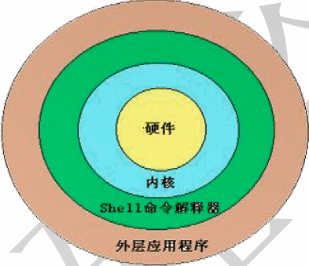
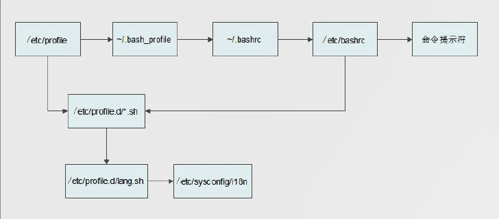

# shell 基础

## 一、Shell概述

### 1、什么是shell



### 2、shell的分类

| Shell类别          | 易学性 | 可移植性 | 编辑性 | 快捷性 |
| ------------------ | ------ | -------- | ------ | ------ |
| Bourne Shell(sh)   | 容易   | 好       | 较差   | 较差   |
| Korn Shell(ksh)    | 较难   | 较好     | 好     | 较好   |
| Bourne Again(Bash) | 难     | 较好     | 好     | 好     |
| POSIX Shell(psh)   | 较难   | 好       | 好     | 较好   |
| C Shell(csh)       | 较难   | 差       | 较好   | 较好   |
| TC Shell(tcsh)     | 难     | 差       | 好     | 好     |

Shell的两种主要语法类型有Bourne和C，这两种语法彼此不兼容。Bourne家族主要包括sh、ksh、Bash、psh、zsh；C家族主要包括csh、tcsh(Bash和zsh在不同程序上支持csh的语法)。

我们可以通过/etc/shells文件来查询Linux支持的Shell。命令如下：

```shell
[root@localhost ~]# cat /etc/shells 
/bin/sh
/bin/bash
/sbin/nologin
/bin/dash
/bin/tcsh
/bin/csh
```

## 二、Shell脚本的执行方式

### 1、echo命令

```shell
[root@localhost ~]# echo [选项] [输出内容]
选项：
	-e：支持反斜线控制的字符转换
	-n：取消输出后行末的换行符号(就是内容输出不换行)
```

```shell
[root@localhost ~]#  echo "Mr. Zhao Zhi Cheng is the most honest man!"
-bash: !": event not found
# 叹号后一定要加空格，否则会报 -bash: !": event not found错误
[root@localhost ~]#  echo "Mr. Zhao Zhi Cheng is the most honest man! "
Mr. Zhao Zhi Cheng is the most honest man!
# 或者使用单引号
[root@localhost ~]# echo 'Mr. Zhao Zhi Cheng is the most honest man!'
Mr. Zhao Zhi Cheng is the most honest man!

[root@localhost ~]# echo -n 'Mr. Zhao Zhi Cheng is the most honest man!'
Mr. Zhao Zhi Cheng is the most honest man![root@localhost ~]# 
# 如果加入了"-n"选项，输出内容结束后，不会换行直接显示新行的提示符
```

在echo命令中如果使用"-e"选项，则可以支持控制字符：

| 控制字符 | 作用                                                         |
| -------- | ------------------------------------------------------------ |
| `\\`     | 输出\本身                                                    |
| \a       | 输出警告音                                                   |
| \b       | 退格键，也就是向左删除键                                     |
| \c       | 取消输出末行的换行符。和"-n"选项一致                         |
| \e       | ESCAPE键                                                     |
| \f       | 换页符                                                       |
| \n       | 换行符                                                       |
| \r       | 回车符                                                       |
| \t       | 制表符，也就是Tab键                                          |
| \v       | 垂直制表符                                                   |
| \0nnn    | 按照八进制ASCII码表输出字符。其中0为数字零，nnn是三位八进制数 |
| \xhh     | 按照十六进制ASCII码表输出字符。其中hh是两位十六进制数        |

```shell
# 这个输出会输出\，同时会在系统音响中输出一声提示音
[root@localhost ~]# echo -e "\\ \a"
\ 

# 这个输出中，在b键左侧有"\b"所以输出时只有ac
[root@localhost ~]# echo -e "ab\bc"
ac

# 加入了制表符"\t"和换行符"\n"，所以会按照格式输出
[root@localhost ~]# echo -e "a\tb\tc\nd\te\tf"
a       b       c
d       e       f

# 还是输出上面的内容，不过是按照八进制的ASCII码输出的，也就是说141这个八进制，在ASCII码中代表小写的"a"，其他的以此类推
[root@localhost ~]# echo -e "\0141\t\0142\t\0143\n\0144\t\0145\t\0146"
a       b       c
d       e       f

# 如果按照十六进制ASCII码也同样可以输出
[root@localhost ~]# echo -e "\x61\t\x62\t\x63\n\x64\t\x65\t\x66"
a       b       c
d       e       f

```

echo命令还可以进行一些比较有意思的东西，比如：

```shell
[root@localhost ~]# echo -e "\e[1;31m abcd \e[0m"
 abcd 
```

这条命令会把abcd按照红色输出。解释下这个命令 \e[1 是标准格式，代表颜色输出开始，\e[0m 代表颜色输出结束，31m定义字体颜色是红色。echo能够识别的颜色如下：30m=黑色，31m=红色；32m=绿色；33m=黄色；34m=蓝色；35m=洋红；36m=青色；37m=白色

```shell
[root@localhost ~]# echo -e "\e[1;42m abcd \e[0m"
 abcd 
```

这条命令会给abcd加入一个绿色的背景。echo可以使用的背景颜色如下：40m=黑色，41m=红色；42m=绿色；43m=黄色；44m=蓝色；45m=洋红；46m=青色；47m=白色

### 2、Shell脚本的执行

```shell
[root@localhost sh]# vi hello.sh
#!/bin/bash

echo "Hello World! "
```

Shell脚本写好了，那么这个脚本该如何运行呢？在Linux中脚本的执行主要有这两种方法：

- 赋予执行权限，直接运行

这种方法是最常用的Shell脚本运行方法，也最为直接简单。就是赋予执行权限之后，直接运行。当然运行时可以使用绝对路径，也可以使用相对路径运行。命令如下：

```shell
# 赋予执行权限
[root@localhost sh]# chmod 755 hello.sh
[root@localhost sh]# ll hello.sh 
-rwxr-xr-x. 1 root root 33 Apr  6 23:57 hello.sh
# 使用绝对路径
[root@localhost sh]# /root/sh/hello.sh
Hello World!
# 因为已经在/root/sh目录当中，也可以使用相对路径
[root@localhost sh]# sh ./hello.sh 
Hello World! 
```

- 通过Bash调用执行脚本

这种方法也非常简单，命令如下：

```shell
[root@localhost sh]# bash hello.sh 
Hello World! 
```

## 三、Bash的基本功能

### 1、历史命令

#### 1、历史命令的查看

```shell
[root@localhost ~]# history [选项] [历史命令保存文件]
选项：
	-c：清空历史命令
	-w：把缓存中的历史命令写入历史命令保存文件。如果不手工指定历史命令保存文件，则放入默认历史命令保存文件~/.bash_history中
```

```shell
[root@localhost ~]# vi /etc/profile
...省略部分输出...
HISTSIZE=1000
...省略部分输出...
```

我们使用history命令查看的历史命令和~/.bash_history文件中保存的历史命令是不同的。那是因为当前登录操作的命令并没有直接写入~/.bash_history文件，而保存在缓存当中的。需要等当前用户注销之后，缓存中的命令才会写入~/.bash_history文件。如果我们需要把内存中的命令直接写入~/.bash_history文件，而不等用户注销时再写入，就需要使用"-w"选项了。命令如下：

```shell
# 把缓存中的历史命令直接写入~/.bash_history
[root@localhost ~]# history -w
```

这时再去查询~/.bash_history文件，历史命令就和history命令查询的一致了。

如果需要清空历史命令，只需要执行：

```shell
# 清空历史命令
[root@localhost ~]# history -c
```

#### 2、历史命令的调用

如果想要使用原先的历史命令有这样几种方法：

- 使用上、下箭头调用以前的历史命令
- 使用"!n"重复执行第n条历史命令
- 使用"!!"重复执行上一条命令
- 使用"!字串"重复执行最后一条以该字串开头的命令
- 使用"!$"重复上一条命令的最后一个参数

### 2、命令与文件的补全

### 3、命令别名

命令格式：

```shell
# 查询命令别名
[root@localhost ~]# alias 

# 设定命令别名
[root@localhost ~]# alias 别名='原命令'
```

```shell
# 例如：查询系统中已经定义好的别名
[root@localhost ~]# alias 
alias cp='cp -i'
alias l.='ls -d .* --color=auto'
alias ll='ls -l --color=auto'
alias ls='ls --color=auto'
alias mv='mv -i'
alias rm='rm -i'
alias vi='vim'
alias which='alias | /usr/bin/which --tty-only --read-alias --show-dot --show-tilde'

# 定义vim命令的别名是vi 
[root@localhost ~]# alias vi='vim'
```

既然我们说别名的优先级比命令高，那么命令执行时具体的顺序是什么呢？命令执行时的顺序是这样的：

1. 第一顺位执行用绝对路径或相对路径执行的命令
2. 第二顺位执行别名
3. 第三顺位执行Bash的内部命令
4. 第四顺位执行按照$PATH环境变量定义的目录查找顺序找到的第一个命令

为了让这个别名永久生效，可以把别名写入环境变量配置文件"~./bashrc"。命令如下：

```shell
[root@localhost ~]# vi .bashrc 
```

### 4、Bash常用快捷键

| 快捷键 | 作用                                                         |
| ------ | ------------------------------------------------------------ |
| Ctrl+A | 把光标移动到命令行开头。如果我们输入的命令过长，想要把光标移动到命令行开头时使用。 |
| Ctrl+E | 把光标移动到命令行结尾。                                     |
| Ctrl+C | 强制终止当前的命令                                           |
| Ctrl+L | 清屏，相当于clear命令                                        |
| Ctrl+U | 删除或剪切光标之前的命令。输入了一行很长的命令，不使用退格键一个一个字符的删除，使用这个快捷键更加方便 |
| Ctrl+K | 删除或剪切光标之后的内容                                     |
| Ctrl+Y | 粘贴Ctrl+U中Ctrl+K剪切的内容                                 |
| Ctrl+R | 在历史命令中搜索，按下Ctrl+R之后，就会出现搜索界面，只要输入搜索内容，就会从历史命令中搜索 |
| Ctrl+D | 退出当前终端                                                 |
| Ctrl+Z | 暂停，并放入后台。这个快捷键牵扯工作管理的内容，在系统管理章节详细介绍 |
| Ctrl+S | 暂停屏幕输出                                                 |
| Ctrl+Q | 恢复屏幕输出                                                 |

### 5、输入输出重定向

#### 1、Bash的标准输入输出

| 设备   | 设备文件名  | 文件描述符 | 类型         |
| ------ | ----------- | ---------- | ------------ |
| 键盘   | /dev/stdin  | 0          | 标准输入     |
| 显示器 | /dev/stdout | 1          | 标准输出     |
| 显示器 | /dev/stderr | 2          | 标准错误输出 |

#### 2、输出重定向

| 类型                       | 符号                   | 作用                                                     |
| -------------------------- | ---------------------- | -------------------------------------------------------- |
| 标准输出重定向             | 命令 > 文件            | 以覆盖的方式，把命令的正确输出输出到指定的文件或设备当中 |
|                            | 命令 >> 文件           | 以追加的方式，把命令的正确输出输出到指定的文件或设备当中 |
| 标准错误输出重定向         | 错误命令 2>文件        | 以覆盖的方式，把命令的错误输出输出到指定的文件或设备当中 |
|                            | 错误命令 2>>文件       | 以追加的方式，把命令的错误输出输出到指定的文件或设备当中 |
| 正确输出和错误输出同时保存 | w命令 > 文件 2>&1      | 以覆盖的方式，把正确输出和错误输出都保存到同一个文件当中 |
|                            | 命令 >> 文件 2>&1      | 以追加的方式，把正确输出和错误输出都保存到同一个文件当中 |
|                            | 命令 &>文件            | 以覆盖的方式，把正确输出和错误输出都保存到同一个文件当中 |
|                            | 命令 &>>文件           | 以追加的方式，把正确输出和错误输出都保存到同一个文件当中 |
|                            | 命令>>文件1  2>>文件 2 | 把正确的输出追加到文件1中，把错误的输出追加到文件2中     |

#### 3、输入重定向

```shell
[root@localhost ~]# wc [选项] [文件名]
选项：
	-c 	统计字节数
	-w  统计单词数
	-l	统计行数
	-m  统计字符数
```

### 6、多命令顺序执行

| 多命令执行符 | 格式             | 作用                                                         |
| ------------ | ---------------- | ------------------------------------------------------------ |
| ;            | 命令1 ; 命令2    | 多个命令顺序执行，命令之间没有任何逻辑联系                   |
| &&           | 命令1 && 命令2   | 当命令1正确执行($?=0)，则命令2才会执行<br>当命令1执行不正确($?≠0)，则命令2不会执行 |
| \|\|         | 命令1 \|\| 命令2 | 当命令1执行不正确($?≠0)，则命令2才会执行<br>当命令1正确执行($?=0)，则命令2不会执行 |

### 7、管道符

#### 1、行提取命令grep

```shell
[root@localhost ~]# grep [选项] "搜索内容" 文件名
选项：
	-A 数字：列出符合条件的行，并列出后续的n行
	-B 数字：列出符合条件的行，并列出前面的n行
	-c：	   统计找到的符合条件的字符串的次数
	-i：	   忽略大小写
    -n：    输出行号
    -v：    反向查找
    --color=auto：搜索出的关键词用颜色显示
```

例：

```shell
# 查找用户信息文件/etc/passwd中，有多少可以登录的用户
[root@localhost ~]# grep "/bin/bash" /etc/passwd

# 查找包含有"root"的行，并列出后续的3行
[root@localhost ~]#  grep -A 3 "root" /etc/passwd

# 查找可以登录的用户，并显示行号
[root@localhost ~]# grep -n "/bin/bash" /etc/passwd

# 查找不含有"/bin/bash"的行，其实就是列出所有的伪用户
[root@localhost ~]# grep -v "/bin/bash" /etc/passwd
```

#### 2、find和grep的区别

find命令是在系统当中搜索符号条件的文件名，如果需要模糊查询，使用通配符进行匹配，搜索时文件名是完全匹配。

```shell
# 建立文件abc
[root@localhost ~]# touch abc
# 建立文件abcd
[root@localhost ~]# touch abcd
# 搜索文件名是abc的文件，只会找到abc文件，而不会找到文件abcd
# 虽然abcd文件名中包含abc，但是find是完全匹配，只能和要搜索的数据完全样，才能找到
[root@localhost ~]# find . -name "abc"
./abc
```

注意：find命令是可以通过-regex选项识别正则表达式的，也就是说find命令可以按照正则表达式规则匹配，而正则表达式是模糊匹配。但是对于初学者而言，find命令和grep命令本身就不好理解，所以这里只按照通配符规则来进行find查询。

grep命令是在文件当中搜索符合条件的字符串，如果需要模糊查询，使用正则表达式进行匹配，搜索时字符串是包含匹配。

```shell
# 在test文件中写入abc数据
[root@localhost ~]# echo abc > test
# 在test文件中追加abcd数据
[root@localhost ~]# echo abcd >> test
# grep 命令查找时，只要数据行中包含有abc，就会都列出，所以abc和abcd都可以查询到
[root@localhost ~]# grep "abc" test
abc
abcd
```

#### 3、管道符

```shell
[root@localhost ~]#  ll -a /etc/ | more

# 查询下本地所有的网络连接，提取包含ESTABLISHED(已建立连接)的行，就可以知道我们的服务器上有多少已经成功连接的网络连接
[root@localhost ~]# netstat -an | grep "ESTABLISHED"

# 如果想知道具体的网络连接数量，就可以再使用wc命令统计行数
[root@localhost ~]# netstat -an |grep "ESTABLISHED" | wc -l

[root@localhost ~]# rpm -qa | grep httpd
```

### 8、通配符

| 通配符 | 作用                                                         |
| ------ | ------------------------------------------------------------ |
| ?      | 匹配一个任意字符                                             |
| *      | 匹配0个或任意多个任意字符，也就是可以匹配任何内容            |
| []     | 匹配中括号中任意一个字符。例如：[abc]代表一匹配一个字符，或者是a，或者是b，或者是c。 |
| [-]    | 匹配中括号中任意一个字符，-代表一个范围。例如：[a-z]代表匹配一个小写字母 |
| [^]    | 逻辑非，表示匹配不是中括号内的一个字符。例如：`[^0-9]`代表匹配一个不是数字的字符。 |

```shell
# 建立几个测试文件
[root@localhost tmp]# touch abc
[root@localhost tmp]# touch abcd
[root@localhost tmp]# touch 012
[root@localhost tmp]# touch 0abc
# "*"代表所有的文件
[root@localhost tmp]# ls *
012 0abc abc abcd
# "?"匹配任意一个字符，所以会匹配0abc，但是不能匹配abc，因为"?"不能匹配空
[root@localhost tmp]# ls ?abc
0abc
# 匹配任何以数字开头文件
[root@localhost tmp]# ls [0-9]*
012 0abc
# 匹配不以数字开头的文件
[root@localhost tmp]# ls [^0-9]*
abc abcd
```

### 9、Bash中其他特殊符号

| 符号 | 作用                                                         |
| ---- | ------------------------------------------------------------ |
| ''   | 单引号。在单引号中所有的特殊符号，如"$"和"`"(反引号)都没有特殊含义。 |
| ""   | 双引号。在双引号中特殊符号都没有特殊含义，但是"$"、"`"和"\"是例外，拥有"调用变量的值"、"引用命令"和"转义符"的特殊含义。 |
| ``   | 反引号。反引号括起来的内容是系统命令，在Bash中会先执行它。和$()作用一样，不过推荐使用$()，因为反引号非常容易看错。 |
| $()  | 和反引号一样，用来引用系统命令                               |
| ()   | 用于一串命令执行时，()中的命令会在子Shell中运行              |
| {}   | 用于一串命令执行时，{}中的命令会在当前Shell中执行。也可以用于变量变形与替换。 |
| []   | 用于变量的测试。                                             |
| #    | 在Shell脚本中，#开头的行代表注释。                           |
| $    | 用于调用变量的值，如需要调用变量name的值时，需要使用$name的方式得到变量的值。 |
| \    | 转义符，跟在\之后的特殊符号将失去特殊含义，变为普通字符。如`\$`将输出"$"符号，面不当做是变量引用。 |

#### 1、单引号和双引号

```shell
# 定义变量name的值是zhicheng
[root@localhost ~]# name=zhicheng
# 如果输出时使用单引号，则$name原封不动的输出
[root@localhost ~]# echo '$name'
$name
# 如果输出时使用双引号，则会输出变量name的值zhicheng
[root@localhost ~]# echo "$name"
zhicheng
```

#### 2、反引号

```shell
# 如果命令不用反引号包含，命令不会执行，而是直接输出
[root@localhost ~]# echo ls
ls
# 只有用反引号包括命令，这个命令才会执行
[root@localhost ~]# echo `ls`
anaconda-ks.cfg install.log install.log.syslog
# 使用$(命令)的方式也是可以的
[root@localhost ~]# echo $(date)
Sun Apr 7 06:11:30 CST 2019
```

#### 3、小括号、中括号和大括号

在介绍小括号和大括号的区别之前，我们先要解释一个概念，那就是父Shell和子Shell。在Bash中，是可以调用新的Bash的，比如：

```shell
[root@localhost ~]# bash
[root@localhost ~]# 
```

这时通过pstree命令查看一下进程树：

```shell
[root@localhost ~]# pstree
init─┬─abrtd
     ├─acpid
     ├─atd
     ├─automount───4*[{automount}]
     ├─certmonger
     ├─crond
     ├─cupsd
     ├─dbus-daemon───{dbus-daemon}
     ├─dhclient
     ├─hald─┬─hald-runner─┬─hald-addon-acpi
     │      │             ├─hald-addon-inpu
     │      │             └─hald-addon-rfki
     │      └─{hald}
     ├─master─┬─pickup
     │        └─qmgr
     ├─mcelog
     ├─6*[mingetty]
     ├─rpc.statd
     ├─rpcbind
     ├─rsyslogd───3*[{rsyslogd}]
     ├─sshd─┬─sshd─┬─bash
     │      │      └─bash───top
     │      ├─2*[sshd───sftp-server]
     │      ├─2*[sshd───6*[sftp-server]]
     │      └─sshd─┬─bash───bash───pstree
     │             ├─bash───top
     │             └─bash───sleep
     └─udevd───2*[udevd]
```

知道了父Shell和子Shell，接着解释小括号和大括号的区别。如果是用于一串命令的执行，那么小括号和大括号的主要区别在于：

- ()执行一串命令，需要重新开一个子Shell进行执行
- {}执行一串命令，是在当前Shell执行
- ()和{}都是把一串命令放在括号里面，并且命令之间用";"号隔开
- ()最后一个命令可以不用分号
- {}最后一个命令要用分号
- {}的第一个命令和左括号之间必须要有一个空格
- ()里的各命令不必和括号有空格
- ()和{}中括号里的某个命令的重定向只影响该命令，但括号外的重定向则影响到括号里的

例：

```shell
# 在父Shell中定义变量name的值是zhicheng
[root@localhost ~]# name=zhicheng
# 如果用()括起来一串命令，这些命令都可以执行
# 给name变量重新赋值，但是这个值只在子Shell中生效
[root@localhost ~]# (name=zczhao;echo $name)
zczhao
# 在父Shell中name的值还是zhicheng,而不是zczhao
[root@localhost ~]# echo $name
zhicheng

# 但是用大括号来进行一串命令的执行，name变量的修改是直接在父Shell当中的
# 注意大括号的格式
[root@localhost ~]# { name=zczhao;echo $name; }
zczhao
# name变量的值已经被修改了
[root@localhost ~]# echo $name
zhicheng
```

## 四、Bash的变量和运算符

### 1、什么是变量

在定义变量时，有一些规则需要遵守：

- 变量名称可以由字母，数字和下划线组成，但是不能以数字开头。如果变量名是"2name"则是错误的
- 在Bash中，变量的默认类型都是字符串型，如果要进行数值运算，则必须指定变量类型为数值型
- 变量用等号连接值，等号左右两侧不能有空格
- 变量的值如果有空格，需要使用单引号或双引号包括。如 “test="helllo world!"”。其中双引号括起来的内容"$"、"\"和反引号都拥有特殊含义，而单引号括起来的内容都是普通字符
- 在变量的值中，可以使用"\"转义
- 如果需要增加变量的值，那么可以进行变量值的叠加。不过变量需要用双引号包含"$变量名"或${变量名}包含变量值。例如：

```shell
# 叠加变量test，变量值变成了123456
[root@localhost ~]# test=123
[root@localhost ~]# test="$test"456
[root@localhost ~]# echo $test
123456
# 现叠加变量test，变量值变成了123456789
[root@localhost ~]# test=${test}789
[root@localhost ~]# echo $test
123456789
```

变量值的叠加可以使用两种格式："$变量名"或$变量名

- 如果是把命令的结果作为变量值赋予变量，则需要使用反引号或$()包含命令，例如

```shell
[root@localhost ~]# test=$(date)
[root@localhost ~]# echo $test
Sun Apr 7 08:30:10 CST 2019
```

- 环境变量名建议大写，便于区分

### 2、变量的分类

- 用户自定义变量：这种变量是最常见的变量，由用户自由定义变量名和变量的值
- 环境变量：这种变量中主要保存的是和系统操作环境相关的数据，比如当前登录用户，用户的家目录，命令的提示符等。不是太好理解吧，那么当在Windows中，同一台电脑可以有多个用户登录，而且每个用户都可以定义自己的桌面样式和分辨率，这些其实就是Windows的操作环境，可以当做是Windows的环境变量来理解。环境变量的变量名可以自由定义，但是一般对系统起作用的环境变量的变量名是系统预先设定好的。
- 位置参数变量：这种变量主要是用来向脚本当中传递参数或数据的，变量名不能自定义，变量作用是固定的
- 预定义变量：是Bash中已经定义好的变量，变量名不能自定义，变量作用也是固定的

### 3、用户自定义变量

#### 1、变量定义

```shell
# 变量名不能用数字开头
[root@localhost ~]# 2name="zhao zhi cheng"
-bash: 2name=zhao zhi cheng: command not found

# 等号左右两侧不能有空格
[root@localhost ~]# name = "zhaozhicheng"
-bash: name: command not found

# 变量的值如果有空格，必须用引号包含
[root@localhost ~]# name=zhao zhi cheng
-bash: zhi: command not found
```

#### 2、变量调用

```shell
# 定义变量name
[root@localhost ~]# name="zhao zhi cheng"
# 输出变量name的值
[root@localhost ~]# echo $name
zhao zhi cheng
```

#### 3、查看变量

```shell
[root@localhost ~]# set 选项
选项：
	-u：如果设定此选项，调用未声明变量时会报错(默认无任何提示)
	-x：如果设定此选项，在命令执行之前，会把命令先输出一次
```

```shell
# 直接使用set命令，会查询系统中所有变量，包含用户自定义变量和环境变量
[root@localhost ~]# set
....省略部分输出...
name='zhao zhi cheng'
test='Sun Apr  7 08:30:10 CST 2019'

# 当设置了-u选项后，如果调用没有设定的变量会有报错，默认是没有任何输出的
[root@localhost ~]# set -u
[root@localhost ~]# echo $file
-bash: file: unbound variable

# 如果设定了-x选项，会在每个命令执行之前，先把命令输出一次
[root@localhost ~]# set -x
[root@localhost ~]# ls
+ ls --color=auto
anaconda-ks.cfg  install.log  install.log.syslog
```

#### 4、变量删除

```shell
[root@localhost ~]# unset 变量名
```

### 4、环境变量

#### 1、环境变量设置

```shell
# 使用export声明的变量即是环境变量
[root@localhost ~]# export age="18"
```

#### 2、环境变量查询和删除

env和set命令的区别是：set命令可以查看所有变量，而env命令只能查看环境变量。

```shell
# 删除环境变量gender
[root@localhost ~]# unset gender
[root@localhost ~]# env | grep gender
```

#### 3、系统默认变量

```shell
[root@localhost ~]# env
HOSTNAME=localhost.localdomain       <-主机名
SELINUX_ROLE_REQUESTED=                   
TERM=xterm                           <-终端环境
SHELL=/bin/bash                      <-当前的shell
HISTSIZE=1000                        <-历史命令条数   
SSH_CLIENT=192.168.152.1 52022 22    <-当前操作环境是ssh连接的，这里记录客户端IP
SELINUX_USE_CURRENT_RANGE=
QTDIR=/usr/lib64/qt-3.3
QTINC=/usr/lib64/qt-3.3/include
SSH_TTY=/dev/pts/2                   <-ssh连接的终端是pst/2
USER=root                            <-当前登录的用户
LS_COLORS=rs=0:di=01;34:ln=01;36:mh=00:pi=40;33:so=01;35:do=01;35:bd=40;33;01:cd=40;33;01:or=40;31;01:mi=01;05;37;41:su=37;41:sg=30;43:ca=30;41:tw=30;42:ow=34;42:st=37;44:ex=01;32:*.tar=01;31:*.tgz=01;31:*.arj=01;31:*.taz=01;31:*.lzh=01;31:*.lzma=01;31:*.tlz=01;31:*.txz=01;31:*.zip=01;31:*.z=01;31:*.Z=01;31:*.dz=01;31:*.gz=01;31:*.lz=01;31:*.xz=01;31:*.bz2=01;31:*.tbz=01;31:*.tbz2=01;31:*.bz=01;31:*.tz=01;31:*.deb=01;31:*.rpm=01;31:*.jar=01;31:*.rar=01;31:*.ace=01;31:*.zoo=01;31:*.cpio=01;31:*.7z=01;31:*.rz=01;31:*.jpg=01;35:*.jpeg=01;35:*.gif=01;35:*.bmp=01;35:*.pbm=01;35:*.pgm=01;35:*.ppm=01;35:*.tga=01;35:*.xbm=01;35:*.xpm=01;35:*.tif=01;35:*.tiff=01;35:*.png=01;35:*.svg=01;35:*.svgz=01;35:*.mng=01;35:*.pcx=01;35:*.mov=01;35:*.mpg=01;35:*.mpeg=01;35:*.m2v=01;35:*.mkv=01;35:*.ogm=01;35:*.mp4=01;35:*.m4v=01;35:*.mp4v=01;35:*.vob=01;35:*.qt=01;35:*.nuv=01;35:*.wmv=01;35:*.asf=01;35:*.rm=01;35:*.rmvb=01;35:*.flc=01;35:*.avi=01;35:*.fli=01;35:*.flv=01;35:*.gl=01;35:*.dl=01;35:*.xcf=01;35:*.xwd=01;35:*.yuv=01;35:*.cgm=01;35:*.emf=01;35:*.axv=01;35:*.anx=01;35:*.ogv=01;35:*.ogx=01;35:*.aac=01;36:*.au=01;36:*.flac=01;36:*.mid=01;36:*.midi=01;36:*.mka=01;36:*.mp3=01;36:*.mpc=01;36:*.ogg=01;36:*.ra=01;36:*.wav=01;36:*.axa=01;36:*.oga=01;36:*.spx=01;36:*.xspf=01;36:     <-定义颜色显示
MAIL=/var/spool/mail/root            <-用户邮箱   
PATH=/usr/lib64/qt-3.3/bin:/usr/local/sbin:/usr/local/bin:/sbin:/bin:/usr/sbin:/usr/bin:/root/bin <-系统查找命令的路径
PWD=/root                            <-当前所在目录
LANG=en_US.UTF-8                     <-语系
SELINUX_LEVEL_REQUESTED=
HISTCONTROL=ignoredups
SHLVL=1                              <-当前在第一层子shell中
HOME=/root                           <-当前登录用户的家目录
LOGNAME=root                         <-登录用户
QTLIB=/usr/lib64/qt-3.3/lib
CVS_RSH=ssh
SSH_CONNECTION=192.168.152.1 52022 192.168.152.130 22
LESSOPEN=||/usr/bin/lesspipe.sh %s
G_BROKEN_FILENAMES=1
_=/bin/env                           <-上次执行命令的最后一个参数或命令本身
```

env命令可以查询到所有的环境变量，可是还有一些变量虽然不是环境变量，却是和Bash操作接口相关的变量，这些变量也对Bash操作终端起到了重要的作用。这些变量就只能用set命令来查看了，列出重要的内容：

```shell
[root@localhost ~]# set
BASH=/bin/bash                       <-Bash的位置
BASHOPTS=checkwinsize:cmdhist:expand_aliases:extquote:force_fignore:hostcomplete:interactive_comments:login_shell:progcomp:promptvars:sourcepath
BASH_ALIASES=()
BASH_ARGC=()
BASH_ARGV=()
BASH_CMDS=()
BASH_LINENO=()
BASH_SOURCE=()
BASH_VERSINFO=([0]="4" [1]="1" [2]="2" [3]="2" [4]="release" [5]="x86_64-redhat-linux-gnu")                               <-Bash版本
BASH_VERSION='4.1.2(2)-release'     <-Bash的版本  
COLORS=/etc/DIR_COLORS              <-颜色记录文件 
COLUMNS=250
CVS_RSH=ssh
DIRSTACK=()
EUID=0
GROUPS=()
G_BROKEN_FILENAMES=1
[root@localhost ~]# set
BASH=/bin/bash
BASHOPTS=checkwinsize:cmdhist:expand_aliases:extquote:force_fignore:hostcomplete:interactive_comments:login_shell:progcomp:promptvars:sourcepath
BASH_ALIASES=()
BASH_ARGC=()
BASH_ARGV=()
BASH_CMDS=()
BASH_LINENO=()
BASH_SOURCE=()
BASH_VERSINFO=([0]="4" [1]="1" [2]="2" [3]="2" [4]="release" [5]="x86_64-redhat-linux-gnu")
BASH_VERSION='4.1.2(2)-release'
COLORS=/etc/DIR_COLORS
COLUMNS=250
CVS_RSH=ssh
DIRSTACK=()
EUID=0
GROUPS=()
G_BROKEN_FILENAMES=1
HISTCONTROL=ignoredups
HISTFILE=/root/.bash_history          <-历史命令保存文件
HISTFILESIZE=1000                     <-在文件当中记录的历史命令最大条数
HISTSIZE=1000                         <-在缓存中记录的历史命令最大条数
HOME=/root
HOSTNAME=localhost.localdomain
HOSTTYPE=x86_64
ID=0
IFS=$' \t\n'
LANG=en_US.UTF-8                      <-语系环境      
LESSOPEN='||/usr/bin/lesspipe.sh %s'
LINES=53
LOGNAME=root
LS_COLORS='rs=0:di=01;34:ln=01;36:mh=00:pi=40;33:so=01;35:do=01;35:bd=40;33;01:cd=40;33;01:or=40;31;01:mi=01;05;37;41:su=37;41:sg=30;43:ca=30;41:tw=30;42:ow=34;42:st=37;44:ex=01;32:*.tar=01;31:*.tgz=01;31:*.arj=01;31:*.taz=01;31:*.lzh=01;31:*.lzma=01;31:*.tlz=01;31:*.txz=01;31:*.zip=01;31:*.z=01;31:*.Z=01;31:*.dz=01;31:*.gz=01;31:*.lz=01;31:*.xz=01;31:*.bz2=01;31:*.tbz=01;31:*.tbz2=01;31:*.bz=01;31:*.tz=01;31:*.deb=01;31:*.rpm=01;31:*.jar=01;31:*.rar=01;31:*.ace=01;31:*.zoo=01;31:*.cpio=01;31:*.7z=01;31:*.rz=01;31:*.jpg=01;35:*.jpeg=01;35:*.gif=01;35:*.bmp=01;35:*.pbm=01;35:*.pgm=01;35:*.ppm=01;35:*.tga=01;35:*.xbm=01;35:*.xpm=01;35:*.tif=01;35:*.tiff=01;35:*.png=01;35:*.svg=01;35:*.svgz=01;35:*.mng=01;35:*.pcx=01;35:*.mov=01;35:*.mpg=01;35:*.mpeg=01;35:*.m2v=01;35:*.mkv=01;35:*.ogm=01;35:*.mp4=01;35:*.m4v=01;35:*.mp4v=01;35:*.vob=01;35:*.qt=01;35:*.nuv=01;35:*.wmv=01;35:*.asf=01;35:*.rm=01;35:*.rmvb=01;35:*.flc=01;35:*.avi=01;35:*.fli=01;35:*.flv=01;35:*.gl=01;35:*.dl=01;35:*.xcf=01;35:*.xwd=01;35:*.yuv=01;35:*.cgm=01;35:*.emf=01;35:*.axv=01;35:*.anx=01;35:*.ogv=01;35:*.ogx=01;35:*.aac=01;36:*.au=01;36:*.flac=01;36:*.mid=01;36:*.midi=01;36:*.mka=01;36:*.mp3=01;36:*.mpc=01;36:*.ogg=01;36:*.ra=01;36:*.wav=01;36:*.axa=01;36:*.oga=01;36:*.spx=01;36:*.xspf=01;36:'
MACHTYPE=x86_64-redhat-linux-gnu    <-软件类型
MAIL=/var/spool/mail/root
MAILCHECK=60                        <-每60秒去扫描新邮件
OPTERR=1
OPTIND=1
OSTYPE=linux-gnu
PATH=/usr/lib64/qt-3.3/bin:/usr/local/sbin:/usr/local/bin:/sbin:/bin:/usr/sbin:/usr/bin:/root/bin
PIPESTATUS=([0]="0")
PPID=98641                          <-父shell的PID
PROMPT_COMMAND='printf "\033]0;%s@%s:%s\007" "${USER}" "${HOSTNAME%%.*}" "${PWD/#$HOME/~}"'
PS1='[\u@\h \W]\$ '                 <-命令提示符 
PS2='> '                            <-如果命令一行没有输入完成，第二行命令的提示符
PS4='+ '
PWD=/root
QTDIR=/usr/lib64/qt-3.3
QTINC=/usr/lib64/qt-3.3/include
QTLIB=/usr/lib64/qt-3.3/lib
SELINUX_LEVEL_REQUESTED=
SELINUX_ROLE_REQUESTED=
SELINUX_USE_CURRENT_RANGE=
SHELL=/bin/bash
SHELLOPTS=braceexpand:emacs:hashall:histexpand:history:interactive-comments:monitor
SHLVL=1
SSH_CLIENT='192.168.152.1 52022 22'
SSH_CONNECTION='192.168.152.1 52022 192.168.152.130 22'
SSH_TTY=/dev/pts/2
TERM=xterm
UID=0                               <-当前用户的UID
USER=root
_=env
colors=/etc/DIR_COLORS
name='zhao zhi cheng'
test='Sun Apr  7 08:30:10 CST 2019'

```

#### 4、系统默认环境变量

- **PATH变量：系统查找命令的路径**

```shell
[root@localhost ~]# echo $PATH
/usr/lib64/qt-3.3/bin:/usr/local/sbin:/usr/local/bin:/sbin:/bin:/usr/sbin:/usr/bin:/root/bin
```

PATH变量的值是用":"分割的路径，这些路径就是系统查找命令的路径。也就是说当输入了一个程序名，如果没有写入路径，系统就会到PATH变量定义的路径中去寻找，是否有可以执行的程序。如果找到则执行，否则会报"命令没有发现"的错误。

那么是不是我们把自己的脚本拷贝到PATH变量定义的路径中，我们自己写的脚本也可以不输入路径直接运行呢？

```shell
# 拷贝hello.sh到/bin目录
[root@localhost ~]# cp /root/sh/hello.sh /bin/
# hello.sh可以直接执行了
[root@localhost ~]# hello.sh
Mr. Zhao Zhi Cheng is the most honest man.
```

那么我们是不是可以修改PATH变量的值，而不是把脚本复制到/bin/目录下。当然是可以的，通过变量的叠加就可以实现了：

```shell
# 在变量PATH的后面，加入/root/sh目录
[root@localhost ~]# PATH="$PATH":/root/sh
# 查询PATH的值，变量叠加生效了
[root@localhost ~]# echo $PATH
/usr/lib64/qt-3.3/bin:/usr/local/sbin:/usr/local/bin:/sbin:/bin:/usr/sbin:/usr/bin:/root/bin:/root/sh
```

当然这样定义的PATH变量只是临时生效，一旦重启或注销就会消失，如果想要永久生效，需要写入环境变量配置文件。

- **PS1变量：命令提示符设置**

PS1是一个很有意思的变量(这可不是SONY的游戏机哦)，是用来定义命令行的提示符的，可以按照我们自己的需求来定义自己喜欢的提示符。PS1可以支持以下这些选项：

\d：显示日期，格式为"星期 月 日"

\H：显示完整的主机名。如默认主机名"localhost.localdomain"

\h：显示简写主机名。如默认主机名"localhost"

\t：显示24小时制时间，格式为"HH:MM:SS"

\T：显示12小时制时间，格式为"HH:MM:SS"

\A：显示24小时制时间，格式为"HH:MM"

\@：显示12小时制时间，格式为"HH:MM am/pm"

\u：显示当前用户名

\v：显示Bash的版本信息

\w：显示当前所在目录的完整名称

\W：显示当前所在目录的最后一个目录

`\#`：执行第几条命令

`\$`：提示符。如果是root用户会显示提示符为"#"，如果是普通用户显示提示符为"$"

这些选项该怎么用？先看看PS1变量的默认值：

```shell
[root@localhost ~]# echo $PS1
[\u@\h \W]\$
# 默认的提示符是显示"[用户名@简写主机名 最后所在目录]提示符 "
```

在PS1变量中，如果是可以解释的符号，如"\u"、"\h"等，则显示这个符号的作用。如果是不能解释的符号，如"@"或"空格"，则原符号输出。修改PS1变量：

```shell
# 修改提示符为'[用户名@当前时间 当前所在完整目录]提示符 '
[root@localhost ~]# PS1='[\u@\t \w]\$ '
# 切换下当前所在目录，因为家目录是看不出来区别的
[root@11:20:52 ~]# cd /usr/local/src/
[root@11:21:04 /usr/local/src]# 
```

这里要小心，PS1变量的值要用单引号包含，否则设置不生效。如：

```shell
[root@11:21:04 /usr/local/src]# PS1='[\u@\a \h \# \W]\$ '
[root@ localhost 47 src]# ls
[root@ localhost 48 src]# 
# 提示符又变了。\@:时间格式是 HH:MM am/pm；\#：会显示执行了多少个命令
```

PS1变量可以自由定制，好像看到了点Linux可以自由定制和修改的影子，还是很有意思的。不过说实话一个提示符已经使用习惯了，如果换一个还是非常别扭的，还是改回默认的提示符：

```shell
[root@ localhost 48 src]# PS1='[\u@\h \W]\$ '
[root@localhost src]# 
```

- **LANG语系变量**

LANG变量定义了Linux系统的主语系环境，这个变量的默认值是：

```shell
[root@localhost ~]# echo $LANG
en_US.UTF-8
```

这是因为我们Linux安装时，选择的是中文安装，所以默认的主语系变量是"en_US.UTF-8"。那么Linux中到底支持多少语系呢？可以使用以下命令查询：

```shell
[root@localhost ~]# locale -a | more 
aa_DJ
aa_DJ.iso88591
aa_DJ.utf8
...省略部分输出...

# 实在太多了，统计一下有多少个
[root@localhost ~]# locale -a | wc -l
741
```

支持这么多的语系，当前系统到底是什么语系呢？使用locale命令直接查询：

```shell
[root@localhost ~]# locale
LANG=en_US.UTF-8
LC_CTYPE="en_US.UTF-8"
LC_NUMERIC="en_US.UTF-8"
LC_TIME="en_US.UTF-8"
LC_COLLATE="en_US.UTF-8"
LC_MONETARY="en_US.UTF-8"
LC_MESSAGES="en_US.UTF-8"
LC_PAPER="en_US.UTF-8"
LC_NAME="en_US.UTF-8"
LC_ADDRESS="en_US.UTF-8"
LC_TELEPHONE="en_US.UTF-8"
LC_MEASUREMENT="en_US.UTF-8"
LC_IDENTIFICATION="en_US.UTF-8"
LC_ALL=
```

还是要通过文件/etc/sysconfig/i18n定义系统的默认语系，查看下这个文件的内容：

```shell
[root@localhost ~]# cat /etc/sysconfig/i18n 
LANG="zh_CN.UTF-8"
```

​        这又是当前系统语系，又是默认语系，有没有快晕倒的感觉。解释下吧，可以这样理解，默认语系是下次重启之后系统所使用的语系，而当前系统语系是当前系统使用的语系。如果系统重启，会从默认语系配置文件/etc/sysconfig/i18n中读出语系，然后赋予变量LANG让这个语系生效。也就是说，LANG定义的语系只对当前系统生效，要想永久生效就要修改/etc/sysconfig/i18n文件了。

​      说到这里，需要解释下Linux中文支持的问题，是不是我们只要定义了语系为中文语系，如zh_CN.UTF-8就可以正确显示中文了呢？这要分情况，如果我们是在图形界面中，或者是使用远程连接工具(如SecureCRT)，只要正解设置了语系，那么是可以正确显示中文的。当然远程工具也要配置正确的语系环境，具体配置方式可以参考Linux系统安装章节。

​     那么如果是纯字符界面(本地终端tty1-tty6)是不能显示中文的，因为Linux的纯字符界面

### 5、位置参数变量

| 位置参数变量 | 作用                                                         |
| ------------ | ------------------------------------------------------------ |
| $n           | n为数字 ，$0代表命令本身，$1-$9代表第一到第九个参数，十以上的参数需要用大括号包含，如${10} |
| $*           | 这个变量代表命令行中所有的参数，$*把所有的参数看成一个整体   |
| $@           | 这个变量也代表命令行中有的参数，不过$@把每个参数区分对待     |
| $#           | 这个变量代表命令行中所的参数的个数                           |

```shell
[root@localhost sh]# vi count.sh 
#!/bin/bash

# 给num1变量赋值是第一个参数
num1=$1
# 给num2变量赋值是第二个参数
num2=$2
# 数值类型运算
sum=$(($num1 + $num2))
# 打印变量sum的值
echo $sum

[root@localhost sh]# chmod 755 count.sh
[root@localhost sh]# ./count.sh 11 22
33
```

那么还有几个位置参数变量是干嘛的呢？写个脚本来说明下：

```shell
[root@localhost sh]# vi param.sh
#!/bin/bash

# 令行中所有的参数
echo "\$* is $*"
# 令行中所有的参数
echo "\$@ is $@"
# 命令行中所的参数的个数
echo "\$# is $#"

[root@localhost sh]# chmod 755 param.sh
[root@localhost sh]# ./param.sh 11 22 33 44
$* is 11 22 33 44
$@ is 11 22 33 44
$# is 4
```

```shell
# $*和$@区别
[root@localhost sh]# vi param2.sh
#!/bin/bash
# 代表命令行中所有的参数，$*把所有的参数看成一个整体
for i in "$*"
do
	echo $i
done

echo "---------------------------"

# 代表命令行中有的参数，不过$@把每个参数依次赋值
for y in "$@"
do
	echo $y
done

[root@localhost sh]# chmod 755 param2.sh
[root@localhost sh]# ./param2.sh 11 22 33 44
11 22 33 44
---------------------------
11
22
33
44
```

### 6、预定义变量

| 预定义变量 | 作用                                                         |
| ---------- | ------------------------------------------------------------ |
| $?         | 最后一次执行的命令的返回状态。如果这个变量的值为0，证明上一个命令正确执行；<br>如果这个变量的值为非0(具体是哪个数，由命令自己来决定)，则证明上一个命令执行不正解了 |
| $$         | 当前进程的进程号(PID)                                        |
| $!         | 后台运行的最后一个进程的进程号(PID)                          |

先来看看"$?"这个变量，看起来不好理解，举个例子：

```shell
# ls 命令正确执行
[root@localhost sh]# ls
count.sh  for.sh  hello.sh  param2.sh  param.sh
# 预定义变量"$?"的值是0，证明上一个命令执行正确
[root@localhost sh]# echo $?
0

# 当前目录没有install.log，所以ls命令报错了
[root@localhost sh]# ls install.log
ls: cannot access install.log: No such file or directory
# 变量"$?"返回一个非0的值，证明上一个命令没有正确执行
[root@localhost sh]# echo $?
2
```

"$$"

```shell
#!/bin/bash

# 输出当前进程的PID，这个PID就是当前这个脚本执行时，生成的进程的PID
echo "The current process is $$"

```

"$!"

```shell
#!/bin/bash

# 使用find命令在root目录下查找hello.sh文件，符号&的意思是把命令放入后台执行
find /root -name hello.sh & 
echo "The last one Daemon process is $!"
# 输出这个后执行命令的进程的PID，也就是输出find命令的PID号
```

### 7、接收键盘输入

```shell
[root@localhost ~]# read [选项] [变量名]
选项：
	-p "提示信息"：在等待read输入时，输出提示信息
	-t 秒数：read 命令会一直等待用户输入，使用此选项可以指定等待时间
	-n 字符数：read命令只接受指定字符数，就会执行
	-s：隐藏输入的数据，适用于机密信息的输入
变量名：
	变量名可以自定义，如果不指定变量名，会把输入保存入默认的REPLY
	如果只提供了一个变量名，则整个输入行赋予该变量
	如果提供了一个以上的变量名，则输入行分为若干字，一个接一个地赋予各个变量，而命令行上的最后一个变量取得剩余所有字
```

```shell
[root@localhost sh]# vi read.sh
#!/bin/bash

read -t 30 -p "Please input your name: " name
# 提示"请输入姓名"并等待30秒，把用户的输入保存到变量name中
echo "Name is $name"
# 输出变量"$name"

read -s -t30 -p "Please entery you age: " age
# 提示"请输入年龄"并等待30秒，把用户的输入保存到变量age中
# 年龄是隐私，用"-s"选项隐藏输入
echo -e "\n"
# 调整输出格式，如果不输出换行，一会的年龄输出不会换行
echo "Age is $age"

read -n 1 -t 30 -p "Please select your gender[M/F]: " gender
# 提示"请选择性别"并等待30秒，把用户的输入保存到变量gender中
# 使用"-n 1"选项只接收一个输入字符就会执行(都不用输入回车)
echo -e "\n"
echo "Sex is $gender"
[root@localhost sh]# chmod 755 read.sh
[root@localhost sh]# ./read.sh
Please input your name: zhaozhicheng
Name is zhaozhicheng
Please entery you age: 

Age is 18
Please select your gender[M/F]: M

Sex is M

```

### 8、Shell的运算符

#### 1、数值的运算方法

如果需要进行数值运算，可以采用以下三种方法中的任意一种：

- **使用declare声明变量类型**

既然所有的变量的默认类型是字符串型，那么只要把变量声明为整数型那不就可以运算了吗？使用declare命令就可以实现声明变量的类型，命令如下：

```shell
[root@localhost ~]# declare [+/-] [选项] 变量名
选项：
	-：给变量设定类型属性
	+：取消变量的类型属性
	-a：将变量声明为数组型
	-i：将变量声明为整数型(integer)
	-r：将变量声明只读变量，注意，一旦设置为只读变量，即不能修改变量的值，也不能删除变量，甚至不能通过+r取消只读属性
	-x：将变量声明为环境变量
	-p：显示指定变量的被声明的类型
```

例子1：数值运算

```shell
# 给变量a、b赋值
[root@localhost ~]# a=11
[root@localhost ~]# b=22
# 声明变量c的类型是整数型，它的值是a和b的和
[root@localhost ~]# declare -i c=$a+$b
[root@localhost ~]# echo $c
33

```

例子2：数组变量类型

数组只有写一些较为复杂的程序才会用到，什么是数组？所谓数组，就是相同数据类型的元素按一定顺序排列的集合，就是把有限个类型相同的变量用一个名字命名，然后用编号区分他们的变量的集合，这个名字称数组名，编号称为下标。组成数组的各个变量成为数组的分量，也称为数组的元素，有时也称为下标变量。

变量和数组都是用来保存数据的，只是变量只能赋予一个数据值，一旦重复赋值，后一个值就会覆盖前一个值。而数组是可以赋予一组相同类型的数据值。

```shell
[root@localhost ~]# name[0]="zhao"
[root@localhost ~]# name[1]="zhi"
[root@localhost ~]# name[2]="cheng"
# 输出数组的内容，如果只写数组名，那么只会输出第一个下标变量
[root@localhost ~]# echo ${name}
zhao
# 输出数组所有的内容
[root@localhost ~]# echo ${name[*]}
zhao zhi cheng
```

注意数组的下标是从0开始的，在调用数组时，需要使用${数组[下标]}的方式来读取。

在例子中，并没有把name变量声明为数组型，其实只要在定义变量时采用"变量名[下标]"的格式，这个变量就会被认为是数组型了，不用强制声明。

例子3：环境变量

其实也可以使用declare命令把变量声明为环境变量，和export命令的作用是一样的：

```shell
# 把变量test声明为环境变量
[root@localhost ~]# declare -x test=123
```

例子4：只读属性

注意一旦给变量设定了只读属性，那么这个变量既不能修改变量的值，也不能删除变量，甚至不能使用"-r"选项取消只读属性，命令如下：

```shell
# 给test赋予只读属性
[root@localhost ~]# declare -r test
# test变量的值不能修改了
[root@localhost ~]# test=456
-bash: test: readonly variable
# 也不能取消只读属性
[root@localhost ~]# declare +r test
-bash: declare: test: readonly variable
# 也不能删除变量
[root@localhost ~]# unset test
-bash: unset: test: cannot unset: readonly variable
```

不过还好这个变量只是命令行声明的，所以只要重新登录或重启，这个变量就会消失了。

例子5：查询变量属性和取消变量的属性

变量属性的查询使用"-p"选项，变量属性的取消使用"+"选项。命令如下：

```shell
# 变量c是int型
[root@localhost ~]# declare -p c
declare -i c="33"
# 变量name是数组型
[root@localhost ~]# declare -p name
declare -a name='([0]="zhao" [1]="zhi" [2]="cheng")'
# 变量test是环境变量和只读变量
[root@localhost ~]# declare -p test
declare -rx test="123"

# 取消test变量的环境变量属性
[root@localhost ~]# declare +x test
# 变量name的只读属性不能取消
[root@localhost ~]# declare -p test
declare -r test="123"

```

- **使用expr或let数值运算工具**

要想进行数值运算的第二种方法是使用expr命令，这种命令就没有declare命令复杂了。命令如下：

```shell
# 给变量a和变量b赋值
[root@localhost ~]# a=11
[root@localhost ~]# b=22
# c的值是变量a和变量b的和。注意"+"号左右两侧必须有空格
[root@localhost ~]# c=$(expr $a + $b)
[root@localhost ~]# echo $c
33
```

使用expr命令进行运算时，要注意"+"号左右两侧必须有空格，否则运算不执行。

let命令和expr命令基本类似，都是Linux中的运算命令，命令格式如下：

```shell
# 给变量a和变量b赋值
[root@localhost ~]# a=11
[root@localhost ~]# b=22
# d的值是变量a和变量b的和
[root@localhost ~]# let d=$a+$b
[root@localhost ~]# echo $d
33

# 定义变量n
[root@localhost ~]# n=20
# 变量n的值等于变量本身再加1
[root@localhost ~]# let n+=1
[root@localhost ~]# echo $n
21
```

expr命令和let命令可以按照习惯使用，不过let命令对格式要求要比expr命令宽松，所以推荐使用let命令进行数值运算。

- **使用"$((运算式))"或"$[运算式]"方式运算**

其实这是一种方式"$(())"和"$[]"这两种括号按照个人习惯使用即可。命令如下：

```shell
[root@localhost ~]# a=11
[root@localhost ~]# b=22
[root@localhost ~]# e=$(($a+$b))
[root@localhost ~]# echo $e
33
[root@localhost ~]# f=$[$a+$b]
[root@localhost ~]# echo $f
33
```

这三种数值运算方式，可以按照自己的习惯来进行使用，不过推荐使用"$((运算式))"的方式

#### 2、Shell常用运算符

| 优先级 | 运算符                                   | 说明                               |
| ------ | ---------------------------------------- | ---------------------------------- |
| 13     | -，+                                     | 单目负，单目正                     |
| 12     | !，~                                     | 逻辑非，按位取反或补码             |
| 11     | *，/，%                                  | 乘、除、取模                       |
| 10     | +，-                                     | 加、减                             |
| 9      | <<，>>                                   | 按位左移，按位右移                 |
| 8      | < =，> =，<，>                           | 小于或等于，大于或等于，小于，大于 |
| 7      | ==，!=                                   | 等于，不等于                       |
| 6      | &                                        | 按位与                             |
| 5      | ^                                        | 按位民或                           |
| 4      | \|                                       | 按位或                             |
| 3      | &&                                       | 逻辑与                             |
| 2      | \|\|                                     | 逻辑或                             |
| 1      | =、+=、-=、/=、%=、&=、^=、\|=、<<=、>>= | 赋值、运算且赋值                   |

运算符优先级表明在每个表达式或子表达式中哪一个运算对象首先被求值 ，数值越大优先级越高，具有较高优先级级别的运算符先于较低级别的运算符进行求值运算。

例子1：加减乘除

```shell
# 虽然乘和除的优先级高于加，但是通过小括号可以调整运算优化级
[root@localhost ~]# a=$(((11+3)*3/2))
[root@localhost ~]# echo $a
21
```

例子2：取模运算

```shell
# 14不能被3整除，余数是2
[root@localhost ~]# b=$((14%3))
[root@localhost ~]# echo $b
2
```

例子3：逻辑与

```shell
# 逻辑与运算只有想与的两边都是1，与的结果才是1，否则与的结果是0
[root@localhost ~]# c=$((1 && 0))
[root@localhost ~]# echo $c
0
```

四则运算练习：

```shell
[root@localhost ~]# vi calc.sh
#!/bin/bash

read -t 30 -p "Please input num1: " num1
read -t 30 -p "Please input num2: " num2
read -n 1 -t 30 -p "Please input operator[+-*/]: " oper
echo -e "\n"

[ "$oper" == "+" ] && echo "$(( $num1 + $num2 ))" && exit
[ "$oper" == "-" ] && echo "$(( $num1 - $num2 ))" && exit
[ "$oper" == "*" ] && echo "$(( $num1 * $num2 ))" && exit
[ "$oper" == "/" ] && echo "$(( $num1 / $num2 ))" && exit

echo "请输入正确运算符"
[root@localhost ~]# chmod 755 calc.sh
[root@localhost ~]# ./calc.sh
Please input num1: 11
Please input num2: 22
Please input operator[+-*/]: +

33
```

### 9、变量的测试与内容转换

| 变量转换方式 | 变量y没有设值                    | 变量y为空值            | 变量y设置值      |
| ------------ | -------------------------------- | ---------------------- | ---------------- |
| x=${y-新值}  | x=新值                           | x为空                  | x=$y             |
| x=${y:-新值} | x=新值                           | x新值                  | x=$y             |
| x=${y+新值}  | x为空                            | x=新值                 | x=新值           |
| x=${y:+新值} | x为空                            | x为空                  | x=新值           |
| x=${y=新值}  | x=新值<br>y=新值                 | x为空<br>y值不变       | x=$y<br>y值不变  |
| x=${y:=新值} | x=新值<br/>y=新值                | x=新值<br/>y=新值      | x=$y<br/>y值不变 |
| x=${y?新值}  | 新值输出到标准错误输出(就是屏幕) | x为空                  | x=$y             |
| x=${y:?新值} | u新值输出到标准错误输出          | 新值输出到标准错误输出 | x=$y             |

如果大括号内没有":"，则变量y是为空，还是没有设值，处理方法是不同的；如果大括号内有":"，则变量y不论是为空，还是没有没有设置，处理方法是一样的。

如果大括号内是"-"或"+"，则在改变变量x值的时候，变量y是不改变的；如果大括号内是"="，则在改变变量x值的同时，变量y的值也会改变。

例子1：

```shell
# 删除变量y
[root@localhost ~]# unset y
# 运行测试
[root@localhost ~]# x=${y-new}
# 因为变量y不存在，所以x=new
[root@localhost ~]# echo $x
new
# 输出空，变量y还是不存在的
[root@localhost ~]# echo $y


```

如果变量y的值是空呢？

```shell
# 给变量y赋值为空
[root@localhost ~]# y=""
# 进行测试
[root@localhost ~]# x=${y-new}
[root@localhost ~]# echo $x

[root@localhost ~]# echo $y

# 变量x和变量y值都是空
```

如果变量y有值呢？

```shell
[root@localhost ~]# y=old
[root@localhost ~]# x=${y-new}
[root@localhost ~]# echo $x
old
[root@localhost ~]# echo $y
old
# 变量x和变量y值都是old
```

例子2：

如果大括号内是"="号，又该是什么情况？先测试下变量y没有设值的情况：

```shell
[root@localhost ~]# unset y
[root@localhost ~]# x=${y:=new}
[root@localhost ~]# echo $x
new
[root@localhost ~]# echo $y
new
# 变量x和变量y值都是new
```

一旦使用"="号，那么变量y和变量x都会同时进行处理，而不像例子1中只改变变量x的值。那如果变量y为空又是什么情况呢？

```shell
[root@localhost ~]# y=""
[root@localhost ~]# x=${y:=new}
[root@localhost ~]# echo $x
new
[root@localhost ~]# echo $y
new
# 变量x和变量y值都是new
```

一旦大括号中使用":"，那么变量y为空或者不设定，处理方式都是一样的了，那如果y已经赋值了，又是什么情况？

```shell
[root@localhost ~]# y=old
[root@localhost ~]# x=${y:=new}
[root@localhost ~]# echo $x
old
[root@localhost ~]# echo $y
old
# 变量x和变量y值都是old
```

## 五、环境变量配置文件

### 1、source 命令

```shell
[root@localhost ~]# source 配置文件
或
[root@localhost ~]# . 配置文件
```

### 2、环境变量配置文件

#### 1、登录时生效的环境变量配置文件

在Linux系统登录时主要生效的环境变量配置文件有以下五个：

1. /etc/profile
2. /etc/profile.d/*.sh
3. ~/.bash_profile
4. ~/.bashrc
5. /etc/bashrc

环境变量配置文件调用过程



- **用户登录过程先调用/etc/profile文件**

在这个环境变量配置文件中会定义这些默认环境变量：

​	USER 变量：根据登录的用户，给这个变量赋值(就是让USER变量的值是当前用户)

​	LOGNAME 变量：根据USER变量的值，给这个变量赋值

​	MAIL 变量：根据登录的用户，定义用户邮箱为/var/spool/mail/用户名

​	PATH 变量：根据登录用户的UID是否为0，判断PATH变量是否包含/sbin、/usr/sbin和/usr/local/sbin这三个系统命令目录

​	HOSTNAME 变量：根据主机名，给这个变量赋值

​	HISTSIZE 变量：定义历史命令的保存条数

​	umask：定义umask默认权限。注意/etc/profile文件中的umask权限是在"有用户登录过程(也就是输入了用户名和密码)"时才会生效。

​	调用/etc/profile.d/*.sh文件，也就是调用/etc/profile.d/目录下所有以.sh结尾的文件

- **由/etc/profile文件调用/etc/profile.d/*.sh文件**

这个目录中所有以.sh结尾的文件都会被/etc/profile文件调用，这里最常见的就是lang.sh文件，而这个文件又会调用/etc/sysconfig/i18n文件。/etc/sysconfig/i18n是默认语系配置文件

-  **由/etc/profile文件调用~/.bash_profile文件**

~/.bash_profile文件就没有那么复杂了，这个文件主要实现了两个功能：

1. 调用了~/.bashrc文件
2. 在PATH变量后面加入了":$HOME/bin"这个目录。那也就是说，如果我们在自己的家目录中建立bin目录，然后把自己的脚本放入"~/bin"目录，就可以直接执行脚本，而不用通过目录执行了

- **由~./bash_profile文件调用~/.bashrc文件**

在~/.bashrc文件中主要实现了：

1. 定义默认别名
2. 调用/etc/bashrc

- **由~/.bashrc调用了/etc/bashrc文件**

在/etc/bashrc文件中主要定义了这些内容：

1. PS1 变量：也就是用户的提示符，如果我们想要永久修改提示符，就要在这个文件中修改
2. umask：定义umask默认权限。这个文件中定义的umask是针对 "没有登录过程(也就是不需要输入用户名和密码时，比如从一个终端切换到另一个终端，或进入子Shell)"时生效。如果是"有用户登录过程"，则是/etc/profile文件中的umask生效
3. 调用`/etc/profile.d/*.sh`，这也是在"没有用户登录过程"时才调用。在"有用户登录过程"时，`/etc/profile.d/*.sh`文件已经被/etc/profile文件调用过了

这样这五个环境变量配置文件会被依次调用，那么如果是我们自己定义的环境变量应该放入哪个文件呢？如果你的修改是打算对所有用户生效的，那么可以放入/etc/profile环境变量配置文件；如果你的修改只是给自己使用的，那么可以放入~/.bash_profile或/~/.bashrc这两个配置文件中的任意一个。

如果误删除了这些环境变量，比如删除了/etc/bashrc文件，或删除了~/.bashrc文件，那么这些文件中配置就会失效(~/.bashrc文件会调用/etc/bashrc文件)。提示符就会变成：

```shell
-bash-4.1#
```

#### 2、注销时生效的环境变量配置文件

在用户退出登录时，只会调用一个环境变量配置文件，就是~/.bash_logout。这个文件默认没有写入任何内容，可是如果我们希望在退出登录时执行一些操作，比如清除历史命令，备份某些数据，就可以把命令写入这个文件。

#### 3、其他配置文件

还有一些环境变量配置文件，最常见的就是~/bash_history文件，也就是历史命令保存文件

### 3、Shell登录信息

#### 1、/etc/issue

在登录tty1-tty6这6个本地终端时，会有几行的欢迎界面。这些欢迎信息是保存在哪里的？可以修改吗？当然可以修改，这些欢迎信息是保存在/etc/issue文件中，查看下这个文件：

```shell
[root@localhost ~]# cat /etc/issue
CentOS release 6.10 (Final)
Kernel \r on an \m
```

可以支持的转义符我们可以通过man agetty命令查询，在表中列出常见的转义符作用：

| 转义符 | 作用                             |
| ------ | -------------------------------- |
| \d     | 显示当前系统日期                 |
| \s     | 显示操作系统名称                 |
| \l     | 显示登录的终端号，这个比较常用   |
| \m     | 显示硬件体系结构，如i386、i686等 |
| \n     | 显示主机名                       |
| \o     | 显示域名                         |
| \r     | 显示内核版本                     |
| \t     | 显示当前系统时间                 |
| \u     | 显示当前登录用户的序列号         |

#### 2、/etc/issue.net

/etc/issue是在本地终端登录是显示欢迎信息的，如果是远程登录(如ssh远程登录，或telnet远程登录)需要显示欢迎信息，则需要配置/etc/issue.net这个文件了。使用这个文件时有两点需要注意：

- 首先，在/etc/issue文件中支持的转义符，在/etc/issue.net文件中不能使用
- 其次，ssh远程登录是否显示/etc/issue.net文件中欢迎信息，是由ssh的配置文件决定的

如果需要ssh远程登录可以查看/etc/issue.net的欢迎信息，那么首先需要修改ssh的配置文件/etc/ssh/sshd_config，加入如下内容：

```shell
[root@localhost ~]# cat /etc/ssh/sshd_config 
...省略部分输出...
# no default banner path
#Banner none
Banner /etc/issue.net
...省略部分输出...
```

这样在ssh远程登录时，也可以显示欢迎信息，只是不再可以识别"\d"和"\l"等信息了

#### 3、/etc/motd

/etc/motd文件中也是显示欢迎信息的，这个文件和/etc/issue及/etc/issue.net文件的区别是：/etc/issue及/etc/issue.net是在用户登录之前显示欢迎信息，而/etc/motd是在用户输入用户名和密码，正确登录之后显示欢迎信息。在/etc/motd文件中的欢迎信息，不论是本地登录，还是远程登录都可以显示。	

### 4、定义Bash快捷键

```shell
# 查询所有快捷键
[root@localhost ~]# stty -a
speed 38400 baud; rows 53; columns 250; line = 0;
intr = ^C; quit = ^\; erase = ^?; kill = ^U; eof = ^D; eol = <undef>; eol2 = <undef>; swtch = <undef>; start = ^Q; stop = ^S; susp = ^Z; rprnt = ^R; werase = ^W; lnext = ^V; flush = ^O; min = 1; time = 0;
-parenb -parodd cs8 -hupcl -cstopb cread -clocal -crtscts -cdtrdsr
-ignbrk -brkint -ignpar -parmrk -inpck -istrip -inlcr -igncr icrnl ixon -ixoff -iuclc -ixany -imaxbel -iutf8
opost -olcuc -ocrnl onlcr -onocr -onlret -ofill -ofdel nl0 cr0 tab0 bs0 vt0 ff0
isig icanon iexten echo echoe echok -echonl -noflsh -xcase -tostop -echoprt echoctl echoke
```

那么这些快捷键可以更改吗？命令：

```shell
# 定义Ctrl+p快捷键为强制终止，"^"字符只要手工输入即可
[root@localhost ~]# stty intr ^p
speed 38400 baud; rows 53; columns 250; line = 0;
intr = ^P; quit = ^\; erase = ^?; kill = ^U; eof = ^D; eol = <undef>; eol2 = <undef>; swtch = <undef>; start = ^Q; stop = ^S; susp = ^Z; rprnt = ^R; werase = ^W; lnext = ^V; flush = ^O; min = 1; time = 0;
-parenb -parodd cs8 -hupcl -cstopb cread -clocal -crtscts -cdtrdsr
-ignbrk -brkint -ignpar -parmrk -inpck -istrip -inlcr -igncr icrnl ixon -ixoff -iuclc -ixany -imaxbel -iutf8
opost -olcuc -ocrnl onlcr -onocr -onlret -ofill -ofdel nl0 cr0 tab0 bs0 vt0 ff0
isig icanon iexten echo echoe echok -echonl -noflsh -xcase -tostop -echoprt echoctl echoke
```

# Shell编程

## 一、正则表达式

### 1、概述

正则表达式和通配符的区别(正则表达式用来在文件中匹配符合条件的字符串，通配符用来匹配符合条件的文件名)，其实这种区别只在Shell当中适用，因为用来在文件当中搜索字符串的命令，如grep、awk、sed 等命令可以支持正则表达式，而在系统当中搜索文件的命令，如ls、find、cp这些命令不支持正则表达式，所以只能使用Shell自己的通配符来进行匹配了。

### 2、基础正则表达式

| 元字符    | 作用                                                         |
| --------- | ------------------------------------------------------------ |
| *         | 前一个字符匹配0次或任意多次                                  |
| .         | 匹配除了换行符外任意一个字符                                 |
| ^         | 匹配行首。例如：^hello会匹配以hello开头的行                  |
| $         | 匹配行尾。例如：hello$会匹配以hello结尾的行                  |
| []        | 匹配中括号中指定的任意一个字符，只匹配一个字符。<br>例如：[aeiou]匹配任意一个元音字母，[0-9]匹配任意一位数字，<br>`[a-z][0-9]`匹配小写字母和一位数字构成的两位字符 |
| [^]       | 匹配除中括号的字符以外的任意一个字符，例如：`[^0-9]`匹配任意一位<br>非数字字符，`[^a-z]`表示任意一位非小写字母 |
| \         | 转义符。用于取消将特殊符号的含义取消                         |
| `\{n\}`   | 表示其前面的字符恰好出现n次。例如：`[0-9]\{4\}`匹配4位数字，<br>`[1][3-8][0-9]\{9\}`匹配手机号码 |
| `\{n,\}`  | 表示其前面的字符出现不小n次。例如：`[0-9]\{2,\}`表示两位及以上的数字 |
| `\{n,m\}` | 表示其前面的字符至少出现n次，最多出现m次。例如：`[a-z]\{6,8\}`匹配6到8位的小写字母 |

在~/.bashrc文件中建立这个别名：

```shell
[root@localhost ~]# vi /root/.bashrc
alias grep='grep --color=auto'
```

#### 1、练习文件建立

```shell
[root@localhost ~]# vi test_rule.txt
Mr. Li Ming said:
he was the most honest man.
123despise him.

But since Mr. shen Chao came,
he never saaaid those words.
5555nice!

saaid: hahahah

because,actuaaaally,
Mr. Shen Chao is the most honest man

Later,Mr. Li ming soid his hot body.
```

#### 2、"*"前一个字符匹配0次，或任意多次

```shell
[root@localhost ~]# grep "a*" test_rule.txt
Mr. Li Ming said:
he was the most honest man.
123despise him.

But since Mr. shen Chao came,
he never saaaid those words.
5555nice!

saaid: hahahah

because,actuaaaally,
Mr. Shen Chao is the most honest man

Later,Mr. Li ming soid his hot body.
```

如果这样写正则表达式"aa*"代表这行字符串一定要有一个a，但是后面有没有a都可以。也就是说会匹配至少包含有一个a的行：

```shell
[root@localhost ~]# grep "aa*" test_rule.txt
Mr. Li Ming said:
he was the most honest man.
But since Mr. shen Chao came,
he never saaaid those words.
saaid: hahahah
because,actuaaaally,
Mr. Shen Chao is the most honest man
Later,Mr. Li ming soid his hot body.
```

```shell
[root@localhost ~]# grep "a" test_rule.txt
Mr. Li Ming said:
he was the most honest man.
But since Mr. shen Chao came,
he never saaaid those words.
saaid: hahahah
because,actuaaaally,
Mr. Shen Chao is the most honest man
Later,Mr. Li ming soid his hot body.
```

如果正则表达是"aaa*"，则会匹配最少包含两上连续a的字符串，如：

```shell
[root@localhost ~]# grep "aaa*" test_rule.txt
he never saaaid those words.
saaid: hahahah
because,actuaaaally,
```

如果正则表达式是"aaaaa*"，则会匹配最少四个连接a的字符串，如：

```shell
[root@localhost ~]# grep "aaaaa*" test_rule.txt
because,actuaaaally,
```

当然如果再多写一个a，如`"aaaaaa*"`就不能从这篇文档中匹配任何内容了，因为这篇文档中a最多的单词"actuaaaally"只有四个连接的a，而`"aaaaaa*"`会匹配最少一个连接的a。

#### 3、"."匹配除了换行符外任意一个字符

正则表达式"."只能匹配一个字符，这个字符可以是任意字符，如：

```shell
# "s..d"会匹配在s和d这两个字母之间一定有两个字符的单词
[root@localhost ~]# grep "s..d" test_rule.txt
Mr. Li Ming said:
Later,Mr. Li ming soid his hot body.

[root@localhost ~]# grep "s.*d" test_rule.txt
Mr. Li Ming said:
he never saaaid those words.
saaid: hahahah
Later,Mr. Li ming soid his hot body.
```

```shell
[root@localhost ~]# grep ".*" test_rule.txt
Mr. Li Ming said:
he was the most honest man.
123despise him.

But since Mr. shen Chao came,
he never saaaid those words.
5555nice!

saaid: hahahah

because,actuaaaally,
Mr. Shen Chao is the most honest man

Later,Mr. Li ming soid his hot body.
```

#### 4、"^"匹配行首，"$"匹配行尾

"^"代表匹配行首，比如"^M"会匹配以大写"M"开头的行：

```shell
[root@localhost ~]# grep "^M" test_rule.txt
Mr. Li Ming said:
Mr. Shen Chao is the most honest man
```

"$"代表匹配行尾，如果"n$"会匹配以小写"n"结尾的行：

```shell
[root@localhost ~]# grep "n$" test_rule.txt
Mr. Shen Chao is the most honest man
```

而"^$"则会匹配空白行：

```shell
[root@localhost ~]# grep "^$" test_rule.txt


```

#### 5、"[]"匹配中括号中指定的任意一个字符，只匹配一个字符

"[]"会匹配中括号中指定任意一个字符，注意只能匹配一个字符，比如[ao]要不会匹配一个a字符，要不会匹配个o字符：

```shell
[root@localhost ~]# grep "s[ao]id" test_rule.txt
Mr. Li Ming said:
Later,Mr. Li ming soid his hot body.
```

而"[0-9]"会匹配任意一个数字，如：

```shell
[root@localhost ~]# grep "[0-9]" test_rule.txt
123despise him.
5555nice!
```

而"[A-Z]"则会匹配一个大写字母，如：

```shell
[root@localhost ~]# grep "[A-Z]" test_rule.txt
Mr. Li Ming said:
But since Mr. shen Chao came,
Mr. Shen Chao is the most honest man
Later,Mr. Li ming soid his hot body.
```

如果正则是"^[a-z]"代表匹配用小写字母开头的行：

```shell
[root@localhost ~]# grep "^[a-z]" test_rule.txt
he was the most honest man.
he never saaaid those words.
saaid: hahahah
because,actuaaaally,
```

#### 6、"[^]"匹配除中括号的字符以外的任意一个字符

```shell
[root@localhost ~]# grep "^[^a-z]" test_rule.txt
Mr. Li Ming said:
123despise him.
But since Mr. shen Chao came,
5555nice!
Mr. Shen Chao is the most honest man
Later,Mr. Li ming soid his hot body.
```

而`"^[^a-zA-z]"`则会匹配不用字母开头的行：

```shell
[root@localhost ~]# grep "^[^a-zA-Z]" test_rule.txt
123despise him.
5555nice!
```

#### 7、"\"转义符

```shell
# 以点结尾的
[root@localhost ~]# grep "\.$" test_rule.txt
he was the most honest man.
123despise him.
he never saaaid those words.
Later,Mr. Li ming soid his hot body.
```

#### 8、`"\{n\}"`表示其前面的字符恰好出现n次

```shell
[root@localhost ~]# grep "a\{3\}" test_rule.txt
he never saaaid those words.
because,actuaaaally,
```

包含3个连续的a，所以都会匹配。但是如果想要只显示三个连续的a，可以这样来写正则：

```shell
[root@localhost ~]# grep "[su]a\{3\}[il]" test_rule.txt
he never saaaid those words.
```

如果正则是`"[0-9]\{3\}"`则会匹配包含连续的三个数字的字符串：

```shell
[root@localhost ~]# grep "[0-9]a\{3\}" test_rule.txt
123despise him.
5555nice!
```

虽然"5555"有四个连续的数字，但是包含三个连接的数字，所以也是可以列出的。可以这样不能体现出来`"[0-9]\{3\}"`只能匹配三个连续的数字，而不能匹配四个连接的数字。那么正则就应该这样来写`"^[0-9]\{3\}[a-z]"`：

```shell
# 只能匹配连续三个数字开头的行
[root@localhost ~]# grep "^[0-9]a\{3\}[a-z]" test_rule.txt
123despise him.
```

#### 9、`"\{n,\}"`表示其前面的字符出现不小于n次

`"\{n,\}"`会匹配前面的字符出现最少n次，比如`"zo\{3,\}m"`这个正则就会匹配用z开头，m结尾，中间最少有三个o的字符串。那么`"^[0-9]\{3,\}[a-z]"`这个正则就能匹配最少用连续三个数字开头的字符串：

```shell
[root@localhost ~]# grep "^[0-9]a\{3,\}[a-z]" test_rule.txt
123despise him.
5555nice!
```

而`"[su]a\{3,\}[il]"`正则则会匹配字母s或u和i或l之间，最少出现三个连接的a的字符串：

```shell
[root@localhost ~]# grep "[su]a\{3,\}[il]" test_rule.txt
he never saaaid those words.
because,actuaaaally,
```

#### 10、`"\{n,m\}"`匹配其前面的字符至少出现n次，最多出现m次

```shell
# 匹配在字母s和和字母i之间最少一个a，最多三个a
[root@localhost ~]# grep "sa\{1,3\}i" test_rule.txt
Mr. Li Ming said:
he never saaaid those words.
saaid: hahahah

# 匹配在字母s和和字母i之间最少两个a，最多三个a
[root@localhost ~]# grep "sa\{2,3\}i" test_rule.txt
he never saaaid those words.
saaid: hahahah
```

### 3、扩展正则表达式

在正则表达式中支持一些元字符，比如"+"、"?"、"|"、"()"。其实Linux是支持这些元字符的，只是grep命令默认不支持而已。如果想要支持这些元字符，必须使用egrep命令或grep -E选项一样的命令，所以又把这些元字符称作为扩展元字符。

如果查询grep的帮助，对egrep的说明就是和grep -E选项一样的命令，所以可以把两个命令当做别名来对待。支持的扩展元字符：

| 扩展元字符 | 作用                                                         |
| ---------- | ------------------------------------------------------------ |
| +          | 前一个字符匹配1次或任意多次<br>如"go+gle"会匹配"gogle"、"google"、"gooogle"，当然如果"o"有更多个，也能匹配。 |
| ?          | 前一个字符匹配0次或1次<br>如"colou?r"可以匹配"colour"或"color" |
| \|         | 匹配两个或多个分支选择。<br>如"was\|his"会匹配包含"was"的行，也匹配包含"his"的行。 |
| ()         | 匹配其整体为一个字符，即模式单元。可以理解为由多个单个字符组成的大字符。<br>如"(dog)+"会匹配"dog"、"dogdog"、"dogdogdog"等，因为被()包含的字符会当成一个整体。<br>但"hello (world\|earth)"会匹配"hello world"及"hello earth"。 |

### 4、正则实例

匹配邮箱：

```shell
[root@localhost ~]# vi mail.txt
123@vip.com
zczhao@vip.com
zczhao.com
zczhao@vip
409748746@qq.com
[root@localhost ~]# grep -E --color=auto "[0-9a-zA-Z_]+@[0-9a-zA-Z_]+(\.[0-9a-zA-Z_]+){1,3}" mail.txt 
123@vip.com
zczhao@vip.com
409748746@qq.com
```

匹配IP：

```shell
[root@localhost ~]# vi ip.txt
10.10.10.10
10.10.10
300.12.12.15
192.168.152.130
192.168.152.300
192.168.152.130.10
[root@localhost ~]# grep -E --color=auto "^(([0-9]\.)|([1-9][0-9]\.)|(1[0-9][0-9]\.)|(2[0-4][0-9]\.)|(25[0-5]\.)){3}(([0-9])|([1-9][0-9])|(1[0-9][0-9])|(2[0-4][0-9])|(25[0-5]))$" ip.txt 
10.10.10.10
192.168.152.130
```


## 二、字符截取和替换命令

### 1、cut列提取命令

```shell
[root@localhost ~]# cut [选项] 文件名
选项：
	-f 列号：	提取第几列
	-d 分隔符： 按照指定分隔符分割列
	-c 字符范围：不依赖分隔符来区分列，而是通过字符范围(行首为0)来进行字段提取。"n-"表示从第n个字符到行尾；"n-m"从第n个字符到第m个字符；"-m"表示从第1个字符到第m个字符
```

cut命令的默认分割符是的制表符，也就是"tab"键，不过对空格符可是支持的不怎么好。先建立一个测试文件，看看cut命令的作用：

```shell
[root@localhost ~]# vi student.txt
ID      Name    gender  Mark
1       Liming  M       86
2       zczhao  M       90
3       Tg      M       83
```

```shell
# 提取第二列内容
[root@localhost ~]# cut -f 2 student.txt 
Name
Liming
zczhao
Tg
```

如果想要提取多列呢？只要列号直接用","分开，命令如下：

```shell
[root@localhost ~]# cut -f 2,4 student.txt 
Name    Mark
Liming  86
zczhao  90
Tg      83
```

cut可以按照字符进行提取，需要注意"8-"代表的是提取所有行的第8个字符开始到行尾，而"10-20"代表提取所有行的第10个字符到第20个字符，而"-8"代表提取所有行从行首到第8个字符：

```shell
# 提取第8个字符开始到行尾，好像很乱啊，那是因为每行的字符个数不相等
[root@localhost ~]# cut -c 8- student.txt
        gender  Mark
g       M       86
o       M       90
83
```

```shell
[root@localhost ~]# cat /etc/passwd
root:x:0:0:root:/root:/bin/bash
...省略部分输出...

# 以":"作为分割符，提取/etc/passwd文件的第1列和第3列
[root@localhost ~]# cut -d ":" -f 1,3 /etc/passwd
root:0
...省略部分输出...
```

如果想用cut命令截取df命令的第一列和第三列，就会出现这样的情况：

```shell
[root@localhost ~]# df -h
Filesystem            Size  Used Avail Use% Mounted on
/dev/sda5              18G  4.7G   12G  29% /
tmpfs                 490M     0  490M   0% /dev/shm
/dev/sda1             190M   34M  147M  19% /boot
/dev/sda2             2.0G  3.1M  1.9G   1% /home
/dev/mapper/zczhaovg-userlv
                      2.5G  2.3M  2.4G   1% /disklvm

# cut对空格符支持的不怎么好
[root@localhost ~]# df -h | cut -d " " -f 1,3
Filesystem 
/dev/sda5 
tmpfs 
/dev/sda1 
/dev/sda2 
/dev/mapper/zczhaovg-userlv
```

### 2、awk编程

#### 1、概述

#### 2、printf格式化输出

```shell
[root@localhost ~]# printf '输出类型输出格式' 输出内容
输出类型：
	%ns：输出字符串。n是数字指代输出几个字符
	%ni：输出整数。n是数字指代输出几个数字
	%m.nf：输出浮点数。m和n是数字，指代输出的整数位数和小数位数。如%8.2f代表共输出8位数，其中2位是小数，6位是整数
输出格式：
	\a：输出警告声音
	\b：输出退格键，也就是Backspace键
	\f：清除屏幕
	\n：换行
	\r：回车，也就是Enter键
	\t：水平输出退格键，也就是Tab键
	\v：垂直输出退格键，也就是Tab键
```

为了演示printf命令，需要修改下刚刚cut命令使用的student.txt文件，文件内容如下：

```shell
[root@localhost ~]# vi student.txt
ID      Name    PHP     Linux   MySQL   Average
1       Liming  82      95      86      87.66
2       zczhao  74      96      87      85.66
3       Tg      99      83      83      91.66 
```

使用printf命令输出这个文件的内容：

```shell
[root@localhost ~]# printf '%s' $(cat student.txt)
IDNamePHPLinuxMySQLAverage1Liming82958687.662zczhao74968785.663Tg99838391.66[root@localhost ~]#
```

晕菜，全变乱了一锅粥。这就是printf命令，如果不指定输出格式，则会把所有输出内容连在一起输出。其实文本的输出本身就是这样的，cat等文本输出命令之所以可以的按照格式漂亮的输出，那是因为cat命令已经设定了输出格式。那么为了用printf输出合理的格式，应该这样做：

```shell
# 注意在printf命令的单引号中，只能识别格式输出符号，而手工输入的空格是无效的
[root@localhost ~]# printf '%s\t%s\t%s\t%s\t%s\t%s\t \n' $(cat student.txt)
ID      Name    PHP     Linux   MySQL   Average 
1       Liming  82      95      86      87.66   
2       zczhao  74      96      87      85.66   
3       Tg      99      83      83      91.66 
```

如果不想把成绩当成字符串输出，而是按照整形和浮点型输出，则要这样：

```shell
[root@localhost ~]# printf '%i\t %s\t %i\t %i\t %i\t %8.2f\t \n' $(cat student.txt | grep -v "Name")
1        Liming  82      95      86         87.66        
2        zczhao  74      96      87         85.66        
3        Tg      99      83      83         91.66
```

#### 3、awk基本使用

```shell
[root@localhost ~]# awk '条件1{动作1} 条件2{动作2}...' 文件名
条件(Pattern)：
	一般使用关系表达式作为条件。这些关系表达式非常多，例如：
	x > 10 判断变量x是否大于10
	x == y 判断变量x是否等于变量y
	A ~ B 判断字符串A是否包含能匹配B表达式的子字符串
	A !~ B 判断字符串A中是否不包含能匹配B表达式的子字符串
动作(Action)：
	格式化输出
	流程控制语句
```

先来学习awk基本用法，也就是只看看格式化输出动作是干什么的。至于条件类型和流程控制语句在后面再详细介绍，例子：

```shell
# 输出第二列和第六列
[root@localhost ~]# awk '{printf $2 "\t" $6 "\n"}' student.txt 
Name    Average
Liming  87.66
zczhao  85.66
Tg      91.66
```

比如截取df命令的结果时，cut命令已经力不从心，来看看awk命令：

```shell
[root@localhost sh]# df -h
Filesystem            Size  Used Avail Use% Mounted on
/dev/sda5              18G  4.7G   12G  29% /
tmpfs                 490M     0  490M   0% /dev/shm
/dev/sda1             190M   34M  147M  19% /boot
/dev/sda2             2.0G  3.1M  1.9G   1% /home
/dev/mapper/zczhaovg-userlv
                      2.5G  2.3M  2.4G   1% /disklvm
# 提取所以分区使用占比
[root@localhost sh]# df -h | grep "/dev/sda" | awk '{print $1 "\t" $5}'
/dev/sda5       29%
/dev/sda1       19%
/dev/sda2       1%

# 提取根分区占比
[root@localhost sh]# df -h | grep "/dev/sda5"
/dev/sda5              18G  4.7G   12G  29% /
[root@localhost sh]# df -h | grep "/dev/sda5" | awk '{print $5}'
29%
[root@localhost sh]# df -h | grep "/dev/sda5" | awk '{print $5}' | cut -d "%" -f 1
29
```

#### 4、awk的条件

| 条件类型 | 条件 |说明 |
| ------ | :------: | ------ |
| awk保留字 | BEGIN | 在awk程序 一开始时，尚未读取任何数据之前执行。BEGIN后的动作只在程序开始时执行一次 |
|  |END | 在awk程序处理完所有数据，即将结束时执行。END后的动作只在程序结束时执行一次 |
|关系运算符|>|大于|
||<|大于|
||>=|大于等于|
||<=|小于等于|
||==|等于。用于判断两个值是否相等，如果是给变量赋值，请使用"="号|
||!=|不等于|
||A~B|判断字符串A中是否包含能匹配B表达式的子字符串|
||A!~B|判断字符串A中是否不包含能匹配B表达式的子字符串|
|正则表达式|/正则/|如果在'//'中可以写入字符，也可以支持正则表达式|

+ **BEGIN** 
BEGIN是awk的保留字，是一种特殊的条件类型。BEGIN的执行时机是"在awk程序一开始时，尚未读取任何数据之间执行"。一旦BEGIN后的动作执行一次。当awk开始从文件中读入数据，BEGIN的条件就不再成立，所以BEGIN定义的动作只能被执行一次，例如：

```Bash
# awk命令只要检测不到完整的单引号不会执行，所以这个命令的换行不用加入"\"，就是一行命令
# 这里定义了两个动作
# 第一个动作使用BEGIN条件，所以会在读入文件内容数据前打印"这是一张成绩单"(只会执行一次)
# 第二个动作会打印文件的第二个字段和第六个字段
[root@localhost ~]# awk 'BEGIN{printf "This is a transcript \n"} 
{printf $2 "\t" $6 "\n"}' student.txt
This is a transcript 
Name    Average
Liming  87.66
zczhao  85.66
Tg      91.66
```
- **END** 
END也是awk保留字，不过刚和BENGIN相反。END是在awk程序处理完所有数据，即将结束时执行。END后的动作只在程序结束时执行一次。例如：

```Bash
[root@localhost ~]# awk 'END{printf "The End \n"}
{printf $2 "\t" $6 "\n"}' student.txt
Name    Average
Liming  87.66
zczhao  85.66
Tg      91.66
The En
```
* **关系运算符**
举几个例子看看关系运算符。假设想看看平均成绩大于等于87分的学员是谁，就可以这样输入命令：

```Bash
# 使用cat输出文件内容，用grep取反包含"Name"的行
[root@localhost ~]# cat student.txt | grep -v "Name"
1       Liming  82      95      86      87.66
2       zczhao  74      96      87      85.66
3       Tg      99      83      83      91.66   
# 判断第6个字段(平均成绩)大于等于87分的行，如果判断式成立，则打印第2列(学员名)
[root@localhost ~]# cat student.txt | grep -v "Name" | awk '$6>=87 {printf $2 "\n"}'
Liming
Tg
```
加入条件后，只有条件成立动作才会执行，如果条件不满足，则动作不运行。通过这个实例，大家可以发现，虽然awk是列提取命令，但是也要换行来读入的。这个命令的执行过程是这样的：
1. 如果有BEGIN条件，则先执行BEGIN定义的动作
2. 如果没有BEGIN条件，则读入第一行，把第一行的数据依次赋予`$0、$1、$2`等变量。其中`$0`代表此行的整体数据，`$1`代表第一字段，`$2`代表第二字段。
3. 依据条件类型判断动作是否执行。如果条件符合，则执行动作，否则读入下一行数据。如果没有条件，则每行都执行动作。
4. 读入下一行数据，重复执行以上步骤。
再举个例子，如果想看zczhao用户的平均成绩：

```Bash
# 如果第二字段中输入包含"zczhao"字符，则打印第六字段数据
[root@localhost ~]# awk '$2 ~ /zczhao/ {print $6}' student.txt 
85.66
```
这里要注意在awk中，使用"//"包含的字符串，awk命令才会查找。也就是说字符串必须用"//"包含，awk命令才正确识别。

- **正则表达式**
如果要想让awk识别字符串，必须使用"//"包含，例如：

```Bash
# 打印Liming的成绩
[root@localhost ~]# awk '/Liming/ {print}' student.txt 
1       Liming  82      95      86      87.66
```
当使用df命令查看分区使用情况时，如果只想查看真正的系统分区的使用状况，而不想查看光盘和临时分区的使用状况，则可以：

```Bash
# 查询包含有sda数字的行，并打印第一字段和第五字段
[root@localhost sh]# df -h | awk '/sda[0-9]/ {print $1 "\t" $5}'
/dev/sda5       29%
/dev/sda1       19%
/dev/sda2       1%
```

#### 5、内置变量
| awk内置变量 |作用 |
| :------: | ------ |
|$0|代表目前awk所读入的整行数据。已知awk是一行一行读入数据的，$0就代表当前读入行的整行数据|
|$n|代表目前读入行的第n个字段|
|NF|当前行拥有的字段(列)总数|
|NR|当前awk所处理的行，是总数据的第几行|
|FS|用户定义分隔符。awk的默认分隔符是任何空格，如果想要使用其他分隔符(如":")，就需要FS变量定义|
|ARGC|命令行参数个数|
|ARGV|命令行参数数组|
|FNR|当前文件k中的当前记录数(对输入文件起始为1)|
|OFMT|数值的输出格式(默认为%.6g)|
|OFS|输出字段的分隔符(默认为空格)|
|ORS|输出记录分隔符(默认为换行符)|
|RS|输入记录分隔符(默认为换行符)|

```Bash
# 查询可以登录的用户
[root@localhost ~]# cat /etc/passwd | grep "/bin/bash"
root:x:0:0:root:/root:/bin/bash
lamp1:x:555:500:test user:/home/lamp1:/bin/bash
mysql:x:498:502::/home/mysql:/bin/bash
user1:x:556:556::/home/user1:/bin/bash
user2:x:557:557::/home/user2:/bin/bash
user3:x:558:558::/home/user3:/bin/bash

# 查询可以登录的用户名和UID
[root@localhost ~]# cat /etc/passwd | grep "/bin/bash" | awk '{FS=":"} {print $1 "\t" $3}'
root:x:0:0:root:/root:/bin/bash 
lamp1   555
mysql   498
user1   556
user2   557
user3   558
```
这是":"分隔符等效了，可是第一行去没有起作用，原来忘记了BEGIN条件，那么再来试试：
```Bash
[root@localhost ~]# cat /etc/passwd | grep "/bin/bash" | awk 'BEGIN {FS=":"} {print $1 "\t" $3}'
root    0
lamp1   555
mysql   498
user1   556
user2   557
user3   558
```
```Bash
# 开始执行{分隔符是":"} {输出第一字段和第三字段 输出行号(NR值) 字段数(NF值)}
[root@localhost ~]# cat /etc/passwd | grep "/bin/bash" | awk 'BEGIN {FS=":"} {print $1 "\t" $3 "\t 行号: " NR "\t 字段数: " NF}'
root    0        行号: 1         字段数: 7
lamp1   555      行号: 2         字段数: 7
mysql   498      行号: 3         字段数: 7
user1   556      行号: 4         字段数: 7
user2   557      行号: 5         字段数: 7
user3   558      行号: 6         字段数: 7
```
如果只想看看sshd这个伪用户的相关信息，则可以这样使用：
```Bash
# 可以看到sshd伪用户的UID是74，是/etc/passwd文件的第26行，此行有7个字段
[root@localhost sh]# cat /etc/passwd | awk 'BEGIN{FS=":"} $1=="sshd" {print $1 "\t" $3 "\t 行号: " NR "\t 字段数: " NF}'
sshd    74       行号: 26        字段数: 7
```

### 3、sed命令

sed主要是用来将数据进行选取、替换、删除、新增的命令，sed命令的讲法：
```Bash
[root@localhost ~]# sed [选项] '[动作]' 文件名
选项：
    -n：一般sed命令会把所有数据都输出到屏幕，如果加入此选择，则只会把经过sed命令处理的行输出到屏幕
    -e：允许对输入数据应用多条sed命令编辑
    -f 脚本文件名：从sed脚本中读入sed操作。和awk命令的-f非常相似。
    -r：在sed中支持扩展正则表达式
    -i：用sed的修改结果直接修改读取数据的文件，而不是由屏幕输出
动作：
    a \：追加，在当前行后添加一行或多行。添加多行时，除最后一行外，每行末尾需要用"\"代表数据未完结。
    c \：行替换，用c后面的字符串替换原数据行，替换多行时，除最后一行外，每行末尾需要用"\"代表数据未完结。
    i \：插入，在当前行前插入一行或多行。插入多行时，除最后一行外，每行末尾需要用"\"代表数据未完结。
    d：删除，删除指定的行
    p：打印，输出指定的行
    s：字串替换，用一个字符串替换另外一个字符串。格式为"行范围s/旧字串/新字串/g"(和vim中的替换格式类似)
```
对sed命令要注意，sed所做的修改并不会直接改变文件的内容(如果是用管道符接收的命令的输出，这种情况连文件都没有)，而是把修改结果只显示到屏幕上，除非使用"-i"选项才会直接修改文件
- **行数据操作** 
查看下student.txt的第二行，那么就可以利用"p"动作了：

```Bash
[root@localhost ~]# sed '2p' student.txt 
ID      Name    PHP     Linux   MySQL   Average
1       Liming  82      95      86      87.66
1       Liming  82      95      86      87.66
2       zczhao  74      96      87      85.66
3       Tg      99      83      83      91.66 
```
好像看着不怎么顺眼啊！"p"命令确实输出了第二行数据，但是sed命令还会把所有数据都输出一次，这时就会看到这个比较奇怪的结果，那如果想指定输出某行数据，就需要"-n"选项的帮助：
```Bash
[root@localhost ~]# sed -n '2p' student.txt 
1       Liming  82      95      86      87.66
```
删除文件的数据：
```Bash
# 删除第二行到第四行的数据
[root@localhost ~]# sed '2,4d' student.txt 
ID      Name    PHP     Linux   MySQL   Average

# 但是文件本身并没有修改
[root@localhost ~]# cat student.txt 
ID      Name    PHP     Linux   MySQL   Average
1       Liming  82      95      86      87.66
2       zczhao  74      96      87      85.66
3       Tg      99      83      83      91.66
```
追加和插入行数据：
```Bash
# 在第二行后加入hello
[root@localhost ~]# sed '2a hello' student.txt 
ID      Name    PHP     Linux   MySQL   Average
1       Liming  82      95      86      87.66
hello
2       zczhao  74      96      87      85.66
3       Tg      99      83      83      91.66  
```
"a"会在指定行后面追加数据，如果想要在指定行前面插入数据，则需要使用"i"动作：
```Bash
# 
# 在第二行前插入两行数据
[root@localhost ~]# sed '2i hello \
> world' student.txt
ID      Name    PHP     Linux   MySQL   Average
hello 
world
1       Liming  82      95      86      87.66
2       zczhao  74      96      87      85.66
3       Tg      99      83      83      91.66  
```
如果是想追加或插入多行数据，除最后一行外，每行的末尾都要加入"\"代表数据未完结。再来看看"-n"选项的作用：
```Bash
# 只看sed命令操作的数据
[root@localhost ~]# sed -n '2i hello \
> world' student.txt
hello 
world
```
"-n"只查看sed命令操作的数据，而不是查看所有数据。
实现行数据替换：
```Bash
[root@localhost ~]# cat student.txt | sed '2c No such person'
ID      Name    PHP     Linux   MySQL   Average
No such person
2       zczhao  74      96      87      85.66
3       Tg      99      83      83      91.66  
```
sed命令默认情况下是不会修改文件内容的，如果确定需要让sed命令直接处理文件的内容，可以使用"-i"选项。不过要小心啊，这样非常容易误操作，在操作系统文件时请小心谨慎。可以使用这样的命令：
```Bash
[root@localhost ~]# sed -i '2c No such person' student.txt 
[root@localhost ~]# cat student.txt 
ID      Name    PHP     Linux   MySQL   Average
No such person
2       zczhao  74      96      87      85.66
3       Tg      99      83      83      91.66 
```
- **字符串替换** 
"c"动作是进行整行替换的，如果仅仅想替换行中的部分数据，就要使用"s"动作了，s动作的格式是：

```Bash
[root@localhost ~]# sed 's/旧字串/新字串/g' 文件名
```
替换的格式和VIM非常相似
```Bash
[root@localhost ~]# cat student.txt 
ID      Name    PHP     Linux   MySQL   Average
1       Liming  82      95      86      87.66
2       zczhao  74      96      87      85.66
3       Tg      99      83      83      91.66   

# 把第3行的74换成99
[root@localhost ~]# sed '3s/74/99/g' student.txt 
ID      Name    PHP     Linux   MySQL   Average
1       Liming  82      95      86      87.66
2       zczhao  99      96      87      85.66
3       Tg      99      83      83      91.66 

[root@localhost ~]# sed 's/zczhao/zhicheng/g' student.txt 
ID      Name    PHP     Linux   MySQL   Average
1       Liming  82      95      86      87.66
2       zhicheng        74      96      87      85.66
3       Tg      99      83      83      91.66   

# 同时修改多个内容
[root@localhost ~]# sed -e 's/74/99/g;s/Tg/cangls/g' student.txt 
ID      Name    PHP     Linux   MySQL   Average
1       Liming  82      95      86      87.66
2       zczhao  99      96      87      85.66
3       cangls  99      83      83      91.66  
```
"-e"选项可以同时执行多个sed动作，当然如果只是执行一个动作也可以使用"-e"选项，但是这是没有什么意义。还要注意，多个动作之间要用";"号或回车分割，例如上一个命令也可以这样写：
```Bash
[root@localhost ~]# sed -e 's/Liming//g
> s/Tg//g' student.txt
ID      Name    PHP     Linux   MySQL   Average
1               82      95      86      87.66
2       zczhao  74      96      87      85.66
3               99      83      83      91.66
```

```shell
# 只打印文件的第一行内容
[root@localhost ~]# sed -n '1p' filename

# 查看文件的第一行到第十行之间的内容
[root@localhost ~]# sed -n '1,10p' filename

# 删除第一行文本信息
[root@localhost ~]# sed'1d' filename

# 查看2019-08-06 22:43-22:44之间的日志记录
[root@localhost ~]# sed -n '/2019-08-06 22:43/,/2019-08-06 22:44/p' filename

# 将文本里面的某些字符串进行替换 格式：sed's/希望替换的内容/被替换的内容/g'
# 将1替换为one
[root@localhost ~]# sed 's/1/one /g' filename

# 查看日志的第1-20行内容
[root@localhost ~]# nl log.file | sed -n '1,10p'
```

## 三、字符串处理命令

### 1、排序命令sort

```Bash
[root@localhost ~]# sort [选项] 文件名
选项：
    -f：忽略大小写
    -b：忽略每行前面的空白部分
    -n：以数值型进行排序，默认使用字符串型排序
    -r：反向排序
    -u：删除重复行，就是uniq命令
    -t：指定分隔符，默认分隔符是制表符	
    -k n[,m]：按照指定的字段范围排序。从第n字段开始，m字段结束(默认到行尾)
```
sort命令默认是用每行开头第一个字符来进行排序的，比如：
```Bash
# 排序用户信息文件
[root@localhost ~]# sort /etc/passwd
abrt:x:173:173::/etc/abrt:/sbin/nologin
adm:x:3:4:adm:/var/adm:/sbin/nologin
```
如果想要反向排序，请使用"-r"选项：
```Bash
# 反向排序用户信息文件
[root@localhost ~]# sort -r /etc/passwd
vcsa:x:69:69:virtual console memory owner:/dev:/sbin/nologin
uucp:x:10:14:uucp:/var/spool/uucp:/sbin/nologin
```
如果想要指定排序的字段，需要使用"-t"选项指定分隔符，并使用"-k"选项指定字段号。假如想要按照UID字段排序/etc/passwd文件：
```Bash
# 指定分隔符是":"，用第三字段开头，第三字段结尾排序，就是只用第三字段排序
[root@localhost ~]# sort -t ":" -k 3,3 /etc/passwd
root:x:0:0:root:/root:/bin/bash
bin:x:1:1:bin:/bin:/sbin/nologin
uucp:x:10:14:uucp:/var/spool/uucp:/sbin/nologin
```
看起来好像很美，可是如果仔细看看，怎么daemon用户的UID是2，反而排在了下面？这是因为sort默认是按照字符排序，前面用户的UID的第一个字符都是1，所以这么排序，要想按照数字排序，请使用"-n"选项：
```Bash
[root@localhost ~]# sort -n -t ":" -k 3,3 /etc/passwd
root:x:0:0:root:/root:/bin/bash
bin:x:1:1:bin:/bin:/sbin/nologin
daemon:x:2:2:daemon:/sbin:/sbin/nologin
```
当然"-k"选项可以直接使用"-k 3"，代表从第三字段到行尾都排序(第一个字符先排序，如果一致，第二个字段再排序，直到行尾)。

### 2、uniq

uniq命令是用来取消重复行的命令，其实和"sort -u"选项是一样的。命令格式如下：

```Bash
[root@localhost ~]# uniq [选项] 文件名
选项：
    -i：忽略大小写
```
### 3、统计命令wc

```Bash
[root@localhost ~]# wc [选项] 文件名
选项：
    -l：只统计行数
    -w：只统计单词数
    -m：只统计字符数
```

## 四、条件判断

### 1、按照文件类型进行判断

| 测试选项 | 作用 |
| :------: | ------ |
|-b 文件|判断该文件是否存在，并且是否为块设备文件(是块设备文件为真)|
|-c 文件|判断该文件是否存在，并且是否为字符设设备文件(是字符设备文件为真)|
|-d 文件|判断该文件是否存在，并且是否为目录文件(是目录为真)|
|-e 文件|判断该文件是否存在(存在为真)|
|-f 文件|判断该文件是否存在，并且是否为普通文件(是普通文件为真)|
|-L 文件|判断该文件是否存在，并且是否为符号链接文件(是符号链接文件为真)|
|-p 文件|判断该文件是否存在，并且是否为管道文件(是管道文件为真)|
|-s 文件|判断该文件是否存在，并且是否为非空(非空为真)|
|-S 文件|判断该文件是否存在，并且是否为套接字文件(是套接字文件为值)|
```Bash
# 判断结果为0，/root/sh/目录是存在的
[root@localhost ~]# [ -e /root/sh/ ]
[root@localhost ~]# echo $?
0

# 在/root/下并没有test文件或目录，所以"$?"的返回值为非零
[root@localhost ~]# [ -e /root/test ]
[root@localhost ~]# echo $?
1
```
使用多命令顺序执行的"&&"和"||"，可以再判断一下/root/sh/是否是目录：
```Bash
# 第一个判断命令如果正确执行，则打印"yes"，否则打印"no"
[root@localhost ~]# [ -d /root/sh/ ] && echo "yes" || echo "no"
yes
```
### 2、按照文件权限进行判断

test是非常完善的判断命令，还可以判断文件的权限：

| 测试选项 | 作用 |
| :------: | ------ |
|-r 文件|判断该文件是否存在，并且是否该文件拥有读权限(有读权限为真)|
|-w 文件|判断该文件是否存在，并且是否该文件拥有写权限(有写权限为真)|
|-x 文件|判断该文件是否存在，并且是否该文件拥有执行权限(有执行权限为真)|
|-u 文件|判断该文件是否存在，并且是否该文件拥有SUID权限(有SUID权限为真)|
|-g 文件|判断该文件是否存在，并且是否该文件拥有SGID权限(有SGID权限为值)|
|-k 文件|判断该文件是否存在，并且是否该文件拥有SBit权限(有SBit权限为值)|
```Bash
[root@localhost sh]# ll student.txt 
-rw-r--r--. 1 root root 104 Apr  8 16:49 student.txt
# 判断文件是否拥有写权限
[root@localhost sh]# [ -w student.txt ] && echo "yes" || echo "no"
yes
```
### 3、两个文件之间进行比较

| 测试选项 | 作用 |
| :------: | ------ |
|文件1 -nt 文件2|判断文件1的修改时间是否比文件2的新(如果新则为真)|
|文件1 -ot 文件2|判断文件1的修改时间是否比文件3的旧(如果旧则为值)|
|文件1 -ef 文件2|判断文件1是否和文件2的Inode号一致，可以理解为两个文件是否为同一个文件。<br>这个文件用于判断硬链接是很好的方法|
到底该如何判断两个文件是否是硬链接呢？这时test就派上用场了：
```Bash
# 创建硬链接
[root@localhost ~]# ln /root/sh/student.txt /tmp/stu.txt
[root@localhost ~]# [ /root/sh/student.txt -ef /tmp/stu.txt ] && echo "yes" || echo "no"
yes
```

### 4、两个整数之间比较

| 测试选项 | 作用 |
| :------: | ------ |
|整数1 -eq 整数2|判断整数1是否和整数2相等(相等为真)|
|整数1 -nq 整数2|判断整数1是否和整数2不相等(不相等为真)|
|整数1 -gt 整数2|判断整数1是否大于整数2(大于为真)|
|整数1 -lt 整数2|判断整数1是否小于整数2(小于为真)|
|整数1 -ge 整数2|判断整数1是否大于等于整数2(大于等于为真)|
|整数1 -le 整数2|判断整数1是否小于等于整数2(小于等于为真)|
```Bash
# 判断23是否大于等于22
[root@localhost ~]# [ 23 -ge 22 ] && echo "yes" || echo "no"
yes
# 判断23是否小于等于22
[root@localhost ~]# [ 23 -le 22 ] && echo "yes" || echo "no"
yes
```

### 5、字符串的判断

| 测试选项 | 作用 |
| :------: | ------ |
|-z 字符串|判断字符串是否为空(为空返回真)|
|-n 字符串|判断字符串是否为非空(非空返回真)|
|字串1 == 字串2|判断字符串1是否和字符串2相等(相等返回真)|
|字串1 != 字串2|判断字符串1是否和字符串2不相等(不相等返回真)|
```Bash
# 给name变量赋值
[root@localhost ~]# name=zczhao
# 判断name变量是否为空
[root@localhost ~]#  [ -z "$name" ]  && echo "yes" || echo "no"
no

# 字符串比较，判断两个变量的真是否相等
[root@localhost ~]# aa=11
[root@localhost ~]# bb=22
[root@localhost ~]# [ "$aa" == "$bb" ] && echo "yes" || echo "no"
no
[root@localhost ~]# bb=11
[root@localhost ~]# [ "$aa" == "$bb" ] && echo "yes" || echo "no"
yes
[root@localhost ~]# bb="11"
[root@localhost ~]# [ "$aa" == "$bb" ] && echo "yes" || echo "no"
yes
[root@localhost ~]# [ "$aa" == "11" ] && echo "yes" || echo "no"
yes
```
### 6、多重条件判断

| 测试选项 | 作用 |
| :------: | ------ |
|判断1 -a 判断2|逻辑与，判断1和判断2都成立，最终的结果才为真|
|判断1 -o 判断2|逻辑或，判断1和判断2有一个成立，最终的结果就为真|
| !判断|逻辑非，使原始的判断式取反|
```Bash
# 给变量aa赋值
[root@localhost ~]# aa=11
# 判断变量aa是否有值，同时判断变量aa的值是否大于23
# 因为变量aa的值不大于23，所以虽然每一个判断值为真，返回的结果也是假
[root@localhost ~]# [ -n "$aa" -a "$aa" -gt 23 ] && echo "yes" || echo "no"
no
```
要想让刚刚的判断式返回真，需要给变量aa重新赋个大于23的值：
```Bash
[root@localhost ~]# aa=24
[root@localhost ~]# [ -n "$aa" -a "$aa" -gt 23 ] && echo "yes" || echo "no"
yes
```
逻辑非：
```Bash
# 本来"-n"选项是变量aa不为空，返回值就是真
# 加入"!"之后，判断值就会取反，所以当变量aa有值时，返回值是假
# 注意："!"和"-n"之间必须加入空格，否则会报错的
[root@localhost ~]# [ ! -n "$aa" ] && echo "yes" || echo "no"
no
```

# 远程操作

## 一、expect

### 1、安装

tclxxxx.tar.gz

expect-x.x.x.tar.gz

```shell
[root@localhost ~]# tar -zvxf tcl8.4.11-src.tar.gz
[root@localhost ~]# cd tcl8.4.11/unix
[root@localhost unix]# ./configure
[root@localhost unix]# make && make install
```

```shell
[root@localhost ~]# tar -zvxf expect-5.43.0.tar.gz
[root@localhost ~]# cd expect-5.43.0
[root@localhost expect-5.43.0]# ./configure --with-tclinclude=/usr/local/src/tcl8.4.11/generic --with-tclconfig=/usr/local/lib/
[root@localhost expect-5.43.0]# make && make install
```

### 2、使用

```shell
!/bin/bash
ip=$1
oldIp=$2
num=$3
declare -i start=$4
declare -i end=$5 

for((i=${start};i<=${end};i++));
do
	/usr/bin/expect <<-EOF
	spawn ssh smgadmin@${ip} "cd /home/smgadmin/web_crawler/slave_iis_lt_firstpage${num} && sed -i 's#${oldIp}#${ip}#g' conf_${i}/param.properties "
	expect {
	    "(yes/no)?" {
	        send "yes\n"
	        expect "password:"
	        send "xd123.com\n"
	    }
	        "password:" {
	        send "xd123.com\n"
	    }
	}
	set timeout 10
	send "exit\r"
	expect eof
	EOF
done

```

```shell
!/bin/bash
ip=$1
oldIp=$2
num=$3
declare -i start=$4
declare -i end=$5 

/usr/bin/expect <<EOF

spawn ssh smgadmin@${ip} "cd /home/smgadmin/web_crawler/main_iis_lt_firstpage${num}/conf && sed -i 's#${oldIp}#${ip}#g' param.properties "
expect {
    "(yes/no)?" {
        send "yes\n"
        expect "password:"
        send "xd123.com\n"
    }
        "password:" {
        send "xd123.com\n"
    }
}
set timeout 10
send "exit\r"
expect eof

# 主节点重启
spawn ssh smgadmin@${ip} "cd /home/smgadmin/web_crawler/main_iis_lt_firstpage${num}/master_shell/ && sh crawler.sh stop && sh crawler.sh start"
expect "smgadmin@${ip}'s password:"
send "xd123.com\r"
set timeout 10
send "exit\r"
expect eof

# 从节点重启
spawn ssh smgadmin@${ip} "cd /home/smgadmin/web_crawler/slave_iis_lt_firstpage${num}/slave_shell/ && python crawlerSlave.py stop && python crawlerSlave.py start"
expect "smgadmin@${ip}'s password:"
send "xd123.com\r"
set timeout 10
send "exit\r"
expect eof

EOF

```

