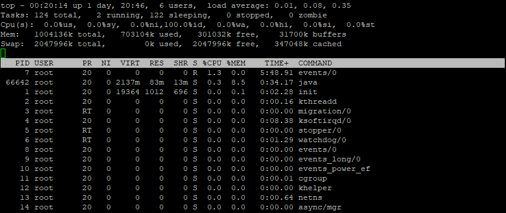
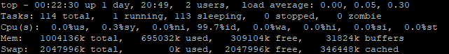
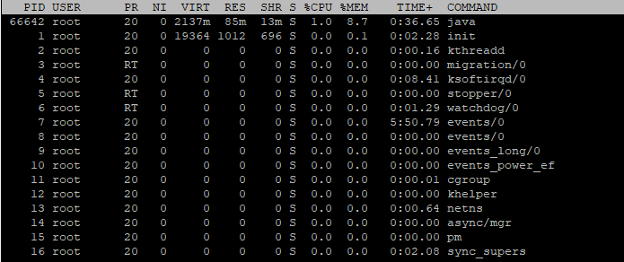
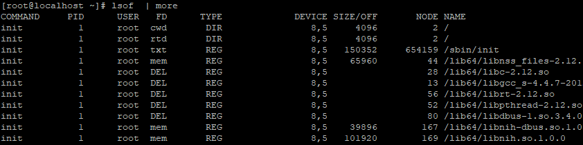

# top 命令

top命令是Linux下常用的性能分析工具，能够实时显示系统中各个进程的资源占用状况，类似于Windows的任务管理器。

## 1、top 命令显示的信息



### 1.1、统计信息区



前五行是系统的整体的统计信息

第一行是任务队列信息，同uptime命令的执行结果。

其内容如下：

```
00:22:30	# 当前时间
up 1 day	# 当前运行时间，格式为(时:分)
2 users		# 当前登录用户数
load average: 0.00, 0.05, 0.30	# 系统负载，即任务队列的平均长度；三个数值分别为 1分钟，5分钟，15分钟前到现在的平均值	
```

第二、三列为进程和CPU的信息，当有多个CPU时，这些内容可能会超过两行。

内容如下：

```
Tasks: 114 total		# 进程总数
		 1 running      # 正在运行的进程数
	   113 sleeping     # 睡眠的进程数
         0 stopped      # 停止的进程数
         0 zombie	    # 僵尸进程数
Cpu(s):
		0.0%us		# 用户空间占用CPU百分比
		0.3%sy		# 内核空间占用CPU百分比
		0.0%ni		# 用户进程空间内改变过优先级的进程占用CPU百分比
		99.7%id		# 空闲CPU百分比
		0.0%wa		# 等待输入输出的CPU时间百分比
		0.0%hi		# 硬中断(Hardware IRQ)占用CPU的百分比
		0.0%si		# 软中断(Software Interrupts)占用CPU的百分比
		0.0%st
```

最后两行为内存信息

内容如下：

```
Mem:   
	1004136k total	# 物理内存总量
	695528k used  	# 使用的物理内存总量
	308608k free    # 空闲内存总量	
	32556k buffers	# 用作内核缓存的内存量
Swap:  
	2047996k total	# 交换区总量        
	0k used			# 使用的交换区总量
	2047996k free	# 空闲交换区总量   
	346456k cached  # 缓冲的交换区总量
```

内存中的内容被换出到交换区，而后又被换入到内存，但使用过的交换区尚未被覆盖，该数值即为这些内容已存在于内存中的交换区的大小。

相应的内存再次被换出时可不必再对交换区写入。

### 1.2、进程信息区



统计信息区域的下方显示了各个进程的详细信息，首先来认识一下各列的含义。

| 序号 | 列名    | 含义                                                         |
| ---- | ------- | ------------------------------------------------------------ |
| a    | PID     | 进程id                                                       |
| b    | PPID    | 父进程id                                                     |
| c    | RUSER   | Real user name                                               |
| d    | UID     | 进程所有者的用户id                                           |
| e    | USER    | 进程所有者的用户名                                           |
| f    | GROUP   | 进程所有者的组名                                             |
| g    | TTY     | 启动进程的终端名。                                           |
| h    | PR      | 优先级                                                       |
| i    | NI      | nice值。负值表示高优化级，正值表示低优先级                   |
| j    | P       | 最后使用的CPU，仅在多CPU环境下有意义                         |
| k    | %CPU    | 上次更新到现在的CPU时间占用百分比                            |
| l    | TIME    | 进程使用的CPU时间总计，单位秒                                |
| m    | TIME+   | 进程使用的CPU时间总计，单位1/100秒                           |
| n    | %MEN    | 进程使用的物理内存百分式                                     |
| o    | VIRT    | 进程使用的虚拟内存中被换出的大小，单位kb                     |
| q    | RES     | 进程使用的未被换出的物理内存大小，单位kb。RES=CODE+DATA      |
| r    | CODE    | 可执行代码占用的物理内存大小，单位kb                         |
| s    | DATA    | 可执行代码以外的部分(数据段+栈)占用的物理内存大小，单位kb    |
| t    | SHR     | 共享内存大小，单位kb                                         |
| u    | nFLT    | 页面错误次数                                                 |
| v    | nDRT    | 最后一次写入到现在，被修改过的页面数                         |
| w    | S       | 进程状态。D=不可中断的睡眠状态 R=运行 S=睡眠 T=跟踪/停止 Z=僵尸进程 |
| x    | COMMAND | 命名名/命令行                                                |
| y    | WCHAN   | 若进程在睡眠，则显示睡眠中的系统函数名                       |
| z    | Flags   | 任务标志，参考sched.h                                        |

默认情况下仅显示比较重要的PID、USER、PR、NI、VIRT、RES、SHR、S、%CPU、%MEN、TIME+、COMMAND

#### 1、更改显示内容

通过 f 键可以选择显示的内容。

按 f 键之后会显示列的列表，按 a-z即可显示或隐藏对应的列，最后按回车键确定。

按 o 键可以改变列的显示顺序。

按小写的 a-z 可以将相应的列向右移动，而大写的A-Z 可以将相应的列向左移动。最后按回车键确定。

按大写的 F 或 O 键，然后按 a-z 可以将进程按照相应的列进行排序。而大写的R键可以将当前的排序倒转。

#### 2、命令使用

##### 2.1、使用格式

```
top [-] [d] [p] [q] [C] [S] [s] [n]
```

##### 2.1、参数说明

```
d	指定每两次屏幕信息刷新之间的时间间隔。当然用户可以使用s交互命令来改变之。
p	通过指定监控进程ID来仅仅监控某个进程的状态。
q	该选项将使top没有任何延迟的进行刷新。如果调用程序有超级用户权限，那么top将以尽可能高的优先级运行。
S	指定累计模式
s	使top命令在安全模式中运行。这将去除交互命令所带来的潜在危险。
i	使top不显示任何闲置或者僵死进程。
c	显示整个命令行而不只是显示命令名
```

#### 3、内部命令

在内部命令执行过程中可以使用的一些交互命令

这些命令都是单字母的，如果在命令行选项中使用了s选项，则可能其中一些命令会被屏蔽掉。

```
h	显示帮助画面，给出一些简短的命令总结说明。
k	终止一个进程。系统将提示用户输入需要终止的进程PID，以及需要发送给该进程什么样的信号。一般的终止进程可以使用15信号；如果不能正常结束那就使用信号9强制结束该进程。默认值是信号15。在安全模式中此命令被屏蔽。
i	忽略闲置和僵死进程。这是一个开关式命令。
q	退出程序
r	重新安排一个进程的优先级别。系统提示用户输入需要改变的进程PID以及需要设置的进程优先级值。输入一个正值将使优先级降低，反之则可以使该进程拥有更高的优先权。默认值是10。
S	切换到累计模式
s	改变两次刷新之间的延迟时间。系统将提示用户输入新的时间，单位为s。如果有小数，就换算成m s。输入0值则系统将不断刷新，默认值是5 s。需要注意的是如果设置太小的时间，很可能会引起不断刷新，从而根本来不及看清显示的情况，而且系统负载也会大大增加。
f/F	从当前显示中添加或者删除项目
o/O	改变显示项目的顺序
n	设置在进程列表所显示进程的数量
l	开启或关闭显示所有cpu使用详细情况(切换显示平均负载和启动时间信息)
m	关闭或开启第一部分第四行 Mem 和 第五行 Swap 信息的表示(切换显示内存信息)
t	关闭或开启第一部分第二行 Tasks 和第三行 Cpus 信息的表示(切换显示进程和CPU状态信息)
c	切换显示命令名称和完整命令行
N	以 PID 的大小的顺序排列表示进程列表
M	根据驻留内存大小进行排序
P	根据CPU使用百分比大小进行排序
T	根据时间/累计时间进行排序
W	将当前设置写入~/.toprc文件中。这是写top配置文件的推荐方法
```

# 查看端口是否占用

## 1、netstat

命令格式

```shell
[root@localhost ~]# netstat [-选项]
常用选项：
-a	(all)显示所有选项，netstat默认不显示LISTEN相关
-t	(tcp)仅显示tcp相关选项
-u	(udp)仅显示udp相关选项
-n	拒绝显示别名，能显示数字的全部转化成数字
-l	仅列出有在Listen(监听)的服务状态
-p	显示建立相关链接的程序名
-r	显示路由信息，路由表
-e	显示扩展信息，例如uid等
-s	按各个协议进行统计
-c	每隔一个固定时间，执行该netstat命令
```

```shell
# 查看端口号是否占用
[root@localhost ~]# netstat -anp | grep 端口号
#　查看当前已经使用的端口情况
[root@localhost ~]# netstat -nultp
```

## 2、lsof

lsof(list open files)是一个列出当前系统打开文件的工具。在linux环境下，任何事物都以文件的形式存在，通过文件不仅仅可以访问常规数据，还可以访问网络连接和硬件。所以如传输控制协议(TCP)和用户数据协议(UDP)套接字等，系统在r后台都为该应用程序分配了一个文件描述符，无论这个这个文件的本质如何，该文件描述符为应用程序与基础操作系统之间的交互提供了通用接口。因为应用程序打开文件的描述符列表提供了大量关于这个应用程序本身的信息，因此c通过losf工具能够查看这个列表对系统监测以及排错将很有帮助的。

### 2.1、输入信息含义



```shell
lsof输出各列信息的意义如下：
COMMAND：进程的名称 PID：进程标识符
USER：进程所有者
FD：文件描述符，应用程序通过文件描述符识别该文件。如cwd、txt等 TYPE：文件类型，如DIR、REG等
DEVICE：指定磁盘的名称
SIZE：文件的大小
NODE：索引节点（文件在磁盘上的标识）
NAME：打开文件的确切名称
FD 列中的文件描述符cwd 值表示应用程序的当前工作目录，这是该应用程序启动的目录，除非它本身对这个目录进行更改,txt 类型的文件是程序代码，如应用程序二进制文件本身或共享库，如上列表中显示的 /sbin/init 程序。
其次数值表示应用程序的文件描述符，这是打开该文件时返回的一个整数。如上的最后一行文件/dev/initctl，其文件描述符为 10。u 表示该文件被打开并处于读取/写入模式，而不是只读 ® 或只写 (w) 模式。同时还有大写 的W 表示该应用程序具有对整个文件的写锁。该文件描述符用于确保每次只能打开一个应用程序实例。初始打开每个应用程序时，都具有三个文件描述符，从 0 到 2，分别表示标准输入、输出和错误流。所以大多数应用程序所打开的文件的 FD 都是从 3 开始。
与 FD 列相比，Type 列则比较直观。文件和目录分别称为 REG 和 DIR。而CHR 和 BLK，分别表示字符和块设备；或者 UNIX、FIFO 和 IPv4，分别表示 UNIX 域套接字、先进先出 (FIFO) 队列和网际协议 (IP) 套接字。
```

### 2.2、常用参数

```shell
# lsof语法格式是 
[root@localhost ~]# lsof ［options］ filename
lsof abc.txt 显示开启文件abc.txt的进程 
lsof -c abc 显示abc进程现在打开的文件 
lsof -c -p 1234 列出进程号为1234的进程所打开的文件 
lsof -g gid 显示归属gid的进程情况 
lsof +d /usr/local/ 显示目录下被进程开启的文件 
lsof +D /usr/local/ 同上，但是会搜索目录下的目录，时间较长 
lsof -d 4 显示使用fd为4的进程 
lsof -i 用以显示符合条件的进程情况
```

### 2.3、lsof使用实例

```shell
# 列出所有打开的文件
[root@localhost ~]# lsof
# 查看谁正在使用某个文件
[root@localhost ~]# lsof   /filepath/file
# 递归查看某个目录的文件信息
[root@localhost ~]# lsof +D /filepath/filepath2/
# 比使用+D选项，遍历查看某个目录的所有文件信息 的方法
[root@localhost ~]# lsof | grep ‘/filepath/filepath2/’
 # 列出某个用户打开的文件信息
[root@localhost ~]# lsof  -u username
# 列出某个程序所打开的文件信息
[root@localhost ~]# lsof -c mysql
# 列出多个程序多打开的文件信息
[root@localhost ~]# lsof -c mysql -c apache
# 列出某个用户以及某个程序所打开的文件信息
[root@localhost ~]# lsof -u test -c mysql
# 列出除了某个用户外的被打开的文件信息
[root@localhost ~]# lsof -u ^root
# 通过某个进程号显示该进行打开的文件
[root@localhost ~]# lsof -p 1
# 列出多个进程号对应的文件信息
[root@localhost ~]# lsof -p 123,456,789
# 列出除了某个进程号，其他进程号所打开的文件信息
[root@localhost ~]# lsof -p ^1
# 列出所有的网络连接
[root@localhost ~]# lsof -i
# 列出所有tcp 网络连接信息
[root@localhost ~]# lsof  -i tcp
# 列出所有udp网络连接信息
[root@localhost ~]# lsof  -i udp
# 列出谁在使用某个端口
[root@localhost ~]# lsof -i :3306
# 列出谁在使用某个特定的udp端口
[root@localhost ~]# lsof -i udp:55
# 列出某个用户的所有活跃的网络端口
[root@localhost ~]# lsof  -a -u test -i
# 列出所有网络文件系统
[root@localhost ~]# lsof -N
# 域名socket文件
[root@localhost ~]# lsof -u
# 某个用户组所打开的文件信息
[root@localhost ~]# lsof -g 5555
# 根据文件描述列出对应的文件信息
[root@localhost ~]# lsof -d description(like 2)
# 根据文件描述范围列出文件信息
[root@localhost ~]# lsof -d 2-3
```

### 2.4、实用命令

```shell
lsof `which httpd` #那个进程在使用apache的可执行文件 
lsof /etc/passwd #那个进程在占用/etc/passwd 
lsof /dev/hda6 #那个进程在占用hda6 
lsof /dev/cdrom #那个进程在占用光驱 
lsof -c sendmail #查看sendmail进程的文件使用情况 
lsof -c courier -u ^zahn #显示出那些文件被以courier打头的进程打开，但是并不属于用户zahn 
lsof -p 30297 #显示那些文件被pid为30297的进程打开 
lsof -D /tmp #显示所有在/tmp文件夹中打开的instance和文件的进程。但是symbol文件并不在列
lsof -u1000 #查看uid是100的用户的进程的文件使用情况 
lsof -utony #查看用户tony的进程的文件使用情况 
lsof -u^tony #查看不是用户tony的进程的文件使用情况(^是取反的意思) 
lsof -i #显示所有打开的端口 
lsof -i:80 #显示所有打开80端口的进程 
lsof -i -U #显示所有打开的端口和UNIX domain文件 
lsof -i UDP@[url]www.akadia.com:123 #显示那些进程打开了到www.akadia.com的UDP的123(ntp)端口的链接 lsof -i tcp@ohaha.ks.edu.tw:ftp -r #不断查看目前ftp连接的情况(-r，lsof会永远不断的执行，直到收到中断信号,+r，lsof会一直执行，直到没有档案被显示,缺省是15s刷新) 
lsof -i tcp@ohaha.ks.edu.tw:ftp -n 
lsof -n #不将IP转换为hostname，缺省是不加上-n参数
```

