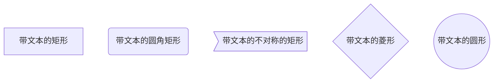
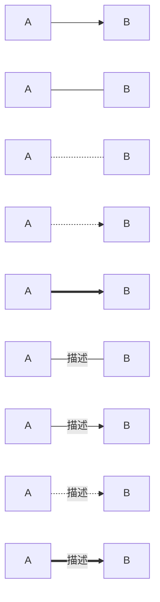
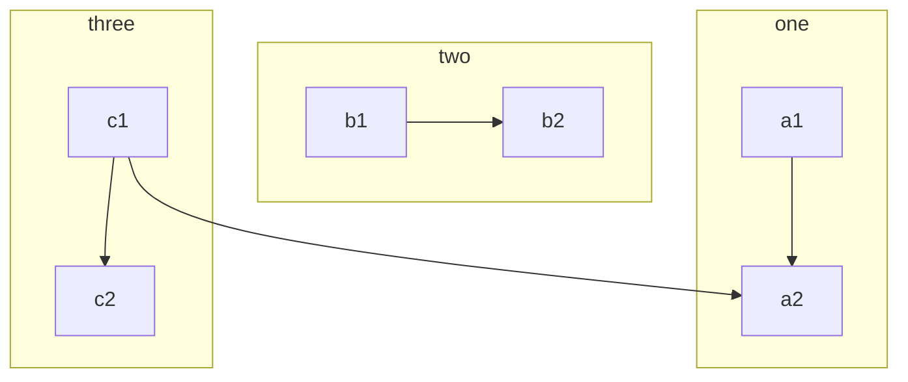
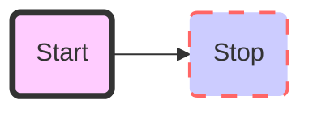
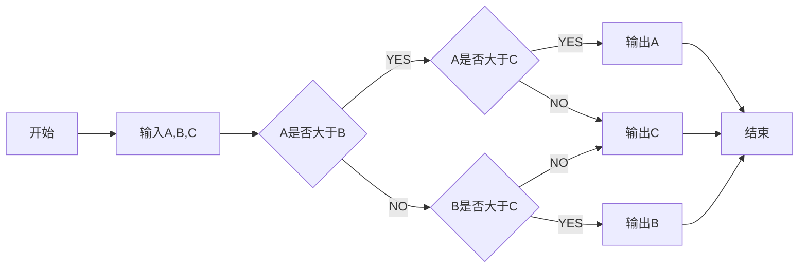

# 流程图
```
​```mermaid
	graph 流程图方向
	流程图的内容
​```
```

流程图方向有下面几个值：

- TB从上到下

- BT 从下到上

- RL 从右到左

- LR 从左到右

- TD 同TB

**基本图形**：



**节点之间的连接**：



**子流程图**



**自定义样式**



**demo**

绘制一个流程图,找出 A、 B、 C 三个数中最大的一个数。

