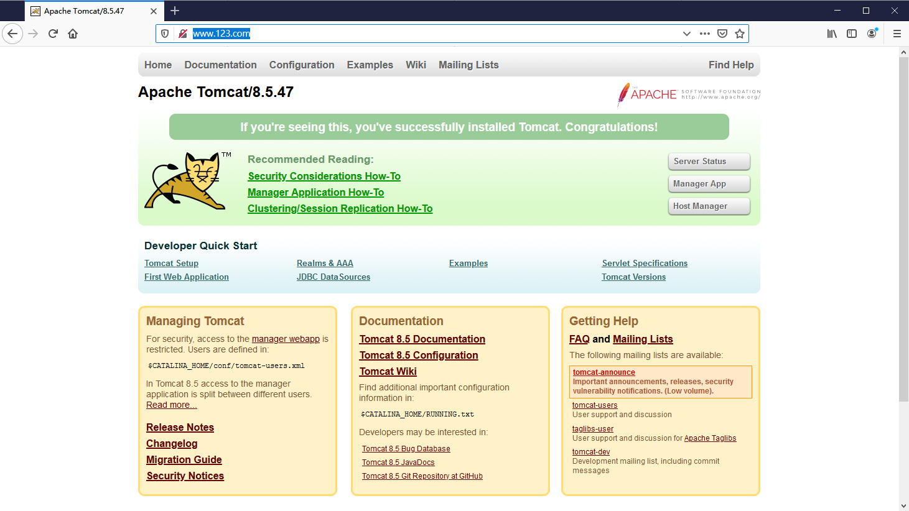

# 一、nginx简介

## 1.1、Nginx概述

Nginx（"engine x"）是一个高性能的 HTTP 和 反向代理服务器，特点是占有内容少，并发能力强，事实上nginx的并发能力确实在网页服务器中表现较好，中国大陆使用nginx网站用户有：百度、京东、新浪、网易、腾讯、淘宝等。

## 1.2、Nginx作为web服务器

Nginx可以作为静态页面的web服务器，同时还支持CGI协议的动态语言，比如prel、php等。但是不支持Java。Java程序只通过与Tomcat配合完成。Nginx专为性能优化而开发，性能是其最重要的考量，实现上非常注重效率，能经受高负载的考验，有报告表明能支持高达50,0000个并发连接数。

https://lnmp.org/nginx.html

## 1.3、正向代理

nginx不仅可以做反向代理，实现负载均衡。还能用作正向代理来进行上网等功能。

正向代理：如果把局域网外的Internet想象成一个巨大的资源库，则局域网中的客户端要访问Internet，则需要通过代理服务器来访问，这种代理服务器就称为正向代理。

## 1.4、反向代理

反向代理，其实客户端对代理是无感知的，因为客户端不需要任何配置就可以访问，我们只需要将请求发送到反向代理服务器，由反向代理服务器去选择目标服务器获取数据后，再返回给客户端，此时反向代理服务器和目标服务器对外就是一个服务器，暴露的是代理服务器地址，隐藏了真实服务器IP地址。

## 1.5、负载均衡

客户端发送多个请求到服务器，服务器处理请求，有一些可能要与数据库进行交互，服务器处理完毕后，再将结果返回给客户端。

这种架构模式对于早期的系统相对单一，并发请求相对较少的情况下是比较适合的，成本也低。但是随着信息数量的不断增长，访问量和数据量的飞速增长，以及系统业务的复杂度增加，这种架构会生成服务器响应客户端的请求日益缓慢，并发量特别大的时候，很容易生成服务器直接崩溃。很明显这是由于服务器性能的瓶颈生成的问题，那么如何解决这种情况呢？

我们首先想到的可能是升级服务器的配置，比如提高CPU执行频率，加大内存等提高机器的物理性能来解决此问题，但是我们知道摩尔定律的日益失效，硬件的性能提升已经不能满足日益提升的需求了。最明显的一个例子，天猫双十一当天，某个热销商品的瞬时访问量是极其庞大的，那么类似上面的系统架构，将机器都增加到现有的顶级物理配置，都是不能够满足需要的。那么怎么办呢？

上面的分析我们去掉了增加服务器物理配置来解决问题的办法，也就是说纵向解决问题的办法是行不通了，那么横向增加服务器的数量呢？这时候集群的概念产生了，单个服务器解决不了，我们增加服务器的数量，然后将请求分发到各个服务器上，将原先集中到单个服务器上的情况改为将请求分发到多个服务器上，将负载分发到不同的服务器，也就是我们所说的负载均衡。

## 1.6、动静分离

为了加快网站的解析速度，可以把动态页面和静态页面由不同的服务器来解析，加快解析速度。降低原来单个服务器的压力。

# 二、nginx安装，常用命令和配置文件

## 1、在Linux系统中安装nginx

省略（参考Linux软件安装）

```shell
# 查看开放的端口号
[root@localhost ~]# firewall-cmd --list-all
# 设置开放的端口号
[root@localhost ~]# firewall-cmd --add-service=http --permanent
[root@localhost ~]# firewall-cmd --add-port=80/tcp --permanent
# 重启防火墙
[root@localhost ~]# firewall-cmd --reload
```

## 2、nginx常用命令

```shell
# 使用nginx操作命令前提条件：必须进入 nginx 的 sbin 目录
[root@localhost ~]# cd /usr/local/nginx/sbin/
# 查看nginx版本号
[root@localhost ~]# /usr/local/nginx/sbin/nginx -v
# 启动nginx
[root@localhost ~]# /usr/local/nginx/sbin/nginx
# 关闭nginx
[root@localhost ~]# /usr/local/nginx/sbin/nginx -s stop
# 重新加载nginx
[root@localhost ~]# ps -ef|grep nginx -s reload
```

## 3、nginx配置文件

### 3.1、配置文件位置

```shell
[root@localhost ~]# /usr/local/nginx/conf/nginx.conf
```

### 3.2、配置文件组成

#### 3.2.1、nginx配置文件由三部分组成

##### 1、全局块

从配置文件开始到events块之间的内容，主要会设置一些影响nginx服务器整体运行的配置指令，主要包括配置运行nginx服务器的用户（级）、允许生成的worker process数据、进入PID存放路径、日志存入路径和类型以及配置文件的引入等。
第一行配置的：

```nginx
worker_processes  1;
```

这是nginx服务器并发处理服务的关键配置，worker_processes值越大，可以支持的并发处理量也越多，但是会受到硬件、软件等设备的制约。

##### 2、events块

```nginx
events {
    worker_connections  1024;
}
```

events块涉及的指令主要影响nginx服务器与用户的网络连接，常用的设置包括是否开户对多work process下的网络连接进行序列化，是否允许同时接收多个网络连接，选取哪种事件驱动模型来处理连接请求，每个work process可以同时支持的最大连接数等。

上述例子中就表示每个work process支持的最大连接数为1024

这部分的配置对Nginx的性能影响较大，在实际中应该灵活配置。

##### 3、http块

```nginx
http {
    include       mime.types;
    default_type  application/octet-stream;

    #log_format  main  '$remote_addr - $remote_user [$time_local] "$request" '
    #                  '$status $body_bytes_sent "$http_referer" '
    #                  '"$http_user_agent" "$http_x_forwarded_for"';

    #access_log  logs/access.log  main;

    sendfile        on;
    #tcp_nopush     on;

    #keepalive_timeout  0;
    keepalive_timeout  65;

    #gzip  on;

    server {
        listen       80;
        server_name  localhost;

        #charset koi8-r;

        #access_log  logs/host.access.log  main;

        location / {
            root   html;
            index  index.html index.htm;
        }

        #error_page  404              /404.html;

        # redirect server error pages to the static page /50x.html
        #
        error_page   500 502 503 504  /50x.html;
        location = /50x.html {
            root   html;
        }
    }
}
```

这算是nginx服务器配置中最频繁的部分，代理、缓存和日志定义等绝大多数据功能和第三方模块的配置都是在这里。

需要注意的是：http块也可以包括 **http 全局块**、**server 块**

###### 3.1、http 全局块

http全局块配置的指令包括文件引入、MIME-TYPE定义、日志自定义、连接超时时间、单链接请求数上限等。

###### 3.2、server 块

这块和虚拟主机有密切关系，虚拟主机从用户角度看，和一台独立的硬件主机是完全一样的，该技术的产生是为了节省互联网服务器硬件成本。

每个http块可以包括多个server块，而每个server块就相当于一个虚拟主机。

而每个server块也分为全局server块，以及可以同时包含多个location块

1. 全局server块
   配置最常见的配置是本虚拟主机的监听配置和本虚拟主机的名称或IP配置
2. location块
   一个server块可以配置多个location块。
   这块主要作用是基于Nginx服务器接收到请求字符串(例如：server_name/uri-string)，对虚拟主机名称(也可以是IP别名)之外的字符串，(例如：前面的/uri-string)进行匹配，对特定的请求进行处理。地址定向、数据缓存和应答控制等功能，还有许多第三方模块的配置也在这里进行。

# 三、nginx配置实例（1-反向代理）

## 1、反向代理实例1

### 1.1、实现效果

1. 打开浏览器，在浏览器地址栏输入地址：http://www.123.com，跳转到Linux系统Tomcat主页面中

### 1.2、准备工作

1. 在linux系统安装tomcat，使用默认端口8080

### 1.3、具体配置

1. 在windows系统的host文件进行域名和ip对应关系的配置

   ```hosts
   # hosts文件路径：C:\Windows\System32\drivers\etc\hosts
   # 在文件里增加以下内容
   192.168.156.61  www.123.com
   ```

2. 在nginx进行请求转发配置（反向代理配置）

   ```nginx
   worker_processes  1;
   
   events {
       worker_connections  1024;
   }
   
   http {
       include       mime.types;
       default_type  application/octet-stream;
       sendfile        on;
       keepalive_timeout  65;
   	
       server {
           listen       80;
           server_name  192.168.156.61;
   		
           location / {
               proxy_pass http://127.0.0.1:8080;
               index  index.html index.htm;
           }
   
       }
   }
   ```

3. 最终测试

   ```shell
   # 启动Tomcat
   [root@localhost ~]# /usr/local/apache-tomcat-8.5.47/bin/startup.sh && tailf /usr/local/apache-tomcat-8.5.47/logs/catalina.out
   # 重新加载nginx
   [root@localhost ~]# /usr/local/nginx/sbin/nginx -s reload
   # 访问址址：http://www.123.com/
   ```

   

## 2、反向代理实例2

### 2.1、实现效果

使用nginx反向代理，根据访问的路径跳转到不同端口的服务中

nginx监听端口为9001：

- 访问http://127.0.0.1:9001/edu/ 直接跳转到 127.0.0.1:8081
- 访问http://127.0.0.1:9001/vod/ 直接跳转到 127.0.0.1:8082

### 2.2、准备工作

1. 准备两个Tomcat 服务器，端口分别为8081、8082

2. 创建文件夹和测试页面

   ```shell
   # 8082 Tomcat下准备的测试页面
   [root@localhost webapps]# pwd
   /usr/local/apache-tomcat-8.5.47/8081/webapps
   [root@localhost webapps]# mkdir edu
   [root@localhost edu]# vi index.html
   <h1>8081</h1>
   # 访问地址：http://192.168.156.61:8081/edu/index.html
   
   # 8082 Tomcat下准备的测试页面
   [root@localhost webapps]# pwd
   /usr/local/apache-tomcat-8.5.47/8082/webapps
   [root@localhost webapps]# mkdir vod
   [root@localhost vod]# vi index.html
   <h1>8082</h1>
   # 访问地址：http://192.168.156.61:8082/vod/index.html
   ```

### 2.3、具体配置

在nginx配置文件中进行请求转发配置（反向代理配置）

```nginx
worker_processes  1;

events {
    worker_connections  1024;
}

http {
    include       mime.types;
    default_type  application/octet-stream;
    sendfile        on;
    keepalive_timeout  65;
		
	server {
        listen       9001;
        server_name  192.168.156.61;
		
        location ~ /edu/ {
            proxy_pass http://127.0.0.1:8081;
            index  index.html index.htm;
        }
		
		location ~ /vod/ {
            proxy_pass http://127.0.0.1:8082;
            index  index.html index.htm;
        }

    }
}

```

需要对外开放 9001 端口

测试地址：http://192.168.156.61:9001/edu/  http://192.168.156.61:9001/vod/

location 指令说明：

​	该指令用于匹配 URL。

​	语法如下：

```nginx
location [= | ~ | ~* | ^~] uri {
    
}
# =：用于不含正则表达式的uri前，要求请求字符串与 uri 严格匹配，如果匹配成功，就停止继续向下搜索并立即处理该请求
# ~：用于表示 uri 包含正则表达式，并且区分大小写
# ~*：用于表示 uri 包含正则表达式，并且不区分大小写
# ^~：用于不包含正则表达式的 uri 前，要求 nginx 服务器找到标识 uri 和请求字符串匹配度最高的 location 后，立即用此 location 处理请求，而不再使用 location 块中的正则 uri 和请求字符串做匹配
# 注意：如果 uri 包含正则表达式，则必须有 ~ 或 ~* 标识
```

# 四、nginx配置实例（2-负载均衡）

## 1、实现效果

1. 浏览器地址栏输入：http://192.168.156.61/edu/index.html，负载均衡效果，平均分配到8081、8082端口中

## 2、准备工作

1. 准备两个Tomcat 服务器，端口分别为8081、8082
2. 在两个Tomcat里的webapps目录中，创建名称是edu文件夹，在edu文件夹下创建index.html页面，用于测试

## 3、具体配置

在nginx配置文件中进行请求转发配置（负载均衡）

```nginx
worker_processes  1;

events {
    worker_connections  1024;
}


http {
    include       mime.types;
    default_type  application/octet-stream;
    sendfile        on;
    keepalive_timeout  65;
	
	upstream myserver {
		ip_hash;
		server 192.168.156.61:8081 weight=1;
		server 192.168.156.61:8082 weight=1;
	}
    server {
        listen       80;
        server_name  192.168.156.61;
		
        location / {
            proxy_pass http://myserver;
			proxy_connect_timeout 10;
            index  index.html index.htm;
        }

    }
}

```

测试地址：http://192.168.156.61/edu/index.html

Tomcat 8081、8082随便哪些停止服务都不影响访问

## 4、nginx提供了几种分配方式(策略)

### 4.1、轮询（默认）

每个请求按时间顺序逐一分配到不同的后端服务器，如果后端服务器down掉，能自动剔除

```nginx
upstream myserver {
    server 192.168.156.61:8081;
    server 192.168.156.61:8082;
}
```

### 4.2、weight

weight代表权重，默认为1，权重越高被分配的客户端越多

```nginx
upstream myserver {
    server 192.168.156.61:8081 weight=5;
    server 192.168.156.61:8082 weight=10;
}
```

### 4.3、ip_hash

每个请求按访问ip有hash结果分配，这样每个访客固定访问一个后端服务器，可以解决session的问题。

```nginx
upstream myserver {
    ip_hash;
    server 192.168.156.61:8081 weight=5;
    server 192.168.156.61:8082 weight=10;
}
```

### 4.4、fair（第三方）

按后面服务器的响应时间来分配请求，响应时间短的优先分配。

```nginx
upstream myserver {
    server 192.168.156.61:8081 weight=5;
    server 192.168.156.61:8082 weight=10;
    fair;
}
```

# 五、nginx配置实例（3-动静分离）

## 1、什么是动静分离

nginx动静分离简单来说就是把动态跟静态请求分开，不能理解成只是单纯的把动态页面和静态页面物理隔离。严格意义上说应该是动态请求跟静态请求分开，可以理解成使用 nginx 处理静态页面，Tomcat 处理动态页面。动静分离从目前实现角度来讲大致分为两种，一种纯粹把静态文件独立成单独的域名，放在独立的服务器上，也是目前主流推崇的方案；另外 一种方法就是动态跟静态文件混合在一起发布，通过nginx来分开。

通过 location 指定不同的后缀名实现不同的请求转发。通过 expires 参数设置，可以使浏览器缓存过期时间，减少与服务器之间的请求和流量。具体 Expires 定义：是给一个资源设定一个过期时间，也就是说无需去服务端验证，直接通过浏览器自身确认是否过期即可，所以不会产生额外的流量。此种方法非常适合不经常变动的资源。（如果经常更新的文件，不建议使用 Expires 来缓存），这里设置3d，表示在这3天之内访问这个URL，发送一个请求，比对服务器该文件最后更新时间没有变化 ，则不会从服务器抓取，返回状态码304，如果有修改，则直接从服务器重新下载，返回状态码 200。

## 2、准备工作

1. 在linux系统中准备静态资源，用于进行访问
   /data/www/a.html
   /data/images/header.jpg

## 3、具体配置

 在nginx配置文件中进行配置

```nginx
worker_processes  1;

events {
    worker_connections  1024;
}

http {
    include       mime.types;
    default_type  application/octet-stream;
    sendfile        on;
    keepalive_timeout  65;
	
    server {
        listen       80;
        server_name  192.168.156.61;
		
        location /www/ {
            root /data/;
            index  index.html index.htm;
        }
		
        location /images/ {
            root /data/;
            autoindex on;
        }
    }
	
}

```

## 4、测试

1. 在浏览器中输入地址：http://192.168.156.61/images/header.jpg
   因为配置了 autoindex on; 列出当前文件夹内容：
   
2. 在浏览器中输入地址：http://192.168.156.61/www/a.html

# 六、nginx配置高可用集群

## 1、配置高可用的准备工作

1. 需要两台nginx服务器（192.168.156.61、192.168.156.62）
2. 在两台服务器安装nginx
3. 在两台服务器安装keepalived
4. 需要虚拟ip

## 2、在两台服务器安装keepalived

省略（参考Linux软件安装）

安装之后，配置文件在/etc/keepalived/keepalived.conf

## 3、完成高可用配置（主从配置）

### 3.1、192.168.156.61（主配置）

```shell
[root@localhost ~]# vi /etc/hosts
127.0.0.1 LVS_DEVEL
```

/etc/keepalived/keepalived.conf

```
global_defs {
   notification_email {
     acassen@firewall.loc
     failover@firewall.loc
     sysadmin@firewall.loc
   }
   notification_email_from Alexandre.Cassen@firewall.loc
   smtp_server 192.168.156.61
   smtp_connect_timeout 30
   router_id LVS_DEVEL # 访问到主机 /etc/hosts 里配置 127.0.0.1 LVS_DEVEL
}

vrrp_script chk_http_port {
	script "/root/nginx_check.sh"
	interval 2 # 检测脚本执行的间隔
	weight 2 # 权重
}

vrrp_instance VI_1 {
    state MASTER # 备份服务器上将 MASTER 改为 BACKUP
    interface ens33 # 网卡
    virtual_router_id 51 # 主、备机的virtual_router_id必须相同
    priority 100 # 主、备机取不同的优先级，主机值较大，备份机值较小
    advert_int 1
    authentication {
        auth_type PASS
        auth_pass 1111
    }
    virtual_ipaddress {
        192.168.156.63 // VRRP H虚拟地址
    }
    track_script {
    	chk_http_port # 执行脚本
    }
}
```

检测脚本/root/nginx_check.sh

```shell
#!/bin/bash
A=`ps -C nginx --no-header | wc -l`
if [ $A -eq 0 ];then
  /usr/local/nginx/sbin/nginx
  sleep 2
  if [ `ps -C nginx --no-header | wc -l` -eq 0 ];then
    killall keepalived
  fi
fi

```

```shell
[root@localhost ~]# chmod +x nginx_check.sh
```

### 3.2、192.168.156.62（从配置）

```shell
[root@localhost ~]# vi /etc/hosts
127.0.0.1 LVS_DEVEL
```

/etc/keepalived/keepalived.conf

```
global_defs {
   notification_email {
     acassen@firewall.loc
     failover@firewall.loc
     sysadmin@firewall.loc
   }
   notification_email_from Alexandre.Cassen@firewall.loc
   smtp_server 192.168.156.62
   smtp_connect_timeout 30
   router_id LVS_DEVEL # 访问到主机 /etc/hosts 里配置 127.0.0.1 LVS_DEVEL
}

vrrp_script chk_http_port {
	script "/root/nginx_check.sh"
	interval 2 # 检测脚本执行的间隔
	weight 2 # 权重
}

vrrp_instance VI_1 {
    state BACKUP # 备份服务器上将 MASTER 改为 BACKUP
    interface ens33 # 网卡
    virtual_router_id 51 # 主、备机的virtual_router_id必须相同
    priority 90 # 主、备机取不同的优先级，主机值较大，备份机值较小
    advert_int 1
    authentication {
        auth_type PASS
        auth_pass 1111
    }
    virtual_ipaddress {
        192.168.156.63 // VRRP H虚拟地址
    }
    track_script {
    	chk_http_port # 执行脚本
    }
}
```

检测脚本/root/nginx_check.sh，检查nginx是不down掉，如果down掉自动重启

```shell
#!/bin/bash
A=`ps -C nginx --no-header | wc -l`
if [ $A -eq 0 ];then
  /usr/local/nginx/sbin/nginx
  sleep 2
  if [ `ps -C nginx --no-header | wc -l` -eq 0 ];then
    killall keepalived
  fi
fi
```

```shell
[root@localhost ~]# chmod +x nginx_check.sh
```

### 3.3、把两台服务器 上nginx 和 keepalived 启动

```shell
[root@localhost ~]# systemctl restart keepalived
[root@localhost ~]# /usr/local/nginx/sbin/nginx
```

### 3.4、最终测试

在地址输入：http://192.168.156.63

可来回关闭主从测试

