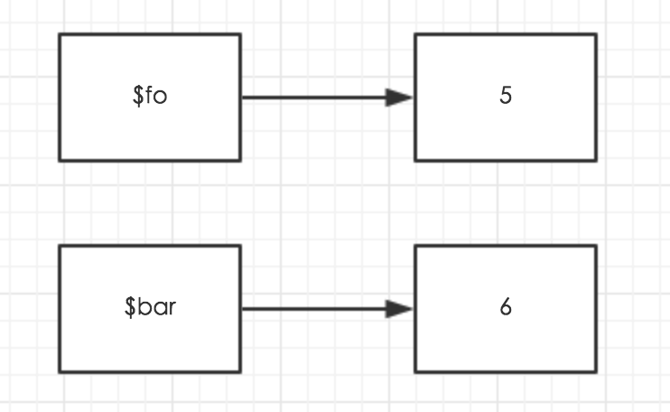
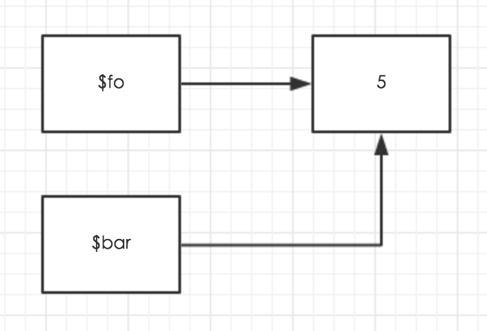
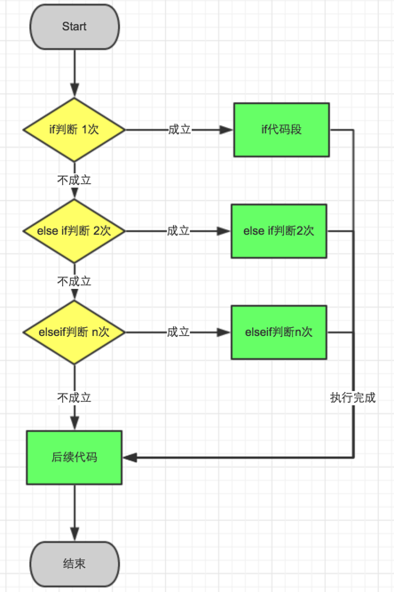
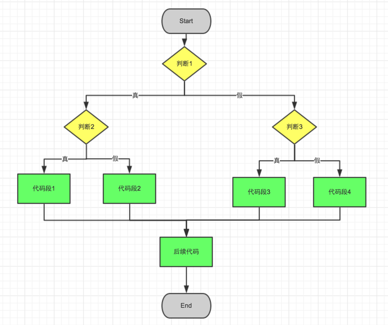
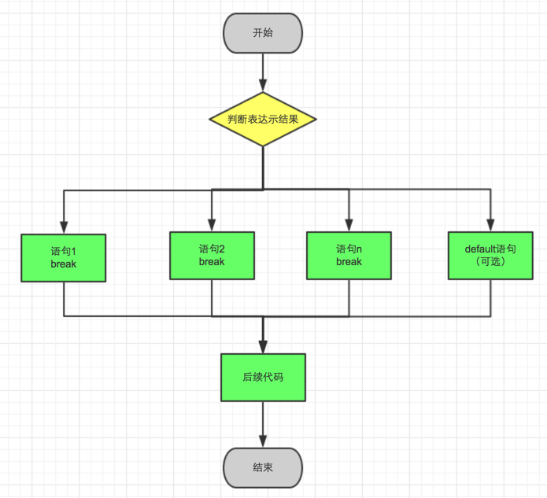
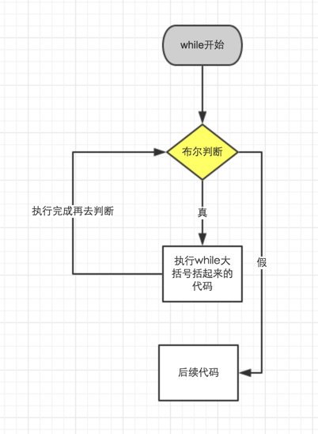
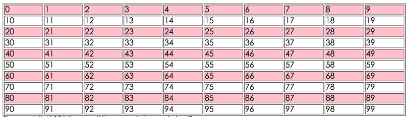

# 注释

```php
// 单行注释
# 单选注释
/*
多行注释
*/
```

# 数据类型

## 1、整型(integer)

```php
<?php
    $i = 10;
?>
```

## 2、布尔型(bool)

```php
<?php
    // 1为true，0为false
    $bool = false;
	var_dump($bool); // bool(true)
?>
```

## 3、字符串(string)

```php
<?php
    $str1 = '字符串1';
	$str2 = "字符串2";
	# 字界符声明字符串，比如"hello"为字界符，第一个"hello"不能有空格，第二个"hello"一定要顶格写！
    $str3 =<<<hello
	字界符声明字符串
hello;
?>
```

单引号和双引号的区别：

1. 双引号解析变量，但是单引号不解析变量

2. 在双引号里面插入变量，变量后面如果有英文和中文字符，它会把这个字符和变量拼接起来，视为一整个变量。一定要在变量最后面接上特殊字符，例如空格等分开。

3. 如果双引号里面插变量的时候，后面不想有空格，可以拿大括号将变量包起来。


```php
<?php 
    $name = '赵志成';
	$str3 = "${name}18岁";
	echo $str3;
?>
```

4. 双引号解析转义字符，单引号不解析转义字符。但，单引号能解析\‘和\

5. 单引号效率高于双引号，尽可能使用单引号

6. 双引号和单引号可以互插，双引号当中插入单引号，单引号当中插入变量，这个变量会被解析。

7. 神奇的字符串拼接胶水——(.)点，来用拼接字符串。

```php
<?php 
    $name = '赵志成';
	$str3 = "${name}18岁".'是个PHP程序员';
	echo $str3;
?>
```

8. 将定界符声明字符视为双引号一样的功能来看待。

## 4、浮点型(float)

```php
<?php
    # 普通声明
    $f = 3.1415926;
	var_dump($f); // float(3.1415926)
	// var_dump()是一个函数，向括号()中间插入y变量。这个函数，会印出来数据类型，还会对应显示变量的长度和值。
?>
```

## 5、NULL

```php
<?php
	$n = null;
	var_dump($n); // NULL
?>
```

主要有以下三种情况会产生null类型：

1. 通过变量赋值明确指定为变量的值为NULL
2. 一个变量没有给任何值
3. 使用函数unset()将变量销毁掉

```php
<?php
	$apple = null;
	# empty()可以向括号中间传入一个变量。这个变量的值如果为false或者为null的话，返回true
	if (empty($apple)) {
        
    }

	# isset()可以向括号中间传入一个或者多个变量，变量与变量间用逗号分开。只要有有一个变量为null，则返回false，否则，则返回true。

	# unset()这个函数的功能是毁掉变量。unset(变量)括号中间插入想要毁掉的变量名，这个变量就会被毁掉。
?>
```

## 6、数组(array)

```php
<?php
	$array = array('name'=>'zhicheng','age'=>18);
	var_dump($array);// array(2) { ["name"]=> string(8) "zhicheng" ["age"]=> int(18) }
?>
```

## 7、资源类型(resource)

## 8、数据类型查看判断

**查看数据类型**

```php
<?php
	// gettype(传入一个变量)能够获得变量的类型
    // var_dump(传入一个变量)输入变量类型和值
?>
```

**判断数据类型**

```php
is_int 是否为整型
is_bool 是否为布尔
is_float 是否是浮点
is_string 是否是字符串
is_array 是否是数组
is_object 是否是对象
is_null 是否为空
is_resource 是否为资源
is_scalar 是否为标量
is_numeric 是否为数值类型
is_callable 是否为函数
```

变量：整型(int)、浮点(float)、布尔(bool)、字符串(string)

混合类型：数组(array)、对象(object)

特殊类型：空(null)、资源(resource)、回调(callback)

## 9、数据类型自动转换和强制转换

**布尔值的自动类型转换**

自动类型转换，就是数据类型在某些情况下，自动会变为其他的类型参与运算。自动类型转换的发生时机是：运算和判断的时候某些值会自动进行转换。

下面的情况是**布尔值判断时的自动类型转换**：

1. 整型的0为假，其他整型值全为真
```php
<?php
	$bool = 0;
?>
```
2.  浮点的0.0，布尔值的假。小数点后只要有一个非零的数值即为真。
```php
<?php
	$bool = 0.0;
?>
```
3. 空字符串为假，只要里面有一个空格都算真。
```php
<?php
	$str = '';
?>
```
4. 字符串的0，也将其看作是假。其他的都为真
```php
<?php
	$str = '0';
?>
```
5. 空数组也将其视为假，只要里面有一个值，就为真。
```php
<?php
	$arr = array();
?>
```
6. 空也为假
```php
<?php
	$bool = null;
?>
```
7.  未声明成功的资源也为假
```php
<?php
	$res = fopen('adasfasfasfdsa.txt','r');
?>
```
**其他类型的自动类型转换**

```php
<?php
    // 布尔变整型参与运算
	$bool = true;
	$result = $bool + 10;
	echo $result; // 11
	// 布尔值的true参与运算是会变成整型或者浮点的1布尔值的false参与运算是会变成整型或者浮点的0字符串开始处是整型或浮点类型的字符，会转成对应的类型参与运算	

	// 字符串类型
	$str = '419不要爱';
	$result = $str + 1;
	echo $result; // 420
	
	$str = '不要爱419';
	$result = $str + 1;
	echo $result; // 1
	
?>
```

强制类型转换有三种方式：

1. 用后面的三个函数可以完成类型转换，intval()、floatval()、strval()
```php
<?php
	$float = 1.23;
    $result = intval($float);
	var_dump($result); // int(1)

	$int = 5;
    $result = floatval($float);
	var_dump($result); // float(1.23)

	$int = 23;
    $result = strval($float);
	var_dump($result); // string(4) "1.23"
?>
```
2. 变量前加上()里面写上类型，将它转换后赋值给其他变量
```php
<?php
	// 定义一个变量，我们来变化一下试试
	$transfer = 12.8;
	// 把浮点变为整型
    $jieguo = (int)$transfer;
    var_dump($jieguo); // int(12)
	// 把浮点变为布尔
	$jieguo = (bool) $transfer;
	var_dump($jieguo); // bool(true)
	// 把布尔变整型
	$bool = true;
	$jieguo = (int)$bool;
	var_dump($jieguo); // int(1)
	// 把浮点变数组
	$fo = 250;
	$jieguo = (array)$fo;
   	var_dump($jieguo); // array(1) { [0]=> int(250) }
?>
```
3. settype(变量，类型) 直接改变量本身
```php
<?php
	// 定义浮点变为整型
    $float = 250.18;
	// settype第二个参数是int
    settype($float,'int');
    // 输出看看结果
    var_dump($float); // int(250)
?>
```

## 10、对象

## 11、常量

```php
<?php
	// define(常量名, 常量值)
    defind('MY_NAME', 'zhicheng');
	// 调用方式
	echo 'my name is '.MY_NAME;
?>
```

注：

1. 常量名可以小写，但是通常大写
2. 常量名可以不加引号，但是通常加上引号
3. 在字符串中调用常量的时候，必须在引号外面
4. 常量名建议只用字母和下划线

**内置常量**

| 常量名      | 说明                           |
| ----------- | ------------------------------ |
| LINE        | 当前所在的行                   |
| FILE        | 当前文件在服务器的路径         |
| FUNCTION    | 当前函数名                     |
| CLASS       | 当前类名                       |
| METHOD      | 当前成员方法名                 |
| PHP_OS      | PHP运行的操作系统              |
| PHP_VERSION | 当前PHP的版本                  |
| TRAIT       | Trait的名字，php5.4新加        |
| DIR         | 文件所在目录                   |
| NAMESPACE   | 当前命名空间的名称(区分大小写) |

## 12、可变变量

```php
<?php
	// 定义一个变量叫作 $shu
	$shu = 'biao';
	// 定义一个【变量】$biao
	$biao = '鼠标';
	// $$shu 就是可变变量，在已声明的变量$shu前又加上了一个变量符
	echo $$shu; // 鼠标
/*
变形过程：
$$shu
${$shu}分成两块来看
${'biao'}把变量$shu解释成了biao
$biao而$biao也是一个变量对应的值是：鼠标
*/
?>
```

## 13、外部变量

user.html
```html
<html>
    <head>     
    </head>
    <body>
        <form action="reg.php" method="get">
            <input type="text" name="username" />
            <input type="passsword" name="pwd" />
            <input type="submit" value="提交" />
        </form>
    </body>
<html>
```
```php
<?php
    // $_GET后面加上中括号，将username作为字符串放在中括号里面，就等到了表单里面的<input type="text" name="username" />的值
	var_dump($_GET['username']);
?>
```
```html
<html>
    <head>     
    </head>
    <body>
        <form action="reg.php" method="post">
            <input type="text" name="username" />
            <input type="passsword" name="pwd" />
            <input type="submit" value="提交" />
        </form>
    </body>
<html>
```
```php
<?php
    // $_POST后面加上中括号，将username作为字符串放在中括号里面，就等到了表单里面的<input type="text" name="username" />的值
	var_dump($_POST['username']);

	// 可把$_GET、$_POST改为$_REQUEST
	// $_REQUEST既可以接收get传值也可以接收post传值
?>
```
外部变量
| 全局变量  | 功能说明                                      |
| --------- | --------------------------------------------- |
| $_COOKIE  | 得到会话控制中的cookie传值                    |
| $_SESSION | 得到会话控制中的session的值                   |
| $_FILES   | 得到文件上传的结果                            |
| $_GET     | 得到get传值的结果                             |
| $_POST    | 得到post传值的结果                            |
| $_REQUEST | 既能得到get的传值结果，也能得到post传值的结果 |
## 14、环境变量
```php
<?php
    // 查看环境变量
    phpinfo();
?>    
```

常用的环境变量的键名和值对应的意思：

| 键名                          | 含义                                   |
| ----------------------------- | -------------------------------------- |
| $_SERVER['REQUEST_METHOD']    | 请求当前PHP页面的方法                  |
| $_SERVER['REQUEST_URI']       | 请求的URI                              |
| $_SERVER['SERVER_SOFTWARE']   | 用的是哪一种服务器                     |
| $_SERVER['SERVER_ADDR']       | 客户的IP地址                           |
| $_SERVER['SCRIPT_FILENAME']   | 当前请求文件的路径                     |
| $_SERVER['HTTP_USER_AGENT']   | 当前访问这个网址的电脑和浏览器的情况   |
| $_SERVER['HTTP_USER_REFERER'] | 上级来源(用户从哪个地址进入当前页面的) |
| $_SERVER['REQUEST_TIME']      | 当前的时间                             |
URI和URL都是网址，但是URL带有主机地址部份，而URI不带主机地址部份，例如：

http://www.zhicheng.com/abc.php?username=zhicheng 上面是一个URL(统一资源定位符)，而URI是不带主机和(http://)

协议的部分：abc.php?username=php

## 15、变量引用

```php
<?php
	$fo = 5;
	//$fo的值为5，将5赋值
	$bar = $fo;
	//$bar的值原来为5，现在将值改为6
	$bar = 6;
	//$bar的结果为6
	echo $bar.'<br />';
	//$fo的结果为5
	echo $fo.'<br />';

	$fo = 5;
	//注意，加上了一个&符哟
	$bar = &$fo;

	$bar = 6;
	//$bar的结果为6
	echo $bar.'<br />';
	//$fo的结果为6
	echo $fo.'<br />';
?>
```
一个变量名，对应了一个数据值。如下图：


而加上&（and 符后），把变量指向同一个存值空间了，如下图：


# 流程控制

## 1、if & else

```php
<?php
	$pao = true;
	if ($pao) {
       echo '1' 
    } else {
        echo '0'
    }
?>
```

## 2、if...else...elseif

```php
if（判断语句1）{
    执行语句体1
} elseif (判断语句2) {
    执行语句体2
} else if (判断语句n) {
        执行语句体n
} else {
        最后的else语句可选
}
```

上述结构表示：
如果判断语句1的值为真，则执行语句体 1。执行完成后进入后续代码段。
否则转入后面的判断语句2（elsif），判断语句2若为真，则执行语句体 2。
否则转入后面的判断语句n（elsif），判断语句2若为真，则执行语句体 n。
如果均不匹配则执行else语句。这种循环嵌套可以不含else语句，即只含有if、elseif语句。
注：elseif()也可以写成else if()

把上面的代码用流程图的形式表示清楚就如下图了：



## 3、if语句多种嵌套

```php
if (判断1) {
    if (判断2) {
		代码段 1    
    } else {
		代码段2
	}
} else {
	if (判断3) {
        代码段3
	} else {
		代码段4
	}
}
```
用流程图来表示如下：


## 4、switch

```php
switch (变量) {    //字符串，整型
	case 具体值:
		执行代码;
		break;
	case 具体值2：
		执行代码2;
		break;
	case 具体值3：
		执行代码3;
		break;
	default:
}
```

用流程图来表示的话结果就如下图所示：


```php
<?php
	// 生成0-9的随机数
	$i = rand(0, 9);
	// 得到今天是星期几的英文简称
	$d = date('D');
	echo $i;
	echo '<br>';
	echo $d;
?>
```

## 5、while
while循环补一段专门的代码逻辑图：


用while循环实现下图效果：


```php
<?php
	$i = 0;
	echo '<table border="1">';
	while ($i <100) {
		// 0 - 9 为一行
        // 10 -19 为一行
		if ($i % 10 == 0) {
			// 为了隔行变色，每20，40，60每行的颜色不同的，因此再进行一次取余运算
			if ($i % 20 == 0) {
				echo '<tr bgcolor="pink">';
			} else {
				echo '<tr>';
			}
		}
		echo '<td>'.$i.'</td>';
		$i++;
		// 同理，每一行结束应该有一个</tr>结束标签
		if ($i % 10 == 0) {
			echo '</tr>';
		}
	}
	echo '</table>';
?>
```

## 6、do...while

```php
do {
   //代码块
} while (判断);
```

## 7、for

```php
for (表达示1; 表达示2; 表达示3){
	需要执行的代码段
}
```

| 语句     | 作用                               |
| -------- | ---------------------------------- |
| exit     | 从当前处停止持续执行               |
| break    | 跳出循环或者跳出结构体执行后续代码 |
| continue | 跳出此次循环，下次循环继续         |

## 8、goto

```php
<?php
	goto wan;
	echo '天王盖地虎';

	wan:
	echo '小鸡炖蘑菇';

	// 程序执行，最后输出：小鸡炖蘑菇
?>
```
```php
<?php
	// goto 跳轩循环
	for ($i=1; $i <= 100; $i++) {
		echo $i.'只羊<br>';
		if ($i == 20) {
			goto end;
		}
	}

	end:
	echo '睡着了....';
?>
```
# 基础语法

## 1、运算符与算术运算

| 符号 | 说明 | 举例 |
| ---- | ---- | ---- |
| +    | 加号 | $x + $y |
| -    | 减号   | $x - $y |
| *    | 乘号，乘以     | $x * $y |
| /    |    除号，除以  | $x / $y |
| %    |  取余也叫取模，求模    | $x % $y |

## 2、自加、自减运算

| 符号 | 说明       |
| ---- | ---------- |
| $x++ | 先赋值后加 |
| $x-- | 先赋值后减 |
| ++$x | 先加后赋值 |
| --$x | 行减后赋值 |

## 3、赋值运算

| 符号 | 举例     | 等价式       |
| ---- | -------- | ------------ |
| +=   | $x += $y | $x = $x + $y |
| -=   | $x -= $y | $x = $x - $y |
| *=   | $x *= $y | $x = $x * $y |
| /=   | $x /= $y | $x = $x / $y |
| %=   | $x %= $y | $x = $x % $y |
| .=   | $x .= $y | $x = $x . $y |

## 4、比较运算符

| 说明                   | 符号                                |
| ---------------------- | ----------------------------------- |
| 大于                   | >                                   |
| 小于                   | <                                   |
| 大于等于               | >=                                  |
| 小于等于               | <=                                  |
| 不等于                 | !=                                  |
| 等于                   | `==`(赋值是=号，所以`==`规定为等于) |
| 全等于(判断类型等于)   | ===                                 |
| 全不等(判断类型不等于) | !==                                 |

## 5、逻辑运算符

| 举例       | 说明             | 详细说明                              |
| ---------- | ---------------- | ------------------------------------- |
| $x and $y  | 逻辑与(并且关系) | $x 和 $y 为真则返回真                 |
| $x && $y   |                  |                                       |
| $x or $y   | 逻辑或           | $x，$y均为false时为假，其他情况全为真 |
| $x \|\| $y |                  |                                       |
| !$x        | 逻辑非           | 取反，即true变为false，false变为treu  |
| $x xor $y  | 逻辑异或         | 相同取false，相异为true               |

## 6、位运算

| 举例     | 说明          | 详细说明                                               |
| -------- | ------------- | ------------------------------------------------------ |
| $a & $b  | And(按位与)   | 将把 $a 和 $b 中都为 1 的位设为 1                      |
| $a \| $b | Or(按位或)    | 将把 $a 和 $b 中任何一个为 1 的位设为 1                |
| $a ^ $b  | Xor(按位异或) | 将把 $a 和 $b 中一个为 1 另一个为 0 的位设为 1         |
| ~$a      | Not(按位取反) | 将 $a 中为 0 的位设为 1，反之亦然                      |
| $a << $b | 左移          | 将 $a 中的位向左移动 $b 次（每一次移动都表示“乘以 2”） |
| $a >> $b | 右移          | 将 $a 中的位向右移动 $b 次（每一次移动都表示“除以 2”） |

## 7、三元运算符和其他运算符

| 符号                     | 说明                                                         |
| ------------------------ | ------------------------------------------------------------ |
| $x ? 真代码段 : 假代码段 | 判断是否为真假 ? 真情况 : 假情况;                            |
| ``（反引号）             | 反引号中间插代命令，执行系统命令，等价于shell_exec函数       |
| @                        | 单行抑制错误，把这一行的错误不让它显示出来了，效率低不建议使用 |
| =>                       | 数组下标访问符                                               |
| ->                       | 对象访问符                                                   |
| instanceof               | 判断某个对象是否来自某个类，如果是的返回true，如果不是返回false |

# 函数基本语法

## 1、自定义函数

```php
function 函数名([参数名1[=值1], 参数名2[=值2], 参数名n[=值n]]) {
       函数中的功能体
    [return 返回值]
}
```

特点：

​    1.函数以function开始

​    2.function后面接空格，空格后接函数名

​    3.函数名与变量命名规则基本一样，但是不同的是：函数名不区分大小写

​    4.所谓参数其实就是变量

​    5.函数名后接括号，括号内跟参数，参数全都有[]（中括号）括起来了，代表参数可填可不填

​    6.如果有参数的话，参数后可以接（＝）等号，等号接默认值。参数值也是用[]（中括号）括起来的，代表选填

​    7.函数后的参数变量，主要功能是把函数体外的变量值，传入函数体内来使用，函数体的变量和函数体外的变量通常是两个不同的变量。

​    8.函数中的具体功能（功能体）用大括号括起来，代表这是一个函数的功能区间

​    9.函数可以有返回值也可以没有返回值，用[]（中括号）括起来的，代表选填。

​    10.return后接空格，空格后接返回值，若有return,return后的代码均不执行。

​    11.函数的执行没有顺序关系，可以在定义处之前的位置调用

​    12.函数不能被定义两次，即函数不能被重载

```php
<?php
	//定义一条函数狗
	function php_cn(){

		$foo = 5;

		$bar = 6;

		$result = $foo + $bar;
		//将$result的结果进行返回
		return $result;
	}

	//调用php_cn()这个函数，$foo和$bar相加的$result就会返回回来给到变量$piao
	$piao = php_cn();

	//输出$piao的结果，果真为11
	echo $piao;
?>
```

## 2、回调函数

```php
<?php
function woziji($one,$two,$func){
	//规定：检查$func是否是函数，如果不是函数停止执行本段代码，返回false
	if(!is_callable($func)){
		return false;
	}

	//把$one、$two相加，再把$one和$two传入$func这个函数中处理一次
	//$func是一个变量函数，参见变量函数这一章
	echo $one + $two + $func($one,$two);

}

//定义几个函数试试
function plusx2( $foo , $bar){
	$result = ($foo+$bar)*2;
	return $result;
}

function jian( $x , $y ){
   $result = $x - $y;
   return $result;
}

//调用一下函数，woziji，向里面传入参数试试
echo woziji(20,10,'plusx2');

echo '<br>';

//将plusx2改成jian试试结果
echo woziji(20,10,'jian');

?>
```

## 3、变量函数

```php
<?php
function demo(){
	echo '天王盖地虎';
}

function test(){
	echo '小鸡炖蘑菇';
}

$fu = 'demo';
//把$fu变为了demo,把demo后加上了一个括号，就执行函数了
$fu();

?>
```

## 4、匿名函数

**变量函数式的匿名函数**：

```php
<?php
$greet = function($name) {
	echo $name.'，你好';
};
$greet('明天');
?>
```

**回调式的匿名函数**：
```php
<?php
function woziji($one,$two,$func){
	//规定：检查$func是否是函数，如果不是函数停止执行本段代码，返回false
	if(!is_callable($func)){
		return false;
	}

	//把$one、$two相加，再把$one和$two传入$func这个函数中处理一次
	//$func是一个变量函数，参见变量函数这一章
	echo $one + $two + $func($one,$two);
}

woziji(20,30,function( $foo , $bar){
		$result = ($foo+$bar)*2;
		return $result;
	}
);
?>
```

## 5、内部函数
```php
<?php
function foo() {
	echo '我是函数foo哟，调一下我才会执行定义函数bar的过程<br />';
	function bar()	{
		echo '在foo函数内部有个函数叫bar函数<br />';
	}
}

// 现在还不能调用bar()函数，因为它还不存在
// bar();

foo();
//现在可以调用bar()函数了，因为foo()函数的执行使得bar()函数变为已定义的函数
bar();

//再调一次foo()会报错
//foo();

?>
```
注意事项：
1. 内部函数名，不能是已存在的函数名
2. 假设在函数a里面定义了一个内部函数，不能定用两次函数a

## 6、变作作用域

### 6.1、通过$GLOBLAS来读取外部变量

```php
<?php
$one = 10;
function demo(){
   $two = 100;
   $result = $two + $GLOBALS['one'];
   return $result;
}
//你会发现结果变成了110
echo demo();
?>
```

### 6.2、通过$GLOBLAS，在函数内修改外部变量

```php
<?php
$hongniu = '我是一个兵，来自老百姓';
function test(){
   echo '执行了函数test哟<br />';
   //调用test()函数，将通过$GLOBALS['hongniu'],把$hongniu的值改变掉
   $GLOBALS['hongniu'] = '帮助别人很快乐';
}

test();
//发现是不是输出的值变了呀？
echo $hongniu;

?>
```

### 6.3、通过$GLOBLAS，在函数内创建全局变量

```php
<?php

function hello(){
   $GLOBALS['que'] = '提神喝茶更好哟';
   echo '你调了一下函数hello<br />';
}

hello();
echo $que;
?>
```

### 6.4、global

```php
<?php
// global $变量1[,变量2,....变量n] 在global后面可以跟一个或者多个变量，变量用逗号分开
$a = 10;
$b = 100;
function test(){
   global $a , $b;
   echo $a + $b;
}
//结果是不是显示出来了？
test();
?>
```

## 7、参数引用

```php
<?php
$foo = 100;
//注意：在$n前面加上了&符
function demo(&$n){
	$n = 10;
	return $n + $n;
}

echo  demo($foo).'<br />';
//你会发生$foo的值变为了10
echo $foo;
?>
```

## 8、递归函数

```php
<?php
$n = 2;
function dg( $n ){
	echo $n.'<br />';
	$n = $n - 1;
	if($n > 0){
       //在函数体内调用了dg自己哟
		dg($n);
	} else {
		echo '--------------';
	}
	echo '俺是狗蛋，俺还没执行' . $n . '<br />';
}
?>
```

## 9、静态变量

```php
<?php
function demo() {
    $a = 0;
   	echo $a;
   	$a++;
}

function test() {
   	static $a = 0;
   	echo $a;
   	$a++;
}

demo();
demo();
demo();
demo();
demo();
demo();
demo();
demo();
demo();
demo();

/*
for($i = 0 ;$i < 10 ; $i++){
   test();
}
*/
// test();执行一次数值就会加1，而demo输出的显示结果，始终为0。
?>
```

## 10、系统内置函数

使用函数的重点：

1. 了解函数的功能，特别是i常用函数的功能
2. 了解函数的参数
3. 了解函数的返回值

函数的基本用法和注意事项：

1. 直接返回布尔型
2. 带有MIXED参数的函数如何调用，Mixed表示任何类型的数据。如Array_unshift()
3. 参数中带有&符的参数，一定要传一个变量做为参数。函数里面改变了他的值。
4. 带有[]的参数，表示可选项
5. 带有...的参数，表示可以传任意多个参数
6. 带有callback的参数，表示回调函数。需要传一个函数进来。Arry_map()
7. 函数支持的版本要了解

http://m.php.cn/code/4863.html

http://www.php.cn/code/1102.html

