# 一、基本操作

## 1、检出(checkout)

- 把服务器端版本库内容完整下载到本地
- 的整个开发过程中只做一次

## 2、更新(update)

- 把服务器端相对于本地的新的修改下载到本地

## 3、提交(commit)

- 把本地修改上传到服务器

# 二、服务器端环境搭建步骤

## 1、安装服务器端程序

```shell
[root@localhost ~]# yum -y install subversion
# 验证安装是否成功
[root@localhost ~]# svn --version
```

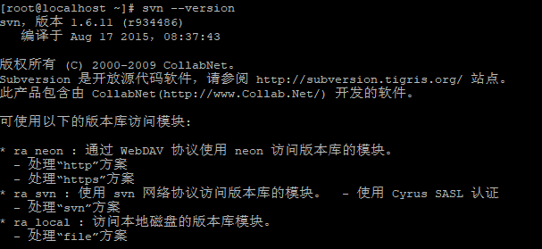

## 2、创建并配置版本库

### 2.1、创建版本库目录

```shell
[root@localhost ~]# mkdir -p /var/svn/repository
```

### 2.2、在版本库目录下创建具体项目目录

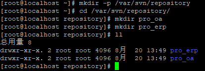

### 2.3、创建SVN版本库

```shell
[root@localhost ~]# svnadmin create 目录
```

### 2.4、版本库内容

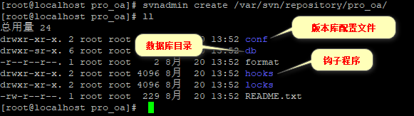

## 3、配置SVN对应的服务

### 3.1、思路

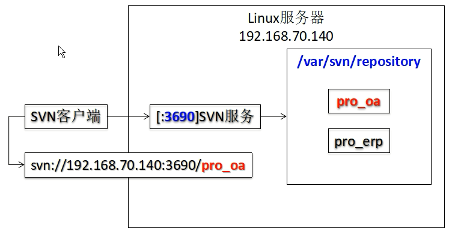

### 3.2、SVN服务

名称：svnserve

默认情况下不是开机自动启动

```shell
# 查看服务是否开机启动
[root@localhost repository]# chkconfig | grep svn
svnserve        0:关闭  1:关闭  2:关闭  3:关闭  4:关闭  5:关闭  6:关闭
# 设置开机启动
[root@localhost repository]# chkconfig svnserve on
[root@localhost repository]# chkconfig | grep svn
svnserve        0:关闭  1:关闭  2:启用  3:启用  4:启用  5:启用  6:关闭
```

对应可执行脚本文件路径

```shell
/etc/rc.d/init.d/svnserve
```

SVN服务具体配置：

```shell
[root@localhost init.d]# vim svnserve
# 修改下面内容：32行
```

```shell
# 原版
args="--daemon --pid-file=${pidfile} $OPTIONS"
# 修改版
args="--daemon --root 版本库根目录 --listen-port 指定端口号 --pid-file=${pidfile} $OPTIONS"
# 例子
args="--daemon --root /var/svn/repository --listen-port 2255 --pid-file=${pidfile} $OPTIONS"
```

## 4、启动SVN服务
SVN服务启动和验证：

```shell
# 查看服务是否启动
[root@localhost init.d]# service svnserve status

# 启动服务
[root@localhost init.d]# service svnserve start

# 验证端口号是否有服务
[root@localhost init.d]# netstat -anp|grep :2255

# 查看进程是否存在
[root@localhost init.d]# ps -ef | grep svnserve | grep -v grep

```

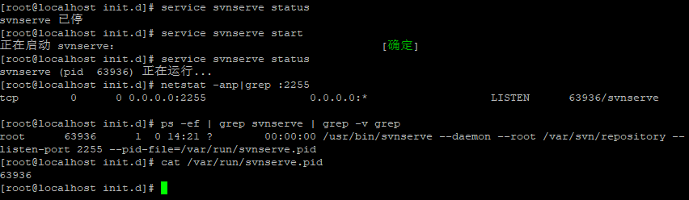

SVN使用默认端口号的配置方式：

```shell
[root@localhost init.d]# vim svnserve
args="--daemon --root /var/svn/repository --pid-file=${pidfile} $OPTIONS"
```

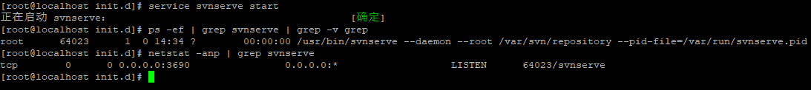

# 三、命令行客户端

## 1、创建两个工作区目录模拟两个开发人员

```shell
[root@localhost ~]# mkdir -p /root/workspace/harry
[root@localhost ~]# mkdir -p /root/workspace/sally
```

## 2、检出

作用：完整下载版本库中的全部内容

- 命令：

```shell
svn checkout svn://192.168.156.60/pro_oa ./ 
```

- 附加效果：
  在指定目录下创建.svn目录
  保存本地目录和文件状态信息，用来和SVN服务器进行交互

- 工作副本：
  .svn所在的目录
  版本控制相关操作都需要在工作副本目录下执行。例如：提交、更新等等，这样的操作
  为了保证工作副本能够正常和服务器进行交互，请不要删除或修改.svn目录中的内容

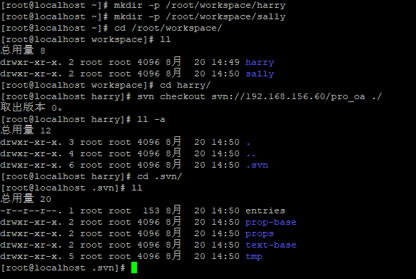

## 3、添加

svn要求提交一个新建的文件前，先把这个文件添加到版本控制体系中

```
svn add 文件名
```

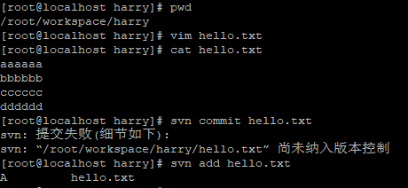

## 4、提交

要求1：附加日志信息
    日志信息相当于写Java代码时的注释，用来标记本次操作所做的修改

```shell
svn commit -m "提交的信息" [文件名]
```

要求2：必须具备相应的权限
    使用文本编辑器打开版本库根目录/conf/svnserve.conf文件
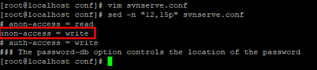
把匿名访问配置项的注释打开。注意：行的开头不能有空格

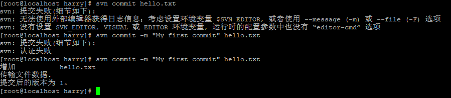

## 5、查看服务器端文件内容

```shell
svn list svn地址
```

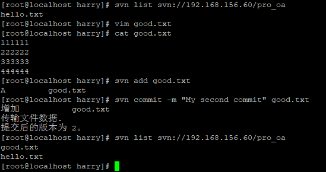

## 6、更新操作

作用：把服务器端文件所产生的所有修改下载到本地

```shell
svn update [文件名]
```

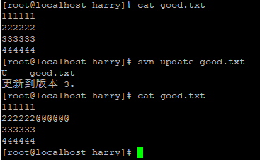

# 三、冲突

## 1、过时的文件

- 概念：在一个相对服务器端版本来说是旧版本的基础上进行了修改的文件
- 要求：所有过时的文件都必须先执行更新操作，更新后在最新版基础上修改的文件才允许提交

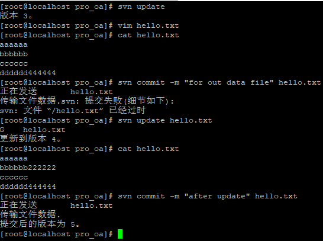

## 2、冲突的产生

- 条件1：本地当前编辑的文件已经过时
- 条件2：从服务器端更新下来的修改和要本地的修改在"同一个文件同一个位置"不一致

## 3、冲突的表现

文件内

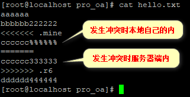

目录内

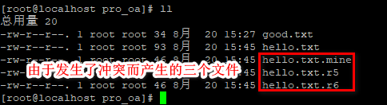

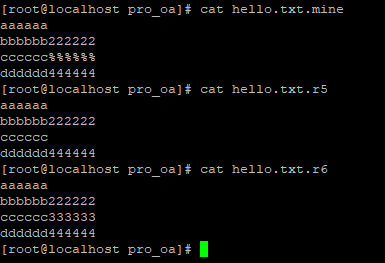

xxx.mine文件：发生冲突时本地文件内容

xxx.r[小版本号]文件：发生冲突前文件内容

xxx.r[大版本号]文件：发生冲突时服务器端文件内容