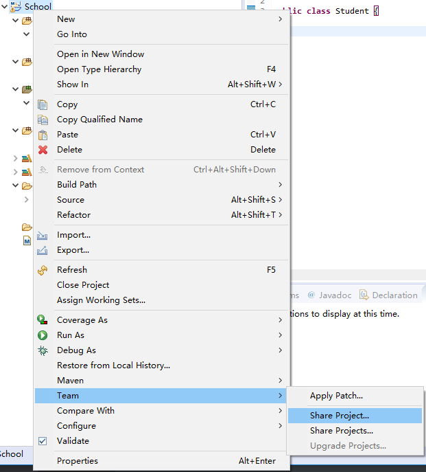
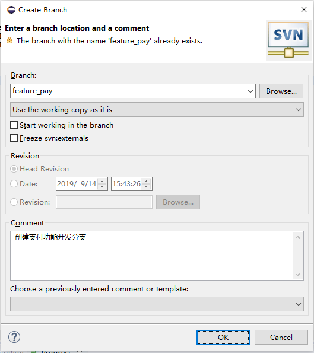

# 一、基本操作

## 1、检出(checkout)

- 把服务器端版本库内容完整下载到本地
- 的整个开发过程中只做一次

## 2、更新(update)

- 把服务器端相对于本地的新的修改下载到本地

## 3、提交(commit)

- 把本地修改上传到服务器

# 二、服务器端环境搭建步骤

## 1、安装服务器端程序

```shell
[root@localhost ~]# yum -y install subversion
# 验证安装是否成功
[root@localhost ~]# svn --version
```


## 2、创建并配置版本库

### 2.1、创建版本库目录

```shell
[root@localhost ~]# mkdir -p /var/svn/repository
```

### 2.2、在版本库目录下创建具体项目目录


### 2.3、创建SVN版本库

```shell
[root@localhost ~]# svnadmin create 目录
```

### 2.4、版本库内容


## 3、配置SVN对应的服务

### 3.1、思路


### 3.2、SVN服务

名称：svnserve

默认情况下不是开机自动启动

```shell
# 查看服务是否开机启动
[root@localhost repository]# chkconfig | grep svn
svnserve        0:关闭  1:关闭  2:关闭  3:关闭  4:关闭  5:关闭  6:关闭
# 设置开机启动
[root@localhost repository]# chkconfig svnserve on
[root@localhost repository]# chkconfig | grep svn
svnserve        0:关闭  1:关闭  2:启用  3:启用  4:启用  5:启用  6:关闭
```

对应可执行脚本文件路径

```shell
/etc/rc.d/init.d/svnserve
```

SVN服务具体配置：

```shell
[root@localhost init.d]# vim svnserve
# 修改下面内容：32行
```

```shell
# 原版
args="--daemon --pid-file=${pidfile} $OPTIONS"
# 修改版
args="--daemon --root 版本库根目录 --listen-port 指定端口号 --pid-file=${pidfile} $OPTIONS"
# 例子
args="--daemon --root /var/svn/repository --listen-port 2255 --pid-file=${pidfile} $OPTIONS"
```

## 4、启动SVN服务
SVN服务启动和验证：

```shell
# 查看服务是否启动
[root@localhost init.d]# service svnserve status

# 启动服务
[root@localhost init.d]# service svnserve start

# 验证端口号是否有服务
[root@localhost init.d]# netstat -anp|grep :2255

# 查看进程是否存在
[root@localhost init.d]# ps -ef | grep svnserve | grep -v grep

```


SVN使用默认端口号的配置方式：

```shell
[root@localhost init.d]# vim svnserve
args="--daemon --root /var/svn/repository --pid-file=${pidfile} $OPTIONS"
```


# 三、命令行客户端

## 1、创建两个工作区目录模拟两个开发人员

```shell
[root@localhost ~]# mkdir -p /root/workspace/harry
[root@localhost ~]# mkdir -p /root/workspace/sally
```

## 2、检出

作用：完整下载版本库中的全部内容

- 命令：

```shell
svn checkout svn://192.168.156.60/pro_oa ./ 
```

- 附加效果：
  在指定目录下创建.svn目录
  保存本地目录和文件状态信息，用来和SVN服务器进行交互

- 工作副本：
  .svn所在的目录
  版本控制相关操作都需要在工作副本目录下执行。例如：提交、更新等等，这样的操作
  为了保证工作副本能够正常和服务器进行交互，请不要删除或修改.svn目录中的内容


## 3、添加

svn要求提交一个新建的文件前，先把这个文件添加到版本控制体系中

```
svn add 文件名
```


## 4、提交

要求1：附加日志信息
    日志信息相当于写Java代码时的注释，用来标记本次操作所做的修改

```shell
svn commit -m "提交的信息" [文件名]
```

要求2：必须具备相应的权限
    使用文本编辑器打开版本库根目录/conf/svnserve.conf文件

把匿名访问配置项的注释打开。注意：行的开头不能有空格


## 5、查看服务器端文件内容

```shell
svn list svn地址
```


## 6、更新操作

作用：把服务器端文件所产生的所有修改下载到本地

```shell
svn update [文件名]
```


# 三、冲突

## 1、过时的文件

- 概念：在一个相对服务器端版本来说是旧版本的基础上进行了修改的文件
- 要求：所有过时的文件都必须先执行更新操作，更新后在最新版基础上修改的文件才允许提交


## 2、冲突的产生

- 条件1：本地当前编辑的文件已经过时
- 条件2：从服务器端更新下来的修改和要本地的修改在"同一个文件同一个位置"不一致

## 3、冲突的表现

文件内


目录内


xxx.mine文件：发生冲突时本地文件内容

xxx.r[小版本号]文件：发生冲突前文件内容

xxx.r[大版本号]文件：发生冲突时服务器端文件内容

## 4、冲突的手动解决

1. 删除冲突发生时产生的三个多余文件
2. 删除冲突文件内多余的符号
3. 把文件编辑到满意的状态
4. 提交


## 5、冲突的半自动解决

提交文件时提示发生冲突，选择（e）编辑：

需要设置SVN_EDITOR环境变量：

```shell
# 找到vim编辑的绝对路径
[root@localhost pro_oa]# which vim
/usr/bin/vim

#　配置SVN_EDITOR环境变量配置
[root@localhost pro_oa]# vim /etc/profile
SVN_EDITOR=/usr/bin/vim
export SVN_EDITOR

# 刷新环境变量
[root@localhost pro_oa]# source /etc/profile

#　查看设置的环境变量是否生效
[root@localhost pro_oa]# echo $SVN_EDITOR
/usr/bin/vim
```

```shell
# 查看文件信息
[root@localhost ~]# svn info 文件/svn地址
# 例
[root@localhost pro_oa]# svn info good.txt
路径: good.txt
名称: good.txt
URL: svn://192.168.156.60/pro_oa/good.txt
版本库根: svn://192.168.156.60/pro_oa
版本库 UUID: a44eb06a-9f76-4ed1-b696-581c4687c0e3
版本: 3
节点种类: 文件
调度: 正常
最后修改的版本: 3
最后修改的时间: 2019-09-11 01:26:57 +0800 (三, 2019-09-11)
文本最后更新: 2019-09-11 01:26:19 +0800 (三, 2019-09-11)
校验和: 89f5991c5de86dccef610590bd3bbeb3

[root@localhost pro_oa]# svn info svn://192.168.156.60/pro_oa/good.txt
路径: good.txt
名称: good.txt
URL: svn://192.168.156.60/pro_oa/good.txt
版本库根: svn://192.168.156.60/pro_oa
版本库 UUID: a44eb06a-9f76-4ed1-b696-581c4687c0e3
版本: 6
节点种类: 文件
最后修改的版本: 6
最后修改的时间: 2019-09-11 01:52:23 +0800 (三, 2019-09-11)

```

解决的过程：

1. 使用e选项进入文件内容编辑界面
2. 进入vim编辑器编辑文件内容
3. 编辑完成后使用r选项标记为已解决


## 6、减少冲突的发生

1. 尽可能在修改文件前先进行更新操作，尽量在最新版基础上修改文件内容
2. 尽量减少多个修改同一个文件的可能性
3. 加强团队成员之间的沟通

# 四、Eclipse的SVN插件

## 1、简介

### 1.1、Subversive

Eclipse团队开发的SVN插件

### 1.2、Subclipse

Apache的SVN团队开发的Eclipse插件

## 2、Subversive的安装

### 2.1、安装前

- Eclipse -> Window -> Preferences -> Team 


- 用户家目录下没有Subversion目录(C:\Users\Administrator\AppData\Roaming)

### 2.2、Subversive下载安装

下载地址：https://www.eclipse.org/subversive/latest-releases.php

### 2.2、安装后

Eclipse -> Window -> Preferences -> Team 


## 3、SVN Connector安装


## 4、创建资源库位置

### 4.1、目的

让本地Eclipse SVN插件知道SVN服务器的位置

### 4.2、操作步骤

1. 切换透视图
   

2. 创建资源库位置

   

3. 输入SVN服务器的URL地址
   

```shell
# 用以上连接可能连不上，需关闭防火墙或找开指定端口访问
[root@localhost ~]# /etc/init.d/iptables stop
```

## 5、Eclipse工程中忽略文件

### 5.1、Eclipse特定文件


### 5.2、忽略特定文件的原因

1. 在服务器上最终运行工程完全没有关系
2. 开发团队中，并不是所有参与开发的成员都使用相同的IDE，所以代码文件之外的IDE特定文件有可能有区别。如果这些文件也都上传到SVN服务器，那么很可能产生冲突。不同IDE之间基于Maven的标准目录结构识别工程。

### 5.3、配置全局范围忽略文件的操作方式

#### 1、配置文件位置

```
~\AppData\Roaming\Subversion\config
# 例：
C:\Users\Administrator\AppData\Roaming\Subversion\config
```

#### 2、要修改的配置项

```
[miscellany]
global-ignores = .settings */.settings/* .classpath .project
```

## 6、分享工程

1. 工程 -> 右键 -> Team -> Share Project...
   

2. 版本控制工具中选择SVN
   

3. 选择一个已经存在的资源库位置或新建一个

   可以直接点Finish(工程SVN服务器端的目录名和工程名一致，上传工程目录的日志使用默认值)

   

4. 确认工程根目录下子目录是否全部上传

## 7、常见图标含义


## 8、检出操作

### 8.1、在Eclipse中执行Import操作


### 8.2、确认资源库位置


### 8.3、找到服务器端工程对应的目录


### 8.4、选择检出方式


### 8.5、Finish


### 8.6、转换工程类型


### 8.7、最终效果


## 9、Subversion Eclipse中基本操作

### 9.1、添加到版本控制器


### 9.2、提交


### 9.3、添加到版本控制器并提交


## 10、Eclipse中解决冲突

快捷键

```
提交：Ctrl+Alt+C
更新：Ctrl+Alt+U
```

### 10.1、冲突文件 -> 右键 -> Team -> Edit Conflicts...


### 10.2、冲突文件内容显示界面

在这个界面中修改至满意，关闭界面


### 10.3、标记为已合并

冲突文件 -> 右键 -> Team -> Mark as Merged


### 10.4、提交

# 五、分支

## 1、概念

在版本控制过程中，使用多个分支同时推进多个不同功能开发

不使用分支开发：人与人之间协作

使用分支开发：小组与小组之间协作 

## 2、应用场景举例

蓝色皮肤界面功能：小组1

用户账号管理功能：小组2

支付功能：小组3

......

## 3、作用

- 多个功能开发齐头并进同时进行
- 任何一个分支上功能开发失败，删除即可，不会对其他分支造成影响

## 4、相关目录

- trunk
  主干
- branches
  分支
- tags
  存放项目开发过程中各个里程碑式的代码

## 5、创建相关目录

资源库位置 -> 右键 -> New... -> Folder


## 6、创建分支

### 6.1、创建新工程并上传到trunk


### 6.2、创建具体分支目录


### 6.3、创建代码分支

项目 -> 右键 -> Team -> Branch...




## 7、切换分支

项目 -> 右键 -> Team -> Switch...


效果：


## 8、合并分支

项目 -> 右键 -> Team -> Merge...


# 六、SVN权限管理

## 1、版本库中三个对应的配置文件

### 1.1、版本库配置文件目录

```
/var/svn/repository/pro_oa/conf
```

### 1.2、svnserve.conf文件

```
#anon-access = write   # 匿名访问
auth-access = write    # 授权访问

password-db = passwd   # 指定设置用户名密码的配置文件

authz-db = authz       # 分配权限的配置文件
```

### 1.3、passwd文件

```
[users]
# 例子
# harry = harryssecret
# sally = sallyssecret
#

# 自定义创建
# 用户名 = 密码
tom = 123123
jerry = 123123

kate = 123123

```

### 1.4、authz文件

```
[groups]
# 例子
# harry_and_sally = harry,sally
# harry_sally_and_joe = harry,sally,&joe

# 用户组 = 用户,用户
kaifa = tom,jerry

# [/foo/bar]
# harry = rw
# &joe = r
# * =

# 针对版本库根目录进行权限设置
[/]
# @组名 = 权限值
@kaifa = rw
# 用户名 = 权限值
kate = r
# 除了上面已经授权的用户以为其他用户没有任何权限
* =
```

## 2、客户端测试

Eclipse中删除曾经登录过的用户名密码的操作方式


## 3、查看历史记录

### 3.1、条目不可读问题解决(Item is not readable)


```shell
[root@localhost conf]# pwd
/var/svn/repository/pro_oa/conf
[root@localhost conf]# vim svnserve.conf
anon-access = none
```

## 4、让文件回到某一个历史状态

选择要回退的版本号 -> 右键 -> Get Content

